# **Capstone Project: Part One**

This notebook aims to explore the dataset 'BookMyShow ads URL Analysis' to understand its structure and the relationships between its features.
The dataset contains 11,000 samples with 32 features for each URL, labeled as legitimate, suspicious, or phishing.

The main steps in this notebook will include:
1. Loading and inspecting the dataset
2. Handling missing values
3. Normalizing or standardizing feature values
4. Converting categorical features into numerical ones if necessary
5. Creating visualizations to understand the data better

The final goal of this analysis is to prepare the data for machine learning models to detect malicious or phishing URLs.

### Section 1: Importing Libraries


```python
# All these libraies will be use for the EDA
import pandas as pd   # For data manipulation and analysis
import seaborn as sns # For data visualization
import matplotlib.pyplot as plt # For plotting
import numpy as np   # For numerical operations

# Setting the visual theme for the plots
sns.set_theme(style="whitegrid")
```

### Section 2: Loading the Dataset


```python
# This script is written using Google Colab
# Therefore the drive needs to be mounted to access the dataset
from google.colab import drive
drive.mount('/content/drive')
```

    Drive already mounted at /content/drive; to attempt to forcibly remount, call drive.mount("/content/drive", force_remount=True).
    


```python
# Loading the dataset from the provided file path
file_path = '/content/drive/MyDrive/Berkeley/Capstone/Part 1/book_my_show_dataset.csv'
df = pd.read_csv(file_path)
```


```python
# Display the first few rows of the dataset to understand its structure
df.head()
```


  <div id="df-427d06ea-3cb9-4866-995f-8d257da1a6f4" class="colab-df-container">
    <div>
<style scoped>
    .dataframe tbody tr th:only-of-type {
        vertical-align: middle;
    }

    .dataframe tbody tr th {
        vertical-align: top;
    }

    .dataframe thead th {
        text-align: right;
    }
</style>
<table border="1" class="dataframe">
  <thead>
    <tr style="text-align: right;">
      <th></th>
      <th>index</th>
      <th>having_IPhaving_IP_Address</th>
      <th>URLURL_Length</th>
      <th>Shortining_Service</th>
      <th>having_At_Symbol</th>
      <th>double_slash_redirecting</th>
      <th>Prefix_Suffix</th>
      <th>having_Sub_Domain</th>
      <th>SSLfinal_State</th>
      <th>Domain_registeration_length</th>
      <th>...</th>
      <th>popUpWidnow</th>
      <th>Iframe</th>
      <th>age_of_domain</th>
      <th>DNSRecord</th>
      <th>web_traffic</th>
      <th>Page_Rank</th>
      <th>Google_Index</th>
      <th>Links_pointing_to_page</th>
      <th>Statistical_report</th>
      <th>Result</th>
    </tr>
  </thead>
  <tbody>
    <tr>
      <th>0</th>
      <td>1</td>
      <td>0</td>
      <td>1</td>
      <td>1</td>
      <td>1</td>
      <td>0</td>
      <td>0</td>
      <td>0</td>
      <td>0</td>
      <td>0</td>
      <td>...</td>
      <td>1</td>
      <td>1</td>
      <td>0</td>
      <td>0</td>
      <td>0</td>
      <td>0</td>
      <td>1</td>
      <td>1</td>
      <td>0</td>
      <td>0</td>
    </tr>
    <tr>
      <th>1</th>
      <td>2</td>
      <td>1</td>
      <td>1</td>
      <td>1</td>
      <td>1</td>
      <td>1</td>
      <td>0</td>
      <td>-1</td>
      <td>1</td>
      <td>0</td>
      <td>...</td>
      <td>1</td>
      <td>1</td>
      <td>0</td>
      <td>0</td>
      <td>-1</td>
      <td>0</td>
      <td>1</td>
      <td>1</td>
      <td>1</td>
      <td>0</td>
    </tr>
    <tr>
      <th>2</th>
      <td>3</td>
      <td>1</td>
      <td>-1</td>
      <td>1</td>
      <td>1</td>
      <td>1</td>
      <td>0</td>
      <td>0</td>
      <td>0</td>
      <td>0</td>
      <td>...</td>
      <td>1</td>
      <td>1</td>
      <td>1</td>
      <td>0</td>
      <td>1</td>
      <td>0</td>
      <td>1</td>
      <td>-1</td>
      <td>0</td>
      <td>0</td>
    </tr>
    <tr>
      <th>3</th>
      <td>4</td>
      <td>1</td>
      <td>-1</td>
      <td>1</td>
      <td>1</td>
      <td>1</td>
      <td>0</td>
      <td>0</td>
      <td>0</td>
      <td>1</td>
      <td>...</td>
      <td>1</td>
      <td>1</td>
      <td>0</td>
      <td>0</td>
      <td>1</td>
      <td>0</td>
      <td>1</td>
      <td>0</td>
      <td>1</td>
      <td>0</td>
    </tr>
    <tr>
      <th>4</th>
      <td>5</td>
      <td>1</td>
      <td>-1</td>
      <td>0</td>
      <td>1</td>
      <td>1</td>
      <td>0</td>
      <td>1</td>
      <td>1</td>
      <td>0</td>
      <td>...</td>
      <td>0</td>
      <td>1</td>
      <td>0</td>
      <td>0</td>
      <td>-1</td>
      <td>0</td>
      <td>1</td>
      <td>1</td>
      <td>1</td>
      <td>1</td>
    </tr>
  </tbody>
</table>
<p>5 rows × 32 columns</p>
</div>
    <div class="colab-df-buttons">

  <div class="colab-df-container">
    <button class="colab-df-convert" onclick="convertToInteractive('df-427d06ea-3cb9-4866-995f-8d257da1a6f4')"
            title="Convert this dataframe to an interactive table."
            style="display:none;">

  <svg xmlns="http://www.w3.org/2000/svg" height="24px" viewBox="0 -960 960 960">
    <path d="M120-120v-720h720v720H120Zm60-500h600v-160H180v160Zm220 220h160v-160H400v160Zm0 220h160v-160H400v160ZM180-400h160v-160H180v160Zm440 0h160v-160H620v160ZM180-180h160v-160H180v160Zm440 0h160v-160H620v160Z"/>
  </svg>
    </button>

  <style>
    .colab-df-container {
      display:flex;
      gap: 12px;
    }

    .colab-df-convert {
      background-color: #E8F0FE;
      border: none;
      border-radius: 50%;
      cursor: pointer;
      display: none;
      fill: #1967D2;
      height: 32px;
      padding: 0 0 0 0;
      width: 32px;
    }

    .colab-df-convert:hover {
      background-color: #E2EBFA;
      box-shadow: 0px 1px 2px rgba(60, 64, 67, 0.3), 0px 1px 3px 1px rgba(60, 64, 67, 0.15);
      fill: #174EA6;
    }

    .colab-df-buttons div {
      margin-bottom: 4px;
    }

    [theme=dark] .colab-df-convert {
      background-color: #3B4455;
      fill: #D2E3FC;
    }

    [theme=dark] .colab-df-convert:hover {
      background-color: #434B5C;
      box-shadow: 0px 1px 3px 1px rgba(0, 0, 0, 0.15);
      filter: drop-shadow(0px 1px 2px rgba(0, 0, 0, 0.3));
      fill: #FFFFFF;
    }
  </style>

    <script>
      const buttonEl =
        document.querySelector('#df-427d06ea-3cb9-4866-995f-8d257da1a6f4 button.colab-df-convert');
      buttonEl.style.display =
        google.colab.kernel.accessAllowed ? 'block' : 'none';

      async function convertToInteractive(key) {
        const element = document.querySelector('#df-427d06ea-3cb9-4866-995f-8d257da1a6f4');
        const dataTable =
          await google.colab.kernel.invokeFunction('convertToInteractive',
                                                    [key], {});
        if (!dataTable) return;

        const docLinkHtml = 'Like what you see? Visit the ' +
          '<a target="_blank" href=https://colab.research.google.com/notebooks/data_table.ipynb>data table notebook</a>'
          + ' to learn more about interactive tables.';
        element.innerHTML = '';
        dataTable['output_type'] = 'display_data';
        await google.colab.output.renderOutput(dataTable, element);
        const docLink = document.createElement('div');
        docLink.innerHTML = docLinkHtml;
        element.appendChild(docLink);
      }
    </script>
  </div>


<div id="df-d3ac1586-1144-4b75-ad84-6ad6bab215a5">
  <button class="colab-df-quickchart" onclick="quickchart('df-d3ac1586-1144-4b75-ad84-6ad6bab215a5')"
            title="Suggest charts"
            style="display:none;">

<svg xmlns="http://www.w3.org/2000/svg" height="24px"viewBox="0 0 24 24"
     width="24px">
    <g>
        <path d="M19 3H5c-1.1 0-2 .9-2 2v14c0 1.1.9 2 2 2h14c1.1 0 2-.9 2-2V5c0-1.1-.9-2-2-2zM9 17H7v-7h2v7zm4 0h-2V7h2v10zm4 0h-2v-4h2v4z"/>
    </g>
</svg>
  </button>

<style>
  .colab-df-quickchart {
      --bg-color: #E8F0FE;
      --fill-color: #1967D2;
      --hover-bg-color: #E2EBFA;
      --hover-fill-color: #174EA6;
      --disabled-fill-color: #AAA;
      --disabled-bg-color: #DDD;
  }

  [theme=dark] .colab-df-quickchart {
      --bg-color: #3B4455;
      --fill-color: #D2E3FC;
      --hover-bg-color: #434B5C;
      --hover-fill-color: #FFFFFF;
      --disabled-bg-color: #3B4455;
      --disabled-fill-color: #666;
  }

  .colab-df-quickchart {
    background-color: var(--bg-color);
    border: none;
    border-radius: 50%;
    cursor: pointer;
    display: none;
    fill: var(--fill-color);
    height: 32px;
    padding: 0;
    width: 32px;
  }

  .colab-df-quickchart:hover {
    background-color: var(--hover-bg-color);
    box-shadow: 0 1px 2px rgba(60, 64, 67, 0.3), 0 1px 3px 1px rgba(60, 64, 67, 0.15);
    fill: var(--button-hover-fill-color);
  }

  .colab-df-quickchart-complete:disabled,
  .colab-df-quickchart-complete:disabled:hover {
    background-color: var(--disabled-bg-color);
    fill: var(--disabled-fill-color);
    box-shadow: none;
  }

  .colab-df-spinner {
    border: 2px solid var(--fill-color);
    border-color: transparent;
    border-bottom-color: var(--fill-color);
    animation:
      spin 1s steps(1) infinite;
  }

  @keyframes spin {
    0% {
      border-color: transparent;
      border-bottom-color: var(--fill-color);
      border-left-color: var(--fill-color);
    }
    20% {
      border-color: transparent;
      border-left-color: var(--fill-color);
      border-top-color: var(--fill-color);
    }
    30% {
      border-color: transparent;
      border-left-color: var(--fill-color);
      border-top-color: var(--fill-color);
      border-right-color: var(--fill-color);
    }
    40% {
      border-color: transparent;
      border-right-color: var(--fill-color);
      border-top-color: var(--fill-color);
    }
    60% {
      border-color: transparent;
      border-right-color: var(--fill-color);
    }
    80% {
      border-color: transparent;
      border-right-color: var(--fill-color);
      border-bottom-color: var(--fill-color);
    }
    90% {
      border-color: transparent;
      border-bottom-color: var(--fill-color);
    }
  }
</style>

  <script>
    async function quickchart(key) {
      const quickchartButtonEl =
        document.querySelector('#' + key + ' button');
      quickchartButtonEl.disabled = true;  // To prevent multiple clicks.
      quickchartButtonEl.classList.add('colab-df-spinner');
      try {
        const charts = await google.colab.kernel.invokeFunction(
            'suggestCharts', [key], {});
      } catch (error) {
        console.error('Error during call to suggestCharts:', error);
      }
      quickchartButtonEl.classList.remove('colab-df-spinner');
      quickchartButtonEl.classList.add('colab-df-quickchart-complete');
    }
    (() => {
      let quickchartButtonEl =
        document.querySelector('#df-d3ac1586-1144-4b75-ad84-6ad6bab215a5 button');
      quickchartButtonEl.style.display =
        google.colab.kernel.accessAllowed ? 'block' : 'none';
    })();
  </script>
</div>

    </div>
  </div>


    Warning: Total number of columns (32) exceeds max_columns (20) limiting to first (20) columns.
    

### Section 3: Inspecting the Dataset


```python
# Checking the structure and basic statistics of the dataset
df.info()  # To see the data types and non-null values
df.describe()  # To get the summary statistics of the dataset
```

    <class 'pandas.core.frame.DataFrame'>
    RangeIndex: 11055 entries, 0 to 11054
    Data columns (total 32 columns):
     #   Column                       Non-Null Count  Dtype 
    ---  ------                       --------------  ----- 
     0   index                        11055 non-null  object
     1   having_IPhaving_IP_Address   11055 non-null  int64 
     2   URLURL_Length                11055 non-null  int64 
     3   Shortining_Service           11055 non-null  int64 
     4   having_At_Symbol             11055 non-null  int64 
     5   double_slash_redirecting     11055 non-null  int64 
     6   Prefix_Suffix                11055 non-null  int64 
     7   having_Sub_Domain            11055 non-null  int64 
     8   SSLfinal_State               11055 non-null  int64 
     9   Domain_registeration_length  11055 non-null  int64 
     10  Favicon                      11055 non-null  int64 
     11  port                         11055 non-null  int64 
     12  HTTPS_token                  11055 non-null  int64 
     13  Request_URL                  11055 non-null  int64 
     14  URL_of_Anchor                11055 non-null  int64 
     15  Links_in_tags                11055 non-null  int64 
     16  SFH                          11055 non-null  int64 
     17  Submitting_to_email          11055 non-null  int64 
     18  Abnormal_URL                 11055 non-null  int64 
     19  Redirect                     11055 non-null  int64 
     20  on_mouseover                 11055 non-null  int64 
     21  RightClick                   11055 non-null  int64 
     22  popUpWidnow                  11055 non-null  int64 
     23  Iframe                       11055 non-null  int64 
     24  age_of_domain                11055 non-null  int64 
     25  DNSRecord                    11055 non-null  int64 
     26  web_traffic                  11055 non-null  int64 
     27  Page_Rank                    11055 non-null  int64 
     28  Google_Index                 11055 non-null  int64 
     29  Links_pointing_to_page       11055 non-null  int64 
     30  Statistical_report           11055 non-null  int64 
     31  Result                       11055 non-null  int64 
    dtypes: int64(31), object(1)
    memory usage: 2.7+ MB
    


  <div id="df-cd0b18bf-f39e-465a-a1c3-6807656bfa2e" class="colab-df-container">
    <div>
<style scoped>
    .dataframe tbody tr th:only-of-type {
        vertical-align: middle;
    }

    .dataframe tbody tr th {
        vertical-align: top;
    }

    .dataframe thead th {
        text-align: right;
    }
</style>
<table border="1" class="dataframe">
  <thead>
    <tr style="text-align: right;">
      <th></th>
      <th>having_IPhaving_IP_Address</th>
      <th>URLURL_Length</th>
      <th>Shortining_Service</th>
      <th>having_At_Symbol</th>
      <th>double_slash_redirecting</th>
      <th>Prefix_Suffix</th>
      <th>having_Sub_Domain</th>
      <th>SSLfinal_State</th>
      <th>Domain_registeration_length</th>
      <th>Favicon</th>
      <th>...</th>
      <th>popUpWidnow</th>
      <th>Iframe</th>
      <th>age_of_domain</th>
      <th>DNSRecord</th>
      <th>web_traffic</th>
      <th>Page_Rank</th>
      <th>Google_Index</th>
      <th>Links_pointing_to_page</th>
      <th>Statistical_report</th>
      <th>Result</th>
    </tr>
  </thead>
  <tbody>
    <tr>
      <th>count</th>
      <td>11055.000000</td>
      <td>11055.000000</td>
      <td>11055.000000</td>
      <td>11055.000000</td>
      <td>11055.000000</td>
      <td>11055.000000</td>
      <td>11055.000000</td>
      <td>11055.000000</td>
      <td>11055.000000</td>
      <td>11055.000000</td>
      <td>...</td>
      <td>11055.000000</td>
      <td>11055.000000</td>
      <td>11055.000000</td>
      <td>11055.000000</td>
      <td>11055.000000</td>
      <td>11055.000000</td>
      <td>11055.000000</td>
      <td>11055.000000</td>
      <td>11055.000000</td>
      <td>11055.000000</td>
    </tr>
    <tr>
      <th>mean</th>
      <td>0.656897</td>
      <td>0.165084</td>
      <td>0.869380</td>
      <td>0.850294</td>
      <td>0.870737</td>
      <td>0.132519</td>
      <td>0.040525</td>
      <td>0.467119</td>
      <td>0.331615</td>
      <td>0.814292</td>
      <td>...</td>
      <td>0.806694</td>
      <td>0.908458</td>
      <td>0.530620</td>
      <td>0.688557</td>
      <td>0.295070</td>
      <td>0.258164</td>
      <td>0.860787</td>
      <td>-0.163275</td>
      <td>0.859792</td>
      <td>0.556943</td>
    </tr>
    <tr>
      <th>std</th>
      <td>0.474767</td>
      <td>0.402826</td>
      <td>0.336999</td>
      <td>0.356799</td>
      <td>0.335506</td>
      <td>0.339070</td>
      <td>0.833195</td>
      <td>0.678297</td>
      <td>0.470815</td>
      <td>0.388888</td>
      <td>...</td>
      <td>0.394909</td>
      <td>0.288392</td>
      <td>0.499084</td>
      <td>0.463104</td>
      <td>0.820263</td>
      <td>0.437644</td>
      <td>0.346184</td>
      <td>0.961174</td>
      <td>0.347218</td>
      <td>0.496769</td>
    </tr>
    <tr>
      <th>min</th>
      <td>0.000000</td>
      <td>-1.000000</td>
      <td>0.000000</td>
      <td>0.000000</td>
      <td>0.000000</td>
      <td>0.000000</td>
      <td>-1.000000</td>
      <td>-1.000000</td>
      <td>0.000000</td>
      <td>0.000000</td>
      <td>...</td>
      <td>0.000000</td>
      <td>0.000000</td>
      <td>0.000000</td>
      <td>0.000000</td>
      <td>-1.000000</td>
      <td>0.000000</td>
      <td>0.000000</td>
      <td>-1.000000</td>
      <td>0.000000</td>
      <td>0.000000</td>
    </tr>
    <tr>
      <th>25%</th>
      <td>0.000000</td>
      <td>0.000000</td>
      <td>1.000000</td>
      <td>1.000000</td>
      <td>1.000000</td>
      <td>0.000000</td>
      <td>-1.000000</td>
      <td>0.000000</td>
      <td>0.000000</td>
      <td>1.000000</td>
      <td>...</td>
      <td>1.000000</td>
      <td>1.000000</td>
      <td>0.000000</td>
      <td>0.000000</td>
      <td>0.000000</td>
      <td>0.000000</td>
      <td>1.000000</td>
      <td>-1.000000</td>
      <td>1.000000</td>
      <td>0.000000</td>
    </tr>
    <tr>
      <th>50%</th>
      <td>1.000000</td>
      <td>0.000000</td>
      <td>1.000000</td>
      <td>1.000000</td>
      <td>1.000000</td>
      <td>0.000000</td>
      <td>0.000000</td>
      <td>1.000000</td>
      <td>0.000000</td>
      <td>1.000000</td>
      <td>...</td>
      <td>1.000000</td>
      <td>1.000000</td>
      <td>1.000000</td>
      <td>1.000000</td>
      <td>1.000000</td>
      <td>0.000000</td>
      <td>1.000000</td>
      <td>-1.000000</td>
      <td>1.000000</td>
      <td>1.000000</td>
    </tr>
    <tr>
      <th>75%</th>
      <td>1.000000</td>
      <td>0.000000</td>
      <td>1.000000</td>
      <td>1.000000</td>
      <td>1.000000</td>
      <td>0.000000</td>
      <td>1.000000</td>
      <td>1.000000</td>
      <td>1.000000</td>
      <td>1.000000</td>
      <td>...</td>
      <td>1.000000</td>
      <td>1.000000</td>
      <td>1.000000</td>
      <td>1.000000</td>
      <td>1.000000</td>
      <td>1.000000</td>
      <td>1.000000</td>
      <td>1.000000</td>
      <td>1.000000</td>
      <td>1.000000</td>
    </tr>
    <tr>
      <th>max</th>
      <td>1.000000</td>
      <td>1.000000</td>
      <td>1.000000</td>
      <td>1.000000</td>
      <td>1.000000</td>
      <td>1.000000</td>
      <td>1.000000</td>
      <td>1.000000</td>
      <td>1.000000</td>
      <td>1.000000</td>
      <td>...</td>
      <td>1.000000</td>
      <td>1.000000</td>
      <td>1.000000</td>
      <td>1.000000</td>
      <td>1.000000</td>
      <td>1.000000</td>
      <td>1.000000</td>
      <td>1.000000</td>
      <td>1.000000</td>
      <td>1.000000</td>
    </tr>
  </tbody>
</table>
<p>8 rows × 31 columns</p>
</div>
    <div class="colab-df-buttons">

  <div class="colab-df-container">
    <button class="colab-df-convert" onclick="convertToInteractive('df-cd0b18bf-f39e-465a-a1c3-6807656bfa2e')"
            title="Convert this dataframe to an interactive table."
            style="display:none;">

  <svg xmlns="http://www.w3.org/2000/svg" height="24px" viewBox="0 -960 960 960">
    <path d="M120-120v-720h720v720H120Zm60-500h600v-160H180v160Zm220 220h160v-160H400v160Zm0 220h160v-160H400v160ZM180-400h160v-160H180v160Zm440 0h160v-160H620v160ZM180-180h160v-160H180v160Zm440 0h160v-160H620v160Z"/>
  </svg>
    </button>

  <style>
    .colab-df-container {
      display:flex;
      gap: 12px;
    }

    .colab-df-convert {
      background-color: #E8F0FE;
      border: none;
      border-radius: 50%;
      cursor: pointer;
      display: none;
      fill: #1967D2;
      height: 32px;
      padding: 0 0 0 0;
      width: 32px;
    }

    .colab-df-convert:hover {
      background-color: #E2EBFA;
      box-shadow: 0px 1px 2px rgba(60, 64, 67, 0.3), 0px 1px 3px 1px rgba(60, 64, 67, 0.15);
      fill: #174EA6;
    }

    .colab-df-buttons div {
      margin-bottom: 4px;
    }

    [theme=dark] .colab-df-convert {
      background-color: #3B4455;
      fill: #D2E3FC;
    }

    [theme=dark] .colab-df-convert:hover {
      background-color: #434B5C;
      box-shadow: 0px 1px 3px 1px rgba(0, 0, 0, 0.15);
      filter: drop-shadow(0px 1px 2px rgba(0, 0, 0, 0.3));
      fill: #FFFFFF;
    }
  </style>

    <script>
      const buttonEl =
        document.querySelector('#df-cd0b18bf-f39e-465a-a1c3-6807656bfa2e button.colab-df-convert');
      buttonEl.style.display =
        google.colab.kernel.accessAllowed ? 'block' : 'none';

      async function convertToInteractive(key) {
        const element = document.querySelector('#df-cd0b18bf-f39e-465a-a1c3-6807656bfa2e');
        const dataTable =
          await google.colab.kernel.invokeFunction('convertToInteractive',
                                                    [key], {});
        if (!dataTable) return;

        const docLinkHtml = 'Like what you see? Visit the ' +
          '<a target="_blank" href=https://colab.research.google.com/notebooks/data_table.ipynb>data table notebook</a>'
          + ' to learn more about interactive tables.';
        element.innerHTML = '';
        dataTable['output_type'] = 'display_data';
        await google.colab.output.renderOutput(dataTable, element);
        const docLink = document.createElement('div');
        docLink.innerHTML = docLinkHtml;
        element.appendChild(docLink);
      }
    </script>
  </div>


<div id="df-6e716781-1012-44f0-bbca-ea3c7f99b030">
  <button class="colab-df-quickchart" onclick="quickchart('df-6e716781-1012-44f0-bbca-ea3c7f99b030')"
            title="Suggest charts"
            style="display:none;">

<svg xmlns="http://www.w3.org/2000/svg" height="24px"viewBox="0 0 24 24"
     width="24px">
    <g>
        <path d="M19 3H5c-1.1 0-2 .9-2 2v14c0 1.1.9 2 2 2h14c1.1 0 2-.9 2-2V5c0-1.1-.9-2-2-2zM9 17H7v-7h2v7zm4 0h-2V7h2v10zm4 0h-2v-4h2v4z"/>
    </g>
</svg>
  </button>

<style>
  .colab-df-quickchart {
      --bg-color: #E8F0FE;
      --fill-color: #1967D2;
      --hover-bg-color: #E2EBFA;
      --hover-fill-color: #174EA6;
      --disabled-fill-color: #AAA;
      --disabled-bg-color: #DDD;
  }

  [theme=dark] .colab-df-quickchart {
      --bg-color: #3B4455;
      --fill-color: #D2E3FC;
      --hover-bg-color: #434B5C;
      --hover-fill-color: #FFFFFF;
      --disabled-bg-color: #3B4455;
      --disabled-fill-color: #666;
  }

  .colab-df-quickchart {
    background-color: var(--bg-color);
    border: none;
    border-radius: 50%;
    cursor: pointer;
    display: none;
    fill: var(--fill-color);
    height: 32px;
    padding: 0;
    width: 32px;
  }

  .colab-df-quickchart:hover {
    background-color: var(--hover-bg-color);
    box-shadow: 0 1px 2px rgba(60, 64, 67, 0.3), 0 1px 3px 1px rgba(60, 64, 67, 0.15);
    fill: var(--button-hover-fill-color);
  }

  .colab-df-quickchart-complete:disabled,
  .colab-df-quickchart-complete:disabled:hover {
    background-color: var(--disabled-bg-color);
    fill: var(--disabled-fill-color);
    box-shadow: none;
  }

  .colab-df-spinner {
    border: 2px solid var(--fill-color);
    border-color: transparent;
    border-bottom-color: var(--fill-color);
    animation:
      spin 1s steps(1) infinite;
  }

  @keyframes spin {
    0% {
      border-color: transparent;
      border-bottom-color: var(--fill-color);
      border-left-color: var(--fill-color);
    }
    20% {
      border-color: transparent;
      border-left-color: var(--fill-color);
      border-top-color: var(--fill-color);
    }
    30% {
      border-color: transparent;
      border-left-color: var(--fill-color);
      border-top-color: var(--fill-color);
      border-right-color: var(--fill-color);
    }
    40% {
      border-color: transparent;
      border-right-color: var(--fill-color);
      border-top-color: var(--fill-color);
    }
    60% {
      border-color: transparent;
      border-right-color: var(--fill-color);
    }
    80% {
      border-color: transparent;
      border-right-color: var(--fill-color);
      border-bottom-color: var(--fill-color);
    }
    90% {
      border-color: transparent;
      border-bottom-color: var(--fill-color);
    }
  }
</style>

  <script>
    async function quickchart(key) {
      const quickchartButtonEl =
        document.querySelector('#' + key + ' button');
      quickchartButtonEl.disabled = true;  // To prevent multiple clicks.
      quickchartButtonEl.classList.add('colab-df-spinner');
      try {
        const charts = await google.colab.kernel.invokeFunction(
            'suggestCharts', [key], {});
      } catch (error) {
        console.error('Error during call to suggestCharts:', error);
      }
      quickchartButtonEl.classList.remove('colab-df-spinner');
      quickchartButtonEl.classList.add('colab-df-quickchart-complete');
    }
    (() => {
      let quickchartButtonEl =
        document.querySelector('#df-6e716781-1012-44f0-bbca-ea3c7f99b030 button');
      quickchartButtonEl.style.display =
        google.colab.kernel.accessAllowed ? 'block' : 'none';
    })();
  </script>
</div>

    </div>
  </div>


```python
# Checking for missing values in the dataset
df.isnull().sum()
```


    index                          0
    having_IPhaving_IP_Address     0
    URLURL_Length                  0
    Shortining_Service             0
    having_At_Symbol               0
    double_slash_redirecting       0
    Prefix_Suffix                  0
    having_Sub_Domain              0
    SSLfinal_State                 0
    Domain_registeration_length    0
    Favicon                        0
    port                           0
    HTTPS_token                    0
    Request_URL                    0
    URL_of_Anchor                  0
    Links_in_tags                  0
    SFH                            0
    Submitting_to_email            0
    Abnormal_URL                   0
    Redirect                       0
    on_mouseover                   0
    RightClick                     0
    popUpWidnow                    0
    Iframe                         0
    age_of_domain                  0
    DNSRecord                      0
    web_traffic                    0
    Page_Rank                      0
    Google_Index                   0
    Links_pointing_to_page         0
    Statistical_report             0
    Result                         0
    dtype: int64


### Section 4: Dropping Unnecessary Columns


```python
# Dropping the 'index' column as it is not needed for analysis
df.drop(columns=['index'], inplace=True)
```


```python
# Identifying and dropping duplicate columns if any
df = df.loc[:,~df.columns.duplicated()]
```

### Section 5: Normalizing or Standardizing Feature Values


```python
# Normalizing numerical features to bring them onto a similar scale
from sklearn.preprocessing import StandardScaler
```


```python
# Selecting numerical columns for normalization
numerical_cols = df.select_dtypes(include=[np.number]).columns
```


```python
# Initializing the StandardScaler
scaler = StandardScaler()
```


```python
# Applying the scaler to the numerical columns
df[numerical_cols] = scaler.fit_transform(df[numerical_cols])
```

### Section 6: Converting Categorical Features into Numerical Ones


```python
# The 'Result' column is the target variable and is already numerical
# Checking the unique values in the 'Result' column
df['Result'].value_counts()
```


    Result
     0.891918    6157
    -1.121180    4898
    Name: count, dtype: int64


### Section 7: Exploratory Data Analysis (EDA)


```python
# Bar plot for the 'Result' column to show the distribution of URL labels
plt.figure(figsize=(10, 6))
sns.countplot(x='Result', data=df, palette='Set2')
plt.title('Distribution of URL Labels')
plt.xlabel('Label')
plt.ylabel('Count')
plt.show()
```

    <ipython-input-138-422ea9100d3b>:3: FutureWarning:
    
    
    
    Passing `palette` without assigning `hue` is deprecated and will be removed in v0.14.0. Assign the `x` variable to `hue` and set `legend=False` for the same effect.
    
    
    


    
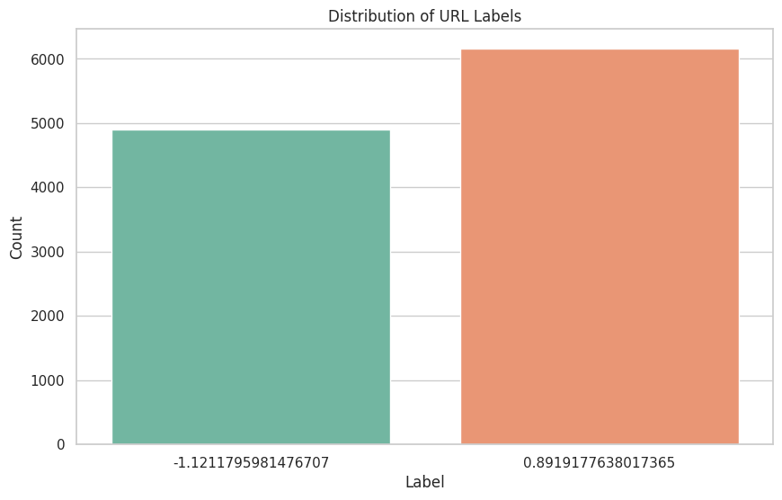
    


```python
# Histograms for numerical features with adjusted spacing
numerical_cols = df.select_dtypes(include=[np.number]).columns

fig, axes = plt.subplots(nrows=8, ncols=4, figsize=(20, 20))
axes = axes.flatten()

for i, col in enumerate(numerical_cols):
    sns.histplot(df[col], bins=20, kde=True, color='purple', ax=axes[i])
    axes[i].set_title(col)
    axes[i].set_xlabel('')
    axes[i].set_ylabel('')

# Removing any empty subplots
for i in range(len(numerical_cols), len(axes)):
    fig.delaxes(axes[i])

fig.tight_layout()
plt.suptitle('Histograms of Numerical Features', fontsize=20, y=1.02)
plt.show()

```


    
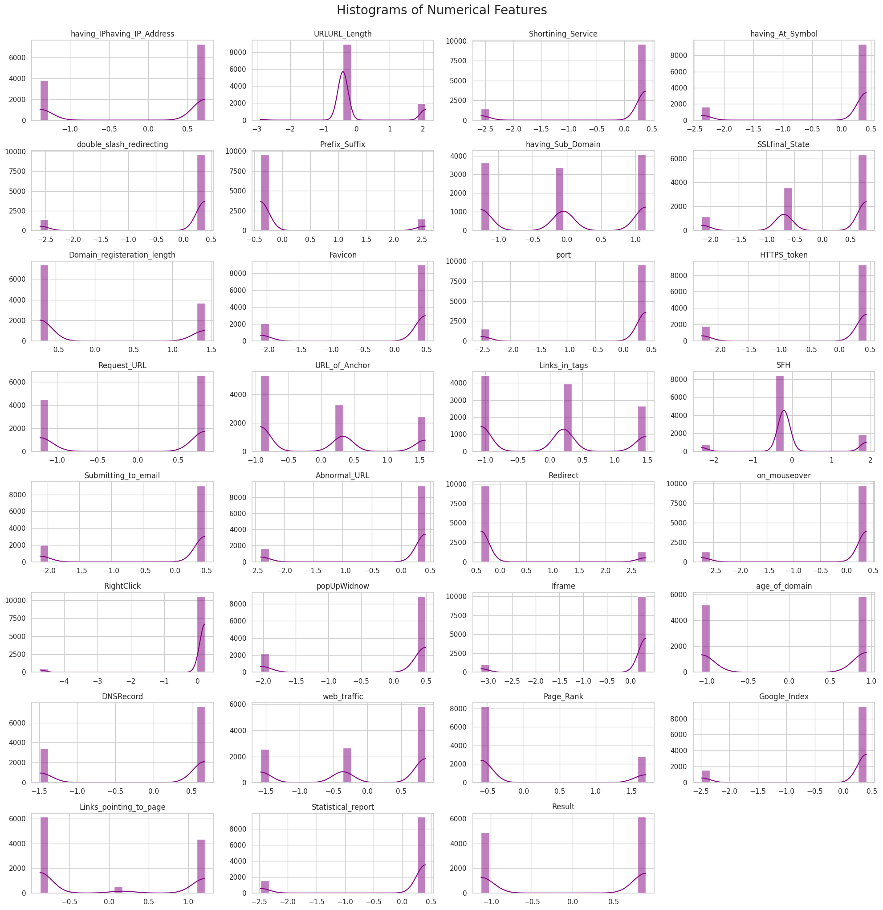
    


```python
# Box plots for numerical features to understand the spread and detect outliers
plt.figure(figsize=(20, 15))
for i, col in enumerate(numerical_cols, 1):
    plt.subplot(6, 6, i)
    sns.boxplot(y=df[col], color='orange')
    plt.title(col)
plt.tight_layout()
plt.show()
```


    
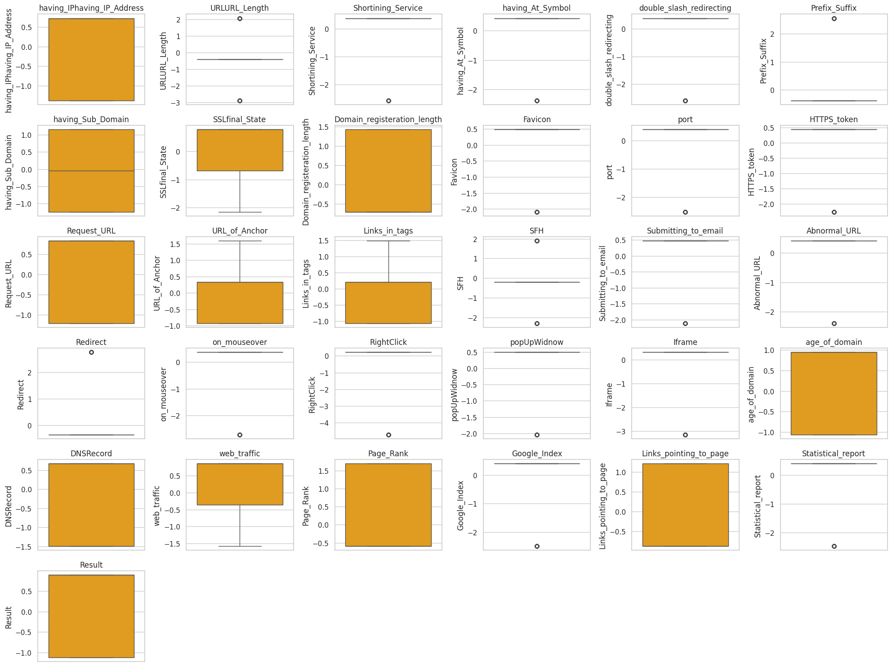
    


```python
# Scatter plot for selected pairs of numerical features
plt.figure(figsize=(10, 6))
sns.scatterplot(x='URLURL_Length', y='age_of_domain', hue='Result', data=df, palette='viridis')
plt.title('Scatter Plot: URL Length vs Age of Domain')
plt.xlabel('URL Length')
plt.ylabel('Age of Domain')
plt.show()
```


    
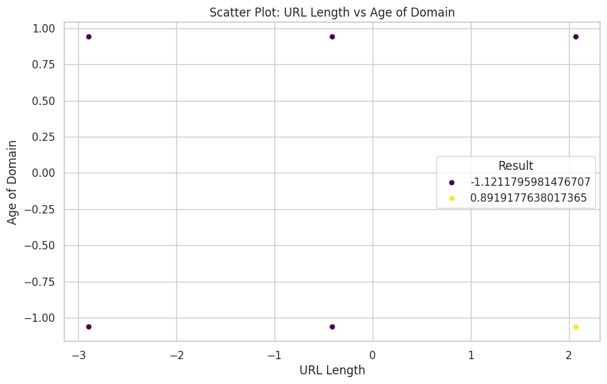
    


```python
# Violin plots for numerical features with adjusted spacing
plt.figure(figsize=(20, 40))  # Increase the figure size for better spacing

# Creating individual violin plots for each numerical column
for i, col in enumerate(numerical_cols, 1):
    plt.subplot(8, 4, i)
    sns.violinplot(x='Result', y=col, data=df, palette='muted')
    plt.title(col)
    plt.xlabel('')
    plt.ylabel('')

plt.tight_layout()
plt.suptitle('Violin Plots of Numerical Features', fontsize=20, y=1.02)
plt.show()

```

    <ipython-input-142-28f993abbe87>:7: FutureWarning:
    
    
    
    Passing `palette` without assigning `hue` is deprecated and will be removed in v0.14.0. Assign the `x` variable to `hue` and set `legend=False` for the same effect.
    
    
    <ipython-input-142-28f993abbe87>:7: FutureWarning:
    
    
    
    Passing `palette` without assigning `hue` is deprecated and will be removed in v0.14.0. Assign the `x` variable to `hue` and set `legend=False` for the same effect.
    
    
    <ipython-input-142-28f993abbe87>:7: FutureWarning:
    
    
    
    Passing `palette` without assigning `hue` is deprecated and will be removed in v0.14.0. Assign the `x` variable to `hue` and set `legend=False` for the same effect.
    
    
    <ipython-input-142-28f993abbe87>:7: FutureWarning:
    
    
    
    Passing `palette` without assigning `hue` is deprecated and will be removed in v0.14.0. Assign the `x` variable to `hue` and set `legend=False` for the same effect.
    
    
    <ipython-input-142-28f993abbe87>:7: FutureWarning:
    
    
    
    Passing `palette` without assigning `hue` is deprecated and will be removed in v0.14.0. Assign the `x` variable to `hue` and set `legend=False` for the same effect.
    
    
    <ipython-input-142-28f993abbe87>:7: FutureWarning:
    
    
    
    Passing `palette` without assigning `hue` is deprecated and will be removed in v0.14.0. Assign the `x` variable to `hue` and set `legend=False` for the same effect.
    
    
    <ipython-input-142-28f993abbe87>:7: FutureWarning:
    
    
    
    Passing `palette` without assigning `hue` is deprecated and will be removed in v0.14.0. Assign the `x` variable to `hue` and set `legend=False` for the same effect.
    
    
    <ipython-input-142-28f993abbe87>:7: FutureWarning:
    
    
    
    Passing `palette` without assigning `hue` is deprecated and will be removed in v0.14.0. Assign the `x` variable to `hue` and set `legend=False` for the same effect.
    
    
    <ipython-input-142-28f993abbe87>:7: FutureWarning:
    
    
    
    Passing `palette` without assigning `hue` is deprecated and will be removed in v0.14.0. Assign the `x` variable to `hue` and set `legend=False` for the same effect.
    
    
    <ipython-input-142-28f993abbe87>:7: FutureWarning:
    
    
    
    Passing `palette` without assigning `hue` is deprecated and will be removed in v0.14.0. Assign the `x` variable to `hue` and set `legend=False` for the same effect.
    
    
    <ipython-input-142-28f993abbe87>:7: FutureWarning:
    
    
    
    Passing `palette` without assigning `hue` is deprecated and will be removed in v0.14.0. Assign the `x` variable to `hue` and set `legend=False` for the same effect.
    
    
    <ipython-input-142-28f993abbe87>:7: FutureWarning:
    
    
    
    Passing `palette` without assigning `hue` is deprecated and will be removed in v0.14.0. Assign the `x` variable to `hue` and set `legend=False` for the same effect.
    
    
    <ipython-input-142-28f993abbe87>:7: FutureWarning:
    
    
    
    Passing `palette` without assigning `hue` is deprecated and will be removed in v0.14.0. Assign the `x` variable to `hue` and set `legend=False` for the same effect.
    
    
    <ipython-input-142-28f993abbe87>:7: FutureWarning:
    
    
    
    Passing `palette` without assigning `hue` is deprecated and will be removed in v0.14.0. Assign the `x` variable to `hue` and set `legend=False` for the same effect.
    
    
    <ipython-input-142-28f993abbe87>:7: FutureWarning:
    
    
    
    Passing `palette` without assigning `hue` is deprecated and will be removed in v0.14.0. Assign the `x` variable to `hue` and set `legend=False` for the same effect.
    
    
    <ipython-input-142-28f993abbe87>:7: FutureWarning:
    
    
    
    Passing `palette` without assigning `hue` is deprecated and will be removed in v0.14.0. Assign the `x` variable to `hue` and set `legend=False` for the same effect.
    
    
    <ipython-input-142-28f993abbe87>:7: FutureWarning:
    
    
    
    Passing `palette` without assigning `hue` is deprecated and will be removed in v0.14.0. Assign the `x` variable to `hue` and set `legend=False` for the same effect.
    
    
    <ipython-input-142-28f993abbe87>:7: FutureWarning:
    
    
    
    Passing `palette` without assigning `hue` is deprecated and will be removed in v0.14.0. Assign the `x` variable to `hue` and set `legend=False` for the same effect.
    
    
    <ipython-input-142-28f993abbe87>:7: FutureWarning:
    
    
    
    Passing `palette` without assigning `hue` is deprecated and will be removed in v0.14.0. Assign the `x` variable to `hue` and set `legend=False` for the same effect.
    
    
    <ipython-input-142-28f993abbe87>:7: FutureWarning:
    
    
    
    Passing `palette` without assigning `hue` is deprecated and will be removed in v0.14.0. Assign the `x` variable to `hue` and set `legend=False` for the same effect.
    
    
    <ipython-input-142-28f993abbe87>:7: FutureWarning:
    
    
    
    Passing `palette` without assigning `hue` is deprecated and will be removed in v0.14.0. Assign the `x` variable to `hue` and set `legend=False` for the same effect.
    
    
    <ipython-input-142-28f993abbe87>:7: FutureWarning:
    
    
    
    Passing `palette` without assigning `hue` is deprecated and will be removed in v0.14.0. Assign the `x` variable to `hue` and set `legend=False` for the same effect.
    
    
    <ipython-input-142-28f993abbe87>:7: FutureWarning:
    
    
    
    Passing `palette` without assigning `hue` is deprecated and will be removed in v0.14.0. Assign the `x` variable to `hue` and set `legend=False` for the same effect.
    
    
    <ipython-input-142-28f993abbe87>:7: FutureWarning:
    
    
    
    Passing `palette` without assigning `hue` is deprecated and will be removed in v0.14.0. Assign the `x` variable to `hue` and set `legend=False` for the same effect.
    
    
    <ipython-input-142-28f993abbe87>:7: FutureWarning:
    
    
    
    Passing `palette` without assigning `hue` is deprecated and will be removed in v0.14.0. Assign the `x` variable to `hue` and set `legend=False` for the same effect.
    
    
    <ipython-input-142-28f993abbe87>:7: FutureWarning:
    
    
    
    Passing `palette` without assigning `hue` is deprecated and will be removed in v0.14.0. Assign the `x` variable to `hue` and set `legend=False` for the same effect.
    
    
    <ipython-input-142-28f993abbe87>:7: FutureWarning:
    
    
    
    Passing `palette` without assigning `hue` is deprecated and will be removed in v0.14.0. Assign the `x` variable to `hue` and set `legend=False` for the same effect.
    
    
    <ipython-input-142-28f993abbe87>:7: FutureWarning:
    
    
    
    Passing `palette` without assigning `hue` is deprecated and will be removed in v0.14.0. Assign the `x` variable to `hue` and set `legend=False` for the same effect.
    
    
    <ipython-input-142-28f993abbe87>:7: FutureWarning:
    
    
    
    Passing `palette` without assigning `hue` is deprecated and will be removed in v0.14.0. Assign the `x` variable to `hue` and set `legend=False` for the same effect.
    
    
    <ipython-input-142-28f993abbe87>:7: FutureWarning:
    
    
    
    Passing `palette` without assigning `hue` is deprecated and will be removed in v0.14.0. Assign the `x` variable to `hue` and set `legend=False` for the same effect.
    
    
    <ipython-input-142-28f993abbe87>:7: FutureWarning:
    
    
    
    Passing `palette` without assigning `hue` is deprecated and will be removed in v0.14.0. Assign the `x` variable to `hue` and set `legend=False` for the same effect.
    
    
    


    
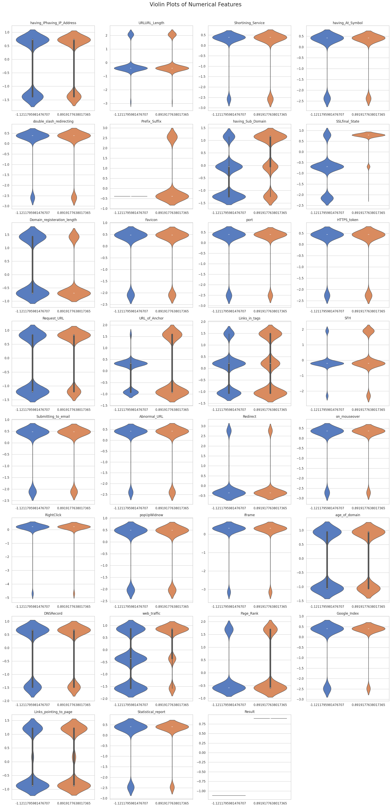
    


```python
# Correlation matrix to see the relationships between numerical features
plt.figure(figsize=(18, 15))
corr_matrix = df.corr()

sns.heatmap(corr_matrix, annot=True, fmt='.2f', cmap='mako', square=True,
            annot_kws={"size": 10}, cbar_kws={"shrink": .75})
plt.title('Correlation Matrix', fontsize=20)
plt.show()
```


    

    


```python
# Animated scatter plot using Plotly
import plotly.express as px

# Sample the data for the animation
sample_df = df.sample(500)

# Adding a small constant to ensure the 'size' property has positive values
sample_df['size_positive'] = sample_df['age_of_domain'] + 1.1

# Creating the animated scatter plot
fig = px.scatter(sample_df, x='URLURL_Length', y='age_of_domain', color='Result',
                 animation_frame=sample_df.index.astype(str), animation_group='Result',
                 size='size_positive', hover_name='Result',
                 title='Animated Scatter Plot: URL Length vs Age of Domain')

fig.show()
```


<html>
<head><meta charset="utf-8" /></head>
<body>
    <div>            <script src="https://cdnjs.cloudflare.com/ajax/libs/mathjax/2.7.5/MathJax.js?config=TeX-AMS-MML_SVG"></script><script type="text/javascript">if (window.MathJax && window.MathJax.Hub && window.MathJax.Hub.Config) {window.MathJax.Hub.Config({SVG: {font: "STIX-Web"}});}</script>                <script type="text/javascript">window.PlotlyConfig = {MathJaxConfig: 'local'};</script>
        <script charset="utf-8" src="https://cdn.plot.ly/plotly-2.24.1.min.js"></script>                <div id="b0814413-2bbc-4e0c-b1ac-b0a20d0baccf" class="plotly-graph-div" style="height:525px; width:100%;"></div>            <script type="text/javascript">                                    window.PLOTLYENV=window.PLOTLYENV || {};                                    if (document.getElementById("b0814413-2bbc-4e0c-b1ac-b0a20d0baccf")) {                    Plotly.newPlot(                        "b0814413-2bbc-4e0c-b1ac-b0a20d0baccf",                        [{"hovertemplate":"\u003cb\u003e%{hovertext}\u003c\u002fb\u003e\u003cbr\u003e\u003cbr\u003eanimation_frame=9875\u003cbr\u003eURLURL_Length=%{x}\u003cbr\u003eage_of_domain=%{y}\u003cbr\u003esize_positive=%{marker.size}\u003cbr\u003eResult=%{marker.color}\u003cextra\u003e\u003c\u002fextra\u003e","hovertext":[-1.1211795981476707],"ids":[-1.1211795981476707],"legendgroup":"","marker":{"color":[-1.1211795981476707],"coloraxis":"coloraxis","size":[2.0405260006288226],"sizemode":"area","sizeref":0.005101315001572056,"symbol":"circle"},"mode":"markers","name":"","orientation":"v","showlegend":false,"x":[-0.4098320249806274],"xaxis":"x","y":[0.9405260006288224],"yaxis":"y","type":"scatter"}],                        {"template":{"data":{"histogram2dcontour":[{"type":"histogram2dcontour","colorbar":{"outlinewidth":0,"ticks":""},"colorscale":[[0.0,"#0d0887"],[0.1111111111111111,"#46039f"],[0.2222222222222222,"#7201a8"],[0.3333333333333333,"#9c179e"],[0.4444444444444444,"#bd3786"],[0.5555555555555556,"#d8576b"],[0.6666666666666666,"#ed7953"],[0.7777777777777778,"#fb9f3a"],[0.8888888888888888,"#fdca26"],[1.0,"#f0f921"]]}],"choropleth":[{"type":"choropleth","colorbar":{"outlinewidth":0,"ticks":""}}],"histogram2d":[{"type":"histogram2d","colorbar":{"outlinewidth":0,"ticks":""},"colorscale":[[0.0,"#0d0887"],[0.1111111111111111,"#46039f"],[0.2222222222222222,"#7201a8"],[0.3333333333333333,"#9c179e"],[0.4444444444444444,"#bd3786"],[0.5555555555555556,"#d8576b"],[0.6666666666666666,"#ed7953"],[0.7777777777777778,"#fb9f3a"],[0.8888888888888888,"#fdca26"],[1.0,"#f0f921"]]}],"heatmap":[{"type":"heatmap","colorbar":{"outlinewidth":0,"ticks":""},"colorscale":[[0.0,"#0d0887"],[0.1111111111111111,"#46039f"],[0.2222222222222222,"#7201a8"],[0.3333333333333333,"#9c179e"],[0.4444444444444444,"#bd3786"],[0.5555555555555556,"#d8576b"],[0.6666666666666666,"#ed7953"],[0.7777777777777778,"#fb9f3a"],[0.8888888888888888,"#fdca26"],[1.0,"#f0f921"]]}],"heatmapgl":[{"type":"heatmapgl","colorbar":{"outlinewidth":0,"ticks":""},"colorscale":[[0.0,"#0d0887"],[0.1111111111111111,"#46039f"],[0.2222222222222222,"#7201a8"],[0.3333333333333333,"#9c179e"],[0.4444444444444444,"#bd3786"],[0.5555555555555556,"#d8576b"],[0.6666666666666666,"#ed7953"],[0.7777777777777778,"#fb9f3a"],[0.8888888888888888,"#fdca26"],[1.0,"#f0f921"]]}],"contourcarpet":[{"type":"contourcarpet","colorbar":{"outlinewidth":0,"ticks":""}}],"contour":[{"type":"contour","colorbar":{"outlinewidth":0,"ticks":""},"colorscale":[[0.0,"#0d0887"],[0.1111111111111111,"#46039f"],[0.2222222222222222,"#7201a8"],[0.3333333333333333,"#9c179e"],[0.4444444444444444,"#bd3786"],[0.5555555555555556,"#d8576b"],[0.6666666666666666,"#ed7953"],[0.7777777777777778,"#fb9f3a"],[0.8888888888888888,"#fdca26"],[1.0,"#f0f921"]]}],"surface":[{"type":"surface","colorbar":{"outlinewidth":0,"ticks":""},"colorscale":[[0.0,"#0d0887"],[0.1111111111111111,"#46039f"],[0.2222222222222222,"#7201a8"],[0.3333333333333333,"#9c179e"],[0.4444444444444444,"#bd3786"],[0.5555555555555556,"#d8576b"],[0.6666666666666666,"#ed7953"],[0.7777777777777778,"#fb9f3a"],[0.8888888888888888,"#fdca26"],[1.0,"#f0f921"]]}],"mesh3d":[{"type":"mesh3d","colorbar":{"outlinewidth":0,"ticks":""}}],"scatter":[{"fillpattern":{"fillmode":"overlay","size":10,"solidity":0.2},"type":"scatter"}],"parcoords":[{"type":"parcoords","line":{"colorbar":{"outlinewidth":0,"ticks":""}}}],"scatterpolargl":[{"type":"scatterpolargl","marker":{"colorbar":{"outlinewidth":0,"ticks":""}}}],"bar":[{"error_x":{"color":"#2a3f5f"},"error_y":{"color":"#2a3f5f"},"marker":{"line":{"color":"#E5ECF6","width":0.5},"pattern":{"fillmode":"overlay","size":10,"solidity":0.2}},"type":"bar"}],"scattergeo":[{"type":"scattergeo","marker":{"colorbar":{"outlinewidth":0,"ticks":""}}}],"scatterpolar":[{"type":"scatterpolar","marker":{"colorbar":{"outlinewidth":0,"ticks":""}}}],"histogram":[{"marker":{"pattern":{"fillmode":"overlay","size":10,"solidity":0.2}},"type":"histogram"}],"scattergl":[{"type":"scattergl","marker":{"colorbar":{"outlinewidth":0,"ticks":""}}}],"scatter3d":[{"type":"scatter3d","line":{"colorbar":{"outlinewidth":0,"ticks":""}},"marker":{"colorbar":{"outlinewidth":0,"ticks":""}}}],"scattermapbox":[{"type":"scattermapbox","marker":{"colorbar":{"outlinewidth":0,"ticks":""}}}],"scatterternary":[{"type":"scatterternary","marker":{"colorbar":{"outlinewidth":0,"ticks":""}}}],"scattercarpet":[{"type":"scattercarpet","marker":{"colorbar":{"outlinewidth":0,"ticks":""}}}],"carpet":[{"aaxis":{"endlinecolor":"#2a3f5f","gridcolor":"white","linecolor":"white","minorgridcolor":"white","startlinecolor":"#2a3f5f"},"baxis":{"endlinecolor":"#2a3f5f","gridcolor":"white","linecolor":"white","minorgridcolor":"white","startlinecolor":"#2a3f5f"},"type":"carpet"}],"table":[{"cells":{"fill":{"color":"#EBF0F8"},"line":{"color":"white"}},"header":{"fill":{"color":"#C8D4E3"},"line":{"color":"white"}},"type":"table"}],"barpolar":[{"marker":{"line":{"color":"#E5ECF6","width":0.5},"pattern":{"fillmode":"overlay","size":10,"solidity":0.2}},"type":"barpolar"}],"pie":[{"automargin":true,"type":"pie"}]},"layout":{"autotypenumbers":"strict","colorway":["#636efa","#EF553B","#00cc96","#ab63fa","#FFA15A","#19d3f3","#FF6692","#B6E880","#FF97FF","#FECB52"],"font":{"color":"#2a3f5f"},"hovermode":"closest","hoverlabel":{"align":"left"},"paper_bgcolor":"white","plot_bgcolor":"#E5ECF6","polar":{"bgcolor":"#E5ECF6","angularaxis":{"gridcolor":"white","linecolor":"white","ticks":""},"radialaxis":{"gridcolor":"white","linecolor":"white","ticks":""}},"ternary":{"bgcolor":"#E5ECF6","aaxis":{"gridcolor":"white","linecolor":"white","ticks":""},"baxis":{"gridcolor":"white","linecolor":"white","ticks":""},"caxis":{"gridcolor":"white","linecolor":"white","ticks":""}},"coloraxis":{"colorbar":{"outlinewidth":0,"ticks":""}},"colorscale":{"sequential":[[0.0,"#0d0887"],[0.1111111111111111,"#46039f"],[0.2222222222222222,"#7201a8"],[0.3333333333333333,"#9c179e"],[0.4444444444444444,"#bd3786"],[0.5555555555555556,"#d8576b"],[0.6666666666666666,"#ed7953"],[0.7777777777777778,"#fb9f3a"],[0.8888888888888888,"#fdca26"],[1.0,"#f0f921"]],"sequentialminus":[[0.0,"#0d0887"],[0.1111111111111111,"#46039f"],[0.2222222222222222,"#7201a8"],[0.3333333333333333,"#9c179e"],[0.4444444444444444,"#bd3786"],[0.5555555555555556,"#d8576b"],[0.6666666666666666,"#ed7953"],[0.7777777777777778,"#fb9f3a"],[0.8888888888888888,"#fdca26"],[1.0,"#f0f921"]],"diverging":[[0,"#8e0152"],[0.1,"#c51b7d"],[0.2,"#de77ae"],[0.3,"#f1b6da"],[0.4,"#fde0ef"],[0.5,"#f7f7f7"],[0.6,"#e6f5d0"],[0.7,"#b8e186"],[0.8,"#7fbc41"],[0.9,"#4d9221"],[1,"#276419"]]},"xaxis":{"gridcolor":"white","linecolor":"white","ticks":"","title":{"standoff":15},"zerolinecolor":"white","automargin":true,"zerolinewidth":2},"yaxis":{"gridcolor":"white","linecolor":"white","ticks":"","title":{"standoff":15},"zerolinecolor":"white","automargin":true,"zerolinewidth":2},"scene":{"xaxis":{"backgroundcolor":"#E5ECF6","gridcolor":"white","linecolor":"white","showbackground":true,"ticks":"","zerolinecolor":"white","gridwidth":2},"yaxis":{"backgroundcolor":"#E5ECF6","gridcolor":"white","linecolor":"white","showbackground":true,"ticks":"","zerolinecolor":"white","gridwidth":2},"zaxis":{"backgroundcolor":"#E5ECF6","gridcolor":"white","linecolor":"white","showbackground":true,"ticks":"","zerolinecolor":"white","gridwidth":2}},"shapedefaults":{"line":{"color":"#2a3f5f"}},"annotationdefaults":{"arrowcolor":"#2a3f5f","arrowhead":0,"arrowwidth":1},"geo":{"bgcolor":"white","landcolor":"#E5ECF6","subunitcolor":"white","showland":true,"showlakes":true,"lakecolor":"white"},"title":{"x":0.05},"mapbox":{"style":"light"}}},"xaxis":{"anchor":"y","domain":[0.0,1.0],"title":{"text":"URLURL_Length"}},"yaxis":{"anchor":"x","domain":[0.0,1.0],"title":{"text":"age_of_domain"}},"coloraxis":{"colorbar":{"title":{"text":"Result"}},"colorscale":[[0.0,"#0d0887"],[0.1111111111111111,"#46039f"],[0.2222222222222222,"#7201a8"],[0.3333333333333333,"#9c179e"],[0.4444444444444444,"#bd3786"],[0.5555555555555556,"#d8576b"],[0.6666666666666666,"#ed7953"],[0.7777777777777778,"#fb9f3a"],[0.8888888888888888,"#fdca26"],[1.0,"#f0f921"]]},"legend":{"tracegroupgap":0,"itemsizing":"constant"},"title":{"text":"Animated Scatter Plot: URL Length vs Age of Domain"},"updatemenus":[{"buttons":[{"args":[null,{"frame":{"duration":500,"redraw":false},"mode":"immediate","fromcurrent":true,"transition":{"duration":500,"easing":"linear"}}],"label":"&#9654;","method":"animate"},{"args":[[null],{"frame":{"duration":0,"redraw":false},"mode":"immediate","fromcurrent":true,"transition":{"duration":0,"easing":"linear"}}],"label":"&#9724;","method":"animate"}],"direction":"left","pad":{"r":10,"t":70},"showactive":false,"type":"buttons","x":0.1,"xanchor":"right","y":0,"yanchor":"top"}],"sliders":[{"active":0,"currentvalue":{"prefix":"animation_frame="},"len":0.9,"pad":{"b":10,"t":60},"steps":[{"args":[["9875"],{"frame":{"duration":0,"redraw":false},"mode":"immediate","fromcurrent":true,"transition":{"duration":0,"easing":"linear"}}],"label":"9875","method":"animate"},{"args":[["9298"],{"frame":{"duration":0,"redraw":false},"mode":"immediate","fromcurrent":true,"transition":{"duration":0,"easing":"linear"}}],"label":"9298","method":"animate"},{"args":[["10760"],{"frame":{"duration":0,"redraw":false},"mode":"immediate","fromcurrent":true,"transition":{"duration":0,"easing":"linear"}}],"label":"10760","method":"animate"},{"args":[["7586"],{"frame":{"duration":0,"redraw":false},"mode":"immediate","fromcurrent":true,"transition":{"duration":0,"easing":"linear"}}],"label":"7586","method":"animate"},{"args":[["7633"],{"frame":{"duration":0,"redraw":false},"mode":"immediate","fromcurrent":true,"transition":{"duration":0,"easing":"linear"}}],"label":"7633","method":"animate"},{"args":[["10128"],{"frame":{"duration":0,"redraw":false},"mode":"immediate","fromcurrent":true,"transition":{"duration":0,"easing":"linear"}}],"label":"10128","method":"animate"},{"args":[["3333"],{"frame":{"duration":0,"redraw":false},"mode":"immediate","fromcurrent":true,"transition":{"duration":0,"easing":"linear"}}],"label":"3333","method":"animate"},{"args":[["1221"],{"frame":{"duration":0,"redraw":false},"mode":"immediate","fromcurrent":true,"transition":{"duration":0,"easing":"linear"}}],"label":"1221","method":"animate"},{"args":[["4013"],{"frame":{"duration":0,"redraw":false},"mode":"immediate","fromcurrent":true,"transition":{"duration":0,"easing":"linear"}}],"label":"4013","method":"animate"},{"args":[["1054"],{"frame":{"duration":0,"redraw":false},"mode":"immediate","fromcurrent":true,"transition":{"duration":0,"easing":"linear"}}],"label":"1054","method":"animate"},{"args":[["3942"],{"frame":{"duration":0,"redraw":false},"mode":"immediate","fromcurrent":true,"transition":{"duration":0,"easing":"linear"}}],"label":"3942","method":"animate"},{"args":[["2402"],{"frame":{"duration":0,"redraw":false},"mode":"immediate","fromcurrent":true,"transition":{"duration":0,"easing":"linear"}}],"label":"2402","method":"animate"},{"args":[["5166"],{"frame":{"duration":0,"redraw":false},"mode":"immediate","fromcurrent":true,"transition":{"duration":0,"easing":"linear"}}],"label":"5166","method":"animate"},{"args":[["3921"],{"frame":{"duration":0,"redraw":false},"mode":"immediate","fromcurrent":true,"transition":{"duration":0,"easing":"linear"}}],"label":"3921","method":"animate"},{"args":[["2168"],{"frame":{"duration":0,"redraw":false},"mode":"immediate","fromcurrent":true,"transition":{"duration":0,"easing":"linear"}}],"label":"2168","method":"animate"},{"args":[["2196"],{"frame":{"duration":0,"redraw":false},"mode":"immediate","fromcurrent":true,"transition":{"duration":0,"easing":"linear"}}],"label":"2196","method":"animate"},{"args":[["3002"],{"frame":{"duration":0,"redraw":false},"mode":"immediate","fromcurrent":true,"transition":{"duration":0,"easing":"linear"}}],"label":"3002","method":"animate"},{"args":[["7129"],{"frame":{"duration":0,"redraw":false},"mode":"immediate","fromcurrent":true,"transition":{"duration":0,"easing":"linear"}}],"label":"7129","method":"animate"},{"args":[["9202"],{"frame":{"duration":0,"redraw":false},"mode":"immediate","fromcurrent":true,"transition":{"duration":0,"easing":"linear"}}],"label":"9202","method":"animate"},{"args":[["10809"],{"frame":{"duration":0,"redraw":false},"mode":"immediate","fromcurrent":true,"transition":{"duration":0,"easing":"linear"}}],"label":"10809","method":"animate"},{"args":[["952"],{"frame":{"duration":0,"redraw":false},"mode":"immediate","fromcurrent":true,"transition":{"duration":0,"easing":"linear"}}],"label":"952","method":"animate"},{"args":[["80"],{"frame":{"duration":0,"redraw":false},"mode":"immediate","fromcurrent":true,"transition":{"duration":0,"easing":"linear"}}],"label":"80","method":"animate"},{"args":[["10350"],{"frame":{"duration":0,"redraw":false},"mode":"immediate","fromcurrent":true,"transition":{"duration":0,"easing":"linear"}}],"label":"10350","method":"animate"},{"args":[["5277"],{"frame":{"duration":0,"redraw":false},"mode":"immediate","fromcurrent":true,"transition":{"duration":0,"easing":"linear"}}],"label":"5277","method":"animate"},{"args":[["1750"],{"frame":{"duration":0,"redraw":false},"mode":"immediate","fromcurrent":true,"transition":{"duration":0,"easing":"linear"}}],"label":"1750","method":"animate"},{"args":[["10742"],{"frame":{"duration":0,"redraw":false},"mode":"immediate","fromcurrent":true,"transition":{"duration":0,"easing":"linear"}}],"label":"10742","method":"animate"},{"args":[["1460"],{"frame":{"duration":0,"redraw":false},"mode":"immediate","fromcurrent":true,"transition":{"duration":0,"easing":"linear"}}],"label":"1460","method":"animate"},{"args":[["7582"],{"frame":{"duration":0,"redraw":false},"mode":"immediate","fromcurrent":true,"transition":{"duration":0,"easing":"linear"}}],"label":"7582","method":"animate"},{"args":[["5255"],{"frame":{"duration":0,"redraw":false},"mode":"immediate","fromcurrent":true,"transition":{"duration":0,"easing":"linear"}}],"label":"5255","method":"animate"},{"args":[["9246"],{"frame":{"duration":0,"redraw":false},"mode":"immediate","fromcurrent":true,"transition":{"duration":0,"easing":"linear"}}],"label":"9246","method":"animate"},{"args":[["5552"],{"frame":{"duration":0,"redraw":false},"mode":"immediate","fromcurrent":true,"transition":{"duration":0,"easing":"linear"}}],"label":"5552","method":"animate"},{"args":[["8117"],{"frame":{"duration":0,"redraw":false},"mode":"immediate","fromcurrent":true,"transition":{"duration":0,"easing":"linear"}}],"label":"8117","method":"animate"},{"args":[["2485"],{"frame":{"duration":0,"redraw":false},"mode":"immediate","fromcurrent":true,"transition":{"duration":0,"easing":"linear"}}],"label":"2485","method":"animate"},{"args":[["6318"],{"frame":{"duration":0,"redraw":false},"mode":"immediate","fromcurrent":true,"transition":{"duration":0,"easing":"linear"}}],"label":"6318","method":"animate"},{"args":[["686"],{"frame":{"duration":0,"redraw":false},"mode":"immediate","fromcurrent":true,"transition":{"duration":0,"easing":"linear"}}],"label":"686","method":"animate"},{"args":[["3226"],{"frame":{"duration":0,"redraw":false},"mode":"immediate","fromcurrent":true,"transition":{"duration":0,"easing":"linear"}}],"label":"3226","method":"animate"},{"args":[["9314"],{"frame":{"duration":0,"redraw":false},"mode":"immediate","fromcurrent":true,"transition":{"duration":0,"easing":"linear"}}],"label":"9314","method":"animate"},{"args":[["5978"],{"frame":{"duration":0,"redraw":false},"mode":"immediate","fromcurrent":true,"transition":{"duration":0,"easing":"linear"}}],"label":"5978","method":"animate"},{"args":[["6947"],{"frame":{"duration":0,"redraw":false},"mode":"immediate","fromcurrent":true,"transition":{"duration":0,"easing":"linear"}}],"label":"6947","method":"animate"},{"args":[["913"],{"frame":{"duration":0,"redraw":false},"mode":"immediate","fromcurrent":true,"transition":{"duration":0,"easing":"linear"}}],"label":"913","method":"animate"},{"args":[["2548"],{"frame":{"duration":0,"redraw":false},"mode":"immediate","fromcurrent":true,"transition":{"duration":0,"easing":"linear"}}],"label":"2548","method":"animate"},{"args":[["857"],{"frame":{"duration":0,"redraw":false},"mode":"immediate","fromcurrent":true,"transition":{"duration":0,"easing":"linear"}}],"label":"857","method":"animate"},{"args":[["7754"],{"frame":{"duration":0,"redraw":false},"mode":"immediate","fromcurrent":true,"transition":{"duration":0,"easing":"linear"}}],"label":"7754","method":"animate"},{"args":[["974"],{"frame":{"duration":0,"redraw":false},"mode":"immediate","fromcurrent":true,"transition":{"duration":0,"easing":"linear"}}],"label":"974","method":"animate"},{"args":[["4146"],{"frame":{"duration":0,"redraw":false},"mode":"immediate","fromcurrent":true,"transition":{"duration":0,"easing":"linear"}}],"label":"4146","method":"animate"},{"args":[["5095"],{"frame":{"duration":0,"redraw":false},"mode":"immediate","fromcurrent":true,"transition":{"duration":0,"easing":"linear"}}],"label":"5095","method":"animate"},{"args":[["10471"],{"frame":{"duration":0,"redraw":false},"mode":"immediate","fromcurrent":true,"transition":{"duration":0,"easing":"linear"}}],"label":"10471","method":"animate"},{"args":[["4343"],{"frame":{"duration":0,"redraw":false},"mode":"immediate","fromcurrent":true,"transition":{"duration":0,"easing":"linear"}}],"label":"4343","method":"animate"},{"args":[["7376"],{"frame":{"duration":0,"redraw":false},"mode":"immediate","fromcurrent":true,"transition":{"duration":0,"easing":"linear"}}],"label":"7376","method":"animate"},{"args":[["2980"],{"frame":{"duration":0,"redraw":false},"mode":"immediate","fromcurrent":true,"transition":{"duration":0,"easing":"linear"}}],"label":"2980","method":"animate"},{"args":[["10708"],{"frame":{"duration":0,"redraw":false},"mode":"immediate","fromcurrent":true,"transition":{"duration":0,"easing":"linear"}}],"label":"10708","method":"animate"},{"args":[["6051"],{"frame":{"duration":0,"redraw":false},"mode":"immediate","fromcurrent":true,"transition":{"duration":0,"easing":"linear"}}],"label":"6051","method":"animate"},{"args":[["8308"],{"frame":{"duration":0,"redraw":false},"mode":"immediate","fromcurrent":true,"transition":{"duration":0,"easing":"linear"}}],"label":"8308","method":"animate"},{"args":[["10323"],{"frame":{"duration":0,"redraw":false},"mode":"immediate","fromcurrent":true,"transition":{"duration":0,"easing":"linear"}}],"label":"10323","method":"animate"},{"args":[["6960"],{"frame":{"duration":0,"redraw":false},"mode":"immediate","fromcurrent":true,"transition":{"duration":0,"easing":"linear"}}],"label":"6960","method":"animate"},{"args":[["3250"],{"frame":{"duration":0,"redraw":false},"mode":"immediate","fromcurrent":true,"transition":{"duration":0,"easing":"linear"}}],"label":"3250","method":"animate"},{"args":[["6809"],{"frame":{"duration":0,"redraw":false},"mode":"immediate","fromcurrent":true,"transition":{"duration":0,"easing":"linear"}}],"label":"6809","method":"animate"},{"args":[["4818"],{"frame":{"duration":0,"redraw":false},"mode":"immediate","fromcurrent":true,"transition":{"duration":0,"easing":"linear"}}],"label":"4818","method":"animate"},{"args":[["9918"],{"frame":{"duration":0,"redraw":false},"mode":"immediate","fromcurrent":true,"transition":{"duration":0,"easing":"linear"}}],"label":"9918","method":"animate"},{"args":[["8290"],{"frame":{"duration":0,"redraw":false},"mode":"immediate","fromcurrent":true,"transition":{"duration":0,"easing":"linear"}}],"label":"8290","method":"animate"},{"args":[["10015"],{"frame":{"duration":0,"redraw":false},"mode":"immediate","fromcurrent":true,"transition":{"duration":0,"easing":"linear"}}],"label":"10015","method":"animate"},{"args":[["7454"],{"frame":{"duration":0,"redraw":false},"mode":"immediate","fromcurrent":true,"transition":{"duration":0,"easing":"linear"}}],"label":"7454","method":"animate"},{"args":[["9192"],{"frame":{"duration":0,"redraw":false},"mode":"immediate","fromcurrent":true,"transition":{"duration":0,"easing":"linear"}}],"label":"9192","method":"animate"},{"args":[["4567"],{"frame":{"duration":0,"redraw":false},"mode":"immediate","fromcurrent":true,"transition":{"duration":0,"easing":"linear"}}],"label":"4567","method":"animate"},{"args":[["2327"],{"frame":{"duration":0,"redraw":false},"mode":"immediate","fromcurrent":true,"transition":{"duration":0,"easing":"linear"}}],"label":"2327","method":"animate"},{"args":[["865"],{"frame":{"duration":0,"redraw":false},"mode":"immediate","fromcurrent":true,"transition":{"duration":0,"easing":"linear"}}],"label":"865","method":"animate"},{"args":[["6742"],{"frame":{"duration":0,"redraw":false},"mode":"immediate","fromcurrent":true,"transition":{"duration":0,"easing":"linear"}}],"label":"6742","method":"animate"},{"args":[["6622"],{"frame":{"duration":0,"redraw":false},"mode":"immediate","fromcurrent":true,"transition":{"duration":0,"easing":"linear"}}],"label":"6622","method":"animate"},{"args":[["1465"],{"frame":{"duration":0,"redraw":false},"mode":"immediate","fromcurrent":true,"transition":{"duration":0,"easing":"linear"}}],"label":"1465","method":"animate"},{"args":[["6738"],{"frame":{"duration":0,"redraw":false},"mode":"immediate","fromcurrent":true,"transition":{"duration":0,"easing":"linear"}}],"label":"6738","method":"animate"},{"args":[["10664"],{"frame":{"duration":0,"redraw":false},"mode":"immediate","fromcurrent":true,"transition":{"duration":0,"easing":"linear"}}],"label":"10664","method":"animate"},{"args":[["4582"],{"frame":{"duration":0,"redraw":false},"mode":"immediate","fromcurrent":true,"transition":{"duration":0,"easing":"linear"}}],"label":"4582","method":"animate"},{"args":[["3409"],{"frame":{"duration":0,"redraw":false},"mode":"immediate","fromcurrent":true,"transition":{"duration":0,"easing":"linear"}}],"label":"3409","method":"animate"},{"args":[["4246"],{"frame":{"duration":0,"redraw":false},"mode":"immediate","fromcurrent":true,"transition":{"duration":0,"easing":"linear"}}],"label":"4246","method":"animate"},{"args":[["4504"],{"frame":{"duration":0,"redraw":false},"mode":"immediate","fromcurrent":true,"transition":{"duration":0,"easing":"linear"}}],"label":"4504","method":"animate"},{"args":[["8095"],{"frame":{"duration":0,"redraw":false},"mode":"immediate","fromcurrent":true,"transition":{"duration":0,"easing":"linear"}}],"label":"8095","method":"animate"},{"args":[["840"],{"frame":{"duration":0,"redraw":false},"mode":"immediate","fromcurrent":true,"transition":{"duration":0,"easing":"linear"}}],"label":"840","method":"animate"},{"args":[["1274"],{"frame":{"duration":0,"redraw":false},"mode":"immediate","fromcurrent":true,"transition":{"duration":0,"easing":"linear"}}],"label":"1274","method":"animate"},{"args":[["3904"],{"frame":{"duration":0,"redraw":false},"mode":"immediate","fromcurrent":true,"transition":{"duration":0,"easing":"linear"}}],"label":"3904","method":"animate"},{"args":[["6316"],{"frame":{"duration":0,"redraw":false},"mode":"immediate","fromcurrent":true,"transition":{"duration":0,"easing":"linear"}}],"label":"6316","method":"animate"},{"args":[["1707"],{"frame":{"duration":0,"redraw":false},"mode":"immediate","fromcurrent":true,"transition":{"duration":0,"easing":"linear"}}],"label":"1707","method":"animate"},{"args":[["1184"],{"frame":{"duration":0,"redraw":false},"mode":"immediate","fromcurrent":true,"transition":{"duration":0,"easing":"linear"}}],"label":"1184","method":"animate"},{"args":[["3413"],{"frame":{"duration":0,"redraw":false},"mode":"immediate","fromcurrent":true,"transition":{"duration":0,"easing":"linear"}}],"label":"3413","method":"animate"},{"args":[["3962"],{"frame":{"duration":0,"redraw":false},"mode":"immediate","fromcurrent":true,"transition":{"duration":0,"easing":"linear"}}],"label":"3962","method":"animate"},{"args":[["1401"],{"frame":{"duration":0,"redraw":false},"mode":"immediate","fromcurrent":true,"transition":{"duration":0,"easing":"linear"}}],"label":"1401","method":"animate"},{"args":[["3531"],{"frame":{"duration":0,"redraw":false},"mode":"immediate","fromcurrent":true,"transition":{"duration":0,"easing":"linear"}}],"label":"3531","method":"animate"},{"args":[["846"],{"frame":{"duration":0,"redraw":false},"mode":"immediate","fromcurrent":true,"transition":{"duration":0,"easing":"linear"}}],"label":"846","method":"animate"},{"args":[["2691"],{"frame":{"duration":0,"redraw":false},"mode":"immediate","fromcurrent":true,"transition":{"duration":0,"easing":"linear"}}],"label":"2691","method":"animate"},{"args":[["4329"],{"frame":{"duration":0,"redraw":false},"mode":"immediate","fromcurrent":true,"transition":{"duration":0,"easing":"linear"}}],"label":"4329","method":"animate"},{"args":[["1457"],{"frame":{"duration":0,"redraw":false},"mode":"immediate","fromcurrent":true,"transition":{"duration":0,"easing":"linear"}}],"label":"1457","method":"animate"},{"args":[["10666"],{"frame":{"duration":0,"redraw":false},"mode":"immediate","fromcurrent":true,"transition":{"duration":0,"easing":"linear"}}],"label":"10666","method":"animate"},{"args":[["6802"],{"frame":{"duration":0,"redraw":false},"mode":"immediate","fromcurrent":true,"transition":{"duration":0,"easing":"linear"}}],"label":"6802","method":"animate"},{"args":[["8911"],{"frame":{"duration":0,"redraw":false},"mode":"immediate","fromcurrent":true,"transition":{"duration":0,"easing":"linear"}}],"label":"8911","method":"animate"},{"args":[["10994"],{"frame":{"duration":0,"redraw":false},"mode":"immediate","fromcurrent":true,"transition":{"duration":0,"easing":"linear"}}],"label":"10994","method":"animate"},{"args":[["525"],{"frame":{"duration":0,"redraw":false},"mode":"immediate","fromcurrent":true,"transition":{"duration":0,"easing":"linear"}}],"label":"525","method":"animate"},{"args":[["9242"],{"frame":{"duration":0,"redraw":false},"mode":"immediate","fromcurrent":true,"transition":{"duration":0,"easing":"linear"}}],"label":"9242","method":"animate"},{"args":[["35"],{"frame":{"duration":0,"redraw":false},"mode":"immediate","fromcurrent":true,"transition":{"duration":0,"easing":"linear"}}],"label":"35","method":"animate"},{"args":[["4342"],{"frame":{"duration":0,"redraw":false},"mode":"immediate","fromcurrent":true,"transition":{"duration":0,"easing":"linear"}}],"label":"4342","method":"animate"},{"args":[["6047"],{"frame":{"duration":0,"redraw":false},"mode":"immediate","fromcurrent":true,"transition":{"duration":0,"easing":"linear"}}],"label":"6047","method":"animate"},{"args":[["9262"],{"frame":{"duration":0,"redraw":false},"mode":"immediate","fromcurrent":true,"transition":{"duration":0,"easing":"linear"}}],"label":"9262","method":"animate"},{"args":[["7369"],{"frame":{"duration":0,"redraw":false},"mode":"immediate","fromcurrent":true,"transition":{"duration":0,"easing":"linear"}}],"label":"7369","method":"animate"},{"args":[["8663"],{"frame":{"duration":0,"redraw":false},"mode":"immediate","fromcurrent":true,"transition":{"duration":0,"easing":"linear"}}],"label":"8663","method":"animate"},{"args":[["5354"],{"frame":{"duration":0,"redraw":false},"mode":"immediate","fromcurrent":true,"transition":{"duration":0,"easing":"linear"}}],"label":"5354","method":"animate"},{"args":[["9949"],{"frame":{"duration":0,"redraw":false},"mode":"immediate","fromcurrent":true,"transition":{"duration":0,"easing":"linear"}}],"label":"9949","method":"animate"},{"args":[["2465"],{"frame":{"duration":0,"redraw":false},"mode":"immediate","fromcurrent":true,"transition":{"duration":0,"easing":"linear"}}],"label":"2465","method":"animate"},{"args":[["4130"],{"frame":{"duration":0,"redraw":false},"mode":"immediate","fromcurrent":true,"transition":{"duration":0,"easing":"linear"}}],"label":"4130","method":"animate"},{"args":[["5232"],{"frame":{"duration":0,"redraw":false},"mode":"immediate","fromcurrent":true,"transition":{"duration":0,"easing":"linear"}}],"label":"5232","method":"animate"},{"args":[["5755"],{"frame":{"duration":0,"redraw":false},"mode":"immediate","fromcurrent":true,"transition":{"duration":0,"easing":"linear"}}],"label":"5755","method":"animate"},{"args":[["4296"],{"frame":{"duration":0,"redraw":false},"mode":"immediate","fromcurrent":true,"transition":{"duration":0,"easing":"linear"}}],"label":"4296","method":"animate"},{"args":[["3815"],{"frame":{"duration":0,"redraw":false},"mode":"immediate","fromcurrent":true,"transition":{"duration":0,"easing":"linear"}}],"label":"3815","method":"animate"},{"args":[["8831"],{"frame":{"duration":0,"redraw":false},"mode":"immediate","fromcurrent":true,"transition":{"duration":0,"easing":"linear"}}],"label":"8831","method":"animate"},{"args":[["256"],{"frame":{"duration":0,"redraw":false},"mode":"immediate","fromcurrent":true,"transition":{"duration":0,"easing":"linear"}}],"label":"256","method":"animate"},{"args":[["3067"],{"frame":{"duration":0,"redraw":false},"mode":"immediate","fromcurrent":true,"transition":{"duration":0,"easing":"linear"}}],"label":"3067","method":"animate"},{"args":[["1952"],{"frame":{"duration":0,"redraw":false},"mode":"immediate","fromcurrent":true,"transition":{"duration":0,"easing":"linear"}}],"label":"1952","method":"animate"},{"args":[["10450"],{"frame":{"duration":0,"redraw":false},"mode":"immediate","fromcurrent":true,"transition":{"duration":0,"easing":"linear"}}],"label":"10450","method":"animate"},{"args":[["7022"],{"frame":{"duration":0,"redraw":false},"mode":"immediate","fromcurrent":true,"transition":{"duration":0,"easing":"linear"}}],"label":"7022","method":"animate"},{"args":[["2622"],{"frame":{"duration":0,"redraw":false},"mode":"immediate","fromcurrent":true,"transition":{"duration":0,"easing":"linear"}}],"label":"2622","method":"animate"},{"args":[["690"],{"frame":{"duration":0,"redraw":false},"mode":"immediate","fromcurrent":true,"transition":{"duration":0,"easing":"linear"}}],"label":"690","method":"animate"},{"args":[["6354"],{"frame":{"duration":0,"redraw":false},"mode":"immediate","fromcurrent":true,"transition":{"duration":0,"easing":"linear"}}],"label":"6354","method":"animate"},{"args":[["9755"],{"frame":{"duration":0,"redraw":false},"mode":"immediate","fromcurrent":true,"transition":{"duration":0,"easing":"linear"}}],"label":"9755","method":"animate"},{"args":[["3146"],{"frame":{"duration":0,"redraw":false},"mode":"immediate","fromcurrent":true,"transition":{"duration":0,"easing":"linear"}}],"label":"3146","method":"animate"},{"args":[["3473"],{"frame":{"duration":0,"redraw":false},"mode":"immediate","fromcurrent":true,"transition":{"duration":0,"easing":"linear"}}],"label":"3473","method":"animate"},{"args":[["7280"],{"frame":{"duration":0,"redraw":false},"mode":"immediate","fromcurrent":true,"transition":{"duration":0,"easing":"linear"}}],"label":"7280","method":"animate"},{"args":[["6626"],{"frame":{"duration":0,"redraw":false},"mode":"immediate","fromcurrent":true,"transition":{"duration":0,"easing":"linear"}}],"label":"6626","method":"animate"},{"args":[["1606"],{"frame":{"duration":0,"redraw":false},"mode":"immediate","fromcurrent":true,"transition":{"duration":0,"easing":"linear"}}],"label":"1606","method":"animate"},{"args":[["8459"],{"frame":{"duration":0,"redraw":false},"mode":"immediate","fromcurrent":true,"transition":{"duration":0,"easing":"linear"}}],"label":"8459","method":"animate"},{"args":[["2576"],{"frame":{"duration":0,"redraw":false},"mode":"immediate","fromcurrent":true,"transition":{"duration":0,"easing":"linear"}}],"label":"2576","method":"animate"},{"args":[["1495"],{"frame":{"duration":0,"redraw":false},"mode":"immediate","fromcurrent":true,"transition":{"duration":0,"easing":"linear"}}],"label":"1495","method":"animate"},{"args":[["1904"],{"frame":{"duration":0,"redraw":false},"mode":"immediate","fromcurrent":true,"transition":{"duration":0,"easing":"linear"}}],"label":"1904","method":"animate"},{"args":[["2339"],{"frame":{"duration":0,"redraw":false},"mode":"immediate","fromcurrent":true,"transition":{"duration":0,"easing":"linear"}}],"label":"2339","method":"animate"},{"args":[["5935"],{"frame":{"duration":0,"redraw":false},"mode":"immediate","fromcurrent":true,"transition":{"duration":0,"easing":"linear"}}],"label":"5935","method":"animate"},{"args":[["2363"],{"frame":{"duration":0,"redraw":false},"mode":"immediate","fromcurrent":true,"transition":{"duration":0,"easing":"linear"}}],"label":"2363","method":"animate"},{"args":[["1721"],{"frame":{"duration":0,"redraw":false},"mode":"immediate","fromcurrent":true,"transition":{"duration":0,"easing":"linear"}}],"label":"1721","method":"animate"},{"args":[["2009"],{"frame":{"duration":0,"redraw":false},"mode":"immediate","fromcurrent":true,"transition":{"duration":0,"easing":"linear"}}],"label":"2009","method":"animate"},{"args":[["3972"],{"frame":{"duration":0,"redraw":false},"mode":"immediate","fromcurrent":true,"transition":{"duration":0,"easing":"linear"}}],"label":"3972","method":"animate"},{"args":[["2803"],{"frame":{"duration":0,"redraw":false},"mode":"immediate","fromcurrent":true,"transition":{"duration":0,"easing":"linear"}}],"label":"2803","method":"animate"},{"args":[["617"],{"frame":{"duration":0,"redraw":false},"mode":"immediate","fromcurrent":true,"transition":{"duration":0,"easing":"linear"}}],"label":"617","method":"animate"},{"args":[["5060"],{"frame":{"duration":0,"redraw":false},"mode":"immediate","fromcurrent":true,"transition":{"duration":0,"easing":"linear"}}],"label":"5060","method":"animate"},{"args":[["4901"],{"frame":{"duration":0,"redraw":false},"mode":"immediate","fromcurrent":true,"transition":{"duration":0,"easing":"linear"}}],"label":"4901","method":"animate"},{"args":[["4048"],{"frame":{"duration":0,"redraw":false},"mode":"immediate","fromcurrent":true,"transition":{"duration":0,"easing":"linear"}}],"label":"4048","method":"animate"},{"args":[["4524"],{"frame":{"duration":0,"redraw":false},"mode":"immediate","fromcurrent":true,"transition":{"duration":0,"easing":"linear"}}],"label":"4524","method":"animate"},{"args":[["8205"],{"frame":{"duration":0,"redraw":false},"mode":"immediate","fromcurrent":true,"transition":{"duration":0,"easing":"linear"}}],"label":"8205","method":"animate"},{"args":[["2503"],{"frame":{"duration":0,"redraw":false},"mode":"immediate","fromcurrent":true,"transition":{"duration":0,"easing":"linear"}}],"label":"2503","method":"animate"},{"args":[["3124"],{"frame":{"duration":0,"redraw":false},"mode":"immediate","fromcurrent":true,"transition":{"duration":0,"easing":"linear"}}],"label":"3124","method":"animate"},{"args":[["4971"],{"frame":{"duration":0,"redraw":false},"mode":"immediate","fromcurrent":true,"transition":{"duration":0,"easing":"linear"}}],"label":"4971","method":"animate"},{"args":[["10914"],{"frame":{"duration":0,"redraw":false},"mode":"immediate","fromcurrent":true,"transition":{"duration":0,"easing":"linear"}}],"label":"10914","method":"animate"},{"args":[["9307"],{"frame":{"duration":0,"redraw":false},"mode":"immediate","fromcurrent":true,"transition":{"duration":0,"easing":"linear"}}],"label":"9307","method":"animate"},{"args":[["9890"],{"frame":{"duration":0,"redraw":false},"mode":"immediate","fromcurrent":true,"transition":{"duration":0,"easing":"linear"}}],"label":"9890","method":"animate"},{"args":[["5294"],{"frame":{"duration":0,"redraw":false},"mode":"immediate","fromcurrent":true,"transition":{"duration":0,"easing":"linear"}}],"label":"5294","method":"animate"},{"args":[["1107"],{"frame":{"duration":0,"redraw":false},"mode":"immediate","fromcurrent":true,"transition":{"duration":0,"easing":"linear"}}],"label":"1107","method":"animate"},{"args":[["4278"],{"frame":{"duration":0,"redraw":false},"mode":"immediate","fromcurrent":true,"transition":{"duration":0,"easing":"linear"}}],"label":"4278","method":"animate"},{"args":[["2114"],{"frame":{"duration":0,"redraw":false},"mode":"immediate","fromcurrent":true,"transition":{"duration":0,"easing":"linear"}}],"label":"2114","method":"animate"},{"args":[["7789"],{"frame":{"duration":0,"redraw":false},"mode":"immediate","fromcurrent":true,"transition":{"duration":0,"easing":"linear"}}],"label":"7789","method":"animate"},{"args":[["7947"],{"frame":{"duration":0,"redraw":false},"mode":"immediate","fromcurrent":true,"transition":{"duration":0,"easing":"linear"}}],"label":"7947","method":"animate"},{"args":[["3532"],{"frame":{"duration":0,"redraw":false},"mode":"immediate","fromcurrent":true,"transition":{"duration":0,"easing":"linear"}}],"label":"3532","method":"animate"},{"args":[["6779"],{"frame":{"duration":0,"redraw":false},"mode":"immediate","fromcurrent":true,"transition":{"duration":0,"easing":"linear"}}],"label":"6779","method":"animate"},{"args":[["10360"],{"frame":{"duration":0,"redraw":false},"mode":"immediate","fromcurrent":true,"transition":{"duration":0,"easing":"linear"}}],"label":"10360","method":"animate"},{"args":[["10800"],{"frame":{"duration":0,"redraw":false},"mode":"immediate","fromcurrent":true,"transition":{"duration":0,"easing":"linear"}}],"label":"10800","method":"animate"},{"args":[["2878"],{"frame":{"duration":0,"redraw":false},"mode":"immediate","fromcurrent":true,"transition":{"duration":0,"easing":"linear"}}],"label":"2878","method":"animate"},{"args":[["9772"],{"frame":{"duration":0,"redraw":false},"mode":"immediate","fromcurrent":true,"transition":{"duration":0,"easing":"linear"}}],"label":"9772","method":"animate"},{"args":[["10789"],{"frame":{"duration":0,"redraw":false},"mode":"immediate","fromcurrent":true,"transition":{"duration":0,"easing":"linear"}}],"label":"10789","method":"animate"},{"args":[["3311"],{"frame":{"duration":0,"redraw":false},"mode":"immediate","fromcurrent":true,"transition":{"duration":0,"easing":"linear"}}],"label":"3311","method":"animate"},{"args":[["1828"],{"frame":{"duration":0,"redraw":false},"mode":"immediate","fromcurrent":true,"transition":{"duration":0,"easing":"linear"}}],"label":"1828","method":"animate"},{"args":[["5245"],{"frame":{"duration":0,"redraw":false},"mode":"immediate","fromcurrent":true,"transition":{"duration":0,"easing":"linear"}}],"label":"5245","method":"animate"},{"args":[["4696"],{"frame":{"duration":0,"redraw":false},"mode":"immediate","fromcurrent":true,"transition":{"duration":0,"easing":"linear"}}],"label":"4696","method":"animate"},{"args":[["3375"],{"frame":{"duration":0,"redraw":false},"mode":"immediate","fromcurrent":true,"transition":{"duration":0,"easing":"linear"}}],"label":"3375","method":"animate"},{"args":[["9577"],{"frame":{"duration":0,"redraw":false},"mode":"immediate","fromcurrent":true,"transition":{"duration":0,"easing":"linear"}}],"label":"9577","method":"animate"},{"args":[["793"],{"frame":{"duration":0,"redraw":false},"mode":"immediate","fromcurrent":true,"transition":{"duration":0,"easing":"linear"}}],"label":"793","method":"animate"},{"args":[["5676"],{"frame":{"duration":0,"redraw":false},"mode":"immediate","fromcurrent":true,"transition":{"duration":0,"easing":"linear"}}],"label":"5676","method":"animate"},{"args":[["9666"],{"frame":{"duration":0,"redraw":false},"mode":"immediate","fromcurrent":true,"transition":{"duration":0,"easing":"linear"}}],"label":"9666","method":"animate"},{"args":[["949"],{"frame":{"duration":0,"redraw":false},"mode":"immediate","fromcurrent":true,"transition":{"duration":0,"easing":"linear"}}],"label":"949","method":"animate"},{"args":[["10268"],{"frame":{"duration":0,"redraw":false},"mode":"immediate","fromcurrent":true,"transition":{"duration":0,"easing":"linear"}}],"label":"10268","method":"animate"},{"args":[["8760"],{"frame":{"duration":0,"redraw":false},"mode":"immediate","fromcurrent":true,"transition":{"duration":0,"easing":"linear"}}],"label":"8760","method":"animate"},{"args":[["3207"],{"frame":{"duration":0,"redraw":false},"mode":"immediate","fromcurrent":true,"transition":{"duration":0,"easing":"linear"}}],"label":"3207","method":"animate"},{"args":[["4356"],{"frame":{"duration":0,"redraw":false},"mode":"immediate","fromcurrent":true,"transition":{"duration":0,"easing":"linear"}}],"label":"4356","method":"animate"},{"args":[["4938"],{"frame":{"duration":0,"redraw":false},"mode":"immediate","fromcurrent":true,"transition":{"duration":0,"easing":"linear"}}],"label":"4938","method":"animate"},{"args":[["10993"],{"frame":{"duration":0,"redraw":false},"mode":"immediate","fromcurrent":true,"transition":{"duration":0,"easing":"linear"}}],"label":"10993","method":"animate"},{"args":[["9469"],{"frame":{"duration":0,"redraw":false},"mode":"immediate","fromcurrent":true,"transition":{"duration":0,"easing":"linear"}}],"label":"9469","method":"animate"},{"args":[["8348"],{"frame":{"duration":0,"redraw":false},"mode":"immediate","fromcurrent":true,"transition":{"duration":0,"easing":"linear"}}],"label":"8348","method":"animate"},{"args":[["453"],{"frame":{"duration":0,"redraw":false},"mode":"immediate","fromcurrent":true,"transition":{"duration":0,"easing":"linear"}}],"label":"453","method":"animate"},{"args":[["6499"],{"frame":{"duration":0,"redraw":false},"mode":"immediate","fromcurrent":true,"transition":{"duration":0,"easing":"linear"}}],"label":"6499","method":"animate"},{"args":[["1191"],{"frame":{"duration":0,"redraw":false},"mode":"immediate","fromcurrent":true,"transition":{"duration":0,"easing":"linear"}}],"label":"1191","method":"animate"},{"args":[["10933"],{"frame":{"duration":0,"redraw":false},"mode":"immediate","fromcurrent":true,"transition":{"duration":0,"easing":"linear"}}],"label":"10933","method":"animate"},{"args":[["1908"],{"frame":{"duration":0,"redraw":false},"mode":"immediate","fromcurrent":true,"transition":{"duration":0,"easing":"linear"}}],"label":"1908","method":"animate"},{"args":[["1381"],{"frame":{"duration":0,"redraw":false},"mode":"immediate","fromcurrent":true,"transition":{"duration":0,"easing":"linear"}}],"label":"1381","method":"animate"},{"args":[["9704"],{"frame":{"duration":0,"redraw":false},"mode":"immediate","fromcurrent":true,"transition":{"duration":0,"easing":"linear"}}],"label":"9704","method":"animate"},{"args":[["8078"],{"frame":{"duration":0,"redraw":false},"mode":"immediate","fromcurrent":true,"transition":{"duration":0,"easing":"linear"}}],"label":"8078","method":"animate"},{"args":[["7968"],{"frame":{"duration":0,"redraw":false},"mode":"immediate","fromcurrent":true,"transition":{"duration":0,"easing":"linear"}}],"label":"7968","method":"animate"},{"args":[["2738"],{"frame":{"duration":0,"redraw":false},"mode":"immediate","fromcurrent":true,"transition":{"duration":0,"easing":"linear"}}],"label":"2738","method":"animate"},{"args":[["8571"],{"frame":{"duration":0,"redraw":false},"mode":"immediate","fromcurrent":true,"transition":{"duration":0,"easing":"linear"}}],"label":"8571","method":"animate"},{"args":[["9270"],{"frame":{"duration":0,"redraw":false},"mode":"immediate","fromcurrent":true,"transition":{"duration":0,"easing":"linear"}}],"label":"9270","method":"animate"},{"args":[["2386"],{"frame":{"duration":0,"redraw":false},"mode":"immediate","fromcurrent":true,"transition":{"duration":0,"easing":"linear"}}],"label":"2386","method":"animate"},{"args":[["3388"],{"frame":{"duration":0,"redraw":false},"mode":"immediate","fromcurrent":true,"transition":{"duration":0,"easing":"linear"}}],"label":"3388","method":"animate"},{"args":[["9574"],{"frame":{"duration":0,"redraw":false},"mode":"immediate","fromcurrent":true,"transition":{"duration":0,"easing":"linear"}}],"label":"9574","method":"animate"},{"args":[["3573"],{"frame":{"duration":0,"redraw":false},"mode":"immediate","fromcurrent":true,"transition":{"duration":0,"easing":"linear"}}],"label":"3573","method":"animate"},{"args":[["1196"],{"frame":{"duration":0,"redraw":false},"mode":"immediate","fromcurrent":true,"transition":{"duration":0,"easing":"linear"}}],"label":"1196","method":"animate"},{"args":[["9855"],{"frame":{"duration":0,"redraw":false},"mode":"immediate","fromcurrent":true,"transition":{"duration":0,"easing":"linear"}}],"label":"9855","method":"animate"},{"args":[["7593"],{"frame":{"duration":0,"redraw":false},"mode":"immediate","fromcurrent":true,"transition":{"duration":0,"easing":"linear"}}],"label":"7593","method":"animate"},{"args":[["447"],{"frame":{"duration":0,"redraw":false},"mode":"immediate","fromcurrent":true,"transition":{"duration":0,"easing":"linear"}}],"label":"447","method":"animate"},{"args":[["5982"],{"frame":{"duration":0,"redraw":false},"mode":"immediate","fromcurrent":true,"transition":{"duration":0,"easing":"linear"}}],"label":"5982","method":"animate"},{"args":[["1665"],{"frame":{"duration":0,"redraw":false},"mode":"immediate","fromcurrent":true,"transition":{"duration":0,"easing":"linear"}}],"label":"1665","method":"animate"},{"args":[["5093"],{"frame":{"duration":0,"redraw":false},"mode":"immediate","fromcurrent":true,"transition":{"duration":0,"easing":"linear"}}],"label":"5093","method":"animate"},{"args":[["2951"],{"frame":{"duration":0,"redraw":false},"mode":"immediate","fromcurrent":true,"transition":{"duration":0,"easing":"linear"}}],"label":"2951","method":"animate"},{"args":[["659"],{"frame":{"duration":0,"redraw":false},"mode":"immediate","fromcurrent":true,"transition":{"duration":0,"easing":"linear"}}],"label":"659","method":"animate"},{"args":[["941"],{"frame":{"duration":0,"redraw":false},"mode":"immediate","fromcurrent":true,"transition":{"duration":0,"easing":"linear"}}],"label":"941","method":"animate"},{"args":[["7868"],{"frame":{"duration":0,"redraw":false},"mode":"immediate","fromcurrent":true,"transition":{"duration":0,"easing":"linear"}}],"label":"7868","method":"animate"},{"args":[["4287"],{"frame":{"duration":0,"redraw":false},"mode":"immediate","fromcurrent":true,"transition":{"duration":0,"easing":"linear"}}],"label":"4287","method":"animate"},{"args":[["3485"],{"frame":{"duration":0,"redraw":false},"mode":"immediate","fromcurrent":true,"transition":{"duration":0,"easing":"linear"}}],"label":"3485","method":"animate"},{"args":[["8098"],{"frame":{"duration":0,"redraw":false},"mode":"immediate","fromcurrent":true,"transition":{"duration":0,"easing":"linear"}}],"label":"8098","method":"animate"},{"args":[["9309"],{"frame":{"duration":0,"redraw":false},"mode":"immediate","fromcurrent":true,"transition":{"duration":0,"easing":"linear"}}],"label":"9309","method":"animate"},{"args":[["5575"],{"frame":{"duration":0,"redraw":false},"mode":"immediate","fromcurrent":true,"transition":{"duration":0,"easing":"linear"}}],"label":"5575","method":"animate"},{"args":[["9320"],{"frame":{"duration":0,"redraw":false},"mode":"immediate","fromcurrent":true,"transition":{"duration":0,"easing":"linear"}}],"label":"9320","method":"animate"},{"args":[["2295"],{"frame":{"duration":0,"redraw":false},"mode":"immediate","fromcurrent":true,"transition":{"duration":0,"easing":"linear"}}],"label":"2295","method":"animate"},{"args":[["10029"],{"frame":{"duration":0,"redraw":false},"mode":"immediate","fromcurrent":true,"transition":{"duration":0,"easing":"linear"}}],"label":"10029","method":"animate"},{"args":[["10341"],{"frame":{"duration":0,"redraw":false},"mode":"immediate","fromcurrent":true,"transition":{"duration":0,"easing":"linear"}}],"label":"10341","method":"animate"},{"args":[["7483"],{"frame":{"duration":0,"redraw":false},"mode":"immediate","fromcurrent":true,"transition":{"duration":0,"easing":"linear"}}],"label":"7483","method":"animate"},{"args":[["7609"],{"frame":{"duration":0,"redraw":false},"mode":"immediate","fromcurrent":true,"transition":{"duration":0,"easing":"linear"}}],"label":"7609","method":"animate"},{"args":[["4067"],{"frame":{"duration":0,"redraw":false},"mode":"immediate","fromcurrent":true,"transition":{"duration":0,"easing":"linear"}}],"label":"4067","method":"animate"},{"args":[["7443"],{"frame":{"duration":0,"redraw":false},"mode":"immediate","fromcurrent":true,"transition":{"duration":0,"easing":"linear"}}],"label":"7443","method":"animate"},{"args":[["10091"],{"frame":{"duration":0,"redraw":false},"mode":"immediate","fromcurrent":true,"transition":{"duration":0,"easing":"linear"}}],"label":"10091","method":"animate"},{"args":[["9283"],{"frame":{"duration":0,"redraw":false},"mode":"immediate","fromcurrent":true,"transition":{"duration":0,"easing":"linear"}}],"label":"9283","method":"animate"},{"args":[["5267"],{"frame":{"duration":0,"redraw":false},"mode":"immediate","fromcurrent":true,"transition":{"duration":0,"easing":"linear"}}],"label":"5267","method":"animate"},{"args":[["3613"],{"frame":{"duration":0,"redraw":false},"mode":"immediate","fromcurrent":true,"transition":{"duration":0,"easing":"linear"}}],"label":"3613","method":"animate"},{"args":[["1626"],{"frame":{"duration":0,"redraw":false},"mode":"immediate","fromcurrent":true,"transition":{"duration":0,"easing":"linear"}}],"label":"1626","method":"animate"},{"args":[["8335"],{"frame":{"duration":0,"redraw":false},"mode":"immediate","fromcurrent":true,"transition":{"duration":0,"easing":"linear"}}],"label":"8335","method":"animate"},{"args":[["4238"],{"frame":{"duration":0,"redraw":false},"mode":"immediate","fromcurrent":true,"transition":{"duration":0,"easing":"linear"}}],"label":"4238","method":"animate"},{"args":[["3134"],{"frame":{"duration":0,"redraw":false},"mode":"immediate","fromcurrent":true,"transition":{"duration":0,"easing":"linear"}}],"label":"3134","method":"animate"},{"args":[["2280"],{"frame":{"duration":0,"redraw":false},"mode":"immediate","fromcurrent":true,"transition":{"duration":0,"easing":"linear"}}],"label":"2280","method":"animate"},{"args":[["4294"],{"frame":{"duration":0,"redraw":false},"mode":"immediate","fromcurrent":true,"transition":{"duration":0,"easing":"linear"}}],"label":"4294","method":"animate"},{"args":[["3943"],{"frame":{"duration":0,"redraw":false},"mode":"immediate","fromcurrent":true,"transition":{"duration":0,"easing":"linear"}}],"label":"3943","method":"animate"},{"args":[["5264"],{"frame":{"duration":0,"redraw":false},"mode":"immediate","fromcurrent":true,"transition":{"duration":0,"easing":"linear"}}],"label":"5264","method":"animate"},{"args":[["7869"],{"frame":{"duration":0,"redraw":false},"mode":"immediate","fromcurrent":true,"transition":{"duration":0,"easing":"linear"}}],"label":"7869","method":"animate"},{"args":[["3909"],{"frame":{"duration":0,"redraw":false},"mode":"immediate","fromcurrent":true,"transition":{"duration":0,"easing":"linear"}}],"label":"3909","method":"animate"},{"args":[["10593"],{"frame":{"duration":0,"redraw":false},"mode":"immediate","fromcurrent":true,"transition":{"duration":0,"easing":"linear"}}],"label":"10593","method":"animate"},{"args":[["567"],{"frame":{"duration":0,"redraw":false},"mode":"immediate","fromcurrent":true,"transition":{"duration":0,"easing":"linear"}}],"label":"567","method":"animate"},{"args":[["2018"],{"frame":{"duration":0,"redraw":false},"mode":"immediate","fromcurrent":true,"transition":{"duration":0,"easing":"linear"}}],"label":"2018","method":"animate"},{"args":[["6142"],{"frame":{"duration":0,"redraw":false},"mode":"immediate","fromcurrent":true,"transition":{"duration":0,"easing":"linear"}}],"label":"6142","method":"animate"},{"args":[["2436"],{"frame":{"duration":0,"redraw":false},"mode":"immediate","fromcurrent":true,"transition":{"duration":0,"easing":"linear"}}],"label":"2436","method":"animate"},{"args":[["6187"],{"frame":{"duration":0,"redraw":false},"mode":"immediate","fromcurrent":true,"transition":{"duration":0,"easing":"linear"}}],"label":"6187","method":"animate"},{"args":[["9255"],{"frame":{"duration":0,"redraw":false},"mode":"immediate","fromcurrent":true,"transition":{"duration":0,"easing":"linear"}}],"label":"9255","method":"animate"},{"args":[["6238"],{"frame":{"duration":0,"redraw":false},"mode":"immediate","fromcurrent":true,"transition":{"duration":0,"easing":"linear"}}],"label":"6238","method":"animate"},{"args":[["7866"],{"frame":{"duration":0,"redraw":false},"mode":"immediate","fromcurrent":true,"transition":{"duration":0,"easing":"linear"}}],"label":"7866","method":"animate"},{"args":[["141"],{"frame":{"duration":0,"redraw":false},"mode":"immediate","fromcurrent":true,"transition":{"duration":0,"easing":"linear"}}],"label":"141","method":"animate"},{"args":[["1657"],{"frame":{"duration":0,"redraw":false},"mode":"immediate","fromcurrent":true,"transition":{"duration":0,"easing":"linear"}}],"label":"1657","method":"animate"},{"args":[["8551"],{"frame":{"duration":0,"redraw":false},"mode":"immediate","fromcurrent":true,"transition":{"duration":0,"easing":"linear"}}],"label":"8551","method":"animate"},{"args":[["4669"],{"frame":{"duration":0,"redraw":false},"mode":"immediate","fromcurrent":true,"transition":{"duration":0,"easing":"linear"}}],"label":"4669","method":"animate"},{"args":[["936"],{"frame":{"duration":0,"redraw":false},"mode":"immediate","fromcurrent":true,"transition":{"duration":0,"easing":"linear"}}],"label":"936","method":"animate"},{"args":[["178"],{"frame":{"duration":0,"redraw":false},"mode":"immediate","fromcurrent":true,"transition":{"duration":0,"easing":"linear"}}],"label":"178","method":"animate"},{"args":[["11019"],{"frame":{"duration":0,"redraw":false},"mode":"immediate","fromcurrent":true,"transition":{"duration":0,"easing":"linear"}}],"label":"11019","method":"animate"},{"args":[["835"],{"frame":{"duration":0,"redraw":false},"mode":"immediate","fromcurrent":true,"transition":{"duration":0,"easing":"linear"}}],"label":"835","method":"animate"},{"args":[["2641"],{"frame":{"duration":0,"redraw":false},"mode":"immediate","fromcurrent":true,"transition":{"duration":0,"easing":"linear"}}],"label":"2641","method":"animate"},{"args":[["2282"],{"frame":{"duration":0,"redraw":false},"mode":"immediate","fromcurrent":true,"transition":{"duration":0,"easing":"linear"}}],"label":"2282","method":"animate"},{"args":[["6188"],{"frame":{"duration":0,"redraw":false},"mode":"immediate","fromcurrent":true,"transition":{"duration":0,"easing":"linear"}}],"label":"6188","method":"animate"},{"args":[["6792"],{"frame":{"duration":0,"redraw":false},"mode":"immediate","fromcurrent":true,"transition":{"duration":0,"easing":"linear"}}],"label":"6792","method":"animate"},{"args":[["9284"],{"frame":{"duration":0,"redraw":false},"mode":"immediate","fromcurrent":true,"transition":{"duration":0,"easing":"linear"}}],"label":"9284","method":"animate"},{"args":[["2771"],{"frame":{"duration":0,"redraw":false},"mode":"immediate","fromcurrent":true,"transition":{"duration":0,"easing":"linear"}}],"label":"2771","method":"animate"},{"args":[["39"],{"frame":{"duration":0,"redraw":false},"mode":"immediate","fromcurrent":true,"transition":{"duration":0,"easing":"linear"}}],"label":"39","method":"animate"},{"args":[["5863"],{"frame":{"duration":0,"redraw":false},"mode":"immediate","fromcurrent":true,"transition":{"duration":0,"easing":"linear"}}],"label":"5863","method":"animate"},{"args":[["9778"],{"frame":{"duration":0,"redraw":false},"mode":"immediate","fromcurrent":true,"transition":{"duration":0,"easing":"linear"}}],"label":"9778","method":"animate"},{"args":[["976"],{"frame":{"duration":0,"redraw":false},"mode":"immediate","fromcurrent":true,"transition":{"duration":0,"easing":"linear"}}],"label":"976","method":"animate"},{"args":[["8929"],{"frame":{"duration":0,"redraw":false},"mode":"immediate","fromcurrent":true,"transition":{"duration":0,"easing":"linear"}}],"label":"8929","method":"animate"},{"args":[["7526"],{"frame":{"duration":0,"redraw":false},"mode":"immediate","fromcurrent":true,"transition":{"duration":0,"easing":"linear"}}],"label":"7526","method":"animate"},{"args":[["10874"],{"frame":{"duration":0,"redraw":false},"mode":"immediate","fromcurrent":true,"transition":{"duration":0,"easing":"linear"}}],"label":"10874","method":"animate"},{"args":[["825"],{"frame":{"duration":0,"redraw":false},"mode":"immediate","fromcurrent":true,"transition":{"duration":0,"easing":"linear"}}],"label":"825","method":"animate"},{"args":[["9619"],{"frame":{"duration":0,"redraw":false},"mode":"immediate","fromcurrent":true,"transition":{"duration":0,"easing":"linear"}}],"label":"9619","method":"animate"},{"args":[["6616"],{"frame":{"duration":0,"redraw":false},"mode":"immediate","fromcurrent":true,"transition":{"duration":0,"easing":"linear"}}],"label":"6616","method":"animate"},{"args":[["308"],{"frame":{"duration":0,"redraw":false},"mode":"immediate","fromcurrent":true,"transition":{"duration":0,"easing":"linear"}}],"label":"308","method":"animate"},{"args":[["398"],{"frame":{"duration":0,"redraw":false},"mode":"immediate","fromcurrent":true,"transition":{"duration":0,"easing":"linear"}}],"label":"398","method":"animate"},{"args":[["4613"],{"frame":{"duration":0,"redraw":false},"mode":"immediate","fromcurrent":true,"transition":{"duration":0,"easing":"linear"}}],"label":"4613","method":"animate"},{"args":[["9018"],{"frame":{"duration":0,"redraw":false},"mode":"immediate","fromcurrent":true,"transition":{"duration":0,"easing":"linear"}}],"label":"9018","method":"animate"},{"args":[["9046"],{"frame":{"duration":0,"redraw":false},"mode":"immediate","fromcurrent":true,"transition":{"duration":0,"easing":"linear"}}],"label":"9046","method":"animate"},{"args":[["584"],{"frame":{"duration":0,"redraw":false},"mode":"immediate","fromcurrent":true,"transition":{"duration":0,"easing":"linear"}}],"label":"584","method":"animate"},{"args":[["4185"],{"frame":{"duration":0,"redraw":false},"mode":"immediate","fromcurrent":true,"transition":{"duration":0,"easing":"linear"}}],"label":"4185","method":"animate"},{"args":[["1821"],{"frame":{"duration":0,"redraw":false},"mode":"immediate","fromcurrent":true,"transition":{"duration":0,"easing":"linear"}}],"label":"1821","method":"animate"},{"args":[["2587"],{"frame":{"duration":0,"redraw":false},"mode":"immediate","fromcurrent":true,"transition":{"duration":0,"easing":"linear"}}],"label":"2587","method":"animate"},{"args":[["10817"],{"frame":{"duration":0,"redraw":false},"mode":"immediate","fromcurrent":true,"transition":{"duration":0,"easing":"linear"}}],"label":"10817","method":"animate"},{"args":[["6949"],{"frame":{"duration":0,"redraw":false},"mode":"immediate","fromcurrent":true,"transition":{"duration":0,"easing":"linear"}}],"label":"6949","method":"animate"},{"args":[["4270"],{"frame":{"duration":0,"redraw":false},"mode":"immediate","fromcurrent":true,"transition":{"duration":0,"easing":"linear"}}],"label":"4270","method":"animate"},{"args":[["1996"],{"frame":{"duration":0,"redraw":false},"mode":"immediate","fromcurrent":true,"transition":{"duration":0,"easing":"linear"}}],"label":"1996","method":"animate"},{"args":[["10448"],{"frame":{"duration":0,"redraw":false},"mode":"immediate","fromcurrent":true,"transition":{"duration":0,"easing":"linear"}}],"label":"10448","method":"animate"},{"args":[["5076"],{"frame":{"duration":0,"redraw":false},"mode":"immediate","fromcurrent":true,"transition":{"duration":0,"easing":"linear"}}],"label":"5076","method":"animate"},{"args":[["9386"],{"frame":{"duration":0,"redraw":false},"mode":"immediate","fromcurrent":true,"transition":{"duration":0,"easing":"linear"}}],"label":"9386","method":"animate"},{"args":[["2525"],{"frame":{"duration":0,"redraw":false},"mode":"immediate","fromcurrent":true,"transition":{"duration":0,"easing":"linear"}}],"label":"2525","method":"animate"},{"args":[["4611"],{"frame":{"duration":0,"redraw":false},"mode":"immediate","fromcurrent":true,"transition":{"duration":0,"easing":"linear"}}],"label":"4611","method":"animate"},{"args":[["9040"],{"frame":{"duration":0,"redraw":false},"mode":"immediate","fromcurrent":true,"transition":{"duration":0,"easing":"linear"}}],"label":"9040","method":"animate"},{"args":[["342"],{"frame":{"duration":0,"redraw":false},"mode":"immediate","fromcurrent":true,"transition":{"duration":0,"easing":"linear"}}],"label":"342","method":"animate"},{"args":[["4706"],{"frame":{"duration":0,"redraw":false},"mode":"immediate","fromcurrent":true,"transition":{"duration":0,"easing":"linear"}}],"label":"4706","method":"animate"},{"args":[["3677"],{"frame":{"duration":0,"redraw":false},"mode":"immediate","fromcurrent":true,"transition":{"duration":0,"easing":"linear"}}],"label":"3677","method":"animate"},{"args":[["523"],{"frame":{"duration":0,"redraw":false},"mode":"immediate","fromcurrent":true,"transition":{"duration":0,"easing":"linear"}}],"label":"523","method":"animate"},{"args":[["5953"],{"frame":{"duration":0,"redraw":false},"mode":"immediate","fromcurrent":true,"transition":{"duration":0,"easing":"linear"}}],"label":"5953","method":"animate"},{"args":[["8600"],{"frame":{"duration":0,"redraw":false},"mode":"immediate","fromcurrent":true,"transition":{"duration":0,"easing":"linear"}}],"label":"8600","method":"animate"},{"args":[["5603"],{"frame":{"duration":0,"redraw":false},"mode":"immediate","fromcurrent":true,"transition":{"duration":0,"easing":"linear"}}],"label":"5603","method":"animate"},{"args":[["9769"],{"frame":{"duration":0,"redraw":false},"mode":"immediate","fromcurrent":true,"transition":{"duration":0,"easing":"linear"}}],"label":"9769","method":"animate"},{"args":[["5230"],{"frame":{"duration":0,"redraw":false},"mode":"immediate","fromcurrent":true,"transition":{"duration":0,"easing":"linear"}}],"label":"5230","method":"animate"},{"args":[["7180"],{"frame":{"duration":0,"redraw":false},"mode":"immediate","fromcurrent":true,"transition":{"duration":0,"easing":"linear"}}],"label":"7180","method":"animate"},{"args":[["8438"],{"frame":{"duration":0,"redraw":false},"mode":"immediate","fromcurrent":true,"transition":{"duration":0,"easing":"linear"}}],"label":"8438","method":"animate"},{"args":[["6640"],{"frame":{"duration":0,"redraw":false},"mode":"immediate","fromcurrent":true,"transition":{"duration":0,"easing":"linear"}}],"label":"6640","method":"animate"},{"args":[["4655"],{"frame":{"duration":0,"redraw":false},"mode":"immediate","fromcurrent":true,"transition":{"duration":0,"easing":"linear"}}],"label":"4655","method":"animate"},{"args":[["3510"],{"frame":{"duration":0,"redraw":false},"mode":"immediate","fromcurrent":true,"transition":{"duration":0,"easing":"linear"}}],"label":"3510","method":"animate"},{"args":[["157"],{"frame":{"duration":0,"redraw":false},"mode":"immediate","fromcurrent":true,"transition":{"duration":0,"easing":"linear"}}],"label":"157","method":"animate"},{"args":[["8395"],{"frame":{"duration":0,"redraw":false},"mode":"immediate","fromcurrent":true,"transition":{"duration":0,"easing":"linear"}}],"label":"8395","method":"animate"},{"args":[["9071"],{"frame":{"duration":0,"redraw":false},"mode":"immediate","fromcurrent":true,"transition":{"duration":0,"easing":"linear"}}],"label":"9071","method":"animate"},{"args":[["7009"],{"frame":{"duration":0,"redraw":false},"mode":"immediate","fromcurrent":true,"transition":{"duration":0,"easing":"linear"}}],"label":"7009","method":"animate"},{"args":[["429"],{"frame":{"duration":0,"redraw":false},"mode":"immediate","fromcurrent":true,"transition":{"duration":0,"easing":"linear"}}],"label":"429","method":"animate"},{"args":[["6808"],{"frame":{"duration":0,"redraw":false},"mode":"immediate","fromcurrent":true,"transition":{"duration":0,"easing":"linear"}}],"label":"6808","method":"animate"},{"args":[["156"],{"frame":{"duration":0,"redraw":false},"mode":"immediate","fromcurrent":true,"transition":{"duration":0,"easing":"linear"}}],"label":"156","method":"animate"},{"args":[["5113"],{"frame":{"duration":0,"redraw":false},"mode":"immediate","fromcurrent":true,"transition":{"duration":0,"easing":"linear"}}],"label":"5113","method":"animate"},{"args":[["6048"],{"frame":{"duration":0,"redraw":false},"mode":"immediate","fromcurrent":true,"transition":{"duration":0,"easing":"linear"}}],"label":"6048","method":"animate"},{"args":[["311"],{"frame":{"duration":0,"redraw":false},"mode":"immediate","fromcurrent":true,"transition":{"duration":0,"easing":"linear"}}],"label":"311","method":"animate"},{"args":[["8414"],{"frame":{"duration":0,"redraw":false},"mode":"immediate","fromcurrent":true,"transition":{"duration":0,"easing":"linear"}}],"label":"8414","method":"animate"},{"args":[["8347"],{"frame":{"duration":0,"redraw":false},"mode":"immediate","fromcurrent":true,"transition":{"duration":0,"easing":"linear"}}],"label":"8347","method":"animate"},{"args":[["5032"],{"frame":{"duration":0,"redraw":false},"mode":"immediate","fromcurrent":true,"transition":{"duration":0,"easing":"linear"}}],"label":"5032","method":"animate"},{"args":[["232"],{"frame":{"duration":0,"redraw":false},"mode":"immediate","fromcurrent":true,"transition":{"duration":0,"easing":"linear"}}],"label":"232","method":"animate"},{"args":[["10543"],{"frame":{"duration":0,"redraw":false},"mode":"immediate","fromcurrent":true,"transition":{"duration":0,"easing":"linear"}}],"label":"10543","method":"animate"},{"args":[["5194"],{"frame":{"duration":0,"redraw":false},"mode":"immediate","fromcurrent":true,"transition":{"duration":0,"easing":"linear"}}],"label":"5194","method":"animate"},{"args":[["6173"],{"frame":{"duration":0,"redraw":false},"mode":"immediate","fromcurrent":true,"transition":{"duration":0,"easing":"linear"}}],"label":"6173","method":"animate"},{"args":[["1308"],{"frame":{"duration":0,"redraw":false},"mode":"immediate","fromcurrent":true,"transition":{"duration":0,"easing":"linear"}}],"label":"1308","method":"animate"},{"args":[["5176"],{"frame":{"duration":0,"redraw":false},"mode":"immediate","fromcurrent":true,"transition":{"duration":0,"easing":"linear"}}],"label":"5176","method":"animate"},{"args":[["1123"],{"frame":{"duration":0,"redraw":false},"mode":"immediate","fromcurrent":true,"transition":{"duration":0,"easing":"linear"}}],"label":"1123","method":"animate"},{"args":[["5488"],{"frame":{"duration":0,"redraw":false},"mode":"immediate","fromcurrent":true,"transition":{"duration":0,"easing":"linear"}}],"label":"5488","method":"animate"},{"args":[["7388"],{"frame":{"duration":0,"redraw":false},"mode":"immediate","fromcurrent":true,"transition":{"duration":0,"easing":"linear"}}],"label":"7388","method":"animate"},{"args":[["10947"],{"frame":{"duration":0,"redraw":false},"mode":"immediate","fromcurrent":true,"transition":{"duration":0,"easing":"linear"}}],"label":"10947","method":"animate"},{"args":[["3615"],{"frame":{"duration":0,"redraw":false},"mode":"immediate","fromcurrent":true,"transition":{"duration":0,"easing":"linear"}}],"label":"3615","method":"animate"},{"args":[["2699"],{"frame":{"duration":0,"redraw":false},"mode":"immediate","fromcurrent":true,"transition":{"duration":0,"easing":"linear"}}],"label":"2699","method":"animate"},{"args":[["9160"],{"frame":{"duration":0,"redraw":false},"mode":"immediate","fromcurrent":true,"transition":{"duration":0,"easing":"linear"}}],"label":"9160","method":"animate"},{"args":[["499"],{"frame":{"duration":0,"redraw":false},"mode":"immediate","fromcurrent":true,"transition":{"duration":0,"easing":"linear"}}],"label":"499","method":"animate"},{"args":[["8188"],{"frame":{"duration":0,"redraw":false},"mode":"immediate","fromcurrent":true,"transition":{"duration":0,"easing":"linear"}}],"label":"8188","method":"animate"},{"args":[["9739"],{"frame":{"duration":0,"redraw":false},"mode":"immediate","fromcurrent":true,"transition":{"duration":0,"easing":"linear"}}],"label":"9739","method":"animate"},{"args":[["3069"],{"frame":{"duration":0,"redraw":false},"mode":"immediate","fromcurrent":true,"transition":{"duration":0,"easing":"linear"}}],"label":"3069","method":"animate"},{"args":[["8282"],{"frame":{"duration":0,"redraw":false},"mode":"immediate","fromcurrent":true,"transition":{"duration":0,"easing":"linear"}}],"label":"8282","method":"animate"},{"args":[["8287"],{"frame":{"duration":0,"redraw":false},"mode":"immediate","fromcurrent":true,"transition":{"duration":0,"easing":"linear"}}],"label":"8287","method":"animate"},{"args":[["1232"],{"frame":{"duration":0,"redraw":false},"mode":"immediate","fromcurrent":true,"transition":{"duration":0,"easing":"linear"}}],"label":"1232","method":"animate"},{"args":[["9385"],{"frame":{"duration":0,"redraw":false},"mode":"immediate","fromcurrent":true,"transition":{"duration":0,"easing":"linear"}}],"label":"9385","method":"animate"},{"args":[["2613"],{"frame":{"duration":0,"redraw":false},"mode":"immediate","fromcurrent":true,"transition":{"duration":0,"easing":"linear"}}],"label":"2613","method":"animate"},{"args":[["8456"],{"frame":{"duration":0,"redraw":false},"mode":"immediate","fromcurrent":true,"transition":{"duration":0,"easing":"linear"}}],"label":"8456","method":"animate"},{"args":[["9802"],{"frame":{"duration":0,"redraw":false},"mode":"immediate","fromcurrent":true,"transition":{"duration":0,"easing":"linear"}}],"label":"9802","method":"animate"},{"args":[["7672"],{"frame":{"duration":0,"redraw":false},"mode":"immediate","fromcurrent":true,"transition":{"duration":0,"easing":"linear"}}],"label":"7672","method":"animate"},{"args":[["2326"],{"frame":{"duration":0,"redraw":false},"mode":"immediate","fromcurrent":true,"transition":{"duration":0,"easing":"linear"}}],"label":"2326","method":"animate"},{"args":[["3579"],{"frame":{"duration":0,"redraw":false},"mode":"immediate","fromcurrent":true,"transition":{"duration":0,"easing":"linear"}}],"label":"3579","method":"animate"},{"args":[["1082"],{"frame":{"duration":0,"redraw":false},"mode":"immediate","fromcurrent":true,"transition":{"duration":0,"easing":"linear"}}],"label":"1082","method":"animate"},{"args":[["4792"],{"frame":{"duration":0,"redraw":false},"mode":"immediate","fromcurrent":true,"transition":{"duration":0,"easing":"linear"}}],"label":"4792","method":"animate"},{"args":[["3897"],{"frame":{"duration":0,"redraw":false},"mode":"immediate","fromcurrent":true,"transition":{"duration":0,"easing":"linear"}}],"label":"3897","method":"animate"},{"args":[["7853"],{"frame":{"duration":0,"redraw":false},"mode":"immediate","fromcurrent":true,"transition":{"duration":0,"easing":"linear"}}],"label":"7853","method":"animate"},{"args":[["4692"],{"frame":{"duration":0,"redraw":false},"mode":"immediate","fromcurrent":true,"transition":{"duration":0,"easing":"linear"}}],"label":"4692","method":"animate"},{"args":[["4997"],{"frame":{"duration":0,"redraw":false},"mode":"immediate","fromcurrent":true,"transition":{"duration":0,"easing":"linear"}}],"label":"4997","method":"animate"},{"args":[["937"],{"frame":{"duration":0,"redraw":false},"mode":"immediate","fromcurrent":true,"transition":{"duration":0,"easing":"linear"}}],"label":"937","method":"animate"},{"args":[["9811"],{"frame":{"duration":0,"redraw":false},"mode":"immediate","fromcurrent":true,"transition":{"duration":0,"easing":"linear"}}],"label":"9811","method":"animate"},{"args":[["9931"],{"frame":{"duration":0,"redraw":false},"mode":"immediate","fromcurrent":true,"transition":{"duration":0,"easing":"linear"}}],"label":"9931","method":"animate"},{"args":[["4194"],{"frame":{"duration":0,"redraw":false},"mode":"immediate","fromcurrent":true,"transition":{"duration":0,"easing":"linear"}}],"label":"4194","method":"animate"},{"args":[["4078"],{"frame":{"duration":0,"redraw":false},"mode":"immediate","fromcurrent":true,"transition":{"duration":0,"easing":"linear"}}],"label":"4078","method":"animate"},{"args":[["1720"],{"frame":{"duration":0,"redraw":false},"mode":"immediate","fromcurrent":true,"transition":{"duration":0,"easing":"linear"}}],"label":"1720","method":"animate"},{"args":[["3836"],{"frame":{"duration":0,"redraw":false},"mode":"immediate","fromcurrent":true,"transition":{"duration":0,"easing":"linear"}}],"label":"3836","method":"animate"},{"args":[["5341"],{"frame":{"duration":0,"redraw":false},"mode":"immediate","fromcurrent":true,"transition":{"duration":0,"easing":"linear"}}],"label":"5341","method":"animate"},{"args":[["2098"],{"frame":{"duration":0,"redraw":false},"mode":"immediate","fromcurrent":true,"transition":{"duration":0,"easing":"linear"}}],"label":"2098","method":"animate"},{"args":[["1937"],{"frame":{"duration":0,"redraw":false},"mode":"immediate","fromcurrent":true,"transition":{"duration":0,"easing":"linear"}}],"label":"1937","method":"animate"},{"args":[["5823"],{"frame":{"duration":0,"redraw":false},"mode":"immediate","fromcurrent":true,"transition":{"duration":0,"easing":"linear"}}],"label":"5823","method":"animate"},{"args":[["5074"],{"frame":{"duration":0,"redraw":false},"mode":"immediate","fromcurrent":true,"transition":{"duration":0,"easing":"linear"}}],"label":"5074","method":"animate"},{"args":[["8729"],{"frame":{"duration":0,"redraw":false},"mode":"immediate","fromcurrent":true,"transition":{"duration":0,"easing":"linear"}}],"label":"8729","method":"animate"},{"args":[["5065"],{"frame":{"duration":0,"redraw":false},"mode":"immediate","fromcurrent":true,"transition":{"duration":0,"easing":"linear"}}],"label":"5065","method":"animate"},{"args":[["4382"],{"frame":{"duration":0,"redraw":false},"mode":"immediate","fromcurrent":true,"transition":{"duration":0,"easing":"linear"}}],"label":"4382","method":"animate"},{"args":[["8048"],{"frame":{"duration":0,"redraw":false},"mode":"immediate","fromcurrent":true,"transition":{"duration":0,"easing":"linear"}}],"label":"8048","method":"animate"},{"args":[["2562"],{"frame":{"duration":0,"redraw":false},"mode":"immediate","fromcurrent":true,"transition":{"duration":0,"easing":"linear"}}],"label":"2562","method":"animate"},{"args":[["1809"],{"frame":{"duration":0,"redraw":false},"mode":"immediate","fromcurrent":true,"transition":{"duration":0,"easing":"linear"}}],"label":"1809","method":"animate"},{"args":[["3951"],{"frame":{"duration":0,"redraw":false},"mode":"immediate","fromcurrent":true,"transition":{"duration":0,"easing":"linear"}}],"label":"3951","method":"animate"},{"args":[["8839"],{"frame":{"duration":0,"redraw":false},"mode":"immediate","fromcurrent":true,"transition":{"duration":0,"easing":"linear"}}],"label":"8839","method":"animate"},{"args":[["3625"],{"frame":{"duration":0,"redraw":false},"mode":"immediate","fromcurrent":true,"transition":{"duration":0,"easing":"linear"}}],"label":"3625","method":"animate"},{"args":[["6514"],{"frame":{"duration":0,"redraw":false},"mode":"immediate","fromcurrent":true,"transition":{"duration":0,"easing":"linear"}}],"label":"6514","method":"animate"},{"args":[["3316"],{"frame":{"duration":0,"redraw":false},"mode":"immediate","fromcurrent":true,"transition":{"duration":0,"easing":"linear"}}],"label":"3316","method":"animate"},{"args":[["4620"],{"frame":{"duration":0,"redraw":false},"mode":"immediate","fromcurrent":true,"transition":{"duration":0,"easing":"linear"}}],"label":"4620","method":"animate"},{"args":[["5143"],{"frame":{"duration":0,"redraw":false},"mode":"immediate","fromcurrent":true,"transition":{"duration":0,"easing":"linear"}}],"label":"5143","method":"animate"},{"args":[["1975"],{"frame":{"duration":0,"redraw":false},"mode":"immediate","fromcurrent":true,"transition":{"duration":0,"easing":"linear"}}],"label":"1975","method":"animate"},{"args":[["2236"],{"frame":{"duration":0,"redraw":false},"mode":"immediate","fromcurrent":true,"transition":{"duration":0,"easing":"linear"}}],"label":"2236","method":"animate"},{"args":[["1224"],{"frame":{"duration":0,"redraw":false},"mode":"immediate","fromcurrent":true,"transition":{"duration":0,"easing":"linear"}}],"label":"1224","method":"animate"},{"args":[["3627"],{"frame":{"duration":0,"redraw":false},"mode":"immediate","fromcurrent":true,"transition":{"duration":0,"easing":"linear"}}],"label":"3627","method":"animate"},{"args":[["2294"],{"frame":{"duration":0,"redraw":false},"mode":"immediate","fromcurrent":true,"transition":{"duration":0,"easing":"linear"}}],"label":"2294","method":"animate"},{"args":[["10264"],{"frame":{"duration":0,"redraw":false},"mode":"immediate","fromcurrent":true,"transition":{"duration":0,"easing":"linear"}}],"label":"10264","method":"animate"},{"args":[["7766"],{"frame":{"duration":0,"redraw":false},"mode":"immediate","fromcurrent":true,"transition":{"duration":0,"easing":"linear"}}],"label":"7766","method":"animate"},{"args":[["5517"],{"frame":{"duration":0,"redraw":false},"mode":"immediate","fromcurrent":true,"transition":{"duration":0,"easing":"linear"}}],"label":"5517","method":"animate"},{"args":[["9369"],{"frame":{"duration":0,"redraw":false},"mode":"immediate","fromcurrent":true,"transition":{"duration":0,"easing":"linear"}}],"label":"9369","method":"animate"},{"args":[["4444"],{"frame":{"duration":0,"redraw":false},"mode":"immediate","fromcurrent":true,"transition":{"duration":0,"easing":"linear"}}],"label":"4444","method":"animate"},{"args":[["6857"],{"frame":{"duration":0,"redraw":false},"mode":"immediate","fromcurrent":true,"transition":{"duration":0,"easing":"linear"}}],"label":"6857","method":"animate"},{"args":[["5307"],{"frame":{"duration":0,"redraw":false},"mode":"immediate","fromcurrent":true,"transition":{"duration":0,"easing":"linear"}}],"label":"5307","method":"animate"},{"args":[["372"],{"frame":{"duration":0,"redraw":false},"mode":"immediate","fromcurrent":true,"transition":{"duration":0,"easing":"linear"}}],"label":"372","method":"animate"},{"args":[["2578"],{"frame":{"duration":0,"redraw":false},"mode":"immediate","fromcurrent":true,"transition":{"duration":0,"easing":"linear"}}],"label":"2578","method":"animate"},{"args":[["6301"],{"frame":{"duration":0,"redraw":false},"mode":"immediate","fromcurrent":true,"transition":{"duration":0,"easing":"linear"}}],"label":"6301","method":"animate"},{"args":[["146"],{"frame":{"duration":0,"redraw":false},"mode":"immediate","fromcurrent":true,"transition":{"duration":0,"easing":"linear"}}],"label":"146","method":"animate"},{"args":[["685"],{"frame":{"duration":0,"redraw":false},"mode":"immediate","fromcurrent":true,"transition":{"duration":0,"easing":"linear"}}],"label":"685","method":"animate"},{"args":[["7066"],{"frame":{"duration":0,"redraw":false},"mode":"immediate","fromcurrent":true,"transition":{"duration":0,"easing":"linear"}}],"label":"7066","method":"animate"},{"args":[["2983"],{"frame":{"duration":0,"redraw":false},"mode":"immediate","fromcurrent":true,"transition":{"duration":0,"easing":"linear"}}],"label":"2983","method":"animate"},{"args":[["10070"],{"frame":{"duration":0,"redraw":false},"mode":"immediate","fromcurrent":true,"transition":{"duration":0,"easing":"linear"}}],"label":"10070","method":"animate"},{"args":[["6930"],{"frame":{"duration":0,"redraw":false},"mode":"immediate","fromcurrent":true,"transition":{"duration":0,"easing":"linear"}}],"label":"6930","method":"animate"},{"args":[["6644"],{"frame":{"duration":0,"redraw":false},"mode":"immediate","fromcurrent":true,"transition":{"duration":0,"easing":"linear"}}],"label":"6644","method":"animate"},{"args":[["4350"],{"frame":{"duration":0,"redraw":false},"mode":"immediate","fromcurrent":true,"transition":{"duration":0,"easing":"linear"}}],"label":"4350","method":"animate"},{"args":[["2934"],{"frame":{"duration":0,"redraw":false},"mode":"immediate","fromcurrent":true,"transition":{"duration":0,"easing":"linear"}}],"label":"2934","method":"animate"},{"args":[["5414"],{"frame":{"duration":0,"redraw":false},"mode":"immediate","fromcurrent":true,"transition":{"duration":0,"easing":"linear"}}],"label":"5414","method":"animate"},{"args":[["134"],{"frame":{"duration":0,"redraw":false},"mode":"immediate","fromcurrent":true,"transition":{"duration":0,"easing":"linear"}}],"label":"134","method":"animate"},{"args":[["5569"],{"frame":{"duration":0,"redraw":false},"mode":"immediate","fromcurrent":true,"transition":{"duration":0,"easing":"linear"}}],"label":"5569","method":"animate"},{"args":[["6820"],{"frame":{"duration":0,"redraw":false},"mode":"immediate","fromcurrent":true,"transition":{"duration":0,"easing":"linear"}}],"label":"6820","method":"animate"},{"args":[["10977"],{"frame":{"duration":0,"redraw":false},"mode":"immediate","fromcurrent":true,"transition":{"duration":0,"easing":"linear"}}],"label":"10977","method":"animate"},{"args":[["4773"],{"frame":{"duration":0,"redraw":false},"mode":"immediate","fromcurrent":true,"transition":{"duration":0,"easing":"linear"}}],"label":"4773","method":"animate"},{"args":[["6630"],{"frame":{"duration":0,"redraw":false},"mode":"immediate","fromcurrent":true,"transition":{"duration":0,"easing":"linear"}}],"label":"6630","method":"animate"},{"args":[["2130"],{"frame":{"duration":0,"redraw":false},"mode":"immediate","fromcurrent":true,"transition":{"duration":0,"easing":"linear"}}],"label":"2130","method":"animate"},{"args":[["2604"],{"frame":{"duration":0,"redraw":false},"mode":"immediate","fromcurrent":true,"transition":{"duration":0,"easing":"linear"}}],"label":"2604","method":"animate"},{"args":[["5137"],{"frame":{"duration":0,"redraw":false},"mode":"immediate","fromcurrent":true,"transition":{"duration":0,"easing":"linear"}}],"label":"5137","method":"animate"},{"args":[["4422"],{"frame":{"duration":0,"redraw":false},"mode":"immediate","fromcurrent":true,"transition":{"duration":0,"easing":"linear"}}],"label":"4422","method":"animate"},{"args":[["6517"],{"frame":{"duration":0,"redraw":false},"mode":"immediate","fromcurrent":true,"transition":{"duration":0,"easing":"linear"}}],"label":"6517","method":"animate"},{"args":[["6490"],{"frame":{"duration":0,"redraw":false},"mode":"immediate","fromcurrent":true,"transition":{"duration":0,"easing":"linear"}}],"label":"6490","method":"animate"},{"args":[["6527"],{"frame":{"duration":0,"redraw":false},"mode":"immediate","fromcurrent":true,"transition":{"duration":0,"easing":"linear"}}],"label":"6527","method":"animate"},{"args":[["284"],{"frame":{"duration":0,"redraw":false},"mode":"immediate","fromcurrent":true,"transition":{"duration":0,"easing":"linear"}}],"label":"284","method":"animate"},{"args":[["7545"],{"frame":{"duration":0,"redraw":false},"mode":"immediate","fromcurrent":true,"transition":{"duration":0,"easing":"linear"}}],"label":"7545","method":"animate"},{"args":[["2739"],{"frame":{"duration":0,"redraw":false},"mode":"immediate","fromcurrent":true,"transition":{"duration":0,"easing":"linear"}}],"label":"2739","method":"animate"},{"args":[["7832"],{"frame":{"duration":0,"redraw":false},"mode":"immediate","fromcurrent":true,"transition":{"duration":0,"easing":"linear"}}],"label":"7832","method":"animate"},{"args":[["3234"],{"frame":{"duration":0,"redraw":false},"mode":"immediate","fromcurrent":true,"transition":{"duration":0,"easing":"linear"}}],"label":"3234","method":"animate"},{"args":[["10814"],{"frame":{"duration":0,"redraw":false},"mode":"immediate","fromcurrent":true,"transition":{"duration":0,"easing":"linear"}}],"label":"10814","method":"animate"},{"args":[["6489"],{"frame":{"duration":0,"redraw":false},"mode":"immediate","fromcurrent":true,"transition":{"duration":0,"easing":"linear"}}],"label":"6489","method":"animate"},{"args":[["4979"],{"frame":{"duration":0,"redraw":false},"mode":"immediate","fromcurrent":true,"transition":{"duration":0,"easing":"linear"}}],"label":"4979","method":"animate"},{"args":[["2161"],{"frame":{"duration":0,"redraw":false},"mode":"immediate","fromcurrent":true,"transition":{"duration":0,"easing":"linear"}}],"label":"2161","method":"animate"},{"args":[["9401"],{"frame":{"duration":0,"redraw":false},"mode":"immediate","fromcurrent":true,"transition":{"duration":0,"easing":"linear"}}],"label":"9401","method":"animate"},{"args":[["10654"],{"frame":{"duration":0,"redraw":false},"mode":"immediate","fromcurrent":true,"transition":{"duration":0,"easing":"linear"}}],"label":"10654","method":"animate"},{"args":[["9863"],{"frame":{"duration":0,"redraw":false},"mode":"immediate","fromcurrent":true,"transition":{"duration":0,"easing":"linear"}}],"label":"9863","method":"animate"},{"args":[["2258"],{"frame":{"duration":0,"redraw":false},"mode":"immediate","fromcurrent":true,"transition":{"duration":0,"easing":"linear"}}],"label":"2258","method":"animate"},{"args":[["1353"],{"frame":{"duration":0,"redraw":false},"mode":"immediate","fromcurrent":true,"transition":{"duration":0,"easing":"linear"}}],"label":"1353","method":"animate"},{"args":[["4095"],{"frame":{"duration":0,"redraw":false},"mode":"immediate","fromcurrent":true,"transition":{"duration":0,"easing":"linear"}}],"label":"4095","method":"animate"},{"args":[["6813"],{"frame":{"duration":0,"redraw":false},"mode":"immediate","fromcurrent":true,"transition":{"duration":0,"easing":"linear"}}],"label":"6813","method":"animate"},{"args":[["10621"],{"frame":{"duration":0,"redraw":false},"mode":"immediate","fromcurrent":true,"transition":{"duration":0,"easing":"linear"}}],"label":"10621","method":"animate"},{"args":[["10290"],{"frame":{"duration":0,"redraw":false},"mode":"immediate","fromcurrent":true,"transition":{"duration":0,"easing":"linear"}}],"label":"10290","method":"animate"},{"args":[["361"],{"frame":{"duration":0,"redraw":false},"mode":"immediate","fromcurrent":true,"transition":{"duration":0,"easing":"linear"}}],"label":"361","method":"animate"},{"args":[["9929"],{"frame":{"duration":0,"redraw":false},"mode":"immediate","fromcurrent":true,"transition":{"duration":0,"easing":"linear"}}],"label":"9929","method":"animate"},{"args":[["7494"],{"frame":{"duration":0,"redraw":false},"mode":"immediate","fromcurrent":true,"transition":{"duration":0,"easing":"linear"}}],"label":"7494","method":"animate"},{"args":[["5448"],{"frame":{"duration":0,"redraw":false},"mode":"immediate","fromcurrent":true,"transition":{"duration":0,"easing":"linear"}}],"label":"5448","method":"animate"},{"args":[["1047"],{"frame":{"duration":0,"redraw":false},"mode":"immediate","fromcurrent":true,"transition":{"duration":0,"easing":"linear"}}],"label":"1047","method":"animate"},{"args":[["2565"],{"frame":{"duration":0,"redraw":false},"mode":"immediate","fromcurrent":true,"transition":{"duration":0,"easing":"linear"}}],"label":"2565","method":"animate"},{"args":[["2620"],{"frame":{"duration":0,"redraw":false},"mode":"immediate","fromcurrent":true,"transition":{"duration":0,"easing":"linear"}}],"label":"2620","method":"animate"},{"args":[["1987"],{"frame":{"duration":0,"redraw":false},"mode":"immediate","fromcurrent":true,"transition":{"duration":0,"easing":"linear"}}],"label":"1987","method":"animate"},{"args":[["8041"],{"frame":{"duration":0,"redraw":false},"mode":"immediate","fromcurrent":true,"transition":{"duration":0,"easing":"linear"}}],"label":"8041","method":"animate"},{"args":[["3649"],{"frame":{"duration":0,"redraw":false},"mode":"immediate","fromcurrent":true,"transition":{"duration":0,"easing":"linear"}}],"label":"3649","method":"animate"},{"args":[["4550"],{"frame":{"duration":0,"redraw":false},"mode":"immediate","fromcurrent":true,"transition":{"duration":0,"easing":"linear"}}],"label":"4550","method":"animate"},{"args":[["1341"],{"frame":{"duration":0,"redraw":false},"mode":"immediate","fromcurrent":true,"transition":{"duration":0,"easing":"linear"}}],"label":"1341","method":"animate"},{"args":[["811"],{"frame":{"duration":0,"redraw":false},"mode":"immediate","fromcurrent":true,"transition":{"duration":0,"easing":"linear"}}],"label":"811","method":"animate"},{"args":[["2045"],{"frame":{"duration":0,"redraw":false},"mode":"immediate","fromcurrent":true,"transition":{"duration":0,"easing":"linear"}}],"label":"2045","method":"animate"},{"args":[["1898"],{"frame":{"duration":0,"redraw":false},"mode":"immediate","fromcurrent":true,"transition":{"duration":0,"easing":"linear"}}],"label":"1898","method":"animate"},{"args":[["10496"],{"frame":{"duration":0,"redraw":false},"mode":"immediate","fromcurrent":true,"transition":{"duration":0,"easing":"linear"}}],"label":"10496","method":"animate"},{"args":[["4957"],{"frame":{"duration":0,"redraw":false},"mode":"immediate","fromcurrent":true,"transition":{"duration":0,"easing":"linear"}}],"label":"4957","method":"animate"},{"args":[["6380"],{"frame":{"duration":0,"redraw":false},"mode":"immediate","fromcurrent":true,"transition":{"duration":0,"easing":"linear"}}],"label":"6380","method":"animate"},{"args":[["3390"],{"frame":{"duration":0,"redraw":false},"mode":"immediate","fromcurrent":true,"transition":{"duration":0,"easing":"linear"}}],"label":"3390","method":"animate"},{"args":[["9333"],{"frame":{"duration":0,"redraw":false},"mode":"immediate","fromcurrent":true,"transition":{"duration":0,"easing":"linear"}}],"label":"9333","method":"animate"},{"args":[["10511"],{"frame":{"duration":0,"redraw":false},"mode":"immediate","fromcurrent":true,"transition":{"duration":0,"easing":"linear"}}],"label":"10511","method":"animate"},{"args":[["4315"],{"frame":{"duration":0,"redraw":false},"mode":"immediate","fromcurrent":true,"transition":{"duration":0,"easing":"linear"}}],"label":"4315","method":"animate"},{"args":[["262"],{"frame":{"duration":0,"redraw":false},"mode":"immediate","fromcurrent":true,"transition":{"duration":0,"easing":"linear"}}],"label":"262","method":"animate"},{"args":[["1547"],{"frame":{"duration":0,"redraw":false},"mode":"immediate","fromcurrent":true,"transition":{"duration":0,"easing":"linear"}}],"label":"1547","method":"animate"},{"args":[["2274"],{"frame":{"duration":0,"redraw":false},"mode":"immediate","fromcurrent":true,"transition":{"duration":0,"easing":"linear"}}],"label":"2274","method":"animate"},{"args":[["2682"],{"frame":{"duration":0,"redraw":false},"mode":"immediate","fromcurrent":true,"transition":{"duration":0,"easing":"linear"}}],"label":"2682","method":"animate"},{"args":[["2851"],{"frame":{"duration":0,"redraw":false},"mode":"immediate","fromcurrent":true,"transition":{"duration":0,"easing":"linear"}}],"label":"2851","method":"animate"},{"args":[["7192"],{"frame":{"duration":0,"redraw":false},"mode":"immediate","fromcurrent":true,"transition":{"duration":0,"easing":"linear"}}],"label":"7192","method":"animate"},{"args":[["10459"],{"frame":{"duration":0,"redraw":false},"mode":"immediate","fromcurrent":true,"transition":{"duration":0,"easing":"linear"}}],"label":"10459","method":"animate"},{"args":[["8578"],{"frame":{"duration":0,"redraw":false},"mode":"immediate","fromcurrent":true,"transition":{"duration":0,"easing":"linear"}}],"label":"8578","method":"animate"},{"args":[["8235"],{"frame":{"duration":0,"redraw":false},"mode":"immediate","fromcurrent":true,"transition":{"duration":0,"easing":"linear"}}],"label":"8235","method":"animate"},{"args":[["10964"],{"frame":{"duration":0,"redraw":false},"mode":"immediate","fromcurrent":true,"transition":{"duration":0,"easing":"linear"}}],"label":"10964","method":"animate"},{"args":[["4978"],{"frame":{"duration":0,"redraw":false},"mode":"immediate","fromcurrent":true,"transition":{"duration":0,"easing":"linear"}}],"label":"4978","method":"animate"},{"args":[["10393"],{"frame":{"duration":0,"redraw":false},"mode":"immediate","fromcurrent":true,"transition":{"duration":0,"easing":"linear"}}],"label":"10393","method":"animate"},{"args":[["10073"],{"frame":{"duration":0,"redraw":false},"mode":"immediate","fromcurrent":true,"transition":{"duration":0,"easing":"linear"}}],"label":"10073","method":"animate"},{"args":[["5020"],{"frame":{"duration":0,"redraw":false},"mode":"immediate","fromcurrent":true,"transition":{"duration":0,"easing":"linear"}}],"label":"5020","method":"animate"},{"args":[["3775"],{"frame":{"duration":0,"redraw":false},"mode":"immediate","fromcurrent":true,"transition":{"duration":0,"easing":"linear"}}],"label":"3775","method":"animate"},{"args":[["4012"],{"frame":{"duration":0,"redraw":false},"mode":"immediate","fromcurrent":true,"transition":{"duration":0,"easing":"linear"}}],"label":"4012","method":"animate"},{"args":[["7871"],{"frame":{"duration":0,"redraw":false},"mode":"immediate","fromcurrent":true,"transition":{"duration":0,"easing":"linear"}}],"label":"7871","method":"animate"},{"args":[["1997"],{"frame":{"duration":0,"redraw":false},"mode":"immediate","fromcurrent":true,"transition":{"duration":0,"easing":"linear"}}],"label":"1997","method":"animate"},{"args":[["9390"],{"frame":{"duration":0,"redraw":false},"mode":"immediate","fromcurrent":true,"transition":{"duration":0,"easing":"linear"}}],"label":"9390","method":"animate"},{"args":[["10162"],{"frame":{"duration":0,"redraw":false},"mode":"immediate","fromcurrent":true,"transition":{"duration":0,"easing":"linear"}}],"label":"10162","method":"animate"},{"args":[["3766"],{"frame":{"duration":0,"redraw":false},"mode":"immediate","fromcurrent":true,"transition":{"duration":0,"easing":"linear"}}],"label":"3766","method":"animate"},{"args":[["1855"],{"frame":{"duration":0,"redraw":false},"mode":"immediate","fromcurrent":true,"transition":{"duration":0,"easing":"linear"}}],"label":"1855","method":"animate"},{"args":[["3915"],{"frame":{"duration":0,"redraw":false},"mode":"immediate","fromcurrent":true,"transition":{"duration":0,"easing":"linear"}}],"label":"3915","method":"animate"},{"args":[["8026"],{"frame":{"duration":0,"redraw":false},"mode":"immediate","fromcurrent":true,"transition":{"duration":0,"easing":"linear"}}],"label":"8026","method":"animate"},{"args":[["62"],{"frame":{"duration":0,"redraw":false},"mode":"immediate","fromcurrent":true,"transition":{"duration":0,"easing":"linear"}}],"label":"62","method":"animate"},{"args":[["7902"],{"frame":{"duration":0,"redraw":false},"mode":"immediate","fromcurrent":true,"transition":{"duration":0,"easing":"linear"}}],"label":"7902","method":"animate"},{"args":[["5627"],{"frame":{"duration":0,"redraw":false},"mode":"immediate","fromcurrent":true,"transition":{"duration":0,"easing":"linear"}}],"label":"5627","method":"animate"},{"args":[["1291"],{"frame":{"duration":0,"redraw":false},"mode":"immediate","fromcurrent":true,"transition":{"duration":0,"easing":"linear"}}],"label":"1291","method":"animate"},{"args":[["10695"],{"frame":{"duration":0,"redraw":false},"mode":"immediate","fromcurrent":true,"transition":{"duration":0,"easing":"linear"}}],"label":"10695","method":"animate"},{"args":[["8097"],{"frame":{"duration":0,"redraw":false},"mode":"immediate","fromcurrent":true,"transition":{"duration":0,"easing":"linear"}}],"label":"8097","method":"animate"},{"args":[["4572"],{"frame":{"duration":0,"redraw":false},"mode":"immediate","fromcurrent":true,"transition":{"duration":0,"easing":"linear"}}],"label":"4572","method":"animate"},{"args":[["2616"],{"frame":{"duration":0,"redraw":false},"mode":"immediate","fromcurrent":true,"transition":{"duration":0,"easing":"linear"}}],"label":"2616","method":"animate"},{"args":[["3890"],{"frame":{"duration":0,"redraw":false},"mode":"immediate","fromcurrent":true,"transition":{"duration":0,"easing":"linear"}}],"label":"3890","method":"animate"},{"args":[["9914"],{"frame":{"duration":0,"redraw":false},"mode":"immediate","fromcurrent":true,"transition":{"duration":0,"easing":"linear"}}],"label":"9914","method":"animate"},{"args":[["6218"],{"frame":{"duration":0,"redraw":false},"mode":"immediate","fromcurrent":true,"transition":{"duration":0,"easing":"linear"}}],"label":"6218","method":"animate"},{"args":[["8882"],{"frame":{"duration":0,"redraw":false},"mode":"immediate","fromcurrent":true,"transition":{"duration":0,"easing":"linear"}}],"label":"8882","method":"animate"},{"args":[["2661"],{"frame":{"duration":0,"redraw":false},"mode":"immediate","fromcurrent":true,"transition":{"duration":0,"easing":"linear"}}],"label":"2661","method":"animate"},{"args":[["4144"],{"frame":{"duration":0,"redraw":false},"mode":"immediate","fromcurrent":true,"transition":{"duration":0,"easing":"linear"}}],"label":"4144","method":"animate"},{"args":[["608"],{"frame":{"duration":0,"redraw":false},"mode":"immediate","fromcurrent":true,"transition":{"duration":0,"easing":"linear"}}],"label":"608","method":"animate"},{"args":[["3382"],{"frame":{"duration":0,"redraw":false},"mode":"immediate","fromcurrent":true,"transition":{"duration":0,"easing":"linear"}}],"label":"3382","method":"animate"},{"args":[["5154"],{"frame":{"duration":0,"redraw":false},"mode":"immediate","fromcurrent":true,"transition":{"duration":0,"easing":"linear"}}],"label":"5154","method":"animate"},{"args":[["5956"],{"frame":{"duration":0,"redraw":false},"mode":"immediate","fromcurrent":true,"transition":{"duration":0,"easing":"linear"}}],"label":"5956","method":"animate"},{"args":[["5283"],{"frame":{"duration":0,"redraw":false},"mode":"immediate","fromcurrent":true,"transition":{"duration":0,"easing":"linear"}}],"label":"5283","method":"animate"},{"args":[["10755"],{"frame":{"duration":0,"redraw":false},"mode":"immediate","fromcurrent":true,"transition":{"duration":0,"easing":"linear"}}],"label":"10755","method":"animate"},{"args":[["5875"],{"frame":{"duration":0,"redraw":false},"mode":"immediate","fromcurrent":true,"transition":{"duration":0,"easing":"linear"}}],"label":"5875","method":"animate"},{"args":[["8455"],{"frame":{"duration":0,"redraw":false},"mode":"immediate","fromcurrent":true,"transition":{"duration":0,"easing":"linear"}}],"label":"8455","method":"animate"},{"args":[["6955"],{"frame":{"duration":0,"redraw":false},"mode":"immediate","fromcurrent":true,"transition":{"duration":0,"easing":"linear"}}],"label":"6955","method":"animate"},{"args":[["10252"],{"frame":{"duration":0,"redraw":false},"mode":"immediate","fromcurrent":true,"transition":{"duration":0,"easing":"linear"}}],"label":"10252","method":"animate"},{"args":[["10606"],{"frame":{"duration":0,"redraw":false},"mode":"immediate","fromcurrent":true,"transition":{"duration":0,"easing":"linear"}}],"label":"10606","method":"animate"},{"args":[["6494"],{"frame":{"duration":0,"redraw":false},"mode":"immediate","fromcurrent":true,"transition":{"duration":0,"easing":"linear"}}],"label":"6494","method":"animate"},{"args":[["709"],{"frame":{"duration":0,"redraw":false},"mode":"immediate","fromcurrent":true,"transition":{"duration":0,"easing":"linear"}}],"label":"709","method":"animate"},{"args":[["4134"],{"frame":{"duration":0,"redraw":false},"mode":"immediate","fromcurrent":true,"transition":{"duration":0,"easing":"linear"}}],"label":"4134","method":"animate"}],"x":0.1,"xanchor":"left","y":0,"yanchor":"top"}]},                        {"responsive": true}                    ).then(function(){
                            Plotly.addFrames('b0814413-2bbc-4e0c-b1ac-b0a20d0baccf', [{"data":[{"hovertemplate":"\u003cb\u003e%{hovertext}\u003c\u002fb\u003e\u003cbr\u003e\u003cbr\u003eanimation_frame=9875\u003cbr\u003eURLURL_Length=%{x}\u003cbr\u003eage_of_domain=%{y}\u003cbr\u003esize_positive=%{marker.size}\u003cbr\u003eResult=%{marker.color}\u003cextra\u003e\u003c\u002fextra\u003e","hovertext":[-1.1211795981476707],"ids":[-1.1211795981476707],"legendgroup":"","marker":{"color":[-1.1211795981476707],"coloraxis":"coloraxis","size":[2.0405260006288226],"sizemode":"area","sizeref":0.005101315001572056,"symbol":"circle"},"mode":"markers","name":"","orientation":"v","showlegend":false,"x":[-0.4098320249806274],"xaxis":"x","y":[0.9405260006288224],"yaxis":"y","type":"scatter"}],"name":"9875"},{"data":[{"hovertemplate":"\u003cb\u003e%{hovertext}\u003c\u002fb\u003e\u003cbr\u003e\u003cbr\u003eanimation_frame=9298\u003cbr\u003eURLURL_Length=%{x}\u003cbr\u003eage_of_domain=%{y}\u003cbr\u003esize_positive=%{marker.size}\u003cbr\u003eResult=%{marker.color}\u003cextra\u003e\u003c\u002fextra\u003e","hovertext":[0.8919177638017365],"ids":[0.8919177638017365],"legendgroup":"","marker":{"color":[0.8919177638017365],"coloraxis":"coloraxis","size":[2.0405260006288226],"sizemode":"area","sizeref":0.005101315001572056,"symbol":"circle"},"mode":"markers","name":"","orientation":"v","showlegend":false,"x":[2.072739501682844],"xaxis":"x","y":[0.9405260006288224],"yaxis":"y","type":"scatter"}],"name":"9298"},{"data":[{"hovertemplate":"\u003cb\u003e%{hovertext}\u003c\u002fb\u003e\u003cbr\u003e\u003cbr\u003eanimation_frame=10760\u003cbr\u003eURLURL_Length=%{x}\u003cbr\u003eage_of_domain=%{y}\u003cbr\u003esize_positive=%{marker.size}\u003cbr\u003eResult=%{marker.color}\u003cextra\u003e\u003c\u002fextra\u003e","hovertext":[0.8919177638017365],"ids":[0.8919177638017365],"legendgroup":"","marker":{"color":[0.8919177638017365],"coloraxis":"coloraxis","size":[2.0405260006288226],"sizemode":"area","sizeref":0.005101315001572056,"symbol":"circle"},"mode":"markers","name":"","orientation":"v","showlegend":false,"x":[-0.4098320249806274],"xaxis":"x","y":[0.9405260006288224],"yaxis":"y","type":"scatter"}],"name":"10760"},{"data":[{"hovertemplate":"\u003cb\u003e%{hovertext}\u003c\u002fb\u003e\u003cbr\u003e\u003cbr\u003eanimation_frame=7586\u003cbr\u003eURLURL_Length=%{x}\u003cbr\u003eage_of_domain=%{y}\u003cbr\u003esize_positive=%{marker.size}\u003cbr\u003eResult=%{marker.color}\u003cextra\u003e\u003c\u002fextra\u003e","hovertext":[0.8919177638017365],"ids":[0.8919177638017365],"legendgroup":"","marker":{"color":[0.8919177638017365],"coloraxis":"coloraxis","size":[0.03676517254024447],"sizemode":"area","sizeref":0.005101315001572056,"symbol":"circle"},"mode":"markers","name":"","orientation":"v","showlegend":false,"x":[-0.4098320249806274],"xaxis":"x","y":[-1.0632348274597556],"yaxis":"y","type":"scatter"}],"name":"7586"},{"data":[{"hovertemplate":"\u003cb\u003e%{hovertext}\u003c\u002fb\u003e\u003cbr\u003e\u003cbr\u003eanimation_frame=7633\u003cbr\u003eURLURL_Length=%{x}\u003cbr\u003eage_of_domain=%{y}\u003cbr\u003esize_positive=%{marker.size}\u003cbr\u003eResult=%{marker.color}\u003cextra\u003e\u003c\u002fextra\u003e","hovertext":[0.8919177638017365],"ids":[0.8919177638017365],"legendgroup":"","marker":{"color":[0.8919177638017365],"coloraxis":"coloraxis","size":[0.03676517254024447],"sizemode":"area","sizeref":0.005101315001572056,"symbol":"circle"},"mode":"markers","name":"","orientation":"v","showlegend":false,"x":[-0.4098320249806274],"xaxis":"x","y":[-1.0632348274597556],"yaxis":"y","type":"scatter"}],"name":"7633"},{"data":[{"hovertemplate":"\u003cb\u003e%{hovertext}\u003c\u002fb\u003e\u003cbr\u003e\u003cbr\u003eanimation_frame=10128\u003cbr\u003eURLURL_Length=%{x}\u003cbr\u003eage_of_domain=%{y}\u003cbr\u003esize_positive=%{marker.size}\u003cbr\u003eResult=%{marker.color}\u003cextra\u003e\u003c\u002fextra\u003e","hovertext":[0.8919177638017365],"ids":[0.8919177638017365],"legendgroup":"","marker":{"color":[0.8919177638017365],"coloraxis":"coloraxis","size":[0.03676517254024447],"sizemode":"area","sizeref":0.005101315001572056,"symbol":"circle"},"mode":"markers","name":"","orientation":"v","showlegend":false,"x":[-0.4098320249806274],"xaxis":"x","y":[-1.0632348274597556],"yaxis":"y","type":"scatter"}],"name":"10128"},{"data":[{"hovertemplate":"\u003cb\u003e%{hovertext}\u003c\u002fb\u003e\u003cbr\u003e\u003cbr\u003eanimation_frame=3333\u003cbr\u003eURLURL_Length=%{x}\u003cbr\u003eage_of_domain=%{y}\u003cbr\u003esize_positive=%{marker.size}\u003cbr\u003eResult=%{marker.color}\u003cextra\u003e\u003c\u002fextra\u003e","hovertext":[0.8919177638017365],"ids":[0.8919177638017365],"legendgroup":"","marker":{"color":[0.8919177638017365],"coloraxis":"coloraxis","size":[2.0405260006288226],"sizemode":"area","sizeref":0.005101315001572056,"symbol":"circle"},"mode":"markers","name":"","orientation":"v","showlegend":false,"x":[2.072739501682844],"xaxis":"x","y":[0.9405260006288224],"yaxis":"y","type":"scatter"}],"name":"3333"},{"data":[{"hovertemplate":"\u003cb\u003e%{hovertext}\u003c\u002fb\u003e\u003cbr\u003e\u003cbr\u003eanimation_frame=1221\u003cbr\u003eURLURL_Length=%{x}\u003cbr\u003eage_of_domain=%{y}\u003cbr\u003esize_positive=%{marker.size}\u003cbr\u003eResult=%{marker.color}\u003cextra\u003e\u003c\u002fextra\u003e","hovertext":[0.8919177638017365],"ids":[0.8919177638017365],"legendgroup":"","marker":{"color":[0.8919177638017365],"coloraxis":"coloraxis","size":[0.03676517254024447],"sizemode":"area","sizeref":0.005101315001572056,"symbol":"circle"},"mode":"markers","name":"","orientation":"v","showlegend":false,"x":[2.072739501682844],"xaxis":"x","y":[-1.0632348274597556],"yaxis":"y","type":"scatter"}],"name":"1221"},{"data":[{"hovertemplate":"\u003cb\u003e%{hovertext}\u003c\u002fb\u003e\u003cbr\u003e\u003cbr\u003eanimation_frame=4013\u003cbr\u003eURLURL_Length=%{x}\u003cbr\u003eage_of_domain=%{y}\u003cbr\u003esize_positive=%{marker.size}\u003cbr\u003eResult=%{marker.color}\u003cextra\u003e\u003c\u002fextra\u003e","hovertext":[-1.1211795981476707],"ids":[-1.1211795981476707],"legendgroup":"","marker":{"color":[-1.1211795981476707],"coloraxis":"coloraxis","size":[2.0405260006288226],"sizemode":"area","sizeref":0.005101315001572056,"symbol":"circle"},"mode":"markers","name":"","orientation":"v","showlegend":false,"x":[-0.4098320249806274],"xaxis":"x","y":[0.9405260006288224],"yaxis":"y","type":"scatter"}],"name":"4013"},{"data":[{"hovertemplate":"\u003cb\u003e%{hovertext}\u003c\u002fb\u003e\u003cbr\u003e\u003cbr\u003eanimation_frame=1054\u003cbr\u003eURLURL_Length=%{x}\u003cbr\u003eage_of_domain=%{y}\u003cbr\u003esize_positive=%{marker.size}\u003cbr\u003eResult=%{marker.color}\u003cextra\u003e\u003c\u002fextra\u003e","hovertext":[-1.1211795981476707],"ids":[-1.1211795981476707],"legendgroup":"","marker":{"color":[-1.1211795981476707],"coloraxis":"coloraxis","size":[0.03676517254024447],"sizemode":"area","sizeref":0.005101315001572056,"symbol":"circle"},"mode":"markers","name":"","orientation":"v","showlegend":false,"x":[-0.4098320249806274],"xaxis":"x","y":[-1.0632348274597556],"yaxis":"y","type":"scatter"}],"name":"1054"},{"data":[{"hovertemplate":"\u003cb\u003e%{hovertext}\u003c\u002fb\u003e\u003cbr\u003e\u003cbr\u003eanimation_frame=3942\u003cbr\u003eURLURL_Length=%{x}\u003cbr\u003eage_of_domain=%{y}\u003cbr\u003esize_positive=%{marker.size}\u003cbr\u003eResult=%{marker.color}\u003cextra\u003e\u003c\u002fextra\u003e","hovertext":[-1.1211795981476707],"ids":[-1.1211795981476707],"legendgroup":"","marker":{"color":[-1.1211795981476707],"coloraxis":"coloraxis","size":[0.03676517254024447],"sizemode":"area","sizeref":0.005101315001572056,"symbol":"circle"},"mode":"markers","name":"","orientation":"v","showlegend":false,"x":[-0.4098320249806274],"xaxis":"x","y":[-1.0632348274597556],"yaxis":"y","type":"scatter"}],"name":"3942"},{"data":[{"hovertemplate":"\u003cb\u003e%{hovertext}\u003c\u002fb\u003e\u003cbr\u003e\u003cbr\u003eanimation_frame=2402\u003cbr\u003eURLURL_Length=%{x}\u003cbr\u003eage_of_domain=%{y}\u003cbr\u003esize_positive=%{marker.size}\u003cbr\u003eResult=%{marker.color}\u003cextra\u003e\u003c\u002fextra\u003e","hovertext":[-1.1211795981476707],"ids":[-1.1211795981476707],"legendgroup":"","marker":{"color":[-1.1211795981476707],"coloraxis":"coloraxis","size":[0.03676517254024447],"sizemode":"area","sizeref":0.005101315001572056,"symbol":"circle"},"mode":"markers","name":"","orientation":"v","showlegend":false,"x":[-0.4098320249806274],"xaxis":"x","y":[-1.0632348274597556],"yaxis":"y","type":"scatter"}],"name":"2402"},{"data":[{"hovertemplate":"\u003cb\u003e%{hovertext}\u003c\u002fb\u003e\u003cbr\u003e\u003cbr\u003eanimation_frame=5166\u003cbr\u003eURLURL_Length=%{x}\u003cbr\u003eage_of_domain=%{y}\u003cbr\u003esize_positive=%{marker.size}\u003cbr\u003eResult=%{marker.color}\u003cextra\u003e\u003c\u002fextra\u003e","hovertext":[-1.1211795981476707],"ids":[-1.1211795981476707],"legendgroup":"","marker":{"color":[-1.1211795981476707],"coloraxis":"coloraxis","size":[0.03676517254024447],"sizemode":"area","sizeref":0.005101315001572056,"symbol":"circle"},"mode":"markers","name":"","orientation":"v","showlegend":false,"x":[-0.4098320249806274],"xaxis":"x","y":[-1.0632348274597556],"yaxis":"y","type":"scatter"}],"name":"5166"},{"data":[{"hovertemplate":"\u003cb\u003e%{hovertext}\u003c\u002fb\u003e\u003cbr\u003e\u003cbr\u003eanimation_frame=3921\u003cbr\u003eURLURL_Length=%{x}\u003cbr\u003eage_of_domain=%{y}\u003cbr\u003esize_positive=%{marker.size}\u003cbr\u003eResult=%{marker.color}\u003cextra\u003e\u003c\u002fextra\u003e","hovertext":[0.8919177638017365],"ids":[0.8919177638017365],"legendgroup":"","marker":{"color":[0.8919177638017365],"coloraxis":"coloraxis","size":[2.0405260006288226],"sizemode":"area","sizeref":0.005101315001572056,"symbol":"circle"},"mode":"markers","name":"","orientation":"v","showlegend":false,"x":[-0.4098320249806274],"xaxis":"x","y":[0.9405260006288224],"yaxis":"y","type":"scatter"}],"name":"3921"},{"data":[{"hovertemplate":"\u003cb\u003e%{hovertext}\u003c\u002fb\u003e\u003cbr\u003e\u003cbr\u003eanimation_frame=2168\u003cbr\u003eURLURL_Length=%{x}\u003cbr\u003eage_of_domain=%{y}\u003cbr\u003esize_positive=%{marker.size}\u003cbr\u003eResult=%{marker.color}\u003cextra\u003e\u003c\u002fextra\u003e","hovertext":[-1.1211795981476707],"ids":[-1.1211795981476707],"legendgroup":"","marker":{"color":[-1.1211795981476707],"coloraxis":"coloraxis","size":[0.03676517254024447],"sizemode":"area","sizeref":0.005101315001572056,"symbol":"circle"},"mode":"markers","name":"","orientation":"v","showlegend":false,"x":[-0.4098320249806274],"xaxis":"x","y":[-1.0632348274597556],"yaxis":"y","type":"scatter"}],"name":"2168"},{"data":[{"hovertemplate":"\u003cb\u003e%{hovertext}\u003c\u002fb\u003e\u003cbr\u003e\u003cbr\u003eanimation_frame=2196\u003cbr\u003eURLURL_Length=%{x}\u003cbr\u003eage_of_domain=%{y}\u003cbr\u003esize_positive=%{marker.size}\u003cbr\u003eResult=%{marker.color}\u003cextra\u003e\u003c\u002fextra\u003e","hovertext":[-1.1211795981476707],"ids":[-1.1211795981476707],"legendgroup":"","marker":{"color":[-1.1211795981476707],"coloraxis":"coloraxis","size":[2.0405260006288226],"sizemode":"area","sizeref":0.005101315001572056,"symbol":"circle"},"mode":"markers","name":"","orientation":"v","showlegend":false,"x":[2.072739501682844],"xaxis":"x","y":[0.9405260006288224],"yaxis":"y","type":"scatter"}],"name":"2196"},{"data":[{"hovertemplate":"\u003cb\u003e%{hovertext}\u003c\u002fb\u003e\u003cbr\u003e\u003cbr\u003eanimation_frame=3002\u003cbr\u003eURLURL_Length=%{x}\u003cbr\u003eage_of_domain=%{y}\u003cbr\u003esize_positive=%{marker.size}\u003cbr\u003eResult=%{marker.color}\u003cextra\u003e\u003c\u002fextra\u003e","hovertext":[0.8919177638017365],"ids":[0.8919177638017365],"legendgroup":"","marker":{"color":[0.8919177638017365],"coloraxis":"coloraxis","size":[2.0405260006288226],"sizemode":"area","sizeref":0.005101315001572056,"symbol":"circle"},"mode":"markers","name":"","orientation":"v","showlegend":false,"x":[2.072739501682844],"xaxis":"x","y":[0.9405260006288224],"yaxis":"y","type":"scatter"}],"name":"3002"},{"data":[{"hovertemplate":"\u003cb\u003e%{hovertext}\u003c\u002fb\u003e\u003cbr\u003e\u003cbr\u003eanimation_frame=7129\u003cbr\u003eURLURL_Length=%{x}\u003cbr\u003eage_of_domain=%{y}\u003cbr\u003esize_positive=%{marker.size}\u003cbr\u003eResult=%{marker.color}\u003cextra\u003e\u003c\u002fextra\u003e","hovertext":[0.8919177638017365],"ids":[0.8919177638017365],"legendgroup":"","marker":{"color":[0.8919177638017365],"coloraxis":"coloraxis","size":[0.03676517254024447],"sizemode":"area","sizeref":0.005101315001572056,"symbol":"circle"},"mode":"markers","name":"","orientation":"v","showlegend":false,"x":[-0.4098320249806274],"xaxis":"x","y":[-1.0632348274597556],"yaxis":"y","type":"scatter"}],"name":"7129"},{"data":[{"hovertemplate":"\u003cb\u003e%{hovertext}\u003c\u002fb\u003e\u003cbr\u003e\u003cbr\u003eanimation_frame=9202\u003cbr\u003eURLURL_Length=%{x}\u003cbr\u003eage_of_domain=%{y}\u003cbr\u003esize_positive=%{marker.size}\u003cbr\u003eResult=%{marker.color}\u003cextra\u003e\u003c\u002fextra\u003e","hovertext":[-1.1211795981476707],"ids":[-1.1211795981476707],"legendgroup":"","marker":{"color":[-1.1211795981476707],"coloraxis":"coloraxis","size":[2.0405260006288226],"sizemode":"area","sizeref":0.005101315001572056,"symbol":"circle"},"mode":"markers","name":"","orientation":"v","showlegend":false,"x":[-0.4098320249806274],"xaxis":"x","y":[0.9405260006288224],"yaxis":"y","type":"scatter"}],"name":"9202"},{"data":[{"hovertemplate":"\u003cb\u003e%{hovertext}\u003c\u002fb\u003e\u003cbr\u003e\u003cbr\u003eanimation_frame=10809\u003cbr\u003eURLURL_Length=%{x}\u003cbr\u003eage_of_domain=%{y}\u003cbr\u003esize_positive=%{marker.size}\u003cbr\u003eResult=%{marker.color}\u003cextra\u003e\u003c\u002fextra\u003e","hovertext":[0.8919177638017365],"ids":[0.8919177638017365],"legendgroup":"","marker":{"color":[0.8919177638017365],"coloraxis":"coloraxis","size":[0.03676517254024447],"sizemode":"area","sizeref":0.005101315001572056,"symbol":"circle"},"mode":"markers","name":"","orientation":"v","showlegend":false,"x":[-0.4098320249806274],"xaxis":"x","y":[-1.0632348274597556],"yaxis":"y","type":"scatter"}],"name":"10809"},{"data":[{"hovertemplate":"\u003cb\u003e%{hovertext}\u003c\u002fb\u003e\u003cbr\u003e\u003cbr\u003eanimation_frame=952\u003cbr\u003eURLURL_Length=%{x}\u003cbr\u003eage_of_domain=%{y}\u003cbr\u003esize_positive=%{marker.size}\u003cbr\u003eResult=%{marker.color}\u003cextra\u003e\u003c\u002fextra\u003e","hovertext":[0.8919177638017365],"ids":[0.8919177638017365],"legendgroup":"","marker":{"color":[0.8919177638017365],"coloraxis":"coloraxis","size":[0.03676517254024447],"sizemode":"area","sizeref":0.005101315001572056,"symbol":"circle"},"mode":"markers","name":"","orientation":"v","showlegend":false,"x":[-0.4098320249806274],"xaxis":"x","y":[-1.0632348274597556],"yaxis":"y","type":"scatter"}],"name":"952"},{"data":[{"hovertemplate":"\u003cb\u003e%{hovertext}\u003c\u002fb\u003e\u003cbr\u003e\u003cbr\u003eanimation_frame=80\u003cbr\u003eURLURL_Length=%{x}\u003cbr\u003eage_of_domain=%{y}\u003cbr\u003esize_positive=%{marker.size}\u003cbr\u003eResult=%{marker.color}\u003cextra\u003e\u003c\u002fextra\u003e","hovertext":[-1.1211795981476707],"ids":[-1.1211795981476707],"legendgroup":"","marker":{"color":[-1.1211795981476707],"coloraxis":"coloraxis","size":[0.03676517254024447],"sizemode":"area","sizeref":0.005101315001572056,"symbol":"circle"},"mode":"markers","name":"","orientation":"v","showlegend":false,"x":[-0.4098320249806274],"xaxis":"x","y":[-1.0632348274597556],"yaxis":"y","type":"scatter"}],"name":"80"},{"data":[{"hovertemplate":"\u003cb\u003e%{hovertext}\u003c\u002fb\u003e\u003cbr\u003e\u003cbr\u003eanimation_frame=10350\u003cbr\u003eURLURL_Length=%{x}\u003cbr\u003eage_of_domain=%{y}\u003cbr\u003esize_positive=%{marker.size}\u003cbr\u003eResult=%{marker.color}\u003cextra\u003e\u003c\u002fextra\u003e","hovertext":[0.8919177638017365],"ids":[0.8919177638017365],"legendgroup":"","marker":{"color":[0.8919177638017365],"coloraxis":"coloraxis","size":[2.0405260006288226],"sizemode":"area","sizeref":0.005101315001572056,"symbol":"circle"},"mode":"markers","name":"","orientation":"v","showlegend":false,"x":[-0.4098320249806274],"xaxis":"x","y":[0.9405260006288224],"yaxis":"y","type":"scatter"}],"name":"10350"},{"data":[{"hovertemplate":"\u003cb\u003e%{hovertext}\u003c\u002fb\u003e\u003cbr\u003e\u003cbr\u003eanimation_frame=5277\u003cbr\u003eURLURL_Length=%{x}\u003cbr\u003eage_of_domain=%{y}\u003cbr\u003esize_positive=%{marker.size}\u003cbr\u003eResult=%{marker.color}\u003cextra\u003e\u003c\u002fextra\u003e","hovertext":[0.8919177638017365],"ids":[0.8919177638017365],"legendgroup":"","marker":{"color":[0.8919177638017365],"coloraxis":"coloraxis","size":[0.03676517254024447],"sizemode":"area","sizeref":0.005101315001572056,"symbol":"circle"},"mode":"markers","name":"","orientation":"v","showlegend":false,"x":[-0.4098320249806274],"xaxis":"x","y":[-1.0632348274597556],"yaxis":"y","type":"scatter"}],"name":"5277"},{"data":[{"hovertemplate":"\u003cb\u003e%{hovertext}\u003c\u002fb\u003e\u003cbr\u003e\u003cbr\u003eanimation_frame=1750\u003cbr\u003eURLURL_Length=%{x}\u003cbr\u003eage_of_domain=%{y}\u003cbr\u003esize_positive=%{marker.size}\u003cbr\u003eResult=%{marker.color}\u003cextra\u003e\u003c\u002fextra\u003e","hovertext":[-1.1211795981476707],"ids":[-1.1211795981476707],"legendgroup":"","marker":{"color":[-1.1211795981476707],"coloraxis":"coloraxis","size":[2.0405260006288226],"sizemode":"area","sizeref":0.005101315001572056,"symbol":"circle"},"mode":"markers","name":"","orientation":"v","showlegend":false,"x":[-0.4098320249806274],"xaxis":"x","y":[0.9405260006288224],"yaxis":"y","type":"scatter"}],"name":"1750"},{"data":[{"hovertemplate":"\u003cb\u003e%{hovertext}\u003c\u002fb\u003e\u003cbr\u003e\u003cbr\u003eanimation_frame=10742\u003cbr\u003eURLURL_Length=%{x}\u003cbr\u003eage_of_domain=%{y}\u003cbr\u003esize_positive=%{marker.size}\u003cbr\u003eResult=%{marker.color}\u003cextra\u003e\u003c\u002fextra\u003e","hovertext":[0.8919177638017365],"ids":[0.8919177638017365],"legendgroup":"","marker":{"color":[0.8919177638017365],"coloraxis":"coloraxis","size":[2.0405260006288226],"sizemode":"area","sizeref":0.005101315001572056,"symbol":"circle"},"mode":"markers","name":"","orientation":"v","showlegend":false,"x":[-0.4098320249806274],"xaxis":"x","y":[0.9405260006288224],"yaxis":"y","type":"scatter"}],"name":"10742"},{"data":[{"hovertemplate":"\u003cb\u003e%{hovertext}\u003c\u002fb\u003e\u003cbr\u003e\u003cbr\u003eanimation_frame=1460\u003cbr\u003eURLURL_Length=%{x}\u003cbr\u003eage_of_domain=%{y}\u003cbr\u003esize_positive=%{marker.size}\u003cbr\u003eResult=%{marker.color}\u003cextra\u003e\u003c\u002fextra\u003e","hovertext":[0.8919177638017365],"ids":[0.8919177638017365],"legendgroup":"","marker":{"color":[0.8919177638017365],"coloraxis":"coloraxis","size":[0.03676517254024447],"sizemode":"area","sizeref":0.005101315001572056,"symbol":"circle"},"mode":"markers","name":"","orientation":"v","showlegend":false,"x":[-0.4098320249806274],"xaxis":"x","y":[-1.0632348274597556],"yaxis":"y","type":"scatter"}],"name":"1460"},{"data":[{"hovertemplate":"\u003cb\u003e%{hovertext}\u003c\u002fb\u003e\u003cbr\u003e\u003cbr\u003eanimation_frame=7582\u003cbr\u003eURLURL_Length=%{x}\u003cbr\u003eage_of_domain=%{y}\u003cbr\u003esize_positive=%{marker.size}\u003cbr\u003eResult=%{marker.color}\u003cextra\u003e\u003c\u002fextra\u003e","hovertext":[-1.1211795981476707],"ids":[-1.1211795981476707],"legendgroup":"","marker":{"color":[-1.1211795981476707],"coloraxis":"coloraxis","size":[0.03676517254024447],"sizemode":"area","sizeref":0.005101315001572056,"symbol":"circle"},"mode":"markers","name":"","orientation":"v","showlegend":false,"x":[-0.4098320249806274],"xaxis":"x","y":[-1.0632348274597556],"yaxis":"y","type":"scatter"}],"name":"7582"},{"data":[{"hovertemplate":"\u003cb\u003e%{hovertext}\u003c\u002fb\u003e\u003cbr\u003e\u003cbr\u003eanimation_frame=5255\u003cbr\u003eURLURL_Length=%{x}\u003cbr\u003eage_of_domain=%{y}\u003cbr\u003esize_positive=%{marker.size}\u003cbr\u003eResult=%{marker.color}\u003cextra\u003e\u003c\u002fextra\u003e","hovertext":[0.8919177638017365],"ids":[0.8919177638017365],"legendgroup":"","marker":{"color":[0.8919177638017365],"coloraxis":"coloraxis","size":[0.03676517254024447],"sizemode":"area","sizeref":0.005101315001572056,"symbol":"circle"},"mode":"markers","name":"","orientation":"v","showlegend":false,"x":[-0.4098320249806274],"xaxis":"x","y":[-1.0632348274597556],"yaxis":"y","type":"scatter"}],"name":"5255"},{"data":[{"hovertemplate":"\u003cb\u003e%{hovertext}\u003c\u002fb\u003e\u003cbr\u003e\u003cbr\u003eanimation_frame=9246\u003cbr\u003eURLURL_Length=%{x}\u003cbr\u003eage_of_domain=%{y}\u003cbr\u003esize_positive=%{marker.size}\u003cbr\u003eResult=%{marker.color}\u003cextra\u003e\u003c\u002fextra\u003e","hovertext":[0.8919177638017365],"ids":[0.8919177638017365],"legendgroup":"","marker":{"color":[0.8919177638017365],"coloraxis":"coloraxis","size":[2.0405260006288226],"sizemode":"area","sizeref":0.005101315001572056,"symbol":"circle"},"mode":"markers","name":"","orientation":"v","showlegend":false,"x":[-0.4098320249806274],"xaxis":"x","y":[0.9405260006288224],"yaxis":"y","type":"scatter"}],"name":"9246"},{"data":[{"hovertemplate":"\u003cb\u003e%{hovertext}\u003c\u002fb\u003e\u003cbr\u003e\u003cbr\u003eanimation_frame=5552\u003cbr\u003eURLURL_Length=%{x}\u003cbr\u003eage_of_domain=%{y}\u003cbr\u003esize_positive=%{marker.size}\u003cbr\u003eResult=%{marker.color}\u003cextra\u003e\u003c\u002fextra\u003e","hovertext":[-1.1211795981476707],"ids":[-1.1211795981476707],"legendgroup":"","marker":{"color":[-1.1211795981476707],"coloraxis":"coloraxis","size":[0.03676517254024447],"sizemode":"area","sizeref":0.005101315001572056,"symbol":"circle"},"mode":"markers","name":"","orientation":"v","showlegend":false,"x":[-0.4098320249806274],"xaxis":"x","y":[-1.0632348274597556],"yaxis":"y","type":"scatter"}],"name":"5552"},{"data":[{"hovertemplate":"\u003cb\u003e%{hovertext}\u003c\u002fb\u003e\u003cbr\u003e\u003cbr\u003eanimation_frame=8117\u003cbr\u003eURLURL_Length=%{x}\u003cbr\u003eage_of_domain=%{y}\u003cbr\u003esize_positive=%{marker.size}\u003cbr\u003eResult=%{marker.color}\u003cextra\u003e\u003c\u002fextra\u003e","hovertext":[0.8919177638017365],"ids":[0.8919177638017365],"legendgroup":"","marker":{"color":[0.8919177638017365],"coloraxis":"coloraxis","size":[0.03676517254024447],"sizemode":"area","sizeref":0.005101315001572056,"symbol":"circle"},"mode":"markers","name":"","orientation":"v","showlegend":false,"x":[-0.4098320249806274],"xaxis":"x","y":[-1.0632348274597556],"yaxis":"y","type":"scatter"}],"name":"8117"},{"data":[{"hovertemplate":"\u003cb\u003e%{hovertext}\u003c\u002fb\u003e\u003cbr\u003e\u003cbr\u003eanimation_frame=2485\u003cbr\u003eURLURL_Length=%{x}\u003cbr\u003eage_of_domain=%{y}\u003cbr\u003esize_positive=%{marker.size}\u003cbr\u003eResult=%{marker.color}\u003cextra\u003e\u003c\u002fextra\u003e","hovertext":[-1.1211795981476707],"ids":[-1.1211795981476707],"legendgroup":"","marker":{"color":[-1.1211795981476707],"coloraxis":"coloraxis","size":[2.0405260006288226],"sizemode":"area","sizeref":0.005101315001572056,"symbol":"circle"},"mode":"markers","name":"","orientation":"v","showlegend":false,"x":[-0.4098320249806274],"xaxis":"x","y":[0.9405260006288224],"yaxis":"y","type":"scatter"}],"name":"2485"},{"data":[{"hovertemplate":"\u003cb\u003e%{hovertext}\u003c\u002fb\u003e\u003cbr\u003e\u003cbr\u003eanimation_frame=6318\u003cbr\u003eURLURL_Length=%{x}\u003cbr\u003eage_of_domain=%{y}\u003cbr\u003esize_positive=%{marker.size}\u003cbr\u003eResult=%{marker.color}\u003cextra\u003e\u003c\u002fextra\u003e","hovertext":[0.8919177638017365],"ids":[0.8919177638017365],"legendgroup":"","marker":{"color":[0.8919177638017365],"coloraxis":"coloraxis","size":[2.0405260006288226],"sizemode":"area","sizeref":0.005101315001572056,"symbol":"circle"},"mode":"markers","name":"","orientation":"v","showlegend":false,"x":[2.072739501682844],"xaxis":"x","y":[0.9405260006288224],"yaxis":"y","type":"scatter"}],"name":"6318"},{"data":[{"hovertemplate":"\u003cb\u003e%{hovertext}\u003c\u002fb\u003e\u003cbr\u003e\u003cbr\u003eanimation_frame=686\u003cbr\u003eURLURL_Length=%{x}\u003cbr\u003eage_of_domain=%{y}\u003cbr\u003esize_positive=%{marker.size}\u003cbr\u003eResult=%{marker.color}\u003cextra\u003e\u003c\u002fextra\u003e","hovertext":[0.8919177638017365],"ids":[0.8919177638017365],"legendgroup":"","marker":{"color":[0.8919177638017365],"coloraxis":"coloraxis","size":[2.0405260006288226],"sizemode":"area","sizeref":0.005101315001572056,"symbol":"circle"},"mode":"markers","name":"","orientation":"v","showlegend":false,"x":[-0.4098320249806274],"xaxis":"x","y":[0.9405260006288224],"yaxis":"y","type":"scatter"}],"name":"686"},{"data":[{"hovertemplate":"\u003cb\u003e%{hovertext}\u003c\u002fb\u003e\u003cbr\u003e\u003cbr\u003eanimation_frame=3226\u003cbr\u003eURLURL_Length=%{x}\u003cbr\u003eage_of_domain=%{y}\u003cbr\u003esize_positive=%{marker.size}\u003cbr\u003eResult=%{marker.color}\u003cextra\u003e\u003c\u002fextra\u003e","hovertext":[-1.1211795981476707],"ids":[-1.1211795981476707],"legendgroup":"","marker":{"color":[-1.1211795981476707],"coloraxis":"coloraxis","size":[0.03676517254024447],"sizemode":"area","sizeref":0.005101315001572056,"symbol":"circle"},"mode":"markers","name":"","orientation":"v","showlegend":false,"x":[-0.4098320249806274],"xaxis":"x","y":[-1.0632348274597556],"yaxis":"y","type":"scatter"}],"name":"3226"},{"data":[{"hovertemplate":"\u003cb\u003e%{hovertext}\u003c\u002fb\u003e\u003cbr\u003e\u003cbr\u003eanimation_frame=9314\u003cbr\u003eURLURL_Length=%{x}\u003cbr\u003eage_of_domain=%{y}\u003cbr\u003esize_positive=%{marker.size}\u003cbr\u003eResult=%{marker.color}\u003cextra\u003e\u003c\u002fextra\u003e","hovertext":[-1.1211795981476707],"ids":[-1.1211795981476707],"legendgroup":"","marker":{"color":[-1.1211795981476707],"coloraxis":"coloraxis","size":[2.0405260006288226],"sizemode":"area","sizeref":0.005101315001572056,"symbol":"circle"},"mode":"markers","name":"","orientation":"v","showlegend":false,"x":[2.072739501682844],"xaxis":"x","y":[0.9405260006288224],"yaxis":"y","type":"scatter"}],"name":"9314"},{"data":[{"hovertemplate":"\u003cb\u003e%{hovertext}\u003c\u002fb\u003e\u003cbr\u003e\u003cbr\u003eanimation_frame=5978\u003cbr\u003eURLURL_Length=%{x}\u003cbr\u003eage_of_domain=%{y}\u003cbr\u003esize_positive=%{marker.size}\u003cbr\u003eResult=%{marker.color}\u003cextra\u003e\u003c\u002fextra\u003e","hovertext":[-1.1211795981476707],"ids":[-1.1211795981476707],"legendgroup":"","marker":{"color":[-1.1211795981476707],"coloraxis":"coloraxis","size":[0.03676517254024447],"sizemode":"area","sizeref":0.005101315001572056,"symbol":"circle"},"mode":"markers","name":"","orientation":"v","showlegend":false,"x":[-0.4098320249806274],"xaxis":"x","y":[-1.0632348274597556],"yaxis":"y","type":"scatter"}],"name":"5978"},{"data":[{"hovertemplate":"\u003cb\u003e%{hovertext}\u003c\u002fb\u003e\u003cbr\u003e\u003cbr\u003eanimation_frame=6947\u003cbr\u003eURLURL_Length=%{x}\u003cbr\u003eage_of_domain=%{y}\u003cbr\u003esize_positive=%{marker.size}\u003cbr\u003eResult=%{marker.color}\u003cextra\u003e\u003c\u002fextra\u003e","hovertext":[0.8919177638017365],"ids":[0.8919177638017365],"legendgroup":"","marker":{"color":[0.8919177638017365],"coloraxis":"coloraxis","size":[0.03676517254024447],"sizemode":"area","sizeref":0.005101315001572056,"symbol":"circle"},"mode":"markers","name":"","orientation":"v","showlegend":false,"x":[-0.4098320249806274],"xaxis":"x","y":[-1.0632348274597556],"yaxis":"y","type":"scatter"}],"name":"6947"},{"data":[{"hovertemplate":"\u003cb\u003e%{hovertext}\u003c\u002fb\u003e\u003cbr\u003e\u003cbr\u003eanimation_frame=913\u003cbr\u003eURLURL_Length=%{x}\u003cbr\u003eage_of_domain=%{y}\u003cbr\u003esize_positive=%{marker.size}\u003cbr\u003eResult=%{marker.color}\u003cextra\u003e\u003c\u002fextra\u003e","hovertext":[-1.1211795981476707],"ids":[-1.1211795981476707],"legendgroup":"","marker":{"color":[-1.1211795981476707],"coloraxis":"coloraxis","size":[2.0405260006288226],"sizemode":"area","sizeref":0.005101315001572056,"symbol":"circle"},"mode":"markers","name":"","orientation":"v","showlegend":false,"x":[2.072739501682844],"xaxis":"x","y":[0.9405260006288224],"yaxis":"y","type":"scatter"}],"name":"913"},{"data":[{"hovertemplate":"\u003cb\u003e%{hovertext}\u003c\u002fb\u003e\u003cbr\u003e\u003cbr\u003eanimation_frame=2548\u003cbr\u003eURLURL_Length=%{x}\u003cbr\u003eage_of_domain=%{y}\u003cbr\u003esize_positive=%{marker.size}\u003cbr\u003eResult=%{marker.color}\u003cextra\u003e\u003c\u002fextra\u003e","hovertext":[0.8919177638017365],"ids":[0.8919177638017365],"legendgroup":"","marker":{"color":[0.8919177638017365],"coloraxis":"coloraxis","size":[2.0405260006288226],"sizemode":"area","sizeref":0.005101315001572056,"symbol":"circle"},"mode":"markers","name":"","orientation":"v","showlegend":false,"x":[-0.4098320249806274],"xaxis":"x","y":[0.9405260006288224],"yaxis":"y","type":"scatter"}],"name":"2548"},{"data":[{"hovertemplate":"\u003cb\u003e%{hovertext}\u003c\u002fb\u003e\u003cbr\u003e\u003cbr\u003eanimation_frame=857\u003cbr\u003eURLURL_Length=%{x}\u003cbr\u003eage_of_domain=%{y}\u003cbr\u003esize_positive=%{marker.size}\u003cbr\u003eResult=%{marker.color}\u003cextra\u003e\u003c\u002fextra\u003e","hovertext":[0.8919177638017365],"ids":[0.8919177638017365],"legendgroup":"","marker":{"color":[0.8919177638017365],"coloraxis":"coloraxis","size":[2.0405260006288226],"sizemode":"area","sizeref":0.005101315001572056,"symbol":"circle"},"mode":"markers","name":"","orientation":"v","showlegend":false,"x":[-0.4098320249806274],"xaxis":"x","y":[0.9405260006288224],"yaxis":"y","type":"scatter"}],"name":"857"},{"data":[{"hovertemplate":"\u003cb\u003e%{hovertext}\u003c\u002fb\u003e\u003cbr\u003e\u003cbr\u003eanimation_frame=7754\u003cbr\u003eURLURL_Length=%{x}\u003cbr\u003eage_of_domain=%{y}\u003cbr\u003esize_positive=%{marker.size}\u003cbr\u003eResult=%{marker.color}\u003cextra\u003e\u003c\u002fextra\u003e","hovertext":[-1.1211795981476707],"ids":[-1.1211795981476707],"legendgroup":"","marker":{"color":[-1.1211795981476707],"coloraxis":"coloraxis","size":[0.03676517254024447],"sizemode":"area","sizeref":0.005101315001572056,"symbol":"circle"},"mode":"markers","name":"","orientation":"v","showlegend":false,"x":[-0.4098320249806274],"xaxis":"x","y":[-1.0632348274597556],"yaxis":"y","type":"scatter"}],"name":"7754"},{"data":[{"hovertemplate":"\u003cb\u003e%{hovertext}\u003c\u002fb\u003e\u003cbr\u003e\u003cbr\u003eanimation_frame=974\u003cbr\u003eURLURL_Length=%{x}\u003cbr\u003eage_of_domain=%{y}\u003cbr\u003esize_positive=%{marker.size}\u003cbr\u003eResult=%{marker.color}\u003cextra\u003e\u003c\u002fextra\u003e","hovertext":[-1.1211795981476707],"ids":[-1.1211795981476707],"legendgroup":"","marker":{"color":[-1.1211795981476707],"coloraxis":"coloraxis","size":[2.0405260006288226],"sizemode":"area","sizeref":0.005101315001572056,"symbol":"circle"},"mode":"markers","name":"","orientation":"v","showlegend":false,"x":[2.072739501682844],"xaxis":"x","y":[0.9405260006288224],"yaxis":"y","type":"scatter"}],"name":"974"},{"data":[{"hovertemplate":"\u003cb\u003e%{hovertext}\u003c\u002fb\u003e\u003cbr\u003e\u003cbr\u003eanimation_frame=4146\u003cbr\u003eURLURL_Length=%{x}\u003cbr\u003eage_of_domain=%{y}\u003cbr\u003esize_positive=%{marker.size}\u003cbr\u003eResult=%{marker.color}\u003cextra\u003e\u003c\u002fextra\u003e","hovertext":[-1.1211795981476707],"ids":[-1.1211795981476707],"legendgroup":"","marker":{"color":[-1.1211795981476707],"coloraxis":"coloraxis","size":[0.03676517254024447],"sizemode":"area","sizeref":0.005101315001572056,"symbol":"circle"},"mode":"markers","name":"","orientation":"v","showlegend":false,"x":[-0.4098320249806274],"xaxis":"x","y":[-1.0632348274597556],"yaxis":"y","type":"scatter"}],"name":"4146"},{"data":[{"hovertemplate":"\u003cb\u003e%{hovertext}\u003c\u002fb\u003e\u003cbr\u003e\u003cbr\u003eanimation_frame=5095\u003cbr\u003eURLURL_Length=%{x}\u003cbr\u003eage_of_domain=%{y}\u003cbr\u003esize_positive=%{marker.size}\u003cbr\u003eResult=%{marker.color}\u003cextra\u003e\u003c\u002fextra\u003e","hovertext":[0.8919177638017365],"ids":[0.8919177638017365],"legendgroup":"","marker":{"color":[0.8919177638017365],"coloraxis":"coloraxis","size":[2.0405260006288226],"sizemode":"area","sizeref":0.005101315001572056,"symbol":"circle"},"mode":"markers","name":"","orientation":"v","showlegend":false,"x":[-0.4098320249806274],"xaxis":"x","y":[0.9405260006288224],"yaxis":"y","type":"scatter"}],"name":"5095"},{"data":[{"hovertemplate":"\u003cb\u003e%{hovertext}\u003c\u002fb\u003e\u003cbr\u003e\u003cbr\u003eanimation_frame=10471\u003cbr\u003eURLURL_Length=%{x}\u003cbr\u003eage_of_domain=%{y}\u003cbr\u003esize_positive=%{marker.size}\u003cbr\u003eResult=%{marker.color}\u003cextra\u003e\u003c\u002fextra\u003e","hovertext":[-1.1211795981476707],"ids":[-1.1211795981476707],"legendgroup":"","marker":{"color":[-1.1211795981476707],"coloraxis":"coloraxis","size":[2.0405260006288226],"sizemode":"area","sizeref":0.005101315001572056,"symbol":"circle"},"mode":"markers","name":"","orientation":"v","showlegend":false,"x":[-0.4098320249806274],"xaxis":"x","y":[0.9405260006288224],"yaxis":"y","type":"scatter"}],"name":"10471"},{"data":[{"hovertemplate":"\u003cb\u003e%{hovertext}\u003c\u002fb\u003e\u003cbr\u003e\u003cbr\u003eanimation_frame=4343\u003cbr\u003eURLURL_Length=%{x}\u003cbr\u003eage_of_domain=%{y}\u003cbr\u003esize_positive=%{marker.size}\u003cbr\u003eResult=%{marker.color}\u003cextra\u003e\u003c\u002fextra\u003e","hovertext":[0.8919177638017365],"ids":[0.8919177638017365],"legendgroup":"","marker":{"color":[0.8919177638017365],"coloraxis":"coloraxis","size":[0.03676517254024447],"sizemode":"area","sizeref":0.005101315001572056,"symbol":"circle"},"mode":"markers","name":"","orientation":"v","showlegend":false,"x":[2.072739501682844],"xaxis":"x","y":[-1.0632348274597556],"yaxis":"y","type":"scatter"}],"name":"4343"},{"data":[{"hovertemplate":"\u003cb\u003e%{hovertext}\u003c\u002fb\u003e\u003cbr\u003e\u003cbr\u003eanimation_frame=7376\u003cbr\u003eURLURL_Length=%{x}\u003cbr\u003eage_of_domain=%{y}\u003cbr\u003esize_positive=%{marker.size}\u003cbr\u003eResult=%{marker.color}\u003cextra\u003e\u003c\u002fextra\u003e","hovertext":[0.8919177638017365],"ids":[0.8919177638017365],"legendgroup":"","marker":{"color":[0.8919177638017365],"coloraxis":"coloraxis","size":[0.03676517254024447],"sizemode":"area","sizeref":0.005101315001572056,"symbol":"circle"},"mode":"markers","name":"","orientation":"v","showlegend":false,"x":[-0.4098320249806274],"xaxis":"x","y":[-1.0632348274597556],"yaxis":"y","type":"scatter"}],"name":"7376"},{"data":[{"hovertemplate":"\u003cb\u003e%{hovertext}\u003c\u002fb\u003e\u003cbr\u003e\u003cbr\u003eanimation_frame=2980\u003cbr\u003eURLURL_Length=%{x}\u003cbr\u003eage_of_domain=%{y}\u003cbr\u003esize_positive=%{marker.size}\u003cbr\u003eResult=%{marker.color}\u003cextra\u003e\u003c\u002fextra\u003e","hovertext":[0.8919177638017365],"ids":[0.8919177638017365],"legendgroup":"","marker":{"color":[0.8919177638017365],"coloraxis":"coloraxis","size":[0.03676517254024447],"sizemode":"area","sizeref":0.005101315001572056,"symbol":"circle"},"mode":"markers","name":"","orientation":"v","showlegend":false,"x":[-0.4098320249806274],"xaxis":"x","y":[-1.0632348274597556],"yaxis":"y","type":"scatter"}],"name":"2980"},{"data":[{"hovertemplate":"\u003cb\u003e%{hovertext}\u003c\u002fb\u003e\u003cbr\u003e\u003cbr\u003eanimation_frame=10708\u003cbr\u003eURLURL_Length=%{x}\u003cbr\u003eage_of_domain=%{y}\u003cbr\u003esize_positive=%{marker.size}\u003cbr\u003eResult=%{marker.color}\u003cextra\u003e\u003c\u002fextra\u003e","hovertext":[0.8919177638017365],"ids":[0.8919177638017365],"legendgroup":"","marker":{"color":[0.8919177638017365],"coloraxis":"coloraxis","size":[2.0405260006288226],"sizemode":"area","sizeref":0.005101315001572056,"symbol":"circle"},"mode":"markers","name":"","orientation":"v","showlegend":false,"x":[-0.4098320249806274],"xaxis":"x","y":[0.9405260006288224],"yaxis":"y","type":"scatter"}],"name":"10708"},{"data":[{"hovertemplate":"\u003cb\u003e%{hovertext}\u003c\u002fb\u003e\u003cbr\u003e\u003cbr\u003eanimation_frame=6051\u003cbr\u003eURLURL_Length=%{x}\u003cbr\u003eage_of_domain=%{y}\u003cbr\u003esize_positive=%{marker.size}\u003cbr\u003eResult=%{marker.color}\u003cextra\u003e\u003c\u002fextra\u003e","hovertext":[-1.1211795981476707],"ids":[-1.1211795981476707],"legendgroup":"","marker":{"color":[-1.1211795981476707],"coloraxis":"coloraxis","size":[0.03676517254024447],"sizemode":"area","sizeref":0.005101315001572056,"symbol":"circle"},"mode":"markers","name":"","orientation":"v","showlegend":false,"x":[-0.4098320249806274],"xaxis":"x","y":[-1.0632348274597556],"yaxis":"y","type":"scatter"}],"name":"6051"},{"data":[{"hovertemplate":"\u003cb\u003e%{hovertext}\u003c\u002fb\u003e\u003cbr\u003e\u003cbr\u003eanimation_frame=8308\u003cbr\u003eURLURL_Length=%{x}\u003cbr\u003eage_of_domain=%{y}\u003cbr\u003esize_positive=%{marker.size}\u003cbr\u003eResult=%{marker.color}\u003cextra\u003e\u003c\u002fextra\u003e","hovertext":[0.8919177638017365],"ids":[0.8919177638017365],"legendgroup":"","marker":{"color":[0.8919177638017365],"coloraxis":"coloraxis","size":[2.0405260006288226],"sizemode":"area","sizeref":0.005101315001572056,"symbol":"circle"},"mode":"markers","name":"","orientation":"v","showlegend":false,"x":[-0.4098320249806274],"xaxis":"x","y":[0.9405260006288224],"yaxis":"y","type":"scatter"}],"name":"8308"},{"data":[{"hovertemplate":"\u003cb\u003e%{hovertext}\u003c\u002fb\u003e\u003cbr\u003e\u003cbr\u003eanimation_frame=10323\u003cbr\u003eURLURL_Length=%{x}\u003cbr\u003eage_of_domain=%{y}\u003cbr\u003esize_positive=%{marker.size}\u003cbr\u003eResult=%{marker.color}\u003cextra\u003e\u003c\u002fextra\u003e","hovertext":[0.8919177638017365],"ids":[0.8919177638017365],"legendgroup":"","marker":{"color":[0.8919177638017365],"coloraxis":"coloraxis","size":[0.03676517254024447],"sizemode":"area","sizeref":0.005101315001572056,"symbol":"circle"},"mode":"markers","name":"","orientation":"v","showlegend":false,"x":[-0.4098320249806274],"xaxis":"x","y":[-1.0632348274597556],"yaxis":"y","type":"scatter"}],"name":"10323"},{"data":[{"hovertemplate":"\u003cb\u003e%{hovertext}\u003c\u002fb\u003e\u003cbr\u003e\u003cbr\u003eanimation_frame=6960\u003cbr\u003eURLURL_Length=%{x}\u003cbr\u003eage_of_domain=%{y}\u003cbr\u003esize_positive=%{marker.size}\u003cbr\u003eResult=%{marker.color}\u003cextra\u003e\u003c\u002fextra\u003e","hovertext":[0.8919177638017365],"ids":[0.8919177638017365],"legendgroup":"","marker":{"color":[0.8919177638017365],"coloraxis":"coloraxis","size":[2.0405260006288226],"sizemode":"area","sizeref":0.005101315001572056,"symbol":"circle"},"mode":"markers","name":"","orientation":"v","showlegend":false,"x":[2.072739501682844],"xaxis":"x","y":[0.9405260006288224],"yaxis":"y","type":"scatter"}],"name":"6960"},{"data":[{"hovertemplate":"\u003cb\u003e%{hovertext}\u003c\u002fb\u003e\u003cbr\u003e\u003cbr\u003eanimation_frame=3250\u003cbr\u003eURLURL_Length=%{x}\u003cbr\u003eage_of_domain=%{y}\u003cbr\u003esize_positive=%{marker.size}\u003cbr\u003eResult=%{marker.color}\u003cextra\u003e\u003c\u002fextra\u003e","hovertext":[0.8919177638017365],"ids":[0.8919177638017365],"legendgroup":"","marker":{"color":[0.8919177638017365],"coloraxis":"coloraxis","size":[2.0405260006288226],"sizemode":"area","sizeref":0.005101315001572056,"symbol":"circle"},"mode":"markers","name":"","orientation":"v","showlegend":false,"x":[-0.4098320249806274],"xaxis":"x","y":[0.9405260006288224],"yaxis":"y","type":"scatter"}],"name":"3250"},{"data":[{"hovertemplate":"\u003cb\u003e%{hovertext}\u003c\u002fb\u003e\u003cbr\u003e\u003cbr\u003eanimation_frame=6809\u003cbr\u003eURLURL_Length=%{x}\u003cbr\u003eage_of_domain=%{y}\u003cbr\u003esize_positive=%{marker.size}\u003cbr\u003eResult=%{marker.color}\u003cextra\u003e\u003c\u002fextra\u003e","hovertext":[0.8919177638017365],"ids":[0.8919177638017365],"legendgroup":"","marker":{"color":[0.8919177638017365],"coloraxis":"coloraxis","size":[0.03676517254024447],"sizemode":"area","sizeref":0.005101315001572056,"symbol":"circle"},"mode":"markers","name":"","orientation":"v","showlegend":false,"x":[-0.4098320249806274],"xaxis":"x","y":[-1.0632348274597556],"yaxis":"y","type":"scatter"}],"name":"6809"},{"data":[{"hovertemplate":"\u003cb\u003e%{hovertext}\u003c\u002fb\u003e\u003cbr\u003e\u003cbr\u003eanimation_frame=4818\u003cbr\u003eURLURL_Length=%{x}\u003cbr\u003eage_of_domain=%{y}\u003cbr\u003esize_positive=%{marker.size}\u003cbr\u003eResult=%{marker.color}\u003cextra\u003e\u003c\u002fextra\u003e","hovertext":[0.8919177638017365],"ids":[0.8919177638017365],"legendgroup":"","marker":{"color":[0.8919177638017365],"coloraxis":"coloraxis","size":[2.0405260006288226],"sizemode":"area","sizeref":0.005101315001572056,"symbol":"circle"},"mode":"markers","name":"","orientation":"v","showlegend":false,"x":[2.072739501682844],"xaxis":"x","y":[0.9405260006288224],"yaxis":"y","type":"scatter"}],"name":"4818"},{"data":[{"hovertemplate":"\u003cb\u003e%{hovertext}\u003c\u002fb\u003e\u003cbr\u003e\u003cbr\u003eanimation_frame=9918\u003cbr\u003eURLURL_Length=%{x}\u003cbr\u003eage_of_domain=%{y}\u003cbr\u003esize_positive=%{marker.size}\u003cbr\u003eResult=%{marker.color}\u003cextra\u003e\u003c\u002fextra\u003e","hovertext":[-1.1211795981476707],"ids":[-1.1211795981476707],"legendgroup":"","marker":{"color":[-1.1211795981476707],"coloraxis":"coloraxis","size":[2.0405260006288226],"sizemode":"area","sizeref":0.005101315001572056,"symbol":"circle"},"mode":"markers","name":"","orientation":"v","showlegend":false,"x":[-0.4098320249806274],"xaxis":"x","y":[0.9405260006288224],"yaxis":"y","type":"scatter"}],"name":"9918"},{"data":[{"hovertemplate":"\u003cb\u003e%{hovertext}\u003c\u002fb\u003e\u003cbr\u003e\u003cbr\u003eanimation_frame=8290\u003cbr\u003eURLURL_Length=%{x}\u003cbr\u003eage_of_domain=%{y}\u003cbr\u003esize_positive=%{marker.size}\u003cbr\u003eResult=%{marker.color}\u003cextra\u003e\u003c\u002fextra\u003e","hovertext":[0.8919177638017365],"ids":[0.8919177638017365],"legendgroup":"","marker":{"color":[0.8919177638017365],"coloraxis":"coloraxis","size":[0.03676517254024447],"sizemode":"area","sizeref":0.005101315001572056,"symbol":"circle"},"mode":"markers","name":"","orientation":"v","showlegend":false,"x":[2.072739501682844],"xaxis":"x","y":[-1.0632348274597556],"yaxis":"y","type":"scatter"}],"name":"8290"},{"data":[{"hovertemplate":"\u003cb\u003e%{hovertext}\u003c\u002fb\u003e\u003cbr\u003e\u003cbr\u003eanimation_frame=10015\u003cbr\u003eURLURL_Length=%{x}\u003cbr\u003eage_of_domain=%{y}\u003cbr\u003esize_positive=%{marker.size}\u003cbr\u003eResult=%{marker.color}\u003cextra\u003e\u003c\u002fextra\u003e","hovertext":[0.8919177638017365],"ids":[0.8919177638017365],"legendgroup":"","marker":{"color":[0.8919177638017365],"coloraxis":"coloraxis","size":[2.0405260006288226],"sizemode":"area","sizeref":0.005101315001572056,"symbol":"circle"},"mode":"markers","name":"","orientation":"v","showlegend":false,"x":[2.072739501682844],"xaxis":"x","y":[0.9405260006288224],"yaxis":"y","type":"scatter"}],"name":"10015"},{"data":[{"hovertemplate":"\u003cb\u003e%{hovertext}\u003c\u002fb\u003e\u003cbr\u003e\u003cbr\u003eanimation_frame=7454\u003cbr\u003eURLURL_Length=%{x}\u003cbr\u003eage_of_domain=%{y}\u003cbr\u003esize_positive=%{marker.size}\u003cbr\u003eResult=%{marker.color}\u003cextra\u003e\u003c\u002fextra\u003e","hovertext":[-1.1211795981476707],"ids":[-1.1211795981476707],"legendgroup":"","marker":{"color":[-1.1211795981476707],"coloraxis":"coloraxis","size":[2.0405260006288226],"sizemode":"area","sizeref":0.005101315001572056,"symbol":"circle"},"mode":"markers","name":"","orientation":"v","showlegend":false,"x":[2.072739501682844],"xaxis":"x","y":[0.9405260006288224],"yaxis":"y","type":"scatter"}],"name":"7454"},{"data":[{"hovertemplate":"\u003cb\u003e%{hovertext}\u003c\u002fb\u003e\u003cbr\u003e\u003cbr\u003eanimation_frame=9192\u003cbr\u003eURLURL_Length=%{x}\u003cbr\u003eage_of_domain=%{y}\u003cbr\u003esize_positive=%{marker.size}\u003cbr\u003eResult=%{marker.color}\u003cextra\u003e\u003c\u002fextra\u003e","hovertext":[-1.1211795981476707],"ids":[-1.1211795981476707],"legendgroup":"","marker":{"color":[-1.1211795981476707],"coloraxis":"coloraxis","size":[2.0405260006288226],"sizemode":"area","sizeref":0.005101315001572056,"symbol":"circle"},"mode":"markers","name":"","orientation":"v","showlegend":false,"x":[-0.4098320249806274],"xaxis":"x","y":[0.9405260006288224],"yaxis":"y","type":"scatter"}],"name":"9192"},{"data":[{"hovertemplate":"\u003cb\u003e%{hovertext}\u003c\u002fb\u003e\u003cbr\u003e\u003cbr\u003eanimation_frame=4567\u003cbr\u003eURLURL_Length=%{x}\u003cbr\u003eage_of_domain=%{y}\u003cbr\u003esize_positive=%{marker.size}\u003cbr\u003eResult=%{marker.color}\u003cextra\u003e\u003c\u002fextra\u003e","hovertext":[0.8919177638017365],"ids":[0.8919177638017365],"legendgroup":"","marker":{"color":[0.8919177638017365],"coloraxis":"coloraxis","size":[2.0405260006288226],"sizemode":"area","sizeref":0.005101315001572056,"symbol":"circle"},"mode":"markers","name":"","orientation":"v","showlegend":false,"x":[2.072739501682844],"xaxis":"x","y":[0.9405260006288224],"yaxis":"y","type":"scatter"}],"name":"4567"},{"data":[{"hovertemplate":"\u003cb\u003e%{hovertext}\u003c\u002fb\u003e\u003cbr\u003e\u003cbr\u003eanimation_frame=2327\u003cbr\u003eURLURL_Length=%{x}\u003cbr\u003eage_of_domain=%{y}\u003cbr\u003esize_positive=%{marker.size}\u003cbr\u003eResult=%{marker.color}\u003cextra\u003e\u003c\u002fextra\u003e","hovertext":[0.8919177638017365],"ids":[0.8919177638017365],"legendgroup":"","marker":{"color":[0.8919177638017365],"coloraxis":"coloraxis","size":[2.0405260006288226],"sizemode":"area","sizeref":0.005101315001572056,"symbol":"circle"},"mode":"markers","name":"","orientation":"v","showlegend":false,"x":[-0.4098320249806274],"xaxis":"x","y":[0.9405260006288224],"yaxis":"y","type":"scatter"}],"name":"2327"},{"data":[{"hovertemplate":"\u003cb\u003e%{hovertext}\u003c\u002fb\u003e\u003cbr\u003e\u003cbr\u003eanimation_frame=865\u003cbr\u003eURLURL_Length=%{x}\u003cbr\u003eage_of_domain=%{y}\u003cbr\u003esize_positive=%{marker.size}\u003cbr\u003eResult=%{marker.color}\u003cextra\u003e\u003c\u002fextra\u003e","hovertext":[0.8919177638017365],"ids":[0.8919177638017365],"legendgroup":"","marker":{"color":[0.8919177638017365],"coloraxis":"coloraxis","size":[0.03676517254024447],"sizemode":"area","sizeref":0.005101315001572056,"symbol":"circle"},"mode":"markers","name":"","orientation":"v","showlegend":false,"x":[-0.4098320249806274],"xaxis":"x","y":[-1.0632348274597556],"yaxis":"y","type":"scatter"}],"name":"865"},{"data":[{"hovertemplate":"\u003cb\u003e%{hovertext}\u003c\u002fb\u003e\u003cbr\u003e\u003cbr\u003eanimation_frame=6742\u003cbr\u003eURLURL_Length=%{x}\u003cbr\u003eage_of_domain=%{y}\u003cbr\u003esize_positive=%{marker.size}\u003cbr\u003eResult=%{marker.color}\u003cextra\u003e\u003c\u002fextra\u003e","hovertext":[-1.1211795981476707],"ids":[-1.1211795981476707],"legendgroup":"","marker":{"color":[-1.1211795981476707],"coloraxis":"coloraxis","size":[0.03676517254024447],"sizemode":"area","sizeref":0.005101315001572056,"symbol":"circle"},"mode":"markers","name":"","orientation":"v","showlegend":false,"x":[-0.4098320249806274],"xaxis":"x","y":[-1.0632348274597556],"yaxis":"y","type":"scatter"}],"name":"6742"},{"data":[{"hovertemplate":"\u003cb\u003e%{hovertext}\u003c\u002fb\u003e\u003cbr\u003e\u003cbr\u003eanimation_frame=6622\u003cbr\u003eURLURL_Length=%{x}\u003cbr\u003eage_of_domain=%{y}\u003cbr\u003esize_positive=%{marker.size}\u003cbr\u003eResult=%{marker.color}\u003cextra\u003e\u003c\u002fextra\u003e","hovertext":[-1.1211795981476707],"ids":[-1.1211795981476707],"legendgroup":"","marker":{"color":[-1.1211795981476707],"coloraxis":"coloraxis","size":[0.03676517254024447],"sizemode":"area","sizeref":0.005101315001572056,"symbol":"circle"},"mode":"markers","name":"","orientation":"v","showlegend":false,"x":[-0.4098320249806274],"xaxis":"x","y":[-1.0632348274597556],"yaxis":"y","type":"scatter"}],"name":"6622"},{"data":[{"hovertemplate":"\u003cb\u003e%{hovertext}\u003c\u002fb\u003e\u003cbr\u003e\u003cbr\u003eanimation_frame=1465\u003cbr\u003eURLURL_Length=%{x}\u003cbr\u003eage_of_domain=%{y}\u003cbr\u003esize_positive=%{marker.size}\u003cbr\u003eResult=%{marker.color}\u003cextra\u003e\u003c\u002fextra\u003e","hovertext":[0.8919177638017365],"ids":[0.8919177638017365],"legendgroup":"","marker":{"color":[0.8919177638017365],"coloraxis":"coloraxis","size":[2.0405260006288226],"sizemode":"area","sizeref":0.005101315001572056,"symbol":"circle"},"mode":"markers","name":"","orientation":"v","showlegend":false,"x":[-0.4098320249806274],"xaxis":"x","y":[0.9405260006288224],"yaxis":"y","type":"scatter"}],"name":"1465"},{"data":[{"hovertemplate":"\u003cb\u003e%{hovertext}\u003c\u002fb\u003e\u003cbr\u003e\u003cbr\u003eanimation_frame=6738\u003cbr\u003eURLURL_Length=%{x}\u003cbr\u003eage_of_domain=%{y}\u003cbr\u003esize_positive=%{marker.size}\u003cbr\u003eResult=%{marker.color}\u003cextra\u003e\u003c\u002fextra\u003e","hovertext":[0.8919177638017365],"ids":[0.8919177638017365],"legendgroup":"","marker":{"color":[0.8919177638017365],"coloraxis":"coloraxis","size":[2.0405260006288226],"sizemode":"area","sizeref":0.005101315001572056,"symbol":"circle"},"mode":"markers","name":"","orientation":"v","showlegend":false,"x":[2.072739501682844],"xaxis":"x","y":[0.9405260006288224],"yaxis":"y","type":"scatter"}],"name":"6738"},{"data":[{"hovertemplate":"\u003cb\u003e%{hovertext}\u003c\u002fb\u003e\u003cbr\u003e\u003cbr\u003eanimation_frame=10664\u003cbr\u003eURLURL_Length=%{x}\u003cbr\u003eage_of_domain=%{y}\u003cbr\u003esize_positive=%{marker.size}\u003cbr\u003eResult=%{marker.color}\u003cextra\u003e\u003c\u002fextra\u003e","hovertext":[-1.1211795981476707],"ids":[-1.1211795981476707],"legendgroup":"","marker":{"color":[-1.1211795981476707],"coloraxis":"coloraxis","size":[2.0405260006288226],"sizemode":"area","sizeref":0.005101315001572056,"symbol":"circle"},"mode":"markers","name":"","orientation":"v","showlegend":false,"x":[-0.4098320249806274],"xaxis":"x","y":[0.9405260006288224],"yaxis":"y","type":"scatter"}],"name":"10664"},{"data":[{"hovertemplate":"\u003cb\u003e%{hovertext}\u003c\u002fb\u003e\u003cbr\u003e\u003cbr\u003eanimation_frame=4582\u003cbr\u003eURLURL_Length=%{x}\u003cbr\u003eage_of_domain=%{y}\u003cbr\u003esize_positive=%{marker.size}\u003cbr\u003eResult=%{marker.color}\u003cextra\u003e\u003c\u002fextra\u003e","hovertext":[-1.1211795981476707],"ids":[-1.1211795981476707],"legendgroup":"","marker":{"color":[-1.1211795981476707],"coloraxis":"coloraxis","size":[0.03676517254024447],"sizemode":"area","sizeref":0.005101315001572056,"symbol":"circle"},"mode":"markers","name":"","orientation":"v","showlegend":false,"x":[-0.4098320249806274],"xaxis":"x","y":[-1.0632348274597556],"yaxis":"y","type":"scatter"}],"name":"4582"},{"data":[{"hovertemplate":"\u003cb\u003e%{hovertext}\u003c\u002fb\u003e\u003cbr\u003e\u003cbr\u003eanimation_frame=3409\u003cbr\u003eURLURL_Length=%{x}\u003cbr\u003eage_of_domain=%{y}\u003cbr\u003esize_positive=%{marker.size}\u003cbr\u003eResult=%{marker.color}\u003cextra\u003e\u003c\u002fextra\u003e","hovertext":[0.8919177638017365],"ids":[0.8919177638017365],"legendgroup":"","marker":{"color":[0.8919177638017365],"coloraxis":"coloraxis","size":[2.0405260006288226],"sizemode":"area","sizeref":0.005101315001572056,"symbol":"circle"},"mode":"markers","name":"","orientation":"v","showlegend":false,"x":[-0.4098320249806274],"xaxis":"x","y":[0.9405260006288224],"yaxis":"y","type":"scatter"}],"name":"3409"},{"data":[{"hovertemplate":"\u003cb\u003e%{hovertext}\u003c\u002fb\u003e\u003cbr\u003e\u003cbr\u003eanimation_frame=4246\u003cbr\u003eURLURL_Length=%{x}\u003cbr\u003eage_of_domain=%{y}\u003cbr\u003esize_positive=%{marker.size}\u003cbr\u003eResult=%{marker.color}\u003cextra\u003e\u003c\u002fextra\u003e","hovertext":[0.8919177638017365],"ids":[0.8919177638017365],"legendgroup":"","marker":{"color":[0.8919177638017365],"coloraxis":"coloraxis","size":[2.0405260006288226],"sizemode":"area","sizeref":0.005101315001572056,"symbol":"circle"},"mode":"markers","name":"","orientation":"v","showlegend":false,"x":[-0.4098320249806274],"xaxis":"x","y":[0.9405260006288224],"yaxis":"y","type":"scatter"}],"name":"4246"},{"data":[{"hovertemplate":"\u003cb\u003e%{hovertext}\u003c\u002fb\u003e\u003cbr\u003e\u003cbr\u003eanimation_frame=4504\u003cbr\u003eURLURL_Length=%{x}\u003cbr\u003eage_of_domain=%{y}\u003cbr\u003esize_positive=%{marker.size}\u003cbr\u003eResult=%{marker.color}\u003cextra\u003e\u003c\u002fextra\u003e","hovertext":[0.8919177638017365],"ids":[0.8919177638017365],"legendgroup":"","marker":{"color":[0.8919177638017365],"coloraxis":"coloraxis","size":[2.0405260006288226],"sizemode":"area","sizeref":0.005101315001572056,"symbol":"circle"},"mode":"markers","name":"","orientation":"v","showlegend":false,"x":[-0.4098320249806274],"xaxis":"x","y":[0.9405260006288224],"yaxis":"y","type":"scatter"}],"name":"4504"},{"data":[{"hovertemplate":"\u003cb\u003e%{hovertext}\u003c\u002fb\u003e\u003cbr\u003e\u003cbr\u003eanimation_frame=8095\u003cbr\u003eURLURL_Length=%{x}\u003cbr\u003eage_of_domain=%{y}\u003cbr\u003esize_positive=%{marker.size}\u003cbr\u003eResult=%{marker.color}\u003cextra\u003e\u003c\u002fextra\u003e","hovertext":[0.8919177638017365],"ids":[0.8919177638017365],"legendgroup":"","marker":{"color":[0.8919177638017365],"coloraxis":"coloraxis","size":[0.03676517254024447],"sizemode":"area","sizeref":0.005101315001572056,"symbol":"circle"},"mode":"markers","name":"","orientation":"v","showlegend":false,"x":[-0.4098320249806274],"xaxis":"x","y":[-1.0632348274597556],"yaxis":"y","type":"scatter"}],"name":"8095"},{"data":[{"hovertemplate":"\u003cb\u003e%{hovertext}\u003c\u002fb\u003e\u003cbr\u003e\u003cbr\u003eanimation_frame=840\u003cbr\u003eURLURL_Length=%{x}\u003cbr\u003eage_of_domain=%{y}\u003cbr\u003esize_positive=%{marker.size}\u003cbr\u003eResult=%{marker.color}\u003cextra\u003e\u003c\u002fextra\u003e","hovertext":[-1.1211795981476707],"ids":[-1.1211795981476707],"legendgroup":"","marker":{"color":[-1.1211795981476707],"coloraxis":"coloraxis","size":[2.0405260006288226],"sizemode":"area","sizeref":0.005101315001572056,"symbol":"circle"},"mode":"markers","name":"","orientation":"v","showlegend":false,"x":[-0.4098320249806274],"xaxis":"x","y":[0.9405260006288224],"yaxis":"y","type":"scatter"}],"name":"840"},{"data":[{"hovertemplate":"\u003cb\u003e%{hovertext}\u003c\u002fb\u003e\u003cbr\u003e\u003cbr\u003eanimation_frame=1274\u003cbr\u003eURLURL_Length=%{x}\u003cbr\u003eage_of_domain=%{y}\u003cbr\u003esize_positive=%{marker.size}\u003cbr\u003eResult=%{marker.color}\u003cextra\u003e\u003c\u002fextra\u003e","hovertext":[0.8919177638017365],"ids":[0.8919177638017365],"legendgroup":"","marker":{"color":[0.8919177638017365],"coloraxis":"coloraxis","size":[2.0405260006288226],"sizemode":"area","sizeref":0.005101315001572056,"symbol":"circle"},"mode":"markers","name":"","orientation":"v","showlegend":false,"x":[2.072739501682844],"xaxis":"x","y":[0.9405260006288224],"yaxis":"y","type":"scatter"}],"name":"1274"},{"data":[{"hovertemplate":"\u003cb\u003e%{hovertext}\u003c\u002fb\u003e\u003cbr\u003e\u003cbr\u003eanimation_frame=3904\u003cbr\u003eURLURL_Length=%{x}\u003cbr\u003eage_of_domain=%{y}\u003cbr\u003esize_positive=%{marker.size}\u003cbr\u003eResult=%{marker.color}\u003cextra\u003e\u003c\u002fextra\u003e","hovertext":[0.8919177638017365],"ids":[0.8919177638017365],"legendgroup":"","marker":{"color":[0.8919177638017365],"coloraxis":"coloraxis","size":[2.0405260006288226],"sizemode":"area","sizeref":0.005101315001572056,"symbol":"circle"},"mode":"markers","name":"","orientation":"v","showlegend":false,"x":[-0.4098320249806274],"xaxis":"x","y":[0.9405260006288224],"yaxis":"y","type":"scatter"}],"name":"3904"},{"data":[{"hovertemplate":"\u003cb\u003e%{hovertext}\u003c\u002fb\u003e\u003cbr\u003e\u003cbr\u003eanimation_frame=6316\u003cbr\u003eURLURL_Length=%{x}\u003cbr\u003eage_of_domain=%{y}\u003cbr\u003esize_positive=%{marker.size}\u003cbr\u003eResult=%{marker.color}\u003cextra\u003e\u003c\u002fextra\u003e","hovertext":[-1.1211795981476707],"ids":[-1.1211795981476707],"legendgroup":"","marker":{"color":[-1.1211795981476707],"coloraxis":"coloraxis","size":[0.03676517254024447],"sizemode":"area","sizeref":0.005101315001572056,"symbol":"circle"},"mode":"markers","name":"","orientation":"v","showlegend":false,"x":[-0.4098320249806274],"xaxis":"x","y":[-1.0632348274597556],"yaxis":"y","type":"scatter"}],"name":"6316"},{"data":[{"hovertemplate":"\u003cb\u003e%{hovertext}\u003c\u002fb\u003e\u003cbr\u003e\u003cbr\u003eanimation_frame=1707\u003cbr\u003eURLURL_Length=%{x}\u003cbr\u003eage_of_domain=%{y}\u003cbr\u003esize_positive=%{marker.size}\u003cbr\u003eResult=%{marker.color}\u003cextra\u003e\u003c\u002fextra\u003e","hovertext":[-1.1211795981476707],"ids":[-1.1211795981476707],"legendgroup":"","marker":{"color":[-1.1211795981476707],"coloraxis":"coloraxis","size":[2.0405260006288226],"sizemode":"area","sizeref":0.005101315001572056,"symbol":"circle"},"mode":"markers","name":"","orientation":"v","showlegend":false,"x":[2.072739501682844],"xaxis":"x","y":[0.9405260006288224],"yaxis":"y","type":"scatter"}],"name":"1707"},{"data":[{"hovertemplate":"\u003cb\u003e%{hovertext}\u003c\u002fb\u003e\u003cbr\u003e\u003cbr\u003eanimation_frame=1184\u003cbr\u003eURLURL_Length=%{x}\u003cbr\u003eage_of_domain=%{y}\u003cbr\u003esize_positive=%{marker.size}\u003cbr\u003eResult=%{marker.color}\u003cextra\u003e\u003c\u002fextra\u003e","hovertext":[-1.1211795981476707],"ids":[-1.1211795981476707],"legendgroup":"","marker":{"color":[-1.1211795981476707],"coloraxis":"coloraxis","size":[2.0405260006288226],"sizemode":"area","sizeref":0.005101315001572056,"symbol":"circle"},"mode":"markers","name":"","orientation":"v","showlegend":false,"x":[-0.4098320249806274],"xaxis":"x","y":[0.9405260006288224],"yaxis":"y","type":"scatter"}],"name":"1184"},{"data":[{"hovertemplate":"\u003cb\u003e%{hovertext}\u003c\u002fb\u003e\u003cbr\u003e\u003cbr\u003eanimation_frame=3413\u003cbr\u003eURLURL_Length=%{x}\u003cbr\u003eage_of_domain=%{y}\u003cbr\u003esize_positive=%{marker.size}\u003cbr\u003eResult=%{marker.color}\u003cextra\u003e\u003c\u002fextra\u003e","hovertext":[0.8919177638017365],"ids":[0.8919177638017365],"legendgroup":"","marker":{"color":[0.8919177638017365],"coloraxis":"coloraxis","size":[2.0405260006288226],"sizemode":"area","sizeref":0.005101315001572056,"symbol":"circle"},"mode":"markers","name":"","orientation":"v","showlegend":false,"x":[-0.4098320249806274],"xaxis":"x","y":[0.9405260006288224],"yaxis":"y","type":"scatter"}],"name":"3413"},{"data":[{"hovertemplate":"\u003cb\u003e%{hovertext}\u003c\u002fb\u003e\u003cbr\u003e\u003cbr\u003eanimation_frame=3962\u003cbr\u003eURLURL_Length=%{x}\u003cbr\u003eage_of_domain=%{y}\u003cbr\u003esize_positive=%{marker.size}\u003cbr\u003eResult=%{marker.color}\u003cextra\u003e\u003c\u002fextra\u003e","hovertext":[-1.1211795981476707],"ids":[-1.1211795981476707],"legendgroup":"","marker":{"color":[-1.1211795981476707],"coloraxis":"coloraxis","size":[0.03676517254024447],"sizemode":"area","sizeref":0.005101315001572056,"symbol":"circle"},"mode":"markers","name":"","orientation":"v","showlegend":false,"x":[-0.4098320249806274],"xaxis":"x","y":[-1.0632348274597556],"yaxis":"y","type":"scatter"}],"name":"3962"},{"data":[{"hovertemplate":"\u003cb\u003e%{hovertext}\u003c\u002fb\u003e\u003cbr\u003e\u003cbr\u003eanimation_frame=1401\u003cbr\u003eURLURL_Length=%{x}\u003cbr\u003eage_of_domain=%{y}\u003cbr\u003esize_positive=%{marker.size}\u003cbr\u003eResult=%{marker.color}\u003cextra\u003e\u003c\u002fextra\u003e","hovertext":[0.8919177638017365],"ids":[0.8919177638017365],"legendgroup":"","marker":{"color":[0.8919177638017365],"coloraxis":"coloraxis","size":[2.0405260006288226],"sizemode":"area","sizeref":0.005101315001572056,"symbol":"circle"},"mode":"markers","name":"","orientation":"v","showlegend":false,"x":[-0.4098320249806274],"xaxis":"x","y":[0.9405260006288224],"yaxis":"y","type":"scatter"}],"name":"1401"},{"data":[{"hovertemplate":"\u003cb\u003e%{hovertext}\u003c\u002fb\u003e\u003cbr\u003e\u003cbr\u003eanimation_frame=3531\u003cbr\u003eURLURL_Length=%{x}\u003cbr\u003eage_of_domain=%{y}\u003cbr\u003esize_positive=%{marker.size}\u003cbr\u003eResult=%{marker.color}\u003cextra\u003e\u003c\u002fextra\u003e","hovertext":[0.8919177638017365],"ids":[0.8919177638017365],"legendgroup":"","marker":{"color":[0.8919177638017365],"coloraxis":"coloraxis","size":[2.0405260006288226],"sizemode":"area","sizeref":0.005101315001572056,"symbol":"circle"},"mode":"markers","name":"","orientation":"v","showlegend":false,"x":[-0.4098320249806274],"xaxis":"x","y":[0.9405260006288224],"yaxis":"y","type":"scatter"}],"name":"3531"},{"data":[{"hovertemplate":"\u003cb\u003e%{hovertext}\u003c\u002fb\u003e\u003cbr\u003e\u003cbr\u003eanimation_frame=846\u003cbr\u003eURLURL_Length=%{x}\u003cbr\u003eage_of_domain=%{y}\u003cbr\u003esize_positive=%{marker.size}\u003cbr\u003eResult=%{marker.color}\u003cextra\u003e\u003c\u002fextra\u003e","hovertext":[-1.1211795981476707],"ids":[-1.1211795981476707],"legendgroup":"","marker":{"color":[-1.1211795981476707],"coloraxis":"coloraxis","size":[0.03676517254024447],"sizemode":"area","sizeref":0.005101315001572056,"symbol":"circle"},"mode":"markers","name":"","orientation":"v","showlegend":false,"x":[-0.4098320249806274],"xaxis":"x","y":[-1.0632348274597556],"yaxis":"y","type":"scatter"}],"name":"846"},{"data":[{"hovertemplate":"\u003cb\u003e%{hovertext}\u003c\u002fb\u003e\u003cbr\u003e\u003cbr\u003eanimation_frame=2691\u003cbr\u003eURLURL_Length=%{x}\u003cbr\u003eage_of_domain=%{y}\u003cbr\u003esize_positive=%{marker.size}\u003cbr\u003eResult=%{marker.color}\u003cextra\u003e\u003c\u002fextra\u003e","hovertext":[0.8919177638017365],"ids":[0.8919177638017365],"legendgroup":"","marker":{"color":[0.8919177638017365],"coloraxis":"coloraxis","size":[2.0405260006288226],"sizemode":"area","sizeref":0.005101315001572056,"symbol":"circle"},"mode":"markers","name":"","orientation":"v","showlegend":false,"x":[-0.4098320249806274],"xaxis":"x","y":[0.9405260006288224],"yaxis":"y","type":"scatter"}],"name":"2691"},{"data":[{"hovertemplate":"\u003cb\u003e%{hovertext}\u003c\u002fb\u003e\u003cbr\u003e\u003cbr\u003eanimation_frame=4329\u003cbr\u003eURLURL_Length=%{x}\u003cbr\u003eage_of_domain=%{y}\u003cbr\u003esize_positive=%{marker.size}\u003cbr\u003eResult=%{marker.color}\u003cextra\u003e\u003c\u002fextra\u003e","hovertext":[0.8919177638017365],"ids":[0.8919177638017365],"legendgroup":"","marker":{"color":[0.8919177638017365],"coloraxis":"coloraxis","size":[2.0405260006288226],"sizemode":"area","sizeref":0.005101315001572056,"symbol":"circle"},"mode":"markers","name":"","orientation":"v","showlegend":false,"x":[-0.4098320249806274],"xaxis":"x","y":[0.9405260006288224],"yaxis":"y","type":"scatter"}],"name":"4329"},{"data":[{"hovertemplate":"\u003cb\u003e%{hovertext}\u003c\u002fb\u003e\u003cbr\u003e\u003cbr\u003eanimation_frame=1457\u003cbr\u003eURLURL_Length=%{x}\u003cbr\u003eage_of_domain=%{y}\u003cbr\u003esize_positive=%{marker.size}\u003cbr\u003eResult=%{marker.color}\u003cextra\u003e\u003c\u002fextra\u003e","hovertext":[-1.1211795981476707],"ids":[-1.1211795981476707],"legendgroup":"","marker":{"color":[-1.1211795981476707],"coloraxis":"coloraxis","size":[2.0405260006288226],"sizemode":"area","sizeref":0.005101315001572056,"symbol":"circle"},"mode":"markers","name":"","orientation":"v","showlegend":false,"x":[-0.4098320249806274],"xaxis":"x","y":[0.9405260006288224],"yaxis":"y","type":"scatter"}],"name":"1457"},{"data":[{"hovertemplate":"\u003cb\u003e%{hovertext}\u003c\u002fb\u003e\u003cbr\u003e\u003cbr\u003eanimation_frame=10666\u003cbr\u003eURLURL_Length=%{x}\u003cbr\u003eage_of_domain=%{y}\u003cbr\u003esize_positive=%{marker.size}\u003cbr\u003eResult=%{marker.color}\u003cextra\u003e\u003c\u002fextra\u003e","hovertext":[0.8919177638017365],"ids":[0.8919177638017365],"legendgroup":"","marker":{"color":[0.8919177638017365],"coloraxis":"coloraxis","size":[2.0405260006288226],"sizemode":"area","sizeref":0.005101315001572056,"symbol":"circle"},"mode":"markers","name":"","orientation":"v","showlegend":false,"x":[2.072739501682844],"xaxis":"x","y":[0.9405260006288224],"yaxis":"y","type":"scatter"}],"name":"10666"},{"data":[{"hovertemplate":"\u003cb\u003e%{hovertext}\u003c\u002fb\u003e\u003cbr\u003e\u003cbr\u003eanimation_frame=6802\u003cbr\u003eURLURL_Length=%{x}\u003cbr\u003eage_of_domain=%{y}\u003cbr\u003esize_positive=%{marker.size}\u003cbr\u003eResult=%{marker.color}\u003cextra\u003e\u003c\u002fextra\u003e","hovertext":[0.8919177638017365],"ids":[0.8919177638017365],"legendgroup":"","marker":{"color":[0.8919177638017365],"coloraxis":"coloraxis","size":[0.03676517254024447],"sizemode":"area","sizeref":0.005101315001572056,"symbol":"circle"},"mode":"markers","name":"","orientation":"v","showlegend":false,"x":[-0.4098320249806274],"xaxis":"x","y":[-1.0632348274597556],"yaxis":"y","type":"scatter"}],"name":"6802"},{"data":[{"hovertemplate":"\u003cb\u003e%{hovertext}\u003c\u002fb\u003e\u003cbr\u003e\u003cbr\u003eanimation_frame=8911\u003cbr\u003eURLURL_Length=%{x}\u003cbr\u003eage_of_domain=%{y}\u003cbr\u003esize_positive=%{marker.size}\u003cbr\u003eResult=%{marker.color}\u003cextra\u003e\u003c\u002fextra\u003e","hovertext":[-1.1211795981476707],"ids":[-1.1211795981476707],"legendgroup":"","marker":{"color":[-1.1211795981476707],"coloraxis":"coloraxis","size":[2.0405260006288226],"sizemode":"area","sizeref":0.005101315001572056,"symbol":"circle"},"mode":"markers","name":"","orientation":"v","showlegend":false,"x":[-0.4098320249806274],"xaxis":"x","y":[0.9405260006288224],"yaxis":"y","type":"scatter"}],"name":"8911"},{"data":[{"hovertemplate":"\u003cb\u003e%{hovertext}\u003c\u002fb\u003e\u003cbr\u003e\u003cbr\u003eanimation_frame=10994\u003cbr\u003eURLURL_Length=%{x}\u003cbr\u003eage_of_domain=%{y}\u003cbr\u003esize_positive=%{marker.size}\u003cbr\u003eResult=%{marker.color}\u003cextra\u003e\u003c\u002fextra\u003e","hovertext":[-1.1211795981476707],"ids":[-1.1211795981476707],"legendgroup":"","marker":{"color":[-1.1211795981476707],"coloraxis":"coloraxis","size":[2.0405260006288226],"sizemode":"area","sizeref":0.005101315001572056,"symbol":"circle"},"mode":"markers","name":"","orientation":"v","showlegend":false,"x":[-0.4098320249806274],"xaxis":"x","y":[0.9405260006288224],"yaxis":"y","type":"scatter"}],"name":"10994"},{"data":[{"hovertemplate":"\u003cb\u003e%{hovertext}\u003c\u002fb\u003e\u003cbr\u003e\u003cbr\u003eanimation_frame=525\u003cbr\u003eURLURL_Length=%{x}\u003cbr\u003eage_of_domain=%{y}\u003cbr\u003esize_positive=%{marker.size}\u003cbr\u003eResult=%{marker.color}\u003cextra\u003e\u003c\u002fextra\u003e","hovertext":[0.8919177638017365],"ids":[0.8919177638017365],"legendgroup":"","marker":{"color":[0.8919177638017365],"coloraxis":"coloraxis","size":[2.0405260006288226],"sizemode":"area","sizeref":0.005101315001572056,"symbol":"circle"},"mode":"markers","name":"","orientation":"v","showlegend":false,"x":[-0.4098320249806274],"xaxis":"x","y":[0.9405260006288224],"yaxis":"y","type":"scatter"}],"name":"525"},{"data":[{"hovertemplate":"\u003cb\u003e%{hovertext}\u003c\u002fb\u003e\u003cbr\u003e\u003cbr\u003eanimation_frame=9242\u003cbr\u003eURLURL_Length=%{x}\u003cbr\u003eage_of_domain=%{y}\u003cbr\u003esize_positive=%{marker.size}\u003cbr\u003eResult=%{marker.color}\u003cextra\u003e\u003c\u002fextra\u003e","hovertext":[-1.1211795981476707],"ids":[-1.1211795981476707],"legendgroup":"","marker":{"color":[-1.1211795981476707],"coloraxis":"coloraxis","size":[0.03676517254024447],"sizemode":"area","sizeref":0.005101315001572056,"symbol":"circle"},"mode":"markers","name":"","orientation":"v","showlegend":false,"x":[-0.4098320249806274],"xaxis":"x","y":[-1.0632348274597556],"yaxis":"y","type":"scatter"}],"name":"9242"},{"data":[{"hovertemplate":"\u003cb\u003e%{hovertext}\u003c\u002fb\u003e\u003cbr\u003e\u003cbr\u003eanimation_frame=35\u003cbr\u003eURLURL_Length=%{x}\u003cbr\u003eage_of_domain=%{y}\u003cbr\u003esize_positive=%{marker.size}\u003cbr\u003eResult=%{marker.color}\u003cextra\u003e\u003c\u002fextra\u003e","hovertext":[-1.1211795981476707],"ids":[-1.1211795981476707],"legendgroup":"","marker":{"color":[-1.1211795981476707],"coloraxis":"coloraxis","size":[0.03676517254024447],"sizemode":"area","sizeref":0.005101315001572056,"symbol":"circle"},"mode":"markers","name":"","orientation":"v","showlegend":false,"x":[-2.892403551644099],"xaxis":"x","y":[-1.0632348274597556],"yaxis":"y","type":"scatter"}],"name":"35"},{"data":[{"hovertemplate":"\u003cb\u003e%{hovertext}\u003c\u002fb\u003e\u003cbr\u003e\u003cbr\u003eanimation_frame=4342\u003cbr\u003eURLURL_Length=%{x}\u003cbr\u003eage_of_domain=%{y}\u003cbr\u003esize_positive=%{marker.size}\u003cbr\u003eResult=%{marker.color}\u003cextra\u003e\u003c\u002fextra\u003e","hovertext":[-1.1211795981476707],"ids":[-1.1211795981476707],"legendgroup":"","marker":{"color":[-1.1211795981476707],"coloraxis":"coloraxis","size":[0.03676517254024447],"sizemode":"area","sizeref":0.005101315001572056,"symbol":"circle"},"mode":"markers","name":"","orientation":"v","showlegend":false,"x":[-0.4098320249806274],"xaxis":"x","y":[-1.0632348274597556],"yaxis":"y","type":"scatter"}],"name":"4342"},{"data":[{"hovertemplate":"\u003cb\u003e%{hovertext}\u003c\u002fb\u003e\u003cbr\u003e\u003cbr\u003eanimation_frame=6047\u003cbr\u003eURLURL_Length=%{x}\u003cbr\u003eage_of_domain=%{y}\u003cbr\u003esize_positive=%{marker.size}\u003cbr\u003eResult=%{marker.color}\u003cextra\u003e\u003c\u002fextra\u003e","hovertext":[0.8919177638017365],"ids":[0.8919177638017365],"legendgroup":"","marker":{"color":[0.8919177638017365],"coloraxis":"coloraxis","size":[0.03676517254024447],"sizemode":"area","sizeref":0.005101315001572056,"symbol":"circle"},"mode":"markers","name":"","orientation":"v","showlegend":false,"x":[-0.4098320249806274],"xaxis":"x","y":[-1.0632348274597556],"yaxis":"y","type":"scatter"}],"name":"6047"},{"data":[{"hovertemplate":"\u003cb\u003e%{hovertext}\u003c\u002fb\u003e\u003cbr\u003e\u003cbr\u003eanimation_frame=9262\u003cbr\u003eURLURL_Length=%{x}\u003cbr\u003eage_of_domain=%{y}\u003cbr\u003esize_positive=%{marker.size}\u003cbr\u003eResult=%{marker.color}\u003cextra\u003e\u003c\u002fextra\u003e","hovertext":[-1.1211795981476707],"ids":[-1.1211795981476707],"legendgroup":"","marker":{"color":[-1.1211795981476707],"coloraxis":"coloraxis","size":[2.0405260006288226],"sizemode":"area","sizeref":0.005101315001572056,"symbol":"circle"},"mode":"markers","name":"","orientation":"v","showlegend":false,"x":[-0.4098320249806274],"xaxis":"x","y":[0.9405260006288224],"yaxis":"y","type":"scatter"}],"name":"9262"},{"data":[{"hovertemplate":"\u003cb\u003e%{hovertext}\u003c\u002fb\u003e\u003cbr\u003e\u003cbr\u003eanimation_frame=7369\u003cbr\u003eURLURL_Length=%{x}\u003cbr\u003eage_of_domain=%{y}\u003cbr\u003esize_positive=%{marker.size}\u003cbr\u003eResult=%{marker.color}\u003cextra\u003e\u003c\u002fextra\u003e","hovertext":[0.8919177638017365],"ids":[0.8919177638017365],"legendgroup":"","marker":{"color":[0.8919177638017365],"coloraxis":"coloraxis","size":[0.03676517254024447],"sizemode":"area","sizeref":0.005101315001572056,"symbol":"circle"},"mode":"markers","name":"","orientation":"v","showlegend":false,"x":[-0.4098320249806274],"xaxis":"x","y":[-1.0632348274597556],"yaxis":"y","type":"scatter"}],"name":"7369"},{"data":[{"hovertemplate":"\u003cb\u003e%{hovertext}\u003c\u002fb\u003e\u003cbr\u003e\u003cbr\u003eanimation_frame=8663\u003cbr\u003eURLURL_Length=%{x}\u003cbr\u003eage_of_domain=%{y}\u003cbr\u003esize_positive=%{marker.size}\u003cbr\u003eResult=%{marker.color}\u003cextra\u003e\u003c\u002fextra\u003e","hovertext":[-1.1211795981476707],"ids":[-1.1211795981476707],"legendgroup":"","marker":{"color":[-1.1211795981476707],"coloraxis":"coloraxis","size":[2.0405260006288226],"sizemode":"area","sizeref":0.005101315001572056,"symbol":"circle"},"mode":"markers","name":"","orientation":"v","showlegend":false,"x":[2.072739501682844],"xaxis":"x","y":[0.9405260006288224],"yaxis":"y","type":"scatter"}],"name":"8663"},{"data":[{"hovertemplate":"\u003cb\u003e%{hovertext}\u003c\u002fb\u003e\u003cbr\u003e\u003cbr\u003eanimation_frame=5354\u003cbr\u003eURLURL_Length=%{x}\u003cbr\u003eage_of_domain=%{y}\u003cbr\u003esize_positive=%{marker.size}\u003cbr\u003eResult=%{marker.color}\u003cextra\u003e\u003c\u002fextra\u003e","hovertext":[0.8919177638017365],"ids":[0.8919177638017365],"legendgroup":"","marker":{"color":[0.8919177638017365],"coloraxis":"coloraxis","size":[0.03676517254024447],"sizemode":"area","sizeref":0.005101315001572056,"symbol":"circle"},"mode":"markers","name":"","orientation":"v","showlegend":false,"x":[-0.4098320249806274],"xaxis":"x","y":[-1.0632348274597556],"yaxis":"y","type":"scatter"}],"name":"5354"},{"data":[{"hovertemplate":"\u003cb\u003e%{hovertext}\u003c\u002fb\u003e\u003cbr\u003e\u003cbr\u003eanimation_frame=9949\u003cbr\u003eURLURL_Length=%{x}\u003cbr\u003eage_of_domain=%{y}\u003cbr\u003esize_positive=%{marker.size}\u003cbr\u003eResult=%{marker.color}\u003cextra\u003e\u003c\u002fextra\u003e","hovertext":[0.8919177638017365],"ids":[0.8919177638017365],"legendgroup":"","marker":{"color":[0.8919177638017365],"coloraxis":"coloraxis","size":[2.0405260006288226],"sizemode":"area","sizeref":0.005101315001572056,"symbol":"circle"},"mode":"markers","name":"","orientation":"v","showlegend":false,"x":[-0.4098320249806274],"xaxis":"x","y":[0.9405260006288224],"yaxis":"y","type":"scatter"}],"name":"9949"},{"data":[{"hovertemplate":"\u003cb\u003e%{hovertext}\u003c\u002fb\u003e\u003cbr\u003e\u003cbr\u003eanimation_frame=2465\u003cbr\u003eURLURL_Length=%{x}\u003cbr\u003eage_of_domain=%{y}\u003cbr\u003esize_positive=%{marker.size}\u003cbr\u003eResult=%{marker.color}\u003cextra\u003e\u003c\u002fextra\u003e","hovertext":[0.8919177638017365],"ids":[0.8919177638017365],"legendgroup":"","marker":{"color":[0.8919177638017365],"coloraxis":"coloraxis","size":[2.0405260006288226],"sizemode":"area","sizeref":0.005101315001572056,"symbol":"circle"},"mode":"markers","name":"","orientation":"v","showlegend":false,"x":[2.072739501682844],"xaxis":"x","y":[0.9405260006288224],"yaxis":"y","type":"scatter"}],"name":"2465"},{"data":[{"hovertemplate":"\u003cb\u003e%{hovertext}\u003c\u002fb\u003e\u003cbr\u003e\u003cbr\u003eanimation_frame=4130\u003cbr\u003eURLURL_Length=%{x}\u003cbr\u003eage_of_domain=%{y}\u003cbr\u003esize_positive=%{marker.size}\u003cbr\u003eResult=%{marker.color}\u003cextra\u003e\u003c\u002fextra\u003e","hovertext":[-1.1211795981476707],"ids":[-1.1211795981476707],"legendgroup":"","marker":{"color":[-1.1211795981476707],"coloraxis":"coloraxis","size":[0.03676517254024447],"sizemode":"area","sizeref":0.005101315001572056,"symbol":"circle"},"mode":"markers","name":"","orientation":"v","showlegend":false,"x":[-0.4098320249806274],"xaxis":"x","y":[-1.0632348274597556],"yaxis":"y","type":"scatter"}],"name":"4130"},{"data":[{"hovertemplate":"\u003cb\u003e%{hovertext}\u003c\u002fb\u003e\u003cbr\u003e\u003cbr\u003eanimation_frame=5232\u003cbr\u003eURLURL_Length=%{x}\u003cbr\u003eage_of_domain=%{y}\u003cbr\u003esize_positive=%{marker.size}\u003cbr\u003eResult=%{marker.color}\u003cextra\u003e\u003c\u002fextra\u003e","hovertext":[-1.1211795981476707],"ids":[-1.1211795981476707],"legendgroup":"","marker":{"color":[-1.1211795981476707],"coloraxis":"coloraxis","size":[0.03676517254024447],"sizemode":"area","sizeref":0.005101315001572056,"symbol":"circle"},"mode":"markers","name":"","orientation":"v","showlegend":false,"x":[-0.4098320249806274],"xaxis":"x","y":[-1.0632348274597556],"yaxis":"y","type":"scatter"}],"name":"5232"},{"data":[{"hovertemplate":"\u003cb\u003e%{hovertext}\u003c\u002fb\u003e\u003cbr\u003e\u003cbr\u003eanimation_frame=5755\u003cbr\u003eURLURL_Length=%{x}\u003cbr\u003eage_of_domain=%{y}\u003cbr\u003esize_positive=%{marker.size}\u003cbr\u003eResult=%{marker.color}\u003cextra\u003e\u003c\u002fextra\u003e","hovertext":[-1.1211795981476707],"ids":[-1.1211795981476707],"legendgroup":"","marker":{"color":[-1.1211795981476707],"coloraxis":"coloraxis","size":[0.03676517254024447],"sizemode":"area","sizeref":0.005101315001572056,"symbol":"circle"},"mode":"markers","name":"","orientation":"v","showlegend":false,"x":[-0.4098320249806274],"xaxis":"x","y":[-1.0632348274597556],"yaxis":"y","type":"scatter"}],"name":"5755"},{"data":[{"hovertemplate":"\u003cb\u003e%{hovertext}\u003c\u002fb\u003e\u003cbr\u003e\u003cbr\u003eanimation_frame=4296\u003cbr\u003eURLURL_Length=%{x}\u003cbr\u003eage_of_domain=%{y}\u003cbr\u003esize_positive=%{marker.size}\u003cbr\u003eResult=%{marker.color}\u003cextra\u003e\u003c\u002fextra\u003e","hovertext":[-1.1211795981476707],"ids":[-1.1211795981476707],"legendgroup":"","marker":{"color":[-1.1211795981476707],"coloraxis":"coloraxis","size":[0.03676517254024447],"sizemode":"area","sizeref":0.005101315001572056,"symbol":"circle"},"mode":"markers","name":"","orientation":"v","showlegend":false,"x":[2.072739501682844],"xaxis":"x","y":[-1.0632348274597556],"yaxis":"y","type":"scatter"}],"name":"4296"},{"data":[{"hovertemplate":"\u003cb\u003e%{hovertext}\u003c\u002fb\u003e\u003cbr\u003e\u003cbr\u003eanimation_frame=3815\u003cbr\u003eURLURL_Length=%{x}\u003cbr\u003eage_of_domain=%{y}\u003cbr\u003esize_positive=%{marker.size}\u003cbr\u003eResult=%{marker.color}\u003cextra\u003e\u003c\u002fextra\u003e","hovertext":[-1.1211795981476707],"ids":[-1.1211795981476707],"legendgroup":"","marker":{"color":[-1.1211795981476707],"coloraxis":"coloraxis","size":[2.0405260006288226],"sizemode":"area","sizeref":0.005101315001572056,"symbol":"circle"},"mode":"markers","name":"","orientation":"v","showlegend":false,"x":[-0.4098320249806274],"xaxis":"x","y":[0.9405260006288224],"yaxis":"y","type":"scatter"}],"name":"3815"},{"data":[{"hovertemplate":"\u003cb\u003e%{hovertext}\u003c\u002fb\u003e\u003cbr\u003e\u003cbr\u003eanimation_frame=8831\u003cbr\u003eURLURL_Length=%{x}\u003cbr\u003eage_of_domain=%{y}\u003cbr\u003esize_positive=%{marker.size}\u003cbr\u003eResult=%{marker.color}\u003cextra\u003e\u003c\u002fextra\u003e","hovertext":[0.8919177638017365],"ids":[0.8919177638017365],"legendgroup":"","marker":{"color":[0.8919177638017365],"coloraxis":"coloraxis","size":[2.0405260006288226],"sizemode":"area","sizeref":0.005101315001572056,"symbol":"circle"},"mode":"markers","name":"","orientation":"v","showlegend":false,"x":[-0.4098320249806274],"xaxis":"x","y":[0.9405260006288224],"yaxis":"y","type":"scatter"}],"name":"8831"},{"data":[{"hovertemplate":"\u003cb\u003e%{hovertext}\u003c\u002fb\u003e\u003cbr\u003e\u003cbr\u003eanimation_frame=256\u003cbr\u003eURLURL_Length=%{x}\u003cbr\u003eage_of_domain=%{y}\u003cbr\u003esize_positive=%{marker.size}\u003cbr\u003eResult=%{marker.color}\u003cextra\u003e\u003c\u002fextra\u003e","hovertext":[-1.1211795981476707],"ids":[-1.1211795981476707],"legendgroup":"","marker":{"color":[-1.1211795981476707],"coloraxis":"coloraxis","size":[2.0405260006288226],"sizemode":"area","sizeref":0.005101315001572056,"symbol":"circle"},"mode":"markers","name":"","orientation":"v","showlegend":false,"x":[-0.4098320249806274],"xaxis":"x","y":[0.9405260006288224],"yaxis":"y","type":"scatter"}],"name":"256"},{"data":[{"hovertemplate":"\u003cb\u003e%{hovertext}\u003c\u002fb\u003e\u003cbr\u003e\u003cbr\u003eanimation_frame=3067\u003cbr\u003eURLURL_Length=%{x}\u003cbr\u003eage_of_domain=%{y}\u003cbr\u003esize_positive=%{marker.size}\u003cbr\u003eResult=%{marker.color}\u003cextra\u003e\u003c\u002fextra\u003e","hovertext":[-1.1211795981476707],"ids":[-1.1211795981476707],"legendgroup":"","marker":{"color":[-1.1211795981476707],"coloraxis":"coloraxis","size":[2.0405260006288226],"sizemode":"area","sizeref":0.005101315001572056,"symbol":"circle"},"mode":"markers","name":"","orientation":"v","showlegend":false,"x":[-0.4098320249806274],"xaxis":"x","y":[0.9405260006288224],"yaxis":"y","type":"scatter"}],"name":"3067"},{"data":[{"hovertemplate":"\u003cb\u003e%{hovertext}\u003c\u002fb\u003e\u003cbr\u003e\u003cbr\u003eanimation_frame=1952\u003cbr\u003eURLURL_Length=%{x}\u003cbr\u003eage_of_domain=%{y}\u003cbr\u003esize_positive=%{marker.size}\u003cbr\u003eResult=%{marker.color}\u003cextra\u003e\u003c\u002fextra\u003e","hovertext":[-1.1211795981476707],"ids":[-1.1211795981476707],"legendgroup":"","marker":{"color":[-1.1211795981476707],"coloraxis":"coloraxis","size":[0.03676517254024447],"sizemode":"area","sizeref":0.005101315001572056,"symbol":"circle"},"mode":"markers","name":"","orientation":"v","showlegend":false,"x":[-0.4098320249806274],"xaxis":"x","y":[-1.0632348274597556],"yaxis":"y","type":"scatter"}],"name":"1952"},{"data":[{"hovertemplate":"\u003cb\u003e%{hovertext}\u003c\u002fb\u003e\u003cbr\u003e\u003cbr\u003eanimation_frame=10450\u003cbr\u003eURLURL_Length=%{x}\u003cbr\u003eage_of_domain=%{y}\u003cbr\u003esize_positive=%{marker.size}\u003cbr\u003eResult=%{marker.color}\u003cextra\u003e\u003c\u002fextra\u003e","hovertext":[0.8919177638017365],"ids":[0.8919177638017365],"legendgroup":"","marker":{"color":[0.8919177638017365],"coloraxis":"coloraxis","size":[2.0405260006288226],"sizemode":"area","sizeref":0.005101315001572056,"symbol":"circle"},"mode":"markers","name":"","orientation":"v","showlegend":false,"x":[2.072739501682844],"xaxis":"x","y":[0.9405260006288224],"yaxis":"y","type":"scatter"}],"name":"10450"},{"data":[{"hovertemplate":"\u003cb\u003e%{hovertext}\u003c\u002fb\u003e\u003cbr\u003e\u003cbr\u003eanimation_frame=7022\u003cbr\u003eURLURL_Length=%{x}\u003cbr\u003eage_of_domain=%{y}\u003cbr\u003esize_positive=%{marker.size}\u003cbr\u003eResult=%{marker.color}\u003cextra\u003e\u003c\u002fextra\u003e","hovertext":[-1.1211795981476707],"ids":[-1.1211795981476707],"legendgroup":"","marker":{"color":[-1.1211795981476707],"coloraxis":"coloraxis","size":[0.03676517254024447],"sizemode":"area","sizeref":0.005101315001572056,"symbol":"circle"},"mode":"markers","name":"","orientation":"v","showlegend":false,"x":[-0.4098320249806274],"xaxis":"x","y":[-1.0632348274597556],"yaxis":"y","type":"scatter"}],"name":"7022"},{"data":[{"hovertemplate":"\u003cb\u003e%{hovertext}\u003c\u002fb\u003e\u003cbr\u003e\u003cbr\u003eanimation_frame=2622\u003cbr\u003eURLURL_Length=%{x}\u003cbr\u003eage_of_domain=%{y}\u003cbr\u003esize_positive=%{marker.size}\u003cbr\u003eResult=%{marker.color}\u003cextra\u003e\u003c\u002fextra\u003e","hovertext":[0.8919177638017365],"ids":[0.8919177638017365],"legendgroup":"","marker":{"color":[0.8919177638017365],"coloraxis":"coloraxis","size":[0.03676517254024447],"sizemode":"area","sizeref":0.005101315001572056,"symbol":"circle"},"mode":"markers","name":"","orientation":"v","showlegend":false,"x":[-0.4098320249806274],"xaxis":"x","y":[-1.0632348274597556],"yaxis":"y","type":"scatter"}],"name":"2622"},{"data":[{"hovertemplate":"\u003cb\u003e%{hovertext}\u003c\u002fb\u003e\u003cbr\u003e\u003cbr\u003eanimation_frame=690\u003cbr\u003eURLURL_Length=%{x}\u003cbr\u003eage_of_domain=%{y}\u003cbr\u003esize_positive=%{marker.size}\u003cbr\u003eResult=%{marker.color}\u003cextra\u003e\u003c\u002fextra\u003e","hovertext":[-1.1211795981476707],"ids":[-1.1211795981476707],"legendgroup":"","marker":{"color":[-1.1211795981476707],"coloraxis":"coloraxis","size":[0.03676517254024447],"sizemode":"area","sizeref":0.005101315001572056,"symbol":"circle"},"mode":"markers","name":"","orientation":"v","showlegend":false,"x":[-0.4098320249806274],"xaxis":"x","y":[-1.0632348274597556],"yaxis":"y","type":"scatter"}],"name":"690"},{"data":[{"hovertemplate":"\u003cb\u003e%{hovertext}\u003c\u002fb\u003e\u003cbr\u003e\u003cbr\u003eanimation_frame=6354\u003cbr\u003eURLURL_Length=%{x}\u003cbr\u003eage_of_domain=%{y}\u003cbr\u003esize_positive=%{marker.size}\u003cbr\u003eResult=%{marker.color}\u003cextra\u003e\u003c\u002fextra\u003e","hovertext":[0.8919177638017365],"ids":[0.8919177638017365],"legendgroup":"","marker":{"color":[0.8919177638017365],"coloraxis":"coloraxis","size":[0.03676517254024447],"sizemode":"area","sizeref":0.005101315001572056,"symbol":"circle"},"mode":"markers","name":"","orientation":"v","showlegend":false,"x":[-0.4098320249806274],"xaxis":"x","y":[-1.0632348274597556],"yaxis":"y","type":"scatter"}],"name":"6354"},{"data":[{"hovertemplate":"\u003cb\u003e%{hovertext}\u003c\u002fb\u003e\u003cbr\u003e\u003cbr\u003eanimation_frame=9755\u003cbr\u003eURLURL_Length=%{x}\u003cbr\u003eage_of_domain=%{y}\u003cbr\u003esize_positive=%{marker.size}\u003cbr\u003eResult=%{marker.color}\u003cextra\u003e\u003c\u002fextra\u003e","hovertext":[0.8919177638017365],"ids":[0.8919177638017365],"legendgroup":"","marker":{"color":[0.8919177638017365],"coloraxis":"coloraxis","size":[2.0405260006288226],"sizemode":"area","sizeref":0.005101315001572056,"symbol":"circle"},"mode":"markers","name":"","orientation":"v","showlegend":false,"x":[2.072739501682844],"xaxis":"x","y":[0.9405260006288224],"yaxis":"y","type":"scatter"}],"name":"9755"},{"data":[{"hovertemplate":"\u003cb\u003e%{hovertext}\u003c\u002fb\u003e\u003cbr\u003e\u003cbr\u003eanimation_frame=3146\u003cbr\u003eURLURL_Length=%{x}\u003cbr\u003eage_of_domain=%{y}\u003cbr\u003esize_positive=%{marker.size}\u003cbr\u003eResult=%{marker.color}\u003cextra\u003e\u003c\u002fextra\u003e","hovertext":[-1.1211795981476707],"ids":[-1.1211795981476707],"legendgroup":"","marker":{"color":[-1.1211795981476707],"coloraxis":"coloraxis","size":[2.0405260006288226],"sizemode":"area","sizeref":0.005101315001572056,"symbol":"circle"},"mode":"markers","name":"","orientation":"v","showlegend":false,"x":[-0.4098320249806274],"xaxis":"x","y":[0.9405260006288224],"yaxis":"y","type":"scatter"}],"name":"3146"},{"data":[{"hovertemplate":"\u003cb\u003e%{hovertext}\u003c\u002fb\u003e\u003cbr\u003e\u003cbr\u003eanimation_frame=3473\u003cbr\u003eURLURL_Length=%{x}\u003cbr\u003eage_of_domain=%{y}\u003cbr\u003esize_positive=%{marker.size}\u003cbr\u003eResult=%{marker.color}\u003cextra\u003e\u003c\u002fextra\u003e","hovertext":[0.8919177638017365],"ids":[0.8919177638017365],"legendgroup":"","marker":{"color":[0.8919177638017365],"coloraxis":"coloraxis","size":[0.03676517254024447],"sizemode":"area","sizeref":0.005101315001572056,"symbol":"circle"},"mode":"markers","name":"","orientation":"v","showlegend":false,"x":[-0.4098320249806274],"xaxis":"x","y":[-1.0632348274597556],"yaxis":"y","type":"scatter"}],"name":"3473"},{"data":[{"hovertemplate":"\u003cb\u003e%{hovertext}\u003c\u002fb\u003e\u003cbr\u003e\u003cbr\u003eanimation_frame=7280\u003cbr\u003eURLURL_Length=%{x}\u003cbr\u003eage_of_domain=%{y}\u003cbr\u003esize_positive=%{marker.size}\u003cbr\u003eResult=%{marker.color}\u003cextra\u003e\u003c\u002fextra\u003e","hovertext":[-1.1211795981476707],"ids":[-1.1211795981476707],"legendgroup":"","marker":{"color":[-1.1211795981476707],"coloraxis":"coloraxis","size":[0.03676517254024447],"sizemode":"area","sizeref":0.005101315001572056,"symbol":"circle"},"mode":"markers","name":"","orientation":"v","showlegend":false,"x":[-0.4098320249806274],"xaxis":"x","y":[-1.0632348274597556],"yaxis":"y","type":"scatter"}],"name":"7280"},{"data":[{"hovertemplate":"\u003cb\u003e%{hovertext}\u003c\u002fb\u003e\u003cbr\u003e\u003cbr\u003eanimation_frame=6626\u003cbr\u003eURLURL_Length=%{x}\u003cbr\u003eage_of_domain=%{y}\u003cbr\u003esize_positive=%{marker.size}\u003cbr\u003eResult=%{marker.color}\u003cextra\u003e\u003c\u002fextra\u003e","hovertext":[0.8919177638017365],"ids":[0.8919177638017365],"legendgroup":"","marker":{"color":[0.8919177638017365],"coloraxis":"coloraxis","size":[0.03676517254024447],"sizemode":"area","sizeref":0.005101315001572056,"symbol":"circle"},"mode":"markers","name":"","orientation":"v","showlegend":false,"x":[-0.4098320249806274],"xaxis":"x","y":[-1.0632348274597556],"yaxis":"y","type":"scatter"}],"name":"6626"},{"data":[{"hovertemplate":"\u003cb\u003e%{hovertext}\u003c\u002fb\u003e\u003cbr\u003e\u003cbr\u003eanimation_frame=1606\u003cbr\u003eURLURL_Length=%{x}\u003cbr\u003eage_of_domain=%{y}\u003cbr\u003esize_positive=%{marker.size}\u003cbr\u003eResult=%{marker.color}\u003cextra\u003e\u003c\u002fextra\u003e","hovertext":[0.8919177638017365],"ids":[0.8919177638017365],"legendgroup":"","marker":{"color":[0.8919177638017365],"coloraxis":"coloraxis","size":[2.0405260006288226],"sizemode":"area","sizeref":0.005101315001572056,"symbol":"circle"},"mode":"markers","name":"","orientation":"v","showlegend":false,"x":[-0.4098320249806274],"xaxis":"x","y":[0.9405260006288224],"yaxis":"y","type":"scatter"}],"name":"1606"},{"data":[{"hovertemplate":"\u003cb\u003e%{hovertext}\u003c\u002fb\u003e\u003cbr\u003e\u003cbr\u003eanimation_frame=8459\u003cbr\u003eURLURL_Length=%{x}\u003cbr\u003eage_of_domain=%{y}\u003cbr\u003esize_positive=%{marker.size}\u003cbr\u003eResult=%{marker.color}\u003cextra\u003e\u003c\u002fextra\u003e","hovertext":[-1.1211795981476707],"ids":[-1.1211795981476707],"legendgroup":"","marker":{"color":[-1.1211795981476707],"coloraxis":"coloraxis","size":[2.0405260006288226],"sizemode":"area","sizeref":0.005101315001572056,"symbol":"circle"},"mode":"markers","name":"","orientation":"v","showlegend":false,"x":[-0.4098320249806274],"xaxis":"x","y":[0.9405260006288224],"yaxis":"y","type":"scatter"}],"name":"8459"},{"data":[{"hovertemplate":"\u003cb\u003e%{hovertext}\u003c\u002fb\u003e\u003cbr\u003e\u003cbr\u003eanimation_frame=2576\u003cbr\u003eURLURL_Length=%{x}\u003cbr\u003eage_of_domain=%{y}\u003cbr\u003esize_positive=%{marker.size}\u003cbr\u003eResult=%{marker.color}\u003cextra\u003e\u003c\u002fextra\u003e","hovertext":[-1.1211795981476707],"ids":[-1.1211795981476707],"legendgroup":"","marker":{"color":[-1.1211795981476707],"coloraxis":"coloraxis","size":[0.03676517254024447],"sizemode":"area","sizeref":0.005101315001572056,"symbol":"circle"},"mode":"markers","name":"","orientation":"v","showlegend":false,"x":[-0.4098320249806274],"xaxis":"x","y":[-1.0632348274597556],"yaxis":"y","type":"scatter"}],"name":"2576"},{"data":[{"hovertemplate":"\u003cb\u003e%{hovertext}\u003c\u002fb\u003e\u003cbr\u003e\u003cbr\u003eanimation_frame=1495\u003cbr\u003eURLURL_Length=%{x}\u003cbr\u003eage_of_domain=%{y}\u003cbr\u003esize_positive=%{marker.size}\u003cbr\u003eResult=%{marker.color}\u003cextra\u003e\u003c\u002fextra\u003e","hovertext":[0.8919177638017365],"ids":[0.8919177638017365],"legendgroup":"","marker":{"color":[0.8919177638017365],"coloraxis":"coloraxis","size":[0.03676517254024447],"sizemode":"area","sizeref":0.005101315001572056,"symbol":"circle"},"mode":"markers","name":"","orientation":"v","showlegend":false,"x":[-0.4098320249806274],"xaxis":"x","y":[-1.0632348274597556],"yaxis":"y","type":"scatter"}],"name":"1495"},{"data":[{"hovertemplate":"\u003cb\u003e%{hovertext}\u003c\u002fb\u003e\u003cbr\u003e\u003cbr\u003eanimation_frame=1904\u003cbr\u003eURLURL_Length=%{x}\u003cbr\u003eage_of_domain=%{y}\u003cbr\u003esize_positive=%{marker.size}\u003cbr\u003eResult=%{marker.color}\u003cextra\u003e\u003c\u002fextra\u003e","hovertext":[-1.1211795981476707],"ids":[-1.1211795981476707],"legendgroup":"","marker":{"color":[-1.1211795981476707],"coloraxis":"coloraxis","size":[2.0405260006288226],"sizemode":"area","sizeref":0.005101315001572056,"symbol":"circle"},"mode":"markers","name":"","orientation":"v","showlegend":false,"x":[-0.4098320249806274],"xaxis":"x","y":[0.9405260006288224],"yaxis":"y","type":"scatter"}],"name":"1904"},{"data":[{"hovertemplate":"\u003cb\u003e%{hovertext}\u003c\u002fb\u003e\u003cbr\u003e\u003cbr\u003eanimation_frame=2339\u003cbr\u003eURLURL_Length=%{x}\u003cbr\u003eage_of_domain=%{y}\u003cbr\u003esize_positive=%{marker.size}\u003cbr\u003eResult=%{marker.color}\u003cextra\u003e\u003c\u002fextra\u003e","hovertext":[-1.1211795981476707],"ids":[-1.1211795981476707],"legendgroup":"","marker":{"color":[-1.1211795981476707],"coloraxis":"coloraxis","size":[2.0405260006288226],"sizemode":"area","sizeref":0.005101315001572056,"symbol":"circle"},"mode":"markers","name":"","orientation":"v","showlegend":false,"x":[-0.4098320249806274],"xaxis":"x","y":[0.9405260006288224],"yaxis":"y","type":"scatter"}],"name":"2339"},{"data":[{"hovertemplate":"\u003cb\u003e%{hovertext}\u003c\u002fb\u003e\u003cbr\u003e\u003cbr\u003eanimation_frame=5935\u003cbr\u003eURLURL_Length=%{x}\u003cbr\u003eage_of_domain=%{y}\u003cbr\u003esize_positive=%{marker.size}\u003cbr\u003eResult=%{marker.color}\u003cextra\u003e\u003c\u002fextra\u003e","hovertext":[0.8919177638017365],"ids":[0.8919177638017365],"legendgroup":"","marker":{"color":[0.8919177638017365],"coloraxis":"coloraxis","size":[2.0405260006288226],"sizemode":"area","sizeref":0.005101315001572056,"symbol":"circle"},"mode":"markers","name":"","orientation":"v","showlegend":false,"x":[2.072739501682844],"xaxis":"x","y":[0.9405260006288224],"yaxis":"y","type":"scatter"}],"name":"5935"},{"data":[{"hovertemplate":"\u003cb\u003e%{hovertext}\u003c\u002fb\u003e\u003cbr\u003e\u003cbr\u003eanimation_frame=2363\u003cbr\u003eURLURL_Length=%{x}\u003cbr\u003eage_of_domain=%{y}\u003cbr\u003esize_positive=%{marker.size}\u003cbr\u003eResult=%{marker.color}\u003cextra\u003e\u003c\u002fextra\u003e","hovertext":[0.8919177638017365],"ids":[0.8919177638017365],"legendgroup":"","marker":{"color":[0.8919177638017365],"coloraxis":"coloraxis","size":[2.0405260006288226],"sizemode":"area","sizeref":0.005101315001572056,"symbol":"circle"},"mode":"markers","name":"","orientation":"v","showlegend":false,"x":[-0.4098320249806274],"xaxis":"x","y":[0.9405260006288224],"yaxis":"y","type":"scatter"}],"name":"2363"},{"data":[{"hovertemplate":"\u003cb\u003e%{hovertext}\u003c\u002fb\u003e\u003cbr\u003e\u003cbr\u003eanimation_frame=1721\u003cbr\u003eURLURL_Length=%{x}\u003cbr\u003eage_of_domain=%{y}\u003cbr\u003esize_positive=%{marker.size}\u003cbr\u003eResult=%{marker.color}\u003cextra\u003e\u003c\u002fextra\u003e","hovertext":[-1.1211795981476707],"ids":[-1.1211795981476707],"legendgroup":"","marker":{"color":[-1.1211795981476707],"coloraxis":"coloraxis","size":[0.03676517254024447],"sizemode":"area","sizeref":0.005101315001572056,"symbol":"circle"},"mode":"markers","name":"","orientation":"v","showlegend":false,"x":[-0.4098320249806274],"xaxis":"x","y":[-1.0632348274597556],"yaxis":"y","type":"scatter"}],"name":"1721"},{"data":[{"hovertemplate":"\u003cb\u003e%{hovertext}\u003c\u002fb\u003e\u003cbr\u003e\u003cbr\u003eanimation_frame=2009\u003cbr\u003eURLURL_Length=%{x}\u003cbr\u003eage_of_domain=%{y}\u003cbr\u003esize_positive=%{marker.size}\u003cbr\u003eResult=%{marker.color}\u003cextra\u003e\u003c\u002fextra\u003e","hovertext":[0.8919177638017365],"ids":[0.8919177638017365],"legendgroup":"","marker":{"color":[0.8919177638017365],"coloraxis":"coloraxis","size":[2.0405260006288226],"sizemode":"area","sizeref":0.005101315001572056,"symbol":"circle"},"mode":"markers","name":"","orientation":"v","showlegend":false,"x":[-0.4098320249806274],"xaxis":"x","y":[0.9405260006288224],"yaxis":"y","type":"scatter"}],"name":"2009"},{"data":[{"hovertemplate":"\u003cb\u003e%{hovertext}\u003c\u002fb\u003e\u003cbr\u003e\u003cbr\u003eanimation_frame=3972\u003cbr\u003eURLURL_Length=%{x}\u003cbr\u003eage_of_domain=%{y}\u003cbr\u003esize_positive=%{marker.size}\u003cbr\u003eResult=%{marker.color}\u003cextra\u003e\u003c\u002fextra\u003e","hovertext":[-1.1211795981476707],"ids":[-1.1211795981476707],"legendgroup":"","marker":{"color":[-1.1211795981476707],"coloraxis":"coloraxis","size":[0.03676517254024447],"sizemode":"area","sizeref":0.005101315001572056,"symbol":"circle"},"mode":"markers","name":"","orientation":"v","showlegend":false,"x":[-0.4098320249806274],"xaxis":"x","y":[-1.0632348274597556],"yaxis":"y","type":"scatter"}],"name":"3972"},{"data":[{"hovertemplate":"\u003cb\u003e%{hovertext}\u003c\u002fb\u003e\u003cbr\u003e\u003cbr\u003eanimation_frame=2803\u003cbr\u003eURLURL_Length=%{x}\u003cbr\u003eage_of_domain=%{y}\u003cbr\u003esize_positive=%{marker.size}\u003cbr\u003eResult=%{marker.color}\u003cextra\u003e\u003c\u002fextra\u003e","hovertext":[-1.1211795981476707],"ids":[-1.1211795981476707],"legendgroup":"","marker":{"color":[-1.1211795981476707],"coloraxis":"coloraxis","size":[2.0405260006288226],"sizemode":"area","sizeref":0.005101315001572056,"symbol":"circle"},"mode":"markers","name":"","orientation":"v","showlegend":false,"x":[2.072739501682844],"xaxis":"x","y":[0.9405260006288224],"yaxis":"y","type":"scatter"}],"name":"2803"},{"data":[{"hovertemplate":"\u003cb\u003e%{hovertext}\u003c\u002fb\u003e\u003cbr\u003e\u003cbr\u003eanimation_frame=617\u003cbr\u003eURLURL_Length=%{x}\u003cbr\u003eage_of_domain=%{y}\u003cbr\u003esize_positive=%{marker.size}\u003cbr\u003eResult=%{marker.color}\u003cextra\u003e\u003c\u002fextra\u003e","hovertext":[-1.1211795981476707],"ids":[-1.1211795981476707],"legendgroup":"","marker":{"color":[-1.1211795981476707],"coloraxis":"coloraxis","size":[0.03676517254024447],"sizemode":"area","sizeref":0.005101315001572056,"symbol":"circle"},"mode":"markers","name":"","orientation":"v","showlegend":false,"x":[-0.4098320249806274],"xaxis":"x","y":[-1.0632348274597556],"yaxis":"y","type":"scatter"}],"name":"617"},{"data":[{"hovertemplate":"\u003cb\u003e%{hovertext}\u003c\u002fb\u003e\u003cbr\u003e\u003cbr\u003eanimation_frame=5060\u003cbr\u003eURLURL_Length=%{x}\u003cbr\u003eage_of_domain=%{y}\u003cbr\u003esize_positive=%{marker.size}\u003cbr\u003eResult=%{marker.color}\u003cextra\u003e\u003c\u002fextra\u003e","hovertext":[-1.1211795981476707],"ids":[-1.1211795981476707],"legendgroup":"","marker":{"color":[-1.1211795981476707],"coloraxis":"coloraxis","size":[0.03676517254024447],"sizemode":"area","sizeref":0.005101315001572056,"symbol":"circle"},"mode":"markers","name":"","orientation":"v","showlegend":false,"x":[-0.4098320249806274],"xaxis":"x","y":[-1.0632348274597556],"yaxis":"y","type":"scatter"}],"name":"5060"},{"data":[{"hovertemplate":"\u003cb\u003e%{hovertext}\u003c\u002fb\u003e\u003cbr\u003e\u003cbr\u003eanimation_frame=4901\u003cbr\u003eURLURL_Length=%{x}\u003cbr\u003eage_of_domain=%{y}\u003cbr\u003esize_positive=%{marker.size}\u003cbr\u003eResult=%{marker.color}\u003cextra\u003e\u003c\u002fextra\u003e","hovertext":[0.8919177638017365],"ids":[0.8919177638017365],"legendgroup":"","marker":{"color":[0.8919177638017365],"coloraxis":"coloraxis","size":[2.0405260006288226],"sizemode":"area","sizeref":0.005101315001572056,"symbol":"circle"},"mode":"markers","name":"","orientation":"v","showlegend":false,"x":[-0.4098320249806274],"xaxis":"x","y":[0.9405260006288224],"yaxis":"y","type":"scatter"}],"name":"4901"},{"data":[{"hovertemplate":"\u003cb\u003e%{hovertext}\u003c\u002fb\u003e\u003cbr\u003e\u003cbr\u003eanimation_frame=4048\u003cbr\u003eURLURL_Length=%{x}\u003cbr\u003eage_of_domain=%{y}\u003cbr\u003esize_positive=%{marker.size}\u003cbr\u003eResult=%{marker.color}\u003cextra\u003e\u003c\u002fextra\u003e","hovertext":[-1.1211795981476707],"ids":[-1.1211795981476707],"legendgroup":"","marker":{"color":[-1.1211795981476707],"coloraxis":"coloraxis","size":[0.03676517254024447],"sizemode":"area","sizeref":0.005101315001572056,"symbol":"circle"},"mode":"markers","name":"","orientation":"v","showlegend":false,"x":[-0.4098320249806274],"xaxis":"x","y":[-1.0632348274597556],"yaxis":"y","type":"scatter"}],"name":"4048"},{"data":[{"hovertemplate":"\u003cb\u003e%{hovertext}\u003c\u002fb\u003e\u003cbr\u003e\u003cbr\u003eanimation_frame=4524\u003cbr\u003eURLURL_Length=%{x}\u003cbr\u003eage_of_domain=%{y}\u003cbr\u003esize_positive=%{marker.size}\u003cbr\u003eResult=%{marker.color}\u003cextra\u003e\u003c\u002fextra\u003e","hovertext":[0.8919177638017365],"ids":[0.8919177638017365],"legendgroup":"","marker":{"color":[0.8919177638017365],"coloraxis":"coloraxis","size":[2.0405260006288226],"sizemode":"area","sizeref":0.005101315001572056,"symbol":"circle"},"mode":"markers","name":"","orientation":"v","showlegend":false,"x":[2.072739501682844],"xaxis":"x","y":[0.9405260006288224],"yaxis":"y","type":"scatter"}],"name":"4524"},{"data":[{"hovertemplate":"\u003cb\u003e%{hovertext}\u003c\u002fb\u003e\u003cbr\u003e\u003cbr\u003eanimation_frame=8205\u003cbr\u003eURLURL_Length=%{x}\u003cbr\u003eage_of_domain=%{y}\u003cbr\u003esize_positive=%{marker.size}\u003cbr\u003eResult=%{marker.color}\u003cextra\u003e\u003c\u002fextra\u003e","hovertext":[0.8919177638017365],"ids":[0.8919177638017365],"legendgroup":"","marker":{"color":[0.8919177638017365],"coloraxis":"coloraxis","size":[2.0405260006288226],"sizemode":"area","sizeref":0.005101315001572056,"symbol":"circle"},"mode":"markers","name":"","orientation":"v","showlegend":false,"x":[-0.4098320249806274],"xaxis":"x","y":[0.9405260006288224],"yaxis":"y","type":"scatter"}],"name":"8205"},{"data":[{"hovertemplate":"\u003cb\u003e%{hovertext}\u003c\u002fb\u003e\u003cbr\u003e\u003cbr\u003eanimation_frame=2503\u003cbr\u003eURLURL_Length=%{x}\u003cbr\u003eage_of_domain=%{y}\u003cbr\u003esize_positive=%{marker.size}\u003cbr\u003eResult=%{marker.color}\u003cextra\u003e\u003c\u002fextra\u003e","hovertext":[0.8919177638017365],"ids":[0.8919177638017365],"legendgroup":"","marker":{"color":[0.8919177638017365],"coloraxis":"coloraxis","size":[2.0405260006288226],"sizemode":"area","sizeref":0.005101315001572056,"symbol":"circle"},"mode":"markers","name":"","orientation":"v","showlegend":false,"x":[-2.892403551644099],"xaxis":"x","y":[0.9405260006288224],"yaxis":"y","type":"scatter"}],"name":"2503"},{"data":[{"hovertemplate":"\u003cb\u003e%{hovertext}\u003c\u002fb\u003e\u003cbr\u003e\u003cbr\u003eanimation_frame=3124\u003cbr\u003eURLURL_Length=%{x}\u003cbr\u003eage_of_domain=%{y}\u003cbr\u003esize_positive=%{marker.size}\u003cbr\u003eResult=%{marker.color}\u003cextra\u003e\u003c\u002fextra\u003e","hovertext":[-1.1211795981476707],"ids":[-1.1211795981476707],"legendgroup":"","marker":{"color":[-1.1211795981476707],"coloraxis":"coloraxis","size":[2.0405260006288226],"sizemode":"area","sizeref":0.005101315001572056,"symbol":"circle"},"mode":"markers","name":"","orientation":"v","showlegend":false,"x":[2.072739501682844],"xaxis":"x","y":[0.9405260006288224],"yaxis":"y","type":"scatter"}],"name":"3124"},{"data":[{"hovertemplate":"\u003cb\u003e%{hovertext}\u003c\u002fb\u003e\u003cbr\u003e\u003cbr\u003eanimation_frame=4971\u003cbr\u003eURLURL_Length=%{x}\u003cbr\u003eage_of_domain=%{y}\u003cbr\u003esize_positive=%{marker.size}\u003cbr\u003eResult=%{marker.color}\u003cextra\u003e\u003c\u002fextra\u003e","hovertext":[0.8919177638017365],"ids":[0.8919177638017365],"legendgroup":"","marker":{"color":[0.8919177638017365],"coloraxis":"coloraxis","size":[0.03676517254024447],"sizemode":"area","sizeref":0.005101315001572056,"symbol":"circle"},"mode":"markers","name":"","orientation":"v","showlegend":false,"x":[-0.4098320249806274],"xaxis":"x","y":[-1.0632348274597556],"yaxis":"y","type":"scatter"}],"name":"4971"},{"data":[{"hovertemplate":"\u003cb\u003e%{hovertext}\u003c\u002fb\u003e\u003cbr\u003e\u003cbr\u003eanimation_frame=10914\u003cbr\u003eURLURL_Length=%{x}\u003cbr\u003eage_of_domain=%{y}\u003cbr\u003esize_positive=%{marker.size}\u003cbr\u003eResult=%{marker.color}\u003cextra\u003e\u003c\u002fextra\u003e","hovertext":[0.8919177638017365],"ids":[0.8919177638017365],"legendgroup":"","marker":{"color":[0.8919177638017365],"coloraxis":"coloraxis","size":[2.0405260006288226],"sizemode":"area","sizeref":0.005101315001572056,"symbol":"circle"},"mode":"markers","name":"","orientation":"v","showlegend":false,"x":[2.072739501682844],"xaxis":"x","y":[0.9405260006288224],"yaxis":"y","type":"scatter"}],"name":"10914"},{"data":[{"hovertemplate":"\u003cb\u003e%{hovertext}\u003c\u002fb\u003e\u003cbr\u003e\u003cbr\u003eanimation_frame=9307\u003cbr\u003eURLURL_Length=%{x}\u003cbr\u003eage_of_domain=%{y}\u003cbr\u003esize_positive=%{marker.size}\u003cbr\u003eResult=%{marker.color}\u003cextra\u003e\u003c\u002fextra\u003e","hovertext":[0.8919177638017365],"ids":[0.8919177638017365],"legendgroup":"","marker":{"color":[0.8919177638017365],"coloraxis":"coloraxis","size":[2.0405260006288226],"sizemode":"area","sizeref":0.005101315001572056,"symbol":"circle"},"mode":"markers","name":"","orientation":"v","showlegend":false,"x":[-0.4098320249806274],"xaxis":"x","y":[0.9405260006288224],"yaxis":"y","type":"scatter"}],"name":"9307"},{"data":[{"hovertemplate":"\u003cb\u003e%{hovertext}\u003c\u002fb\u003e\u003cbr\u003e\u003cbr\u003eanimation_frame=9890\u003cbr\u003eURLURL_Length=%{x}\u003cbr\u003eage_of_domain=%{y}\u003cbr\u003esize_positive=%{marker.size}\u003cbr\u003eResult=%{marker.color}\u003cextra\u003e\u003c\u002fextra\u003e","hovertext":[0.8919177638017365],"ids":[0.8919177638017365],"legendgroup":"","marker":{"color":[0.8919177638017365],"coloraxis":"coloraxis","size":[2.0405260006288226],"sizemode":"area","sizeref":0.005101315001572056,"symbol":"circle"},"mode":"markers","name":"","orientation":"v","showlegend":false,"x":[-0.4098320249806274],"xaxis":"x","y":[0.9405260006288224],"yaxis":"y","type":"scatter"}],"name":"9890"},{"data":[{"hovertemplate":"\u003cb\u003e%{hovertext}\u003c\u002fb\u003e\u003cbr\u003e\u003cbr\u003eanimation_frame=5294\u003cbr\u003eURLURL_Length=%{x}\u003cbr\u003eage_of_domain=%{y}\u003cbr\u003esize_positive=%{marker.size}\u003cbr\u003eResult=%{marker.color}\u003cextra\u003e\u003c\u002fextra\u003e","hovertext":[0.8919177638017365],"ids":[0.8919177638017365],"legendgroup":"","marker":{"color":[0.8919177638017365],"coloraxis":"coloraxis","size":[0.03676517254024447],"sizemode":"area","sizeref":0.005101315001572056,"symbol":"circle"},"mode":"markers","name":"","orientation":"v","showlegend":false,"x":[-0.4098320249806274],"xaxis":"x","y":[-1.0632348274597556],"yaxis":"y","type":"scatter"}],"name":"5294"},{"data":[{"hovertemplate":"\u003cb\u003e%{hovertext}\u003c\u002fb\u003e\u003cbr\u003e\u003cbr\u003eanimation_frame=1107\u003cbr\u003eURLURL_Length=%{x}\u003cbr\u003eage_of_domain=%{y}\u003cbr\u003esize_positive=%{marker.size}\u003cbr\u003eResult=%{marker.color}\u003cextra\u003e\u003c\u002fextra\u003e","hovertext":[-1.1211795981476707],"ids":[-1.1211795981476707],"legendgroup":"","marker":{"color":[-1.1211795981476707],"coloraxis":"coloraxis","size":[0.03676517254024447],"sizemode":"area","sizeref":0.005101315001572056,"symbol":"circle"},"mode":"markers","name":"","orientation":"v","showlegend":false,"x":[-0.4098320249806274],"xaxis":"x","y":[-1.0632348274597556],"yaxis":"y","type":"scatter"}],"name":"1107"},{"data":[{"hovertemplate":"\u003cb\u003e%{hovertext}\u003c\u002fb\u003e\u003cbr\u003e\u003cbr\u003eanimation_frame=4278\u003cbr\u003eURLURL_Length=%{x}\u003cbr\u003eage_of_domain=%{y}\u003cbr\u003esize_positive=%{marker.size}\u003cbr\u003eResult=%{marker.color}\u003cextra\u003e\u003c\u002fextra\u003e","hovertext":[0.8919177638017365],"ids":[0.8919177638017365],"legendgroup":"","marker":{"color":[0.8919177638017365],"coloraxis":"coloraxis","size":[2.0405260006288226],"sizemode":"area","sizeref":0.005101315001572056,"symbol":"circle"},"mode":"markers","name":"","orientation":"v","showlegend":false,"x":[-0.4098320249806274],"xaxis":"x","y":[0.9405260006288224],"yaxis":"y","type":"scatter"}],"name":"4278"},{"data":[{"hovertemplate":"\u003cb\u003e%{hovertext}\u003c\u002fb\u003e\u003cbr\u003e\u003cbr\u003eanimation_frame=2114\u003cbr\u003eURLURL_Length=%{x}\u003cbr\u003eage_of_domain=%{y}\u003cbr\u003esize_positive=%{marker.size}\u003cbr\u003eResult=%{marker.color}\u003cextra\u003e\u003c\u002fextra\u003e","hovertext":[0.8919177638017365],"ids":[0.8919177638017365],"legendgroup":"","marker":{"color":[0.8919177638017365],"coloraxis":"coloraxis","size":[0.03676517254024447],"sizemode":"area","sizeref":0.005101315001572056,"symbol":"circle"},"mode":"markers","name":"","orientation":"v","showlegend":false,"x":[-0.4098320249806274],"xaxis":"x","y":[-1.0632348274597556],"yaxis":"y","type":"scatter"}],"name":"2114"},{"data":[{"hovertemplate":"\u003cb\u003e%{hovertext}\u003c\u002fb\u003e\u003cbr\u003e\u003cbr\u003eanimation_frame=7789\u003cbr\u003eURLURL_Length=%{x}\u003cbr\u003eage_of_domain=%{y}\u003cbr\u003esize_positive=%{marker.size}\u003cbr\u003eResult=%{marker.color}\u003cextra\u003e\u003c\u002fextra\u003e","hovertext":[-1.1211795981476707],"ids":[-1.1211795981476707],"legendgroup":"","marker":{"color":[-1.1211795981476707],"coloraxis":"coloraxis","size":[0.03676517254024447],"sizemode":"area","sizeref":0.005101315001572056,"symbol":"circle"},"mode":"markers","name":"","orientation":"v","showlegend":false,"x":[-0.4098320249806274],"xaxis":"x","y":[-1.0632348274597556],"yaxis":"y","type":"scatter"}],"name":"7789"},{"data":[{"hovertemplate":"\u003cb\u003e%{hovertext}\u003c\u002fb\u003e\u003cbr\u003e\u003cbr\u003eanimation_frame=7947\u003cbr\u003eURLURL_Length=%{x}\u003cbr\u003eage_of_domain=%{y}\u003cbr\u003esize_positive=%{marker.size}\u003cbr\u003eResult=%{marker.color}\u003cextra\u003e\u003c\u002fextra\u003e","hovertext":[0.8919177638017365],"ids":[0.8919177638017365],"legendgroup":"","marker":{"color":[0.8919177638017365],"coloraxis":"coloraxis","size":[0.03676517254024447],"sizemode":"area","sizeref":0.005101315001572056,"symbol":"circle"},"mode":"markers","name":"","orientation":"v","showlegend":false,"x":[-0.4098320249806274],"xaxis":"x","y":[-1.0632348274597556],"yaxis":"y","type":"scatter"}],"name":"7947"},{"data":[{"hovertemplate":"\u003cb\u003e%{hovertext}\u003c\u002fb\u003e\u003cbr\u003e\u003cbr\u003eanimation_frame=3532\u003cbr\u003eURLURL_Length=%{x}\u003cbr\u003eage_of_domain=%{y}\u003cbr\u003esize_positive=%{marker.size}\u003cbr\u003eResult=%{marker.color}\u003cextra\u003e\u003c\u002fextra\u003e","hovertext":[-1.1211795981476707],"ids":[-1.1211795981476707],"legendgroup":"","marker":{"color":[-1.1211795981476707],"coloraxis":"coloraxis","size":[0.03676517254024447],"sizemode":"area","sizeref":0.005101315001572056,"symbol":"circle"},"mode":"markers","name":"","orientation":"v","showlegend":false,"x":[-2.892403551644099],"xaxis":"x","y":[-1.0632348274597556],"yaxis":"y","type":"scatter"}],"name":"3532"},{"data":[{"hovertemplate":"\u003cb\u003e%{hovertext}\u003c\u002fb\u003e\u003cbr\u003e\u003cbr\u003eanimation_frame=6779\u003cbr\u003eURLURL_Length=%{x}\u003cbr\u003eage_of_domain=%{y}\u003cbr\u003esize_positive=%{marker.size}\u003cbr\u003eResult=%{marker.color}\u003cextra\u003e\u003c\u002fextra\u003e","hovertext":[0.8919177638017365],"ids":[0.8919177638017365],"legendgroup":"","marker":{"color":[0.8919177638017365],"coloraxis":"coloraxis","size":[0.03676517254024447],"sizemode":"area","sizeref":0.005101315001572056,"symbol":"circle"},"mode":"markers","name":"","orientation":"v","showlegend":false,"x":[-0.4098320249806274],"xaxis":"x","y":[-1.0632348274597556],"yaxis":"y","type":"scatter"}],"name":"6779"},{"data":[{"hovertemplate":"\u003cb\u003e%{hovertext}\u003c\u002fb\u003e\u003cbr\u003e\u003cbr\u003eanimation_frame=10360\u003cbr\u003eURLURL_Length=%{x}\u003cbr\u003eage_of_domain=%{y}\u003cbr\u003esize_positive=%{marker.size}\u003cbr\u003eResult=%{marker.color}\u003cextra\u003e\u003c\u002fextra\u003e","hovertext":[-1.1211795981476707],"ids":[-1.1211795981476707],"legendgroup":"","marker":{"color":[-1.1211795981476707],"coloraxis":"coloraxis","size":[2.0405260006288226],"sizemode":"area","sizeref":0.005101315001572056,"symbol":"circle"},"mode":"markers","name":"","orientation":"v","showlegend":false,"x":[-0.4098320249806274],"xaxis":"x","y":[0.9405260006288224],"yaxis":"y","type":"scatter"}],"name":"10360"},{"data":[{"hovertemplate":"\u003cb\u003e%{hovertext}\u003c\u002fb\u003e\u003cbr\u003e\u003cbr\u003eanimation_frame=10800\u003cbr\u003eURLURL_Length=%{x}\u003cbr\u003eage_of_domain=%{y}\u003cbr\u003esize_positive=%{marker.size}\u003cbr\u003eResult=%{marker.color}\u003cextra\u003e\u003c\u002fextra\u003e","hovertext":[0.8919177638017365],"ids":[0.8919177638017365],"legendgroup":"","marker":{"color":[0.8919177638017365],"coloraxis":"coloraxis","size":[2.0405260006288226],"sizemode":"area","sizeref":0.005101315001572056,"symbol":"circle"},"mode":"markers","name":"","orientation":"v","showlegend":false,"x":[-0.4098320249806274],"xaxis":"x","y":[0.9405260006288224],"yaxis":"y","type":"scatter"}],"name":"10800"},{"data":[{"hovertemplate":"\u003cb\u003e%{hovertext}\u003c\u002fb\u003e\u003cbr\u003e\u003cbr\u003eanimation_frame=2878\u003cbr\u003eURLURL_Length=%{x}\u003cbr\u003eage_of_domain=%{y}\u003cbr\u003esize_positive=%{marker.size}\u003cbr\u003eResult=%{marker.color}\u003cextra\u003e\u003c\u002fextra\u003e","hovertext":[0.8919177638017365],"ids":[0.8919177638017365],"legendgroup":"","marker":{"color":[0.8919177638017365],"coloraxis":"coloraxis","size":[2.0405260006288226],"sizemode":"area","sizeref":0.005101315001572056,"symbol":"circle"},"mode":"markers","name":"","orientation":"v","showlegend":false,"x":[-0.4098320249806274],"xaxis":"x","y":[0.9405260006288224],"yaxis":"y","type":"scatter"}],"name":"2878"},{"data":[{"hovertemplate":"\u003cb\u003e%{hovertext}\u003c\u002fb\u003e\u003cbr\u003e\u003cbr\u003eanimation_frame=9772\u003cbr\u003eURLURL_Length=%{x}\u003cbr\u003eage_of_domain=%{y}\u003cbr\u003esize_positive=%{marker.size}\u003cbr\u003eResult=%{marker.color}\u003cextra\u003e\u003c\u002fextra\u003e","hovertext":[0.8919177638017365],"ids":[0.8919177638017365],"legendgroup":"","marker":{"color":[0.8919177638017365],"coloraxis":"coloraxis","size":[2.0405260006288226],"sizemode":"area","sizeref":0.005101315001572056,"symbol":"circle"},"mode":"markers","name":"","orientation":"v","showlegend":false,"x":[-0.4098320249806274],"xaxis":"x","y":[0.9405260006288224],"yaxis":"y","type":"scatter"}],"name":"9772"},{"data":[{"hovertemplate":"\u003cb\u003e%{hovertext}\u003c\u002fb\u003e\u003cbr\u003e\u003cbr\u003eanimation_frame=10789\u003cbr\u003eURLURL_Length=%{x}\u003cbr\u003eage_of_domain=%{y}\u003cbr\u003esize_positive=%{marker.size}\u003cbr\u003eResult=%{marker.color}\u003cextra\u003e\u003c\u002fextra\u003e","hovertext":[0.8919177638017365],"ids":[0.8919177638017365],"legendgroup":"","marker":{"color":[0.8919177638017365],"coloraxis":"coloraxis","size":[2.0405260006288226],"sizemode":"area","sizeref":0.005101315001572056,"symbol":"circle"},"mode":"markers","name":"","orientation":"v","showlegend":false,"x":[-0.4098320249806274],"xaxis":"x","y":[0.9405260006288224],"yaxis":"y","type":"scatter"}],"name":"10789"},{"data":[{"hovertemplate":"\u003cb\u003e%{hovertext}\u003c\u002fb\u003e\u003cbr\u003e\u003cbr\u003eanimation_frame=3311\u003cbr\u003eURLURL_Length=%{x}\u003cbr\u003eage_of_domain=%{y}\u003cbr\u003esize_positive=%{marker.size}\u003cbr\u003eResult=%{marker.color}\u003cextra\u003e\u003c\u002fextra\u003e","hovertext":[-1.1211795981476707],"ids":[-1.1211795981476707],"legendgroup":"","marker":{"color":[-1.1211795981476707],"coloraxis":"coloraxis","size":[0.03676517254024447],"sizemode":"area","sizeref":0.005101315001572056,"symbol":"circle"},"mode":"markers","name":"","orientation":"v","showlegend":false,"x":[-0.4098320249806274],"xaxis":"x","y":[-1.0632348274597556],"yaxis":"y","type":"scatter"}],"name":"3311"},{"data":[{"hovertemplate":"\u003cb\u003e%{hovertext}\u003c\u002fb\u003e\u003cbr\u003e\u003cbr\u003eanimation_frame=1828\u003cbr\u003eURLURL_Length=%{x}\u003cbr\u003eage_of_domain=%{y}\u003cbr\u003esize_positive=%{marker.size}\u003cbr\u003eResult=%{marker.color}\u003cextra\u003e\u003c\u002fextra\u003e","hovertext":[-1.1211795981476707],"ids":[-1.1211795981476707],"legendgroup":"","marker":{"color":[-1.1211795981476707],"coloraxis":"coloraxis","size":[0.03676517254024447],"sizemode":"area","sizeref":0.005101315001572056,"symbol":"circle"},"mode":"markers","name":"","orientation":"v","showlegend":false,"x":[-0.4098320249806274],"xaxis":"x","y":[-1.0632348274597556],"yaxis":"y","type":"scatter"}],"name":"1828"},{"data":[{"hovertemplate":"\u003cb\u003e%{hovertext}\u003c\u002fb\u003e\u003cbr\u003e\u003cbr\u003eanimation_frame=5245\u003cbr\u003eURLURL_Length=%{x}\u003cbr\u003eage_of_domain=%{y}\u003cbr\u003esize_positive=%{marker.size}\u003cbr\u003eResult=%{marker.color}\u003cextra\u003e\u003c\u002fextra\u003e","hovertext":[0.8919177638017365],"ids":[0.8919177638017365],"legendgroup":"","marker":{"color":[0.8919177638017365],"coloraxis":"coloraxis","size":[0.03676517254024447],"sizemode":"area","sizeref":0.005101315001572056,"symbol":"circle"},"mode":"markers","name":"","orientation":"v","showlegend":false,"x":[-0.4098320249806274],"xaxis":"x","y":[-1.0632348274597556],"yaxis":"y","type":"scatter"}],"name":"5245"},{"data":[{"hovertemplate":"\u003cb\u003e%{hovertext}\u003c\u002fb\u003e\u003cbr\u003e\u003cbr\u003eanimation_frame=4696\u003cbr\u003eURLURL_Length=%{x}\u003cbr\u003eage_of_domain=%{y}\u003cbr\u003esize_positive=%{marker.size}\u003cbr\u003eResult=%{marker.color}\u003cextra\u003e\u003c\u002fextra\u003e","hovertext":[-1.1211795981476707],"ids":[-1.1211795981476707],"legendgroup":"","marker":{"color":[-1.1211795981476707],"coloraxis":"coloraxis","size":[2.0405260006288226],"sizemode":"area","sizeref":0.005101315001572056,"symbol":"circle"},"mode":"markers","name":"","orientation":"v","showlegend":false,"x":[-0.4098320249806274],"xaxis":"x","y":[0.9405260006288224],"yaxis":"y","type":"scatter"}],"name":"4696"},{"data":[{"hovertemplate":"\u003cb\u003e%{hovertext}\u003c\u002fb\u003e\u003cbr\u003e\u003cbr\u003eanimation_frame=3375\u003cbr\u003eURLURL_Length=%{x}\u003cbr\u003eage_of_domain=%{y}\u003cbr\u003esize_positive=%{marker.size}\u003cbr\u003eResult=%{marker.color}\u003cextra\u003e\u003c\u002fextra\u003e","hovertext":[0.8919177638017365],"ids":[0.8919177638017365],"legendgroup":"","marker":{"color":[0.8919177638017365],"coloraxis":"coloraxis","size":[2.0405260006288226],"sizemode":"area","sizeref":0.005101315001572056,"symbol":"circle"},"mode":"markers","name":"","orientation":"v","showlegend":false,"x":[2.072739501682844],"xaxis":"x","y":[0.9405260006288224],"yaxis":"y","type":"scatter"}],"name":"3375"},{"data":[{"hovertemplate":"\u003cb\u003e%{hovertext}\u003c\u002fb\u003e\u003cbr\u003e\u003cbr\u003eanimation_frame=9577\u003cbr\u003eURLURL_Length=%{x}\u003cbr\u003eage_of_domain=%{y}\u003cbr\u003esize_positive=%{marker.size}\u003cbr\u003eResult=%{marker.color}\u003cextra\u003e\u003c\u002fextra\u003e","hovertext":[0.8919177638017365],"ids":[0.8919177638017365],"legendgroup":"","marker":{"color":[0.8919177638017365],"coloraxis":"coloraxis","size":[2.0405260006288226],"sizemode":"area","sizeref":0.005101315001572056,"symbol":"circle"},"mode":"markers","name":"","orientation":"v","showlegend":false,"x":[-0.4098320249806274],"xaxis":"x","y":[0.9405260006288224],"yaxis":"y","type":"scatter"}],"name":"9577"},{"data":[{"hovertemplate":"\u003cb\u003e%{hovertext}\u003c\u002fb\u003e\u003cbr\u003e\u003cbr\u003eanimation_frame=793\u003cbr\u003eURLURL_Length=%{x}\u003cbr\u003eage_of_domain=%{y}\u003cbr\u003esize_positive=%{marker.size}\u003cbr\u003eResult=%{marker.color}\u003cextra\u003e\u003c\u002fextra\u003e","hovertext":[-1.1211795981476707],"ids":[-1.1211795981476707],"legendgroup":"","marker":{"color":[-1.1211795981476707],"coloraxis":"coloraxis","size":[0.03676517254024447],"sizemode":"area","sizeref":0.005101315001572056,"symbol":"circle"},"mode":"markers","name":"","orientation":"v","showlegend":false,"x":[-0.4098320249806274],"xaxis":"x","y":[-1.0632348274597556],"yaxis":"y","type":"scatter"}],"name":"793"},{"data":[{"hovertemplate":"\u003cb\u003e%{hovertext}\u003c\u002fb\u003e\u003cbr\u003e\u003cbr\u003eanimation_frame=5676\u003cbr\u003eURLURL_Length=%{x}\u003cbr\u003eage_of_domain=%{y}\u003cbr\u003esize_positive=%{marker.size}\u003cbr\u003eResult=%{marker.color}\u003cextra\u003e\u003c\u002fextra\u003e","hovertext":[-1.1211795981476707],"ids":[-1.1211795981476707],"legendgroup":"","marker":{"color":[-1.1211795981476707],"coloraxis":"coloraxis","size":[0.03676517254024447],"sizemode":"area","sizeref":0.005101315001572056,"symbol":"circle"},"mode":"markers","name":"","orientation":"v","showlegend":false,"x":[-0.4098320249806274],"xaxis":"x","y":[-1.0632348274597556],"yaxis":"y","type":"scatter"}],"name":"5676"},{"data":[{"hovertemplate":"\u003cb\u003e%{hovertext}\u003c\u002fb\u003e\u003cbr\u003e\u003cbr\u003eanimation_frame=9666\u003cbr\u003eURLURL_Length=%{x}\u003cbr\u003eage_of_domain=%{y}\u003cbr\u003esize_positive=%{marker.size}\u003cbr\u003eResult=%{marker.color}\u003cextra\u003e\u003c\u002fextra\u003e","hovertext":[-1.1211795981476707],"ids":[-1.1211795981476707],"legendgroup":"","marker":{"color":[-1.1211795981476707],"coloraxis":"coloraxis","size":[2.0405260006288226],"sizemode":"area","sizeref":0.005101315001572056,"symbol":"circle"},"mode":"markers","name":"","orientation":"v","showlegend":false,"x":[-0.4098320249806274],"xaxis":"x","y":[0.9405260006288224],"yaxis":"y","type":"scatter"}],"name":"9666"},{"data":[{"hovertemplate":"\u003cb\u003e%{hovertext}\u003c\u002fb\u003e\u003cbr\u003e\u003cbr\u003eanimation_frame=949\u003cbr\u003eURLURL_Length=%{x}\u003cbr\u003eage_of_domain=%{y}\u003cbr\u003esize_positive=%{marker.size}\u003cbr\u003eResult=%{marker.color}\u003cextra\u003e\u003c\u002fextra\u003e","hovertext":[0.8919177638017365],"ids":[0.8919177638017365],"legendgroup":"","marker":{"color":[0.8919177638017365],"coloraxis":"coloraxis","size":[0.03676517254024447],"sizemode":"area","sizeref":0.005101315001572056,"symbol":"circle"},"mode":"markers","name":"","orientation":"v","showlegend":false,"x":[-0.4098320249806274],"xaxis":"x","y":[-1.0632348274597556],"yaxis":"y","type":"scatter"}],"name":"949"},{"data":[{"hovertemplate":"\u003cb\u003e%{hovertext}\u003c\u002fb\u003e\u003cbr\u003e\u003cbr\u003eanimation_frame=10268\u003cbr\u003eURLURL_Length=%{x}\u003cbr\u003eage_of_domain=%{y}\u003cbr\u003esize_positive=%{marker.size}\u003cbr\u003eResult=%{marker.color}\u003cextra\u003e\u003c\u002fextra\u003e","hovertext":[0.8919177638017365],"ids":[0.8919177638017365],"legendgroup":"","marker":{"color":[0.8919177638017365],"coloraxis":"coloraxis","size":[2.0405260006288226],"sizemode":"area","sizeref":0.005101315001572056,"symbol":"circle"},"mode":"markers","name":"","orientation":"v","showlegend":false,"x":[2.072739501682844],"xaxis":"x","y":[0.9405260006288224],"yaxis":"y","type":"scatter"}],"name":"10268"},{"data":[{"hovertemplate":"\u003cb\u003e%{hovertext}\u003c\u002fb\u003e\u003cbr\u003e\u003cbr\u003eanimation_frame=8760\u003cbr\u003eURLURL_Length=%{x}\u003cbr\u003eage_of_domain=%{y}\u003cbr\u003esize_positive=%{marker.size}\u003cbr\u003eResult=%{marker.color}\u003cextra\u003e\u003c\u002fextra\u003e","hovertext":[-1.1211795981476707],"ids":[-1.1211795981476707],"legendgroup":"","marker":{"color":[-1.1211795981476707],"coloraxis":"coloraxis","size":[2.0405260006288226],"sizemode":"area","sizeref":0.005101315001572056,"symbol":"circle"},"mode":"markers","name":"","orientation":"v","showlegend":false,"x":[-0.4098320249806274],"xaxis":"x","y":[0.9405260006288224],"yaxis":"y","type":"scatter"}],"name":"8760"},{"data":[{"hovertemplate":"\u003cb\u003e%{hovertext}\u003c\u002fb\u003e\u003cbr\u003e\u003cbr\u003eanimation_frame=3207\u003cbr\u003eURLURL_Length=%{x}\u003cbr\u003eage_of_domain=%{y}\u003cbr\u003esize_positive=%{marker.size}\u003cbr\u003eResult=%{marker.color}\u003cextra\u003e\u003c\u002fextra\u003e","hovertext":[0.8919177638017365],"ids":[0.8919177638017365],"legendgroup":"","marker":{"color":[0.8919177638017365],"coloraxis":"coloraxis","size":[2.0405260006288226],"sizemode":"area","sizeref":0.005101315001572056,"symbol":"circle"},"mode":"markers","name":"","orientation":"v","showlegend":false,"x":[-0.4098320249806274],"xaxis":"x","y":[0.9405260006288224],"yaxis":"y","type":"scatter"}],"name":"3207"},{"data":[{"hovertemplate":"\u003cb\u003e%{hovertext}\u003c\u002fb\u003e\u003cbr\u003e\u003cbr\u003eanimation_frame=4356\u003cbr\u003eURLURL_Length=%{x}\u003cbr\u003eage_of_domain=%{y}\u003cbr\u003esize_positive=%{marker.size}\u003cbr\u003eResult=%{marker.color}\u003cextra\u003e\u003c\u002fextra\u003e","hovertext":[-1.1211795981476707],"ids":[-1.1211795981476707],"legendgroup":"","marker":{"color":[-1.1211795981476707],"coloraxis":"coloraxis","size":[2.0405260006288226],"sizemode":"area","sizeref":0.005101315001572056,"symbol":"circle"},"mode":"markers","name":"","orientation":"v","showlegend":false,"x":[-0.4098320249806274],"xaxis":"x","y":[0.9405260006288224],"yaxis":"y","type":"scatter"}],"name":"4356"},{"data":[{"hovertemplate":"\u003cb\u003e%{hovertext}\u003c\u002fb\u003e\u003cbr\u003e\u003cbr\u003eanimation_frame=4938\u003cbr\u003eURLURL_Length=%{x}\u003cbr\u003eage_of_domain=%{y}\u003cbr\u003esize_positive=%{marker.size}\u003cbr\u003eResult=%{marker.color}\u003cextra\u003e\u003c\u002fextra\u003e","hovertext":[-1.1211795981476707],"ids":[-1.1211795981476707],"legendgroup":"","marker":{"color":[-1.1211795981476707],"coloraxis":"coloraxis","size":[0.03676517254024447],"sizemode":"area","sizeref":0.005101315001572056,"symbol":"circle"},"mode":"markers","name":"","orientation":"v","showlegend":false,"x":[-0.4098320249806274],"xaxis":"x","y":[-1.0632348274597556],"yaxis":"y","type":"scatter"}],"name":"4938"},{"data":[{"hovertemplate":"\u003cb\u003e%{hovertext}\u003c\u002fb\u003e\u003cbr\u003e\u003cbr\u003eanimation_frame=10993\u003cbr\u003eURLURL_Length=%{x}\u003cbr\u003eage_of_domain=%{y}\u003cbr\u003esize_positive=%{marker.size}\u003cbr\u003eResult=%{marker.color}\u003cextra\u003e\u003c\u002fextra\u003e","hovertext":[0.8919177638017365],"ids":[0.8919177638017365],"legendgroup":"","marker":{"color":[0.8919177638017365],"coloraxis":"coloraxis","size":[0.03676517254024447],"sizemode":"area","sizeref":0.005101315001572056,"symbol":"circle"},"mode":"markers","name":"","orientation":"v","showlegend":false,"x":[-0.4098320249806274],"xaxis":"x","y":[-1.0632348274597556],"yaxis":"y","type":"scatter"}],"name":"10993"},{"data":[{"hovertemplate":"\u003cb\u003e%{hovertext}\u003c\u002fb\u003e\u003cbr\u003e\u003cbr\u003eanimation_frame=9469\u003cbr\u003eURLURL_Length=%{x}\u003cbr\u003eage_of_domain=%{y}\u003cbr\u003esize_positive=%{marker.size}\u003cbr\u003eResult=%{marker.color}\u003cextra\u003e\u003c\u002fextra\u003e","hovertext":[-1.1211795981476707],"ids":[-1.1211795981476707],"legendgroup":"","marker":{"color":[-1.1211795981476707],"coloraxis":"coloraxis","size":[2.0405260006288226],"sizemode":"area","sizeref":0.005101315001572056,"symbol":"circle"},"mode":"markers","name":"","orientation":"v","showlegend":false,"x":[2.072739501682844],"xaxis":"x","y":[0.9405260006288224],"yaxis":"y","type":"scatter"}],"name":"9469"},{"data":[{"hovertemplate":"\u003cb\u003e%{hovertext}\u003c\u002fb\u003e\u003cbr\u003e\u003cbr\u003eanimation_frame=8348\u003cbr\u003eURLURL_Length=%{x}\u003cbr\u003eage_of_domain=%{y}\u003cbr\u003esize_positive=%{marker.size}\u003cbr\u003eResult=%{marker.color}\u003cextra\u003e\u003c\u002fextra\u003e","hovertext":[0.8919177638017365],"ids":[0.8919177638017365],"legendgroup":"","marker":{"color":[0.8919177638017365],"coloraxis":"coloraxis","size":[2.0405260006288226],"sizemode":"area","sizeref":0.005101315001572056,"symbol":"circle"},"mode":"markers","name":"","orientation":"v","showlegend":false,"x":[2.072739501682844],"xaxis":"x","y":[0.9405260006288224],"yaxis":"y","type":"scatter"}],"name":"8348"},{"data":[{"hovertemplate":"\u003cb\u003e%{hovertext}\u003c\u002fb\u003e\u003cbr\u003e\u003cbr\u003eanimation_frame=453\u003cbr\u003eURLURL_Length=%{x}\u003cbr\u003eage_of_domain=%{y}\u003cbr\u003esize_positive=%{marker.size}\u003cbr\u003eResult=%{marker.color}\u003cextra\u003e\u003c\u002fextra\u003e","hovertext":[-1.1211795981476707],"ids":[-1.1211795981476707],"legendgroup":"","marker":{"color":[-1.1211795981476707],"coloraxis":"coloraxis","size":[0.03676517254024447],"sizemode":"area","sizeref":0.005101315001572056,"symbol":"circle"},"mode":"markers","name":"","orientation":"v","showlegend":false,"x":[-0.4098320249806274],"xaxis":"x","y":[-1.0632348274597556],"yaxis":"y","type":"scatter"}],"name":"453"},{"data":[{"hovertemplate":"\u003cb\u003e%{hovertext}\u003c\u002fb\u003e\u003cbr\u003e\u003cbr\u003eanimation_frame=6499\u003cbr\u003eURLURL_Length=%{x}\u003cbr\u003eage_of_domain=%{y}\u003cbr\u003esize_positive=%{marker.size}\u003cbr\u003eResult=%{marker.color}\u003cextra\u003e\u003c\u002fextra\u003e","hovertext":[0.8919177638017365],"ids":[0.8919177638017365],"legendgroup":"","marker":{"color":[0.8919177638017365],"coloraxis":"coloraxis","size":[0.03676517254024447],"sizemode":"area","sizeref":0.005101315001572056,"symbol":"circle"},"mode":"markers","name":"","orientation":"v","showlegend":false,"x":[-0.4098320249806274],"xaxis":"x","y":[-1.0632348274597556],"yaxis":"y","type":"scatter"}],"name":"6499"},{"data":[{"hovertemplate":"\u003cb\u003e%{hovertext}\u003c\u002fb\u003e\u003cbr\u003e\u003cbr\u003eanimation_frame=1191\u003cbr\u003eURLURL_Length=%{x}\u003cbr\u003eage_of_domain=%{y}\u003cbr\u003esize_positive=%{marker.size}\u003cbr\u003eResult=%{marker.color}\u003cextra\u003e\u003c\u002fextra\u003e","hovertext":[0.8919177638017365],"ids":[0.8919177638017365],"legendgroup":"","marker":{"color":[0.8919177638017365],"coloraxis":"coloraxis","size":[0.03676517254024447],"sizemode":"area","sizeref":0.005101315001572056,"symbol":"circle"},"mode":"markers","name":"","orientation":"v","showlegend":false,"x":[-0.4098320249806274],"xaxis":"x","y":[-1.0632348274597556],"yaxis":"y","type":"scatter"}],"name":"1191"},{"data":[{"hovertemplate":"\u003cb\u003e%{hovertext}\u003c\u002fb\u003e\u003cbr\u003e\u003cbr\u003eanimation_frame=10933\u003cbr\u003eURLURL_Length=%{x}\u003cbr\u003eage_of_domain=%{y}\u003cbr\u003esize_positive=%{marker.size}\u003cbr\u003eResult=%{marker.color}\u003cextra\u003e\u003c\u002fextra\u003e","hovertext":[0.8919177638017365],"ids":[0.8919177638017365],"legendgroup":"","marker":{"color":[0.8919177638017365],"coloraxis":"coloraxis","size":[2.0405260006288226],"sizemode":"area","sizeref":0.005101315001572056,"symbol":"circle"},"mode":"markers","name":"","orientation":"v","showlegend":false,"x":[-0.4098320249806274],"xaxis":"x","y":[0.9405260006288224],"yaxis":"y","type":"scatter"}],"name":"10933"},{"data":[{"hovertemplate":"\u003cb\u003e%{hovertext}\u003c\u002fb\u003e\u003cbr\u003e\u003cbr\u003eanimation_frame=1908\u003cbr\u003eURLURL_Length=%{x}\u003cbr\u003eage_of_domain=%{y}\u003cbr\u003esize_positive=%{marker.size}\u003cbr\u003eResult=%{marker.color}\u003cextra\u003e\u003c\u002fextra\u003e","hovertext":[0.8919177638017365],"ids":[0.8919177638017365],"legendgroup":"","marker":{"color":[0.8919177638017365],"coloraxis":"coloraxis","size":[2.0405260006288226],"sizemode":"area","sizeref":0.005101315001572056,"symbol":"circle"},"mode":"markers","name":"","orientation":"v","showlegend":false,"x":[2.072739501682844],"xaxis":"x","y":[0.9405260006288224],"yaxis":"y","type":"scatter"}],"name":"1908"},{"data":[{"hovertemplate":"\u003cb\u003e%{hovertext}\u003c\u002fb\u003e\u003cbr\u003e\u003cbr\u003eanimation_frame=1381\u003cbr\u003eURLURL_Length=%{x}\u003cbr\u003eage_of_domain=%{y}\u003cbr\u003esize_positive=%{marker.size}\u003cbr\u003eResult=%{marker.color}\u003cextra\u003e\u003c\u002fextra\u003e","hovertext":[0.8919177638017365],"ids":[0.8919177638017365],"legendgroup":"","marker":{"color":[0.8919177638017365],"coloraxis":"coloraxis","size":[2.0405260006288226],"sizemode":"area","sizeref":0.005101315001572056,"symbol":"circle"},"mode":"markers","name":"","orientation":"v","showlegend":false,"x":[-0.4098320249806274],"xaxis":"x","y":[0.9405260006288224],"yaxis":"y","type":"scatter"}],"name":"1381"},{"data":[{"hovertemplate":"\u003cb\u003e%{hovertext}\u003c\u002fb\u003e\u003cbr\u003e\u003cbr\u003eanimation_frame=9704\u003cbr\u003eURLURL_Length=%{x}\u003cbr\u003eage_of_domain=%{y}\u003cbr\u003esize_positive=%{marker.size}\u003cbr\u003eResult=%{marker.color}\u003cextra\u003e\u003c\u002fextra\u003e","hovertext":[0.8919177638017365],"ids":[0.8919177638017365],"legendgroup":"","marker":{"color":[0.8919177638017365],"coloraxis":"coloraxis","size":[2.0405260006288226],"sizemode":"area","sizeref":0.005101315001572056,"symbol":"circle"},"mode":"markers","name":"","orientation":"v","showlegend":false,"x":[-0.4098320249806274],"xaxis":"x","y":[0.9405260006288224],"yaxis":"y","type":"scatter"}],"name":"9704"},{"data":[{"hovertemplate":"\u003cb\u003e%{hovertext}\u003c\u002fb\u003e\u003cbr\u003e\u003cbr\u003eanimation_frame=8078\u003cbr\u003eURLURL_Length=%{x}\u003cbr\u003eage_of_domain=%{y}\u003cbr\u003esize_positive=%{marker.size}\u003cbr\u003eResult=%{marker.color}\u003cextra\u003e\u003c\u002fextra\u003e","hovertext":[-1.1211795981476707],"ids":[-1.1211795981476707],"legendgroup":"","marker":{"color":[-1.1211795981476707],"coloraxis":"coloraxis","size":[0.03676517254024447],"sizemode":"area","sizeref":0.005101315001572056,"symbol":"circle"},"mode":"markers","name":"","orientation":"v","showlegend":false,"x":[-0.4098320249806274],"xaxis":"x","y":[-1.0632348274597556],"yaxis":"y","type":"scatter"}],"name":"8078"},{"data":[{"hovertemplate":"\u003cb\u003e%{hovertext}\u003c\u002fb\u003e\u003cbr\u003e\u003cbr\u003eanimation_frame=7968\u003cbr\u003eURLURL_Length=%{x}\u003cbr\u003eage_of_domain=%{y}\u003cbr\u003esize_positive=%{marker.size}\u003cbr\u003eResult=%{marker.color}\u003cextra\u003e\u003c\u002fextra\u003e","hovertext":[0.8919177638017365],"ids":[0.8919177638017365],"legendgroup":"","marker":{"color":[0.8919177638017365],"coloraxis":"coloraxis","size":[0.03676517254024447],"sizemode":"area","sizeref":0.005101315001572056,"symbol":"circle"},"mode":"markers","name":"","orientation":"v","showlegend":false,"x":[-0.4098320249806274],"xaxis":"x","y":[-1.0632348274597556],"yaxis":"y","type":"scatter"}],"name":"7968"},{"data":[{"hovertemplate":"\u003cb\u003e%{hovertext}\u003c\u002fb\u003e\u003cbr\u003e\u003cbr\u003eanimation_frame=2738\u003cbr\u003eURLURL_Length=%{x}\u003cbr\u003eage_of_domain=%{y}\u003cbr\u003esize_positive=%{marker.size}\u003cbr\u003eResult=%{marker.color}\u003cextra\u003e\u003c\u002fextra\u003e","hovertext":[0.8919177638017365],"ids":[0.8919177638017365],"legendgroup":"","marker":{"color":[0.8919177638017365],"coloraxis":"coloraxis","size":[0.03676517254024447],"sizemode":"area","sizeref":0.005101315001572056,"symbol":"circle"},"mode":"markers","name":"","orientation":"v","showlegend":false,"x":[-0.4098320249806274],"xaxis":"x","y":[-1.0632348274597556],"yaxis":"y","type":"scatter"}],"name":"2738"},{"data":[{"hovertemplate":"\u003cb\u003e%{hovertext}\u003c\u002fb\u003e\u003cbr\u003e\u003cbr\u003eanimation_frame=8571\u003cbr\u003eURLURL_Length=%{x}\u003cbr\u003eage_of_domain=%{y}\u003cbr\u003esize_positive=%{marker.size}\u003cbr\u003eResult=%{marker.color}\u003cextra\u003e\u003c\u002fextra\u003e","hovertext":[-1.1211795981476707],"ids":[-1.1211795981476707],"legendgroup":"","marker":{"color":[-1.1211795981476707],"coloraxis":"coloraxis","size":[2.0405260006288226],"sizemode":"area","sizeref":0.005101315001572056,"symbol":"circle"},"mode":"markers","name":"","orientation":"v","showlegend":false,"x":[-0.4098320249806274],"xaxis":"x","y":[0.9405260006288224],"yaxis":"y","type":"scatter"}],"name":"8571"},{"data":[{"hovertemplate":"\u003cb\u003e%{hovertext}\u003c\u002fb\u003e\u003cbr\u003e\u003cbr\u003eanimation_frame=9270\u003cbr\u003eURLURL_Length=%{x}\u003cbr\u003eage_of_domain=%{y}\u003cbr\u003esize_positive=%{marker.size}\u003cbr\u003eResult=%{marker.color}\u003cextra\u003e\u003c\u002fextra\u003e","hovertext":[-1.1211795981476707],"ids":[-1.1211795981476707],"legendgroup":"","marker":{"color":[-1.1211795981476707],"coloraxis":"coloraxis","size":[2.0405260006288226],"sizemode":"area","sizeref":0.005101315001572056,"symbol":"circle"},"mode":"markers","name":"","orientation":"v","showlegend":false,"x":[-0.4098320249806274],"xaxis":"x","y":[0.9405260006288224],"yaxis":"y","type":"scatter"}],"name":"9270"},{"data":[{"hovertemplate":"\u003cb\u003e%{hovertext}\u003c\u002fb\u003e\u003cbr\u003e\u003cbr\u003eanimation_frame=2386\u003cbr\u003eURLURL_Length=%{x}\u003cbr\u003eage_of_domain=%{y}\u003cbr\u003esize_positive=%{marker.size}\u003cbr\u003eResult=%{marker.color}\u003cextra\u003e\u003c\u002fextra\u003e","hovertext":[-1.1211795981476707],"ids":[-1.1211795981476707],"legendgroup":"","marker":{"color":[-1.1211795981476707],"coloraxis":"coloraxis","size":[0.03676517254024447],"sizemode":"area","sizeref":0.005101315001572056,"symbol":"circle"},"mode":"markers","name":"","orientation":"v","showlegend":false,"x":[-0.4098320249806274],"xaxis":"x","y":[-1.0632348274597556],"yaxis":"y","type":"scatter"}],"name":"2386"},{"data":[{"hovertemplate":"\u003cb\u003e%{hovertext}\u003c\u002fb\u003e\u003cbr\u003e\u003cbr\u003eanimation_frame=3388\u003cbr\u003eURLURL_Length=%{x}\u003cbr\u003eage_of_domain=%{y}\u003cbr\u003esize_positive=%{marker.size}\u003cbr\u003eResult=%{marker.color}\u003cextra\u003e\u003c\u002fextra\u003e","hovertext":[-1.1211795981476707],"ids":[-1.1211795981476707],"legendgroup":"","marker":{"color":[-1.1211795981476707],"coloraxis":"coloraxis","size":[0.03676517254024447],"sizemode":"area","sizeref":0.005101315001572056,"symbol":"circle"},"mode":"markers","name":"","orientation":"v","showlegend":false,"x":[-0.4098320249806274],"xaxis":"x","y":[-1.0632348274597556],"yaxis":"y","type":"scatter"}],"name":"3388"},{"data":[{"hovertemplate":"\u003cb\u003e%{hovertext}\u003c\u002fb\u003e\u003cbr\u003e\u003cbr\u003eanimation_frame=9574\u003cbr\u003eURLURL_Length=%{x}\u003cbr\u003eage_of_domain=%{y}\u003cbr\u003esize_positive=%{marker.size}\u003cbr\u003eResult=%{marker.color}\u003cextra\u003e\u003c\u002fextra\u003e","hovertext":[0.8919177638017365],"ids":[0.8919177638017365],"legendgroup":"","marker":{"color":[0.8919177638017365],"coloraxis":"coloraxis","size":[2.0405260006288226],"sizemode":"area","sizeref":0.005101315001572056,"symbol":"circle"},"mode":"markers","name":"","orientation":"v","showlegend":false,"x":[-0.4098320249806274],"xaxis":"x","y":[0.9405260006288224],"yaxis":"y","type":"scatter"}],"name":"9574"},{"data":[{"hovertemplate":"\u003cb\u003e%{hovertext}\u003c\u002fb\u003e\u003cbr\u003e\u003cbr\u003eanimation_frame=3573\u003cbr\u003eURLURL_Length=%{x}\u003cbr\u003eage_of_domain=%{y}\u003cbr\u003esize_positive=%{marker.size}\u003cbr\u003eResult=%{marker.color}\u003cextra\u003e\u003c\u002fextra\u003e","hovertext":[-1.1211795981476707],"ids":[-1.1211795981476707],"legendgroup":"","marker":{"color":[-1.1211795981476707],"coloraxis":"coloraxis","size":[0.03676517254024447],"sizemode":"area","sizeref":0.005101315001572056,"symbol":"circle"},"mode":"markers","name":"","orientation":"v","showlegend":false,"x":[-0.4098320249806274],"xaxis":"x","y":[-1.0632348274597556],"yaxis":"y","type":"scatter"}],"name":"3573"},{"data":[{"hovertemplate":"\u003cb\u003e%{hovertext}\u003c\u002fb\u003e\u003cbr\u003e\u003cbr\u003eanimation_frame=1196\u003cbr\u003eURLURL_Length=%{x}\u003cbr\u003eage_of_domain=%{y}\u003cbr\u003esize_positive=%{marker.size}\u003cbr\u003eResult=%{marker.color}\u003cextra\u003e\u003c\u002fextra\u003e","hovertext":[-1.1211795981476707],"ids":[-1.1211795981476707],"legendgroup":"","marker":{"color":[-1.1211795981476707],"coloraxis":"coloraxis","size":[0.03676517254024447],"sizemode":"area","sizeref":0.005101315001572056,"symbol":"circle"},"mode":"markers","name":"","orientation":"v","showlegend":false,"x":[-0.4098320249806274],"xaxis":"x","y":[-1.0632348274597556],"yaxis":"y","type":"scatter"}],"name":"1196"},{"data":[{"hovertemplate":"\u003cb\u003e%{hovertext}\u003c\u002fb\u003e\u003cbr\u003e\u003cbr\u003eanimation_frame=9855\u003cbr\u003eURLURL_Length=%{x}\u003cbr\u003eage_of_domain=%{y}\u003cbr\u003esize_positive=%{marker.size}\u003cbr\u003eResult=%{marker.color}\u003cextra\u003e\u003c\u002fextra\u003e","hovertext":[0.8919177638017365],"ids":[0.8919177638017365],"legendgroup":"","marker":{"color":[0.8919177638017365],"coloraxis":"coloraxis","size":[2.0405260006288226],"sizemode":"area","sizeref":0.005101315001572056,"symbol":"circle"},"mode":"markers","name":"","orientation":"v","showlegend":false,"x":[-0.4098320249806274],"xaxis":"x","y":[0.9405260006288224],"yaxis":"y","type":"scatter"}],"name":"9855"},{"data":[{"hovertemplate":"\u003cb\u003e%{hovertext}\u003c\u002fb\u003e\u003cbr\u003e\u003cbr\u003eanimation_frame=7593\u003cbr\u003eURLURL_Length=%{x}\u003cbr\u003eage_of_domain=%{y}\u003cbr\u003esize_positive=%{marker.size}\u003cbr\u003eResult=%{marker.color}\u003cextra\u003e\u003c\u002fextra\u003e","hovertext":[0.8919177638017365],"ids":[0.8919177638017365],"legendgroup":"","marker":{"color":[0.8919177638017365],"coloraxis":"coloraxis","size":[0.03676517254024447],"sizemode":"area","sizeref":0.005101315001572056,"symbol":"circle"},"mode":"markers","name":"","orientation":"v","showlegend":false,"x":[-0.4098320249806274],"xaxis":"x","y":[-1.0632348274597556],"yaxis":"y","type":"scatter"}],"name":"7593"},{"data":[{"hovertemplate":"\u003cb\u003e%{hovertext}\u003c\u002fb\u003e\u003cbr\u003e\u003cbr\u003eanimation_frame=447\u003cbr\u003eURLURL_Length=%{x}\u003cbr\u003eage_of_domain=%{y}\u003cbr\u003esize_positive=%{marker.size}\u003cbr\u003eResult=%{marker.color}\u003cextra\u003e\u003c\u002fextra\u003e","hovertext":[0.8919177638017365],"ids":[0.8919177638017365],"legendgroup":"","marker":{"color":[0.8919177638017365],"coloraxis":"coloraxis","size":[0.03676517254024447],"sizemode":"area","sizeref":0.005101315001572056,"symbol":"circle"},"mode":"markers","name":"","orientation":"v","showlegend":false,"x":[-0.4098320249806274],"xaxis":"x","y":[-1.0632348274597556],"yaxis":"y","type":"scatter"}],"name":"447"},{"data":[{"hovertemplate":"\u003cb\u003e%{hovertext}\u003c\u002fb\u003e\u003cbr\u003e\u003cbr\u003eanimation_frame=5982\u003cbr\u003eURLURL_Length=%{x}\u003cbr\u003eage_of_domain=%{y}\u003cbr\u003esize_positive=%{marker.size}\u003cbr\u003eResult=%{marker.color}\u003cextra\u003e\u003c\u002fextra\u003e","hovertext":[-1.1211795981476707],"ids":[-1.1211795981476707],"legendgroup":"","marker":{"color":[-1.1211795981476707],"coloraxis":"coloraxis","size":[0.03676517254024447],"sizemode":"area","sizeref":0.005101315001572056,"symbol":"circle"},"mode":"markers","name":"","orientation":"v","showlegend":false,"x":[-0.4098320249806274],"xaxis":"x","y":[-1.0632348274597556],"yaxis":"y","type":"scatter"}],"name":"5982"},{"data":[{"hovertemplate":"\u003cb\u003e%{hovertext}\u003c\u002fb\u003e\u003cbr\u003e\u003cbr\u003eanimation_frame=1665\u003cbr\u003eURLURL_Length=%{x}\u003cbr\u003eage_of_domain=%{y}\u003cbr\u003esize_positive=%{marker.size}\u003cbr\u003eResult=%{marker.color}\u003cextra\u003e\u003c\u002fextra\u003e","hovertext":[0.8919177638017365],"ids":[0.8919177638017365],"legendgroup":"","marker":{"color":[0.8919177638017365],"coloraxis":"coloraxis","size":[2.0405260006288226],"sizemode":"area","sizeref":0.005101315001572056,"symbol":"circle"},"mode":"markers","name":"","orientation":"v","showlegend":false,"x":[2.072739501682844],"xaxis":"x","y":[0.9405260006288224],"yaxis":"y","type":"scatter"}],"name":"1665"},{"data":[{"hovertemplate":"\u003cb\u003e%{hovertext}\u003c\u002fb\u003e\u003cbr\u003e\u003cbr\u003eanimation_frame=5093\u003cbr\u003eURLURL_Length=%{x}\u003cbr\u003eage_of_domain=%{y}\u003cbr\u003esize_positive=%{marker.size}\u003cbr\u003eResult=%{marker.color}\u003cextra\u003e\u003c\u002fextra\u003e","hovertext":[-1.1211795981476707],"ids":[-1.1211795981476707],"legendgroup":"","marker":{"color":[-1.1211795981476707],"coloraxis":"coloraxis","size":[2.0405260006288226],"sizemode":"area","sizeref":0.005101315001572056,"symbol":"circle"},"mode":"markers","name":"","orientation":"v","showlegend":false,"x":[-0.4098320249806274],"xaxis":"x","y":[0.9405260006288224],"yaxis":"y","type":"scatter"}],"name":"5093"},{"data":[{"hovertemplate":"\u003cb\u003e%{hovertext}\u003c\u002fb\u003e\u003cbr\u003e\u003cbr\u003eanimation_frame=2951\u003cbr\u003eURLURL_Length=%{x}\u003cbr\u003eage_of_domain=%{y}\u003cbr\u003esize_positive=%{marker.size}\u003cbr\u003eResult=%{marker.color}\u003cextra\u003e\u003c\u002fextra\u003e","hovertext":[0.8919177638017365],"ids":[0.8919177638017365],"legendgroup":"","marker":{"color":[0.8919177638017365],"coloraxis":"coloraxis","size":[2.0405260006288226],"sizemode":"area","sizeref":0.005101315001572056,"symbol":"circle"},"mode":"markers","name":"","orientation":"v","showlegend":false,"x":[-0.4098320249806274],"xaxis":"x","y":[0.9405260006288224],"yaxis":"y","type":"scatter"}],"name":"2951"},{"data":[{"hovertemplate":"\u003cb\u003e%{hovertext}\u003c\u002fb\u003e\u003cbr\u003e\u003cbr\u003eanimation_frame=659\u003cbr\u003eURLURL_Length=%{x}\u003cbr\u003eage_of_domain=%{y}\u003cbr\u003esize_positive=%{marker.size}\u003cbr\u003eResult=%{marker.color}\u003cextra\u003e\u003c\u002fextra\u003e","hovertext":[-1.1211795981476707],"ids":[-1.1211795981476707],"legendgroup":"","marker":{"color":[-1.1211795981476707],"coloraxis":"coloraxis","size":[2.0405260006288226],"sizemode":"area","sizeref":0.005101315001572056,"symbol":"circle"},"mode":"markers","name":"","orientation":"v","showlegend":false,"x":[-0.4098320249806274],"xaxis":"x","y":[0.9405260006288224],"yaxis":"y","type":"scatter"}],"name":"659"},{"data":[{"hovertemplate":"\u003cb\u003e%{hovertext}\u003c\u002fb\u003e\u003cbr\u003e\u003cbr\u003eanimation_frame=941\u003cbr\u003eURLURL_Length=%{x}\u003cbr\u003eage_of_domain=%{y}\u003cbr\u003esize_positive=%{marker.size}\u003cbr\u003eResult=%{marker.color}\u003cextra\u003e\u003c\u002fextra\u003e","hovertext":[0.8919177638017365],"ids":[0.8919177638017365],"legendgroup":"","marker":{"color":[0.8919177638017365],"coloraxis":"coloraxis","size":[2.0405260006288226],"sizemode":"area","sizeref":0.005101315001572056,"symbol":"circle"},"mode":"markers","name":"","orientation":"v","showlegend":false,"x":[-0.4098320249806274],"xaxis":"x","y":[0.9405260006288224],"yaxis":"y","type":"scatter"}],"name":"941"},{"data":[{"hovertemplate":"\u003cb\u003e%{hovertext}\u003c\u002fb\u003e\u003cbr\u003e\u003cbr\u003eanimation_frame=7868\u003cbr\u003eURLURL_Length=%{x}\u003cbr\u003eage_of_domain=%{y}\u003cbr\u003esize_positive=%{marker.size}\u003cbr\u003eResult=%{marker.color}\u003cextra\u003e\u003c\u002fextra\u003e","hovertext":[-1.1211795981476707],"ids":[-1.1211795981476707],"legendgroup":"","marker":{"color":[-1.1211795981476707],"coloraxis":"coloraxis","size":[0.03676517254024447],"sizemode":"area","sizeref":0.005101315001572056,"symbol":"circle"},"mode":"markers","name":"","orientation":"v","showlegend":false,"x":[-0.4098320249806274],"xaxis":"x","y":[-1.0632348274597556],"yaxis":"y","type":"scatter"}],"name":"7868"},{"data":[{"hovertemplate":"\u003cb\u003e%{hovertext}\u003c\u002fb\u003e\u003cbr\u003e\u003cbr\u003eanimation_frame=4287\u003cbr\u003eURLURL_Length=%{x}\u003cbr\u003eage_of_domain=%{y}\u003cbr\u003esize_positive=%{marker.size}\u003cbr\u003eResult=%{marker.color}\u003cextra\u003e\u003c\u002fextra\u003e","hovertext":[0.8919177638017365],"ids":[0.8919177638017365],"legendgroup":"","marker":{"color":[0.8919177638017365],"coloraxis":"coloraxis","size":[2.0405260006288226],"sizemode":"area","sizeref":0.005101315001572056,"symbol":"circle"},"mode":"markers","name":"","orientation":"v","showlegend":false,"x":[2.072739501682844],"xaxis":"x","y":[0.9405260006288224],"yaxis":"y","type":"scatter"}],"name":"4287"},{"data":[{"hovertemplate":"\u003cb\u003e%{hovertext}\u003c\u002fb\u003e\u003cbr\u003e\u003cbr\u003eanimation_frame=3485\u003cbr\u003eURLURL_Length=%{x}\u003cbr\u003eage_of_domain=%{y}\u003cbr\u003esize_positive=%{marker.size}\u003cbr\u003eResult=%{marker.color}\u003cextra\u003e\u003c\u002fextra\u003e","hovertext":[-1.1211795981476707],"ids":[-1.1211795981476707],"legendgroup":"","marker":{"color":[-1.1211795981476707],"coloraxis":"coloraxis","size":[0.03676517254024447],"sizemode":"area","sizeref":0.005101315001572056,"symbol":"circle"},"mode":"markers","name":"","orientation":"v","showlegend":false,"x":[-2.892403551644099],"xaxis":"x","y":[-1.0632348274597556],"yaxis":"y","type":"scatter"}],"name":"3485"},{"data":[{"hovertemplate":"\u003cb\u003e%{hovertext}\u003c\u002fb\u003e\u003cbr\u003e\u003cbr\u003eanimation_frame=8098\u003cbr\u003eURLURL_Length=%{x}\u003cbr\u003eage_of_domain=%{y}\u003cbr\u003esize_positive=%{marker.size}\u003cbr\u003eResult=%{marker.color}\u003cextra\u003e\u003c\u002fextra\u003e","hovertext":[0.8919177638017365],"ids":[0.8919177638017365],"legendgroup":"","marker":{"color":[0.8919177638017365],"coloraxis":"coloraxis","size":[0.03676517254024447],"sizemode":"area","sizeref":0.005101315001572056,"symbol":"circle"},"mode":"markers","name":"","orientation":"v","showlegend":false,"x":[-0.4098320249806274],"xaxis":"x","y":[-1.0632348274597556],"yaxis":"y","type":"scatter"}],"name":"8098"},{"data":[{"hovertemplate":"\u003cb\u003e%{hovertext}\u003c\u002fb\u003e\u003cbr\u003e\u003cbr\u003eanimation_frame=9309\u003cbr\u003eURLURL_Length=%{x}\u003cbr\u003eage_of_domain=%{y}\u003cbr\u003esize_positive=%{marker.size}\u003cbr\u003eResult=%{marker.color}\u003cextra\u003e\u003c\u002fextra\u003e","hovertext":[0.8919177638017365],"ids":[0.8919177638017365],"legendgroup":"","marker":{"color":[0.8919177638017365],"coloraxis":"coloraxis","size":[2.0405260006288226],"sizemode":"area","sizeref":0.005101315001572056,"symbol":"circle"},"mode":"markers","name":"","orientation":"v","showlegend":false,"x":[-0.4098320249806274],"xaxis":"x","y":[0.9405260006288224],"yaxis":"y","type":"scatter"}],"name":"9309"},{"data":[{"hovertemplate":"\u003cb\u003e%{hovertext}\u003c\u002fb\u003e\u003cbr\u003e\u003cbr\u003eanimation_frame=5575\u003cbr\u003eURLURL_Length=%{x}\u003cbr\u003eage_of_domain=%{y}\u003cbr\u003esize_positive=%{marker.size}\u003cbr\u003eResult=%{marker.color}\u003cextra\u003e\u003c\u002fextra\u003e","hovertext":[0.8919177638017365],"ids":[0.8919177638017365],"legendgroup":"","marker":{"color":[0.8919177638017365],"coloraxis":"coloraxis","size":[0.03676517254024447],"sizemode":"area","sizeref":0.005101315001572056,"symbol":"circle"},"mode":"markers","name":"","orientation":"v","showlegend":false,"x":[-0.4098320249806274],"xaxis":"x","y":[-1.0632348274597556],"yaxis":"y","type":"scatter"}],"name":"5575"},{"data":[{"hovertemplate":"\u003cb\u003e%{hovertext}\u003c\u002fb\u003e\u003cbr\u003e\u003cbr\u003eanimation_frame=9320\u003cbr\u003eURLURL_Length=%{x}\u003cbr\u003eage_of_domain=%{y}\u003cbr\u003esize_positive=%{marker.size}\u003cbr\u003eResult=%{marker.color}\u003cextra\u003e\u003c\u002fextra\u003e","hovertext":[-1.1211795981476707],"ids":[-1.1211795981476707],"legendgroup":"","marker":{"color":[-1.1211795981476707],"coloraxis":"coloraxis","size":[2.0405260006288226],"sizemode":"area","sizeref":0.005101315001572056,"symbol":"circle"},"mode":"markers","name":"","orientation":"v","showlegend":false,"x":[-0.4098320249806274],"xaxis":"x","y":[0.9405260006288224],"yaxis":"y","type":"scatter"}],"name":"9320"},{"data":[{"hovertemplate":"\u003cb\u003e%{hovertext}\u003c\u002fb\u003e\u003cbr\u003e\u003cbr\u003eanimation_frame=2295\u003cbr\u003eURLURL_Length=%{x}\u003cbr\u003eage_of_domain=%{y}\u003cbr\u003esize_positive=%{marker.size}\u003cbr\u003eResult=%{marker.color}\u003cextra\u003e\u003c\u002fextra\u003e","hovertext":[0.8919177638017365],"ids":[0.8919177638017365],"legendgroup":"","marker":{"color":[0.8919177638017365],"coloraxis":"coloraxis","size":[2.0405260006288226],"sizemode":"area","sizeref":0.005101315001572056,"symbol":"circle"},"mode":"markers","name":"","orientation":"v","showlegend":false,"x":[-0.4098320249806274],"xaxis":"x","y":[0.9405260006288224],"yaxis":"y","type":"scatter"}],"name":"2295"},{"data":[{"hovertemplate":"\u003cb\u003e%{hovertext}\u003c\u002fb\u003e\u003cbr\u003e\u003cbr\u003eanimation_frame=10029\u003cbr\u003eURLURL_Length=%{x}\u003cbr\u003eage_of_domain=%{y}\u003cbr\u003esize_positive=%{marker.size}\u003cbr\u003eResult=%{marker.color}\u003cextra\u003e\u003c\u002fextra\u003e","hovertext":[0.8919177638017365],"ids":[0.8919177638017365],"legendgroup":"","marker":{"color":[0.8919177638017365],"coloraxis":"coloraxis","size":[2.0405260006288226],"sizemode":"area","sizeref":0.005101315001572056,"symbol":"circle"},"mode":"markers","name":"","orientation":"v","showlegend":false,"x":[-0.4098320249806274],"xaxis":"x","y":[0.9405260006288224],"yaxis":"y","type":"scatter"}],"name":"10029"},{"data":[{"hovertemplate":"\u003cb\u003e%{hovertext}\u003c\u002fb\u003e\u003cbr\u003e\u003cbr\u003eanimation_frame=10341\u003cbr\u003eURLURL_Length=%{x}\u003cbr\u003eage_of_domain=%{y}\u003cbr\u003esize_positive=%{marker.size}\u003cbr\u003eResult=%{marker.color}\u003cextra\u003e\u003c\u002fextra\u003e","hovertext":[-1.1211795981476707],"ids":[-1.1211795981476707],"legendgroup":"","marker":{"color":[-1.1211795981476707],"coloraxis":"coloraxis","size":[2.0405260006288226],"sizemode":"area","sizeref":0.005101315001572056,"symbol":"circle"},"mode":"markers","name":"","orientation":"v","showlegend":false,"x":[-0.4098320249806274],"xaxis":"x","y":[0.9405260006288224],"yaxis":"y","type":"scatter"}],"name":"10341"},{"data":[{"hovertemplate":"\u003cb\u003e%{hovertext}\u003c\u002fb\u003e\u003cbr\u003e\u003cbr\u003eanimation_frame=7483\u003cbr\u003eURLURL_Length=%{x}\u003cbr\u003eage_of_domain=%{y}\u003cbr\u003esize_positive=%{marker.size}\u003cbr\u003eResult=%{marker.color}\u003cextra\u003e\u003c\u002fextra\u003e","hovertext":[0.8919177638017365],"ids":[0.8919177638017365],"legendgroup":"","marker":{"color":[0.8919177638017365],"coloraxis":"coloraxis","size":[0.03676517254024447],"sizemode":"area","sizeref":0.005101315001572056,"symbol":"circle"},"mode":"markers","name":"","orientation":"v","showlegend":false,"x":[-0.4098320249806274],"xaxis":"x","y":[-1.0632348274597556],"yaxis":"y","type":"scatter"}],"name":"7483"},{"data":[{"hovertemplate":"\u003cb\u003e%{hovertext}\u003c\u002fb\u003e\u003cbr\u003e\u003cbr\u003eanimation_frame=7609\u003cbr\u003eURLURL_Length=%{x}\u003cbr\u003eage_of_domain=%{y}\u003cbr\u003esize_positive=%{marker.size}\u003cbr\u003eResult=%{marker.color}\u003cextra\u003e\u003c\u002fextra\u003e","hovertext":[0.8919177638017365],"ids":[0.8919177638017365],"legendgroup":"","marker":{"color":[0.8919177638017365],"coloraxis":"coloraxis","size":[0.03676517254024447],"sizemode":"area","sizeref":0.005101315001572056,"symbol":"circle"},"mode":"markers","name":"","orientation":"v","showlegend":false,"x":[-0.4098320249806274],"xaxis":"x","y":[-1.0632348274597556],"yaxis":"y","type":"scatter"}],"name":"7609"},{"data":[{"hovertemplate":"\u003cb\u003e%{hovertext}\u003c\u002fb\u003e\u003cbr\u003e\u003cbr\u003eanimation_frame=4067\u003cbr\u003eURLURL_Length=%{x}\u003cbr\u003eage_of_domain=%{y}\u003cbr\u003esize_positive=%{marker.size}\u003cbr\u003eResult=%{marker.color}\u003cextra\u003e\u003c\u002fextra\u003e","hovertext":[0.8919177638017365],"ids":[0.8919177638017365],"legendgroup":"","marker":{"color":[0.8919177638017365],"coloraxis":"coloraxis","size":[0.03676517254024447],"sizemode":"area","sizeref":0.005101315001572056,"symbol":"circle"},"mode":"markers","name":"","orientation":"v","showlegend":false,"x":[-0.4098320249806274],"xaxis":"x","y":[-1.0632348274597556],"yaxis":"y","type":"scatter"}],"name":"4067"},{"data":[{"hovertemplate":"\u003cb\u003e%{hovertext}\u003c\u002fb\u003e\u003cbr\u003e\u003cbr\u003eanimation_frame=7443\u003cbr\u003eURLURL_Length=%{x}\u003cbr\u003eage_of_domain=%{y}\u003cbr\u003esize_positive=%{marker.size}\u003cbr\u003eResult=%{marker.color}\u003cextra\u003e\u003c\u002fextra\u003e","hovertext":[-1.1211795981476707],"ids":[-1.1211795981476707],"legendgroup":"","marker":{"color":[-1.1211795981476707],"coloraxis":"coloraxis","size":[0.03676517254024447],"sizemode":"area","sizeref":0.005101315001572056,"symbol":"circle"},"mode":"markers","name":"","orientation":"v","showlegend":false,"x":[-0.4098320249806274],"xaxis":"x","y":[-1.0632348274597556],"yaxis":"y","type":"scatter"}],"name":"7443"},{"data":[{"hovertemplate":"\u003cb\u003e%{hovertext}\u003c\u002fb\u003e\u003cbr\u003e\u003cbr\u003eanimation_frame=10091\u003cbr\u003eURLURL_Length=%{x}\u003cbr\u003eage_of_domain=%{y}\u003cbr\u003esize_positive=%{marker.size}\u003cbr\u003eResult=%{marker.color}\u003cextra\u003e\u003c\u002fextra\u003e","hovertext":[0.8919177638017365],"ids":[0.8919177638017365],"legendgroup":"","marker":{"color":[0.8919177638017365],"coloraxis":"coloraxis","size":[0.03676517254024447],"sizemode":"area","sizeref":0.005101315001572056,"symbol":"circle"},"mode":"markers","name":"","orientation":"v","showlegend":false,"x":[-0.4098320249806274],"xaxis":"x","y":[-1.0632348274597556],"yaxis":"y","type":"scatter"}],"name":"10091"},{"data":[{"hovertemplate":"\u003cb\u003e%{hovertext}\u003c\u002fb\u003e\u003cbr\u003e\u003cbr\u003eanimation_frame=9283\u003cbr\u003eURLURL_Length=%{x}\u003cbr\u003eage_of_domain=%{y}\u003cbr\u003esize_positive=%{marker.size}\u003cbr\u003eResult=%{marker.color}\u003cextra\u003e\u003c\u002fextra\u003e","hovertext":[-1.1211795981476707],"ids":[-1.1211795981476707],"legendgroup":"","marker":{"color":[-1.1211795981476707],"coloraxis":"coloraxis","size":[2.0405260006288226],"sizemode":"area","sizeref":0.005101315001572056,"symbol":"circle"},"mode":"markers","name":"","orientation":"v","showlegend":false,"x":[-0.4098320249806274],"xaxis":"x","y":[0.9405260006288224],"yaxis":"y","type":"scatter"}],"name":"9283"},{"data":[{"hovertemplate":"\u003cb\u003e%{hovertext}\u003c\u002fb\u003e\u003cbr\u003e\u003cbr\u003eanimation_frame=5267\u003cbr\u003eURLURL_Length=%{x}\u003cbr\u003eage_of_domain=%{y}\u003cbr\u003esize_positive=%{marker.size}\u003cbr\u003eResult=%{marker.color}\u003cextra\u003e\u003c\u002fextra\u003e","hovertext":[0.8919177638017365],"ids":[0.8919177638017365],"legendgroup":"","marker":{"color":[0.8919177638017365],"coloraxis":"coloraxis","size":[0.03676517254024447],"sizemode":"area","sizeref":0.005101315001572056,"symbol":"circle"},"mode":"markers","name":"","orientation":"v","showlegend":false,"x":[-0.4098320249806274],"xaxis":"x","y":[-1.0632348274597556],"yaxis":"y","type":"scatter"}],"name":"5267"},{"data":[{"hovertemplate":"\u003cb\u003e%{hovertext}\u003c\u002fb\u003e\u003cbr\u003e\u003cbr\u003eanimation_frame=3613\u003cbr\u003eURLURL_Length=%{x}\u003cbr\u003eage_of_domain=%{y}\u003cbr\u003esize_positive=%{marker.size}\u003cbr\u003eResult=%{marker.color}\u003cextra\u003e\u003c\u002fextra\u003e","hovertext":[0.8919177638017365],"ids":[0.8919177638017365],"legendgroup":"","marker":{"color":[0.8919177638017365],"coloraxis":"coloraxis","size":[2.0405260006288226],"sizemode":"area","sizeref":0.005101315001572056,"symbol":"circle"},"mode":"markers","name":"","orientation":"v","showlegend":false,"x":[-0.4098320249806274],"xaxis":"x","y":[0.9405260006288224],"yaxis":"y","type":"scatter"}],"name":"3613"},{"data":[{"hovertemplate":"\u003cb\u003e%{hovertext}\u003c\u002fb\u003e\u003cbr\u003e\u003cbr\u003eanimation_frame=1626\u003cbr\u003eURLURL_Length=%{x}\u003cbr\u003eage_of_domain=%{y}\u003cbr\u003esize_positive=%{marker.size}\u003cbr\u003eResult=%{marker.color}\u003cextra\u003e\u003c\u002fextra\u003e","hovertext":[0.8919177638017365],"ids":[0.8919177638017365],"legendgroup":"","marker":{"color":[0.8919177638017365],"coloraxis":"coloraxis","size":[0.03676517254024447],"sizemode":"area","sizeref":0.005101315001572056,"symbol":"circle"},"mode":"markers","name":"","orientation":"v","showlegend":false,"x":[-0.4098320249806274],"xaxis":"x","y":[-1.0632348274597556],"yaxis":"y","type":"scatter"}],"name":"1626"},{"data":[{"hovertemplate":"\u003cb\u003e%{hovertext}\u003c\u002fb\u003e\u003cbr\u003e\u003cbr\u003eanimation_frame=8335\u003cbr\u003eURLURL_Length=%{x}\u003cbr\u003eage_of_domain=%{y}\u003cbr\u003esize_positive=%{marker.size}\u003cbr\u003eResult=%{marker.color}\u003cextra\u003e\u003c\u002fextra\u003e","hovertext":[0.8919177638017365],"ids":[0.8919177638017365],"legendgroup":"","marker":{"color":[0.8919177638017365],"coloraxis":"coloraxis","size":[2.0405260006288226],"sizemode":"area","sizeref":0.005101315001572056,"symbol":"circle"},"mode":"markers","name":"","orientation":"v","showlegend":false,"x":[-0.4098320249806274],"xaxis":"x","y":[0.9405260006288224],"yaxis":"y","type":"scatter"}],"name":"8335"},{"data":[{"hovertemplate":"\u003cb\u003e%{hovertext}\u003c\u002fb\u003e\u003cbr\u003e\u003cbr\u003eanimation_frame=4238\u003cbr\u003eURLURL_Length=%{x}\u003cbr\u003eage_of_domain=%{y}\u003cbr\u003esize_positive=%{marker.size}\u003cbr\u003eResult=%{marker.color}\u003cextra\u003e\u003c\u002fextra\u003e","hovertext":[0.8919177638017365],"ids":[0.8919177638017365],"legendgroup":"","marker":{"color":[0.8919177638017365],"coloraxis":"coloraxis","size":[0.03676517254024447],"sizemode":"area","sizeref":0.005101315001572056,"symbol":"circle"},"mode":"markers","name":"","orientation":"v","showlegend":false,"x":[-0.4098320249806274],"xaxis":"x","y":[-1.0632348274597556],"yaxis":"y","type":"scatter"}],"name":"4238"},{"data":[{"hovertemplate":"\u003cb\u003e%{hovertext}\u003c\u002fb\u003e\u003cbr\u003e\u003cbr\u003eanimation_frame=3134\u003cbr\u003eURLURL_Length=%{x}\u003cbr\u003eage_of_domain=%{y}\u003cbr\u003esize_positive=%{marker.size}\u003cbr\u003eResult=%{marker.color}\u003cextra\u003e\u003c\u002fextra\u003e","hovertext":[-1.1211795981476707],"ids":[-1.1211795981476707],"legendgroup":"","marker":{"color":[-1.1211795981476707],"coloraxis":"coloraxis","size":[2.0405260006288226],"sizemode":"area","sizeref":0.005101315001572056,"symbol":"circle"},"mode":"markers","name":"","orientation":"v","showlegend":false,"x":[-0.4098320249806274],"xaxis":"x","y":[0.9405260006288224],"yaxis":"y","type":"scatter"}],"name":"3134"},{"data":[{"hovertemplate":"\u003cb\u003e%{hovertext}\u003c\u002fb\u003e\u003cbr\u003e\u003cbr\u003eanimation_frame=2280\u003cbr\u003eURLURL_Length=%{x}\u003cbr\u003eage_of_domain=%{y}\u003cbr\u003esize_positive=%{marker.size}\u003cbr\u003eResult=%{marker.color}\u003cextra\u003e\u003c\u002fextra\u003e","hovertext":[-1.1211795981476707],"ids":[-1.1211795981476707],"legendgroup":"","marker":{"color":[-1.1211795981476707],"coloraxis":"coloraxis","size":[2.0405260006288226],"sizemode":"area","sizeref":0.005101315001572056,"symbol":"circle"},"mode":"markers","name":"","orientation":"v","showlegend":false,"x":[2.072739501682844],"xaxis":"x","y":[0.9405260006288224],"yaxis":"y","type":"scatter"}],"name":"2280"},{"data":[{"hovertemplate":"\u003cb\u003e%{hovertext}\u003c\u002fb\u003e\u003cbr\u003e\u003cbr\u003eanimation_frame=4294\u003cbr\u003eURLURL_Length=%{x}\u003cbr\u003eage_of_domain=%{y}\u003cbr\u003esize_positive=%{marker.size}\u003cbr\u003eResult=%{marker.color}\u003cextra\u003e\u003c\u002fextra\u003e","hovertext":[0.8919177638017365],"ids":[0.8919177638017365],"legendgroup":"","marker":{"color":[0.8919177638017365],"coloraxis":"coloraxis","size":[2.0405260006288226],"sizemode":"area","sizeref":0.005101315001572056,"symbol":"circle"},"mode":"markers","name":"","orientation":"v","showlegend":false,"x":[-0.4098320249806274],"xaxis":"x","y":[0.9405260006288224],"yaxis":"y","type":"scatter"}],"name":"4294"},{"data":[{"hovertemplate":"\u003cb\u003e%{hovertext}\u003c\u002fb\u003e\u003cbr\u003e\u003cbr\u003eanimation_frame=3943\u003cbr\u003eURLURL_Length=%{x}\u003cbr\u003eage_of_domain=%{y}\u003cbr\u003esize_positive=%{marker.size}\u003cbr\u003eResult=%{marker.color}\u003cextra\u003e\u003c\u002fextra\u003e","hovertext":[-1.1211795981476707],"ids":[-1.1211795981476707],"legendgroup":"","marker":{"color":[-1.1211795981476707],"coloraxis":"coloraxis","size":[0.03676517254024447],"sizemode":"area","sizeref":0.005101315001572056,"symbol":"circle"},"mode":"markers","name":"","orientation":"v","showlegend":false,"x":[-0.4098320249806274],"xaxis":"x","y":[-1.0632348274597556],"yaxis":"y","type":"scatter"}],"name":"3943"},{"data":[{"hovertemplate":"\u003cb\u003e%{hovertext}\u003c\u002fb\u003e\u003cbr\u003e\u003cbr\u003eanimation_frame=5264\u003cbr\u003eURLURL_Length=%{x}\u003cbr\u003eage_of_domain=%{y}\u003cbr\u003esize_positive=%{marker.size}\u003cbr\u003eResult=%{marker.color}\u003cextra\u003e\u003c\u002fextra\u003e","hovertext":[-1.1211795981476707],"ids":[-1.1211795981476707],"legendgroup":"","marker":{"color":[-1.1211795981476707],"coloraxis":"coloraxis","size":[0.03676517254024447],"sizemode":"area","sizeref":0.005101315001572056,"symbol":"circle"},"mode":"markers","name":"","orientation":"v","showlegend":false,"x":[-0.4098320249806274],"xaxis":"x","y":[-1.0632348274597556],"yaxis":"y","type":"scatter"}],"name":"5264"},{"data":[{"hovertemplate":"\u003cb\u003e%{hovertext}\u003c\u002fb\u003e\u003cbr\u003e\u003cbr\u003eanimation_frame=7869\u003cbr\u003eURLURL_Length=%{x}\u003cbr\u003eage_of_domain=%{y}\u003cbr\u003esize_positive=%{marker.size}\u003cbr\u003eResult=%{marker.color}\u003cextra\u003e\u003c\u002fextra\u003e","hovertext":[-1.1211795981476707],"ids":[-1.1211795981476707],"legendgroup":"","marker":{"color":[-1.1211795981476707],"coloraxis":"coloraxis","size":[2.0405260006288226],"sizemode":"area","sizeref":0.005101315001572056,"symbol":"circle"},"mode":"markers","name":"","orientation":"v","showlegend":false,"x":[2.072739501682844],"xaxis":"x","y":[0.9405260006288224],"yaxis":"y","type":"scatter"}],"name":"7869"},{"data":[{"hovertemplate":"\u003cb\u003e%{hovertext}\u003c\u002fb\u003e\u003cbr\u003e\u003cbr\u003eanimation_frame=3909\u003cbr\u003eURLURL_Length=%{x}\u003cbr\u003eage_of_domain=%{y}\u003cbr\u003esize_positive=%{marker.size}\u003cbr\u003eResult=%{marker.color}\u003cextra\u003e\u003c\u002fextra\u003e","hovertext":[0.8919177638017365],"ids":[0.8919177638017365],"legendgroup":"","marker":{"color":[0.8919177638017365],"coloraxis":"coloraxis","size":[2.0405260006288226],"sizemode":"area","sizeref":0.005101315001572056,"symbol":"circle"},"mode":"markers","name":"","orientation":"v","showlegend":false,"x":[-0.4098320249806274],"xaxis":"x","y":[0.9405260006288224],"yaxis":"y","type":"scatter"}],"name":"3909"},{"data":[{"hovertemplate":"\u003cb\u003e%{hovertext}\u003c\u002fb\u003e\u003cbr\u003e\u003cbr\u003eanimation_frame=10593\u003cbr\u003eURLURL_Length=%{x}\u003cbr\u003eage_of_domain=%{y}\u003cbr\u003esize_positive=%{marker.size}\u003cbr\u003eResult=%{marker.color}\u003cextra\u003e\u003c\u002fextra\u003e","hovertext":[0.8919177638017365],"ids":[0.8919177638017365],"legendgroup":"","marker":{"color":[0.8919177638017365],"coloraxis":"coloraxis","size":[2.0405260006288226],"sizemode":"area","sizeref":0.005101315001572056,"symbol":"circle"},"mode":"markers","name":"","orientation":"v","showlegend":false,"x":[-0.4098320249806274],"xaxis":"x","y":[0.9405260006288224],"yaxis":"y","type":"scatter"}],"name":"10593"},{"data":[{"hovertemplate":"\u003cb\u003e%{hovertext}\u003c\u002fb\u003e\u003cbr\u003e\u003cbr\u003eanimation_frame=567\u003cbr\u003eURLURL_Length=%{x}\u003cbr\u003eage_of_domain=%{y}\u003cbr\u003esize_positive=%{marker.size}\u003cbr\u003eResult=%{marker.color}\u003cextra\u003e\u003c\u002fextra\u003e","hovertext":[0.8919177638017365],"ids":[0.8919177638017365],"legendgroup":"","marker":{"color":[0.8919177638017365],"coloraxis":"coloraxis","size":[0.03676517254024447],"sizemode":"area","sizeref":0.005101315001572056,"symbol":"circle"},"mode":"markers","name":"","orientation":"v","showlegend":false,"x":[-0.4098320249806274],"xaxis":"x","y":[-1.0632348274597556],"yaxis":"y","type":"scatter"}],"name":"567"},{"data":[{"hovertemplate":"\u003cb\u003e%{hovertext}\u003c\u002fb\u003e\u003cbr\u003e\u003cbr\u003eanimation_frame=2018\u003cbr\u003eURLURL_Length=%{x}\u003cbr\u003eage_of_domain=%{y}\u003cbr\u003esize_positive=%{marker.size}\u003cbr\u003eResult=%{marker.color}\u003cextra\u003e\u003c\u002fextra\u003e","hovertext":[-1.1211795981476707],"ids":[-1.1211795981476707],"legendgroup":"","marker":{"color":[-1.1211795981476707],"coloraxis":"coloraxis","size":[0.03676517254024447],"sizemode":"area","sizeref":0.005101315001572056,"symbol":"circle"},"mode":"markers","name":"","orientation":"v","showlegend":false,"x":[-0.4098320249806274],"xaxis":"x","y":[-1.0632348274597556],"yaxis":"y","type":"scatter"}],"name":"2018"},{"data":[{"hovertemplate":"\u003cb\u003e%{hovertext}\u003c\u002fb\u003e\u003cbr\u003e\u003cbr\u003eanimation_frame=6142\u003cbr\u003eURLURL_Length=%{x}\u003cbr\u003eage_of_domain=%{y}\u003cbr\u003esize_positive=%{marker.size}\u003cbr\u003eResult=%{marker.color}\u003cextra\u003e\u003c\u002fextra\u003e","hovertext":[0.8919177638017365],"ids":[0.8919177638017365],"legendgroup":"","marker":{"color":[0.8919177638017365],"coloraxis":"coloraxis","size":[2.0405260006288226],"sizemode":"area","sizeref":0.005101315001572056,"symbol":"circle"},"mode":"markers","name":"","orientation":"v","showlegend":false,"x":[2.072739501682844],"xaxis":"x","y":[0.9405260006288224],"yaxis":"y","type":"scatter"}],"name":"6142"},{"data":[{"hovertemplate":"\u003cb\u003e%{hovertext}\u003c\u002fb\u003e\u003cbr\u003e\u003cbr\u003eanimation_frame=2436\u003cbr\u003eURLURL_Length=%{x}\u003cbr\u003eage_of_domain=%{y}\u003cbr\u003esize_positive=%{marker.size}\u003cbr\u003eResult=%{marker.color}\u003cextra\u003e\u003c\u002fextra\u003e","hovertext":[0.8919177638017365],"ids":[0.8919177638017365],"legendgroup":"","marker":{"color":[0.8919177638017365],"coloraxis":"coloraxis","size":[2.0405260006288226],"sizemode":"area","sizeref":0.005101315001572056,"symbol":"circle"},"mode":"markers","name":"","orientation":"v","showlegend":false,"x":[-0.4098320249806274],"xaxis":"x","y":[0.9405260006288224],"yaxis":"y","type":"scatter"}],"name":"2436"},{"data":[{"hovertemplate":"\u003cb\u003e%{hovertext}\u003c\u002fb\u003e\u003cbr\u003e\u003cbr\u003eanimation_frame=6187\u003cbr\u003eURLURL_Length=%{x}\u003cbr\u003eage_of_domain=%{y}\u003cbr\u003esize_positive=%{marker.size}\u003cbr\u003eResult=%{marker.color}\u003cextra\u003e\u003c\u002fextra\u003e","hovertext":[-1.1211795981476707],"ids":[-1.1211795981476707],"legendgroup":"","marker":{"color":[-1.1211795981476707],"coloraxis":"coloraxis","size":[0.03676517254024447],"sizemode":"area","sizeref":0.005101315001572056,"symbol":"circle"},"mode":"markers","name":"","orientation":"v","showlegend":false,"x":[-0.4098320249806274],"xaxis":"x","y":[-1.0632348274597556],"yaxis":"y","type":"scatter"}],"name":"6187"},{"data":[{"hovertemplate":"\u003cb\u003e%{hovertext}\u003c\u002fb\u003e\u003cbr\u003e\u003cbr\u003eanimation_frame=9255\u003cbr\u003eURLURL_Length=%{x}\u003cbr\u003eage_of_domain=%{y}\u003cbr\u003esize_positive=%{marker.size}\u003cbr\u003eResult=%{marker.color}\u003cextra\u003e\u003c\u002fextra\u003e","hovertext":[0.8919177638017365],"ids":[0.8919177638017365],"legendgroup":"","marker":{"color":[0.8919177638017365],"coloraxis":"coloraxis","size":[2.0405260006288226],"sizemode":"area","sizeref":0.005101315001572056,"symbol":"circle"},"mode":"markers","name":"","orientation":"v","showlegend":false,"x":[-0.4098320249806274],"xaxis":"x","y":[0.9405260006288224],"yaxis":"y","type":"scatter"}],"name":"9255"},{"data":[{"hovertemplate":"\u003cb\u003e%{hovertext}\u003c\u002fb\u003e\u003cbr\u003e\u003cbr\u003eanimation_frame=6238\u003cbr\u003eURLURL_Length=%{x}\u003cbr\u003eage_of_domain=%{y}\u003cbr\u003esize_positive=%{marker.size}\u003cbr\u003eResult=%{marker.color}\u003cextra\u003e\u003c\u002fextra\u003e","hovertext":[0.8919177638017365],"ids":[0.8919177638017365],"legendgroup":"","marker":{"color":[0.8919177638017365],"coloraxis":"coloraxis","size":[0.03676517254024447],"sizemode":"area","sizeref":0.005101315001572056,"symbol":"circle"},"mode":"markers","name":"","orientation":"v","showlegend":false,"x":[-0.4098320249806274],"xaxis":"x","y":[-1.0632348274597556],"yaxis":"y","type":"scatter"}],"name":"6238"},{"data":[{"hovertemplate":"\u003cb\u003e%{hovertext}\u003c\u002fb\u003e\u003cbr\u003e\u003cbr\u003eanimation_frame=7866\u003cbr\u003eURLURL_Length=%{x}\u003cbr\u003eage_of_domain=%{y}\u003cbr\u003esize_positive=%{marker.size}\u003cbr\u003eResult=%{marker.color}\u003cextra\u003e\u003c\u002fextra\u003e","hovertext":[-1.1211795981476707],"ids":[-1.1211795981476707],"legendgroup":"","marker":{"color":[-1.1211795981476707],"coloraxis":"coloraxis","size":[0.03676517254024447],"sizemode":"area","sizeref":0.005101315001572056,"symbol":"circle"},"mode":"markers","name":"","orientation":"v","showlegend":false,"x":[-0.4098320249806274],"xaxis":"x","y":[-1.0632348274597556],"yaxis":"y","type":"scatter"}],"name":"7866"},{"data":[{"hovertemplate":"\u003cb\u003e%{hovertext}\u003c\u002fb\u003e\u003cbr\u003e\u003cbr\u003eanimation_frame=141\u003cbr\u003eURLURL_Length=%{x}\u003cbr\u003eage_of_domain=%{y}\u003cbr\u003esize_positive=%{marker.size}\u003cbr\u003eResult=%{marker.color}\u003cextra\u003e\u003c\u002fextra\u003e","hovertext":[-1.1211795981476707],"ids":[-1.1211795981476707],"legendgroup":"","marker":{"color":[-1.1211795981476707],"coloraxis":"coloraxis","size":[2.0405260006288226],"sizemode":"area","sizeref":0.005101315001572056,"symbol":"circle"},"mode":"markers","name":"","orientation":"v","showlegend":false,"x":[2.072739501682844],"xaxis":"x","y":[0.9405260006288224],"yaxis":"y","type":"scatter"}],"name":"141"},{"data":[{"hovertemplate":"\u003cb\u003e%{hovertext}\u003c\u002fb\u003e\u003cbr\u003e\u003cbr\u003eanimation_frame=1657\u003cbr\u003eURLURL_Length=%{x}\u003cbr\u003eage_of_domain=%{y}\u003cbr\u003esize_positive=%{marker.size}\u003cbr\u003eResult=%{marker.color}\u003cextra\u003e\u003c\u002fextra\u003e","hovertext":[0.8919177638017365],"ids":[0.8919177638017365],"legendgroup":"","marker":{"color":[0.8919177638017365],"coloraxis":"coloraxis","size":[2.0405260006288226],"sizemode":"area","sizeref":0.005101315001572056,"symbol":"circle"},"mode":"markers","name":"","orientation":"v","showlegend":false,"x":[-0.4098320249806274],"xaxis":"x","y":[0.9405260006288224],"yaxis":"y","type":"scatter"}],"name":"1657"},{"data":[{"hovertemplate":"\u003cb\u003e%{hovertext}\u003c\u002fb\u003e\u003cbr\u003e\u003cbr\u003eanimation_frame=8551\u003cbr\u003eURLURL_Length=%{x}\u003cbr\u003eage_of_domain=%{y}\u003cbr\u003esize_positive=%{marker.size}\u003cbr\u003eResult=%{marker.color}\u003cextra\u003e\u003c\u002fextra\u003e","hovertext":[0.8919177638017365],"ids":[0.8919177638017365],"legendgroup":"","marker":{"color":[0.8919177638017365],"coloraxis":"coloraxis","size":[2.0405260006288226],"sizemode":"area","sizeref":0.005101315001572056,"symbol":"circle"},"mode":"markers","name":"","orientation":"v","showlegend":false,"x":[2.072739501682844],"xaxis":"x","y":[0.9405260006288224],"yaxis":"y","type":"scatter"}],"name":"8551"},{"data":[{"hovertemplate":"\u003cb\u003e%{hovertext}\u003c\u002fb\u003e\u003cbr\u003e\u003cbr\u003eanimation_frame=4669\u003cbr\u003eURLURL_Length=%{x}\u003cbr\u003eage_of_domain=%{y}\u003cbr\u003esize_positive=%{marker.size}\u003cbr\u003eResult=%{marker.color}\u003cextra\u003e\u003c\u002fextra\u003e","hovertext":[0.8919177638017365],"ids":[0.8919177638017365],"legendgroup":"","marker":{"color":[0.8919177638017365],"coloraxis":"coloraxis","size":[0.03676517254024447],"sizemode":"area","sizeref":0.005101315001572056,"symbol":"circle"},"mode":"markers","name":"","orientation":"v","showlegend":false,"x":[-0.4098320249806274],"xaxis":"x","y":[-1.0632348274597556],"yaxis":"y","type":"scatter"}],"name":"4669"},{"data":[{"hovertemplate":"\u003cb\u003e%{hovertext}\u003c\u002fb\u003e\u003cbr\u003e\u003cbr\u003eanimation_frame=936\u003cbr\u003eURLURL_Length=%{x}\u003cbr\u003eage_of_domain=%{y}\u003cbr\u003esize_positive=%{marker.size}\u003cbr\u003eResult=%{marker.color}\u003cextra\u003e\u003c\u002fextra\u003e","hovertext":[0.8919177638017365],"ids":[0.8919177638017365],"legendgroup":"","marker":{"color":[0.8919177638017365],"coloraxis":"coloraxis","size":[2.0405260006288226],"sizemode":"area","sizeref":0.005101315001572056,"symbol":"circle"},"mode":"markers","name":"","orientation":"v","showlegend":false,"x":[-0.4098320249806274],"xaxis":"x","y":[0.9405260006288224],"yaxis":"y","type":"scatter"}],"name":"936"},{"data":[{"hovertemplate":"\u003cb\u003e%{hovertext}\u003c\u002fb\u003e\u003cbr\u003e\u003cbr\u003eanimation_frame=178\u003cbr\u003eURLURL_Length=%{x}\u003cbr\u003eage_of_domain=%{y}\u003cbr\u003esize_positive=%{marker.size}\u003cbr\u003eResult=%{marker.color}\u003cextra\u003e\u003c\u002fextra\u003e","hovertext":[0.8919177638017365],"ids":[0.8919177638017365],"legendgroup":"","marker":{"color":[0.8919177638017365],"coloraxis":"coloraxis","size":[2.0405260006288226],"sizemode":"area","sizeref":0.005101315001572056,"symbol":"circle"},"mode":"markers","name":"","orientation":"v","showlegend":false,"x":[-0.4098320249806274],"xaxis":"x","y":[0.9405260006288224],"yaxis":"y","type":"scatter"}],"name":"178"},{"data":[{"hovertemplate":"\u003cb\u003e%{hovertext}\u003c\u002fb\u003e\u003cbr\u003e\u003cbr\u003eanimation_frame=11019\u003cbr\u003eURLURL_Length=%{x}\u003cbr\u003eage_of_domain=%{y}\u003cbr\u003esize_positive=%{marker.size}\u003cbr\u003eResult=%{marker.color}\u003cextra\u003e\u003c\u002fextra\u003e","hovertext":[-1.1211795981476707],"ids":[-1.1211795981476707],"legendgroup":"","marker":{"color":[-1.1211795981476707],"coloraxis":"coloraxis","size":[2.0405260006288226],"sizemode":"area","sizeref":0.005101315001572056,"symbol":"circle"},"mode":"markers","name":"","orientation":"v","showlegend":false,"x":[-0.4098320249806274],"xaxis":"x","y":[0.9405260006288224],"yaxis":"y","type":"scatter"}],"name":"11019"},{"data":[{"hovertemplate":"\u003cb\u003e%{hovertext}\u003c\u002fb\u003e\u003cbr\u003e\u003cbr\u003eanimation_frame=835\u003cbr\u003eURLURL_Length=%{x}\u003cbr\u003eage_of_domain=%{y}\u003cbr\u003esize_positive=%{marker.size}\u003cbr\u003eResult=%{marker.color}\u003cextra\u003e\u003c\u002fextra\u003e","hovertext":[0.8919177638017365],"ids":[0.8919177638017365],"legendgroup":"","marker":{"color":[0.8919177638017365],"coloraxis":"coloraxis","size":[0.03676517254024447],"sizemode":"area","sizeref":0.005101315001572056,"symbol":"circle"},"mode":"markers","name":"","orientation":"v","showlegend":false,"x":[-0.4098320249806274],"xaxis":"x","y":[-1.0632348274597556],"yaxis":"y","type":"scatter"}],"name":"835"},{"data":[{"hovertemplate":"\u003cb\u003e%{hovertext}\u003c\u002fb\u003e\u003cbr\u003e\u003cbr\u003eanimation_frame=2641\u003cbr\u003eURLURL_Length=%{x}\u003cbr\u003eage_of_domain=%{y}\u003cbr\u003esize_positive=%{marker.size}\u003cbr\u003eResult=%{marker.color}\u003cextra\u003e\u003c\u002fextra\u003e","hovertext":[-1.1211795981476707],"ids":[-1.1211795981476707],"legendgroup":"","marker":{"color":[-1.1211795981476707],"coloraxis":"coloraxis","size":[0.03676517254024447],"sizemode":"area","sizeref":0.005101315001572056,"symbol":"circle"},"mode":"markers","name":"","orientation":"v","showlegend":false,"x":[-0.4098320249806274],"xaxis":"x","y":[-1.0632348274597556],"yaxis":"y","type":"scatter"}],"name":"2641"},{"data":[{"hovertemplate":"\u003cb\u003e%{hovertext}\u003c\u002fb\u003e\u003cbr\u003e\u003cbr\u003eanimation_frame=2282\u003cbr\u003eURLURL_Length=%{x}\u003cbr\u003eage_of_domain=%{y}\u003cbr\u003esize_positive=%{marker.size}\u003cbr\u003eResult=%{marker.color}\u003cextra\u003e\u003c\u002fextra\u003e","hovertext":[-1.1211795981476707],"ids":[-1.1211795981476707],"legendgroup":"","marker":{"color":[-1.1211795981476707],"coloraxis":"coloraxis","size":[0.03676517254024447],"sizemode":"area","sizeref":0.005101315001572056,"symbol":"circle"},"mode":"markers","name":"","orientation":"v","showlegend":false,"x":[-0.4098320249806274],"xaxis":"x","y":[-1.0632348274597556],"yaxis":"y","type":"scatter"}],"name":"2282"},{"data":[{"hovertemplate":"\u003cb\u003e%{hovertext}\u003c\u002fb\u003e\u003cbr\u003e\u003cbr\u003eanimation_frame=6188\u003cbr\u003eURLURL_Length=%{x}\u003cbr\u003eage_of_domain=%{y}\u003cbr\u003esize_positive=%{marker.size}\u003cbr\u003eResult=%{marker.color}\u003cextra\u003e\u003c\u002fextra\u003e","hovertext":[-1.1211795981476707],"ids":[-1.1211795981476707],"legendgroup":"","marker":{"color":[-1.1211795981476707],"coloraxis":"coloraxis","size":[0.03676517254024447],"sizemode":"area","sizeref":0.005101315001572056,"symbol":"circle"},"mode":"markers","name":"","orientation":"v","showlegend":false,"x":[-0.4098320249806274],"xaxis":"x","y":[-1.0632348274597556],"yaxis":"y","type":"scatter"}],"name":"6188"},{"data":[{"hovertemplate":"\u003cb\u003e%{hovertext}\u003c\u002fb\u003e\u003cbr\u003e\u003cbr\u003eanimation_frame=6792\u003cbr\u003eURLURL_Length=%{x}\u003cbr\u003eage_of_domain=%{y}\u003cbr\u003esize_positive=%{marker.size}\u003cbr\u003eResult=%{marker.color}\u003cextra\u003e\u003c\u002fextra\u003e","hovertext":[-1.1211795981476707],"ids":[-1.1211795981476707],"legendgroup":"","marker":{"color":[-1.1211795981476707],"coloraxis":"coloraxis","size":[0.03676517254024447],"sizemode":"area","sizeref":0.005101315001572056,"symbol":"circle"},"mode":"markers","name":"","orientation":"v","showlegend":false,"x":[-0.4098320249806274],"xaxis":"x","y":[-1.0632348274597556],"yaxis":"y","type":"scatter"}],"name":"6792"},{"data":[{"hovertemplate":"\u003cb\u003e%{hovertext}\u003c\u002fb\u003e\u003cbr\u003e\u003cbr\u003eanimation_frame=9284\u003cbr\u003eURLURL_Length=%{x}\u003cbr\u003eage_of_domain=%{y}\u003cbr\u003esize_positive=%{marker.size}\u003cbr\u003eResult=%{marker.color}\u003cextra\u003e\u003c\u002fextra\u003e","hovertext":[0.8919177638017365],"ids":[0.8919177638017365],"legendgroup":"","marker":{"color":[0.8919177638017365],"coloraxis":"coloraxis","size":[2.0405260006288226],"sizemode":"area","sizeref":0.005101315001572056,"symbol":"circle"},"mode":"markers","name":"","orientation":"v","showlegend":false,"x":[-0.4098320249806274],"xaxis":"x","y":[0.9405260006288224],"yaxis":"y","type":"scatter"}],"name":"9284"},{"data":[{"hovertemplate":"\u003cb\u003e%{hovertext}\u003c\u002fb\u003e\u003cbr\u003e\u003cbr\u003eanimation_frame=2771\u003cbr\u003eURLURL_Length=%{x}\u003cbr\u003eage_of_domain=%{y}\u003cbr\u003esize_positive=%{marker.size}\u003cbr\u003eResult=%{marker.color}\u003cextra\u003e\u003c\u002fextra\u003e","hovertext":[0.8919177638017365],"ids":[0.8919177638017365],"legendgroup":"","marker":{"color":[0.8919177638017365],"coloraxis":"coloraxis","size":[0.03676517254024447],"sizemode":"area","sizeref":0.005101315001572056,"symbol":"circle"},"mode":"markers","name":"","orientation":"v","showlegend":false,"x":[-0.4098320249806274],"xaxis":"x","y":[-1.0632348274597556],"yaxis":"y","type":"scatter"}],"name":"2771"},{"data":[{"hovertemplate":"\u003cb\u003e%{hovertext}\u003c\u002fb\u003e\u003cbr\u003e\u003cbr\u003eanimation_frame=39\u003cbr\u003eURLURL_Length=%{x}\u003cbr\u003eage_of_domain=%{y}\u003cbr\u003esize_positive=%{marker.size}\u003cbr\u003eResult=%{marker.color}\u003cextra\u003e\u003c\u002fextra\u003e","hovertext":[0.8919177638017365],"ids":[0.8919177638017365],"legendgroup":"","marker":{"color":[0.8919177638017365],"coloraxis":"coloraxis","size":[0.03676517254024447],"sizemode":"area","sizeref":0.005101315001572056,"symbol":"circle"},"mode":"markers","name":"","orientation":"v","showlegend":false,"x":[-0.4098320249806274],"xaxis":"x","y":[-1.0632348274597556],"yaxis":"y","type":"scatter"}],"name":"39"},{"data":[{"hovertemplate":"\u003cb\u003e%{hovertext}\u003c\u002fb\u003e\u003cbr\u003e\u003cbr\u003eanimation_frame=5863\u003cbr\u003eURLURL_Length=%{x}\u003cbr\u003eage_of_domain=%{y}\u003cbr\u003esize_positive=%{marker.size}\u003cbr\u003eResult=%{marker.color}\u003cextra\u003e\u003c\u002fextra\u003e","hovertext":[-1.1211795981476707],"ids":[-1.1211795981476707],"legendgroup":"","marker":{"color":[-1.1211795981476707],"coloraxis":"coloraxis","size":[0.03676517254024447],"sizemode":"area","sizeref":0.005101315001572056,"symbol":"circle"},"mode":"markers","name":"","orientation":"v","showlegend":false,"x":[-0.4098320249806274],"xaxis":"x","y":[-1.0632348274597556],"yaxis":"y","type":"scatter"}],"name":"5863"},{"data":[{"hovertemplate":"\u003cb\u003e%{hovertext}\u003c\u002fb\u003e\u003cbr\u003e\u003cbr\u003eanimation_frame=9778\u003cbr\u003eURLURL_Length=%{x}\u003cbr\u003eage_of_domain=%{y}\u003cbr\u003esize_positive=%{marker.size}\u003cbr\u003eResult=%{marker.color}\u003cextra\u003e\u003c\u002fextra\u003e","hovertext":[-1.1211795981476707],"ids":[-1.1211795981476707],"legendgroup":"","marker":{"color":[-1.1211795981476707],"coloraxis":"coloraxis","size":[2.0405260006288226],"sizemode":"area","sizeref":0.005101315001572056,"symbol":"circle"},"mode":"markers","name":"","orientation":"v","showlegend":false,"x":[-0.4098320249806274],"xaxis":"x","y":[0.9405260006288224],"yaxis":"y","type":"scatter"}],"name":"9778"},{"data":[{"hovertemplate":"\u003cb\u003e%{hovertext}\u003c\u002fb\u003e\u003cbr\u003e\u003cbr\u003eanimation_frame=976\u003cbr\u003eURLURL_Length=%{x}\u003cbr\u003eage_of_domain=%{y}\u003cbr\u003esize_positive=%{marker.size}\u003cbr\u003eResult=%{marker.color}\u003cextra\u003e\u003c\u002fextra\u003e","hovertext":[-1.1211795981476707],"ids":[-1.1211795981476707],"legendgroup":"","marker":{"color":[-1.1211795981476707],"coloraxis":"coloraxis","size":[2.0405260006288226],"sizemode":"area","sizeref":0.005101315001572056,"symbol":"circle"},"mode":"markers","name":"","orientation":"v","showlegend":false,"x":[-0.4098320249806274],"xaxis":"x","y":[0.9405260006288224],"yaxis":"y","type":"scatter"}],"name":"976"},{"data":[{"hovertemplate":"\u003cb\u003e%{hovertext}\u003c\u002fb\u003e\u003cbr\u003e\u003cbr\u003eanimation_frame=8929\u003cbr\u003eURLURL_Length=%{x}\u003cbr\u003eage_of_domain=%{y}\u003cbr\u003esize_positive=%{marker.size}\u003cbr\u003eResult=%{marker.color}\u003cextra\u003e\u003c\u002fextra\u003e","hovertext":[-1.1211795981476707],"ids":[-1.1211795981476707],"legendgroup":"","marker":{"color":[-1.1211795981476707],"coloraxis":"coloraxis","size":[2.0405260006288226],"sizemode":"area","sizeref":0.005101315001572056,"symbol":"circle"},"mode":"markers","name":"","orientation":"v","showlegend":false,"x":[-0.4098320249806274],"xaxis":"x","y":[0.9405260006288224],"yaxis":"y","type":"scatter"}],"name":"8929"},{"data":[{"hovertemplate":"\u003cb\u003e%{hovertext}\u003c\u002fb\u003e\u003cbr\u003e\u003cbr\u003eanimation_frame=7526\u003cbr\u003eURLURL_Length=%{x}\u003cbr\u003eage_of_domain=%{y}\u003cbr\u003esize_positive=%{marker.size}\u003cbr\u003eResult=%{marker.color}\u003cextra\u003e\u003c\u002fextra\u003e","hovertext":[-1.1211795981476707],"ids":[-1.1211795981476707],"legendgroup":"","marker":{"color":[-1.1211795981476707],"coloraxis":"coloraxis","size":[0.03676517254024447],"sizemode":"area","sizeref":0.005101315001572056,"symbol":"circle"},"mode":"markers","name":"","orientation":"v","showlegend":false,"x":[-0.4098320249806274],"xaxis":"x","y":[-1.0632348274597556],"yaxis":"y","type":"scatter"}],"name":"7526"},{"data":[{"hovertemplate":"\u003cb\u003e%{hovertext}\u003c\u002fb\u003e\u003cbr\u003e\u003cbr\u003eanimation_frame=10874\u003cbr\u003eURLURL_Length=%{x}\u003cbr\u003eage_of_domain=%{y}\u003cbr\u003esize_positive=%{marker.size}\u003cbr\u003eResult=%{marker.color}\u003cextra\u003e\u003c\u002fextra\u003e","hovertext":[-1.1211795981476707],"ids":[-1.1211795981476707],"legendgroup":"","marker":{"color":[-1.1211795981476707],"coloraxis":"coloraxis","size":[2.0405260006288226],"sizemode":"area","sizeref":0.005101315001572056,"symbol":"circle"},"mode":"markers","name":"","orientation":"v","showlegend":false,"x":[-0.4098320249806274],"xaxis":"x","y":[0.9405260006288224],"yaxis":"y","type":"scatter"}],"name":"10874"},{"data":[{"hovertemplate":"\u003cb\u003e%{hovertext}\u003c\u002fb\u003e\u003cbr\u003e\u003cbr\u003eanimation_frame=825\u003cbr\u003eURLURL_Length=%{x}\u003cbr\u003eage_of_domain=%{y}\u003cbr\u003esize_positive=%{marker.size}\u003cbr\u003eResult=%{marker.color}\u003cextra\u003e\u003c\u002fextra\u003e","hovertext":[0.8919177638017365],"ids":[0.8919177638017365],"legendgroup":"","marker":{"color":[0.8919177638017365],"coloraxis":"coloraxis","size":[2.0405260006288226],"sizemode":"area","sizeref":0.005101315001572056,"symbol":"circle"},"mode":"markers","name":"","orientation":"v","showlegend":false,"x":[-0.4098320249806274],"xaxis":"x","y":[0.9405260006288224],"yaxis":"y","type":"scatter"}],"name":"825"},{"data":[{"hovertemplate":"\u003cb\u003e%{hovertext}\u003c\u002fb\u003e\u003cbr\u003e\u003cbr\u003eanimation_frame=9619\u003cbr\u003eURLURL_Length=%{x}\u003cbr\u003eage_of_domain=%{y}\u003cbr\u003esize_positive=%{marker.size}\u003cbr\u003eResult=%{marker.color}\u003cextra\u003e\u003c\u002fextra\u003e","hovertext":[0.8919177638017365],"ids":[0.8919177638017365],"legendgroup":"","marker":{"color":[0.8919177638017365],"coloraxis":"coloraxis","size":[2.0405260006288226],"sizemode":"area","sizeref":0.005101315001572056,"symbol":"circle"},"mode":"markers","name":"","orientation":"v","showlegend":false,"x":[-0.4098320249806274],"xaxis":"x","y":[0.9405260006288224],"yaxis":"y","type":"scatter"}],"name":"9619"},{"data":[{"hovertemplate":"\u003cb\u003e%{hovertext}\u003c\u002fb\u003e\u003cbr\u003e\u003cbr\u003eanimation_frame=6616\u003cbr\u003eURLURL_Length=%{x}\u003cbr\u003eage_of_domain=%{y}\u003cbr\u003esize_positive=%{marker.size}\u003cbr\u003eResult=%{marker.color}\u003cextra\u003e\u003c\u002fextra\u003e","hovertext":[0.8919177638017365],"ids":[0.8919177638017365],"legendgroup":"","marker":{"color":[0.8919177638017365],"coloraxis":"coloraxis","size":[0.03676517254024447],"sizemode":"area","sizeref":0.005101315001572056,"symbol":"circle"},"mode":"markers","name":"","orientation":"v","showlegend":false,"x":[-0.4098320249806274],"xaxis":"x","y":[-1.0632348274597556],"yaxis":"y","type":"scatter"}],"name":"6616"},{"data":[{"hovertemplate":"\u003cb\u003e%{hovertext}\u003c\u002fb\u003e\u003cbr\u003e\u003cbr\u003eanimation_frame=308\u003cbr\u003eURLURL_Length=%{x}\u003cbr\u003eage_of_domain=%{y}\u003cbr\u003esize_positive=%{marker.size}\u003cbr\u003eResult=%{marker.color}\u003cextra\u003e\u003c\u002fextra\u003e","hovertext":[0.8919177638017365],"ids":[0.8919177638017365],"legendgroup":"","marker":{"color":[0.8919177638017365],"coloraxis":"coloraxis","size":[2.0405260006288226],"sizemode":"area","sizeref":0.005101315001572056,"symbol":"circle"},"mode":"markers","name":"","orientation":"v","showlegend":false,"x":[-0.4098320249806274],"xaxis":"x","y":[0.9405260006288224],"yaxis":"y","type":"scatter"}],"name":"308"},{"data":[{"hovertemplate":"\u003cb\u003e%{hovertext}\u003c\u002fb\u003e\u003cbr\u003e\u003cbr\u003eanimation_frame=398\u003cbr\u003eURLURL_Length=%{x}\u003cbr\u003eage_of_domain=%{y}\u003cbr\u003esize_positive=%{marker.size}\u003cbr\u003eResult=%{marker.color}\u003cextra\u003e\u003c\u002fextra\u003e","hovertext":[0.8919177638017365],"ids":[0.8919177638017365],"legendgroup":"","marker":{"color":[0.8919177638017365],"coloraxis":"coloraxis","size":[0.03676517254024447],"sizemode":"area","sizeref":0.005101315001572056,"symbol":"circle"},"mode":"markers","name":"","orientation":"v","showlegend":false,"x":[-0.4098320249806274],"xaxis":"x","y":[-1.0632348274597556],"yaxis":"y","type":"scatter"}],"name":"398"},{"data":[{"hovertemplate":"\u003cb\u003e%{hovertext}\u003c\u002fb\u003e\u003cbr\u003e\u003cbr\u003eanimation_frame=4613\u003cbr\u003eURLURL_Length=%{x}\u003cbr\u003eage_of_domain=%{y}\u003cbr\u003esize_positive=%{marker.size}\u003cbr\u003eResult=%{marker.color}\u003cextra\u003e\u003c\u002fextra\u003e","hovertext":[0.8919177638017365],"ids":[0.8919177638017365],"legendgroup":"","marker":{"color":[0.8919177638017365],"coloraxis":"coloraxis","size":[2.0405260006288226],"sizemode":"area","sizeref":0.005101315001572056,"symbol":"circle"},"mode":"markers","name":"","orientation":"v","showlegend":false,"x":[-0.4098320249806274],"xaxis":"x","y":[0.9405260006288224],"yaxis":"y","type":"scatter"}],"name":"4613"},{"data":[{"hovertemplate":"\u003cb\u003e%{hovertext}\u003c\u002fb\u003e\u003cbr\u003e\u003cbr\u003eanimation_frame=9018\u003cbr\u003eURLURL_Length=%{x}\u003cbr\u003eage_of_domain=%{y}\u003cbr\u003esize_positive=%{marker.size}\u003cbr\u003eResult=%{marker.color}\u003cextra\u003e\u003c\u002fextra\u003e","hovertext":[0.8919177638017365],"ids":[0.8919177638017365],"legendgroup":"","marker":{"color":[0.8919177638017365],"coloraxis":"coloraxis","size":[2.0405260006288226],"sizemode":"area","sizeref":0.005101315001572056,"symbol":"circle"},"mode":"markers","name":"","orientation":"v","showlegend":false,"x":[2.072739501682844],"xaxis":"x","y":[0.9405260006288224],"yaxis":"y","type":"scatter"}],"name":"9018"},{"data":[{"hovertemplate":"\u003cb\u003e%{hovertext}\u003c\u002fb\u003e\u003cbr\u003e\u003cbr\u003eanimation_frame=9046\u003cbr\u003eURLURL_Length=%{x}\u003cbr\u003eage_of_domain=%{y}\u003cbr\u003esize_positive=%{marker.size}\u003cbr\u003eResult=%{marker.color}\u003cextra\u003e\u003c\u002fextra\u003e","hovertext":[-1.1211795981476707],"ids":[-1.1211795981476707],"legendgroup":"","marker":{"color":[-1.1211795981476707],"coloraxis":"coloraxis","size":[2.0405260006288226],"sizemode":"area","sizeref":0.005101315001572056,"symbol":"circle"},"mode":"markers","name":"","orientation":"v","showlegend":false,"x":[-0.4098320249806274],"xaxis":"x","y":[0.9405260006288224],"yaxis":"y","type":"scatter"}],"name":"9046"},{"data":[{"hovertemplate":"\u003cb\u003e%{hovertext}\u003c\u002fb\u003e\u003cbr\u003e\u003cbr\u003eanimation_frame=584\u003cbr\u003eURLURL_Length=%{x}\u003cbr\u003eage_of_domain=%{y}\u003cbr\u003esize_positive=%{marker.size}\u003cbr\u003eResult=%{marker.color}\u003cextra\u003e\u003c\u002fextra\u003e","hovertext":[-1.1211795981476707],"ids":[-1.1211795981476707],"legendgroup":"","marker":{"color":[-1.1211795981476707],"coloraxis":"coloraxis","size":[0.03676517254024447],"sizemode":"area","sizeref":0.005101315001572056,"symbol":"circle"},"mode":"markers","name":"","orientation":"v","showlegend":false,"x":[-0.4098320249806274],"xaxis":"x","y":[-1.0632348274597556],"yaxis":"y","type":"scatter"}],"name":"584"},{"data":[{"hovertemplate":"\u003cb\u003e%{hovertext}\u003c\u002fb\u003e\u003cbr\u003e\u003cbr\u003eanimation_frame=4185\u003cbr\u003eURLURL_Length=%{x}\u003cbr\u003eage_of_domain=%{y}\u003cbr\u003esize_positive=%{marker.size}\u003cbr\u003eResult=%{marker.color}\u003cextra\u003e\u003c\u002fextra\u003e","hovertext":[0.8919177638017365],"ids":[0.8919177638017365],"legendgroup":"","marker":{"color":[0.8919177638017365],"coloraxis":"coloraxis","size":[0.03676517254024447],"sizemode":"area","sizeref":0.005101315001572056,"symbol":"circle"},"mode":"markers","name":"","orientation":"v","showlegend":false,"x":[2.072739501682844],"xaxis":"x","y":[-1.0632348274597556],"yaxis":"y","type":"scatter"}],"name":"4185"},{"data":[{"hovertemplate":"\u003cb\u003e%{hovertext}\u003c\u002fb\u003e\u003cbr\u003e\u003cbr\u003eanimation_frame=1821\u003cbr\u003eURLURL_Length=%{x}\u003cbr\u003eage_of_domain=%{y}\u003cbr\u003esize_positive=%{marker.size}\u003cbr\u003eResult=%{marker.color}\u003cextra\u003e\u003c\u002fextra\u003e","hovertext":[0.8919177638017365],"ids":[0.8919177638017365],"legendgroup":"","marker":{"color":[0.8919177638017365],"coloraxis":"coloraxis","size":[2.0405260006288226],"sizemode":"area","sizeref":0.005101315001572056,"symbol":"circle"},"mode":"markers","name":"","orientation":"v","showlegend":false,"x":[2.072739501682844],"xaxis":"x","y":[0.9405260006288224],"yaxis":"y","type":"scatter"}],"name":"1821"},{"data":[{"hovertemplate":"\u003cb\u003e%{hovertext}\u003c\u002fb\u003e\u003cbr\u003e\u003cbr\u003eanimation_frame=2587\u003cbr\u003eURLURL_Length=%{x}\u003cbr\u003eage_of_domain=%{y}\u003cbr\u003esize_positive=%{marker.size}\u003cbr\u003eResult=%{marker.color}\u003cextra\u003e\u003c\u002fextra\u003e","hovertext":[-1.1211795981476707],"ids":[-1.1211795981476707],"legendgroup":"","marker":{"color":[-1.1211795981476707],"coloraxis":"coloraxis","size":[0.03676517254024447],"sizemode":"area","sizeref":0.005101315001572056,"symbol":"circle"},"mode":"markers","name":"","orientation":"v","showlegend":false,"x":[-0.4098320249806274],"xaxis":"x","y":[-1.0632348274597556],"yaxis":"y","type":"scatter"}],"name":"2587"},{"data":[{"hovertemplate":"\u003cb\u003e%{hovertext}\u003c\u002fb\u003e\u003cbr\u003e\u003cbr\u003eanimation_frame=10817\u003cbr\u003eURLURL_Length=%{x}\u003cbr\u003eage_of_domain=%{y}\u003cbr\u003esize_positive=%{marker.size}\u003cbr\u003eResult=%{marker.color}\u003cextra\u003e\u003c\u002fextra\u003e","hovertext":[-1.1211795981476707],"ids":[-1.1211795981476707],"legendgroup":"","marker":{"color":[-1.1211795981476707],"coloraxis":"coloraxis","size":[2.0405260006288226],"sizemode":"area","sizeref":0.005101315001572056,"symbol":"circle"},"mode":"markers","name":"","orientation":"v","showlegend":false,"x":[2.072739501682844],"xaxis":"x","y":[0.9405260006288224],"yaxis":"y","type":"scatter"}],"name":"10817"},{"data":[{"hovertemplate":"\u003cb\u003e%{hovertext}\u003c\u002fb\u003e\u003cbr\u003e\u003cbr\u003eanimation_frame=6949\u003cbr\u003eURLURL_Length=%{x}\u003cbr\u003eage_of_domain=%{y}\u003cbr\u003esize_positive=%{marker.size}\u003cbr\u003eResult=%{marker.color}\u003cextra\u003e\u003c\u002fextra\u003e","hovertext":[0.8919177638017365],"ids":[0.8919177638017365],"legendgroup":"","marker":{"color":[0.8919177638017365],"coloraxis":"coloraxis","size":[0.03676517254024447],"sizemode":"area","sizeref":0.005101315001572056,"symbol":"circle"},"mode":"markers","name":"","orientation":"v","showlegend":false,"x":[-0.4098320249806274],"xaxis":"x","y":[-1.0632348274597556],"yaxis":"y","type":"scatter"}],"name":"6949"},{"data":[{"hovertemplate":"\u003cb\u003e%{hovertext}\u003c\u002fb\u003e\u003cbr\u003e\u003cbr\u003eanimation_frame=4270\u003cbr\u003eURLURL_Length=%{x}\u003cbr\u003eage_of_domain=%{y}\u003cbr\u003esize_positive=%{marker.size}\u003cbr\u003eResult=%{marker.color}\u003cextra\u003e\u003c\u002fextra\u003e","hovertext":[-1.1211795981476707],"ids":[-1.1211795981476707],"legendgroup":"","marker":{"color":[-1.1211795981476707],"coloraxis":"coloraxis","size":[2.0405260006288226],"sizemode":"area","sizeref":0.005101315001572056,"symbol":"circle"},"mode":"markers","name":"","orientation":"v","showlegend":false,"x":[-2.892403551644099],"xaxis":"x","y":[0.9405260006288224],"yaxis":"y","type":"scatter"}],"name":"4270"},{"data":[{"hovertemplate":"\u003cb\u003e%{hovertext}\u003c\u002fb\u003e\u003cbr\u003e\u003cbr\u003eanimation_frame=1996\u003cbr\u003eURLURL_Length=%{x}\u003cbr\u003eage_of_domain=%{y}\u003cbr\u003esize_positive=%{marker.size}\u003cbr\u003eResult=%{marker.color}\u003cextra\u003e\u003c\u002fextra\u003e","hovertext":[-1.1211795981476707],"ids":[-1.1211795981476707],"legendgroup":"","marker":{"color":[-1.1211795981476707],"coloraxis":"coloraxis","size":[2.0405260006288226],"sizemode":"area","sizeref":0.005101315001572056,"symbol":"circle"},"mode":"markers","name":"","orientation":"v","showlegend":false,"x":[-0.4098320249806274],"xaxis":"x","y":[0.9405260006288224],"yaxis":"y","type":"scatter"}],"name":"1996"},{"data":[{"hovertemplate":"\u003cb\u003e%{hovertext}\u003c\u002fb\u003e\u003cbr\u003e\u003cbr\u003eanimation_frame=10448\u003cbr\u003eURLURL_Length=%{x}\u003cbr\u003eage_of_domain=%{y}\u003cbr\u003esize_positive=%{marker.size}\u003cbr\u003eResult=%{marker.color}\u003cextra\u003e\u003c\u002fextra\u003e","hovertext":[0.8919177638017365],"ids":[0.8919177638017365],"legendgroup":"","marker":{"color":[0.8919177638017365],"coloraxis":"coloraxis","size":[2.0405260006288226],"sizemode":"area","sizeref":0.005101315001572056,"symbol":"circle"},"mode":"markers","name":"","orientation":"v","showlegend":false,"x":[-0.4098320249806274],"xaxis":"x","y":[0.9405260006288224],"yaxis":"y","type":"scatter"}],"name":"10448"},{"data":[{"hovertemplate":"\u003cb\u003e%{hovertext}\u003c\u002fb\u003e\u003cbr\u003e\u003cbr\u003eanimation_frame=5076\u003cbr\u003eURLURL_Length=%{x}\u003cbr\u003eage_of_domain=%{y}\u003cbr\u003esize_positive=%{marker.size}\u003cbr\u003eResult=%{marker.color}\u003cextra\u003e\u003c\u002fextra\u003e","hovertext":[-1.1211795981476707],"ids":[-1.1211795981476707],"legendgroup":"","marker":{"color":[-1.1211795981476707],"coloraxis":"coloraxis","size":[2.0405260006288226],"sizemode":"area","sizeref":0.005101315001572056,"symbol":"circle"},"mode":"markers","name":"","orientation":"v","showlegend":false,"x":[-0.4098320249806274],"xaxis":"x","y":[0.9405260006288224],"yaxis":"y","type":"scatter"}],"name":"5076"},{"data":[{"hovertemplate":"\u003cb\u003e%{hovertext}\u003c\u002fb\u003e\u003cbr\u003e\u003cbr\u003eanimation_frame=9386\u003cbr\u003eURLURL_Length=%{x}\u003cbr\u003eage_of_domain=%{y}\u003cbr\u003esize_positive=%{marker.size}\u003cbr\u003eResult=%{marker.color}\u003cextra\u003e\u003c\u002fextra\u003e","hovertext":[-1.1211795981476707],"ids":[-1.1211795981476707],"legendgroup":"","marker":{"color":[-1.1211795981476707],"coloraxis":"coloraxis","size":[2.0405260006288226],"sizemode":"area","sizeref":0.005101315001572056,"symbol":"circle"},"mode":"markers","name":"","orientation":"v","showlegend":false,"x":[-0.4098320249806274],"xaxis":"x","y":[0.9405260006288224],"yaxis":"y","type":"scatter"}],"name":"9386"},{"data":[{"hovertemplate":"\u003cb\u003e%{hovertext}\u003c\u002fb\u003e\u003cbr\u003e\u003cbr\u003eanimation_frame=2525\u003cbr\u003eURLURL_Length=%{x}\u003cbr\u003eage_of_domain=%{y}\u003cbr\u003esize_positive=%{marker.size}\u003cbr\u003eResult=%{marker.color}\u003cextra\u003e\u003c\u002fextra\u003e","hovertext":[-1.1211795981476707],"ids":[-1.1211795981476707],"legendgroup":"","marker":{"color":[-1.1211795981476707],"coloraxis":"coloraxis","size":[0.03676517254024447],"sizemode":"area","sizeref":0.005101315001572056,"symbol":"circle"},"mode":"markers","name":"","orientation":"v","showlegend":false,"x":[-0.4098320249806274],"xaxis":"x","y":[-1.0632348274597556],"yaxis":"y","type":"scatter"}],"name":"2525"},{"data":[{"hovertemplate":"\u003cb\u003e%{hovertext}\u003c\u002fb\u003e\u003cbr\u003e\u003cbr\u003eanimation_frame=4611\u003cbr\u003eURLURL_Length=%{x}\u003cbr\u003eage_of_domain=%{y}\u003cbr\u003esize_positive=%{marker.size}\u003cbr\u003eResult=%{marker.color}\u003cextra\u003e\u003c\u002fextra\u003e","hovertext":[0.8919177638017365],"ids":[0.8919177638017365],"legendgroup":"","marker":{"color":[0.8919177638017365],"coloraxis":"coloraxis","size":[2.0405260006288226],"sizemode":"area","sizeref":0.005101315001572056,"symbol":"circle"},"mode":"markers","name":"","orientation":"v","showlegend":false,"x":[-0.4098320249806274],"xaxis":"x","y":[0.9405260006288224],"yaxis":"y","type":"scatter"}],"name":"4611"},{"data":[{"hovertemplate":"\u003cb\u003e%{hovertext}\u003c\u002fb\u003e\u003cbr\u003e\u003cbr\u003eanimation_frame=9040\u003cbr\u003eURLURL_Length=%{x}\u003cbr\u003eage_of_domain=%{y}\u003cbr\u003esize_positive=%{marker.size}\u003cbr\u003eResult=%{marker.color}\u003cextra\u003e\u003c\u002fextra\u003e","hovertext":[-1.1211795981476707],"ids":[-1.1211795981476707],"legendgroup":"","marker":{"color":[-1.1211795981476707],"coloraxis":"coloraxis","size":[2.0405260006288226],"sizemode":"area","sizeref":0.005101315001572056,"symbol":"circle"},"mode":"markers","name":"","orientation":"v","showlegend":false,"x":[-2.892403551644099],"xaxis":"x","y":[0.9405260006288224],"yaxis":"y","type":"scatter"}],"name":"9040"},{"data":[{"hovertemplate":"\u003cb\u003e%{hovertext}\u003c\u002fb\u003e\u003cbr\u003e\u003cbr\u003eanimation_frame=342\u003cbr\u003eURLURL_Length=%{x}\u003cbr\u003eage_of_domain=%{y}\u003cbr\u003esize_positive=%{marker.size}\u003cbr\u003eResult=%{marker.color}\u003cextra\u003e\u003c\u002fextra\u003e","hovertext":[0.8919177638017365],"ids":[0.8919177638017365],"legendgroup":"","marker":{"color":[0.8919177638017365],"coloraxis":"coloraxis","size":[2.0405260006288226],"sizemode":"area","sizeref":0.005101315001572056,"symbol":"circle"},"mode":"markers","name":"","orientation":"v","showlegend":false,"x":[2.072739501682844],"xaxis":"x","y":[0.9405260006288224],"yaxis":"y","type":"scatter"}],"name":"342"},{"data":[{"hovertemplate":"\u003cb\u003e%{hovertext}\u003c\u002fb\u003e\u003cbr\u003e\u003cbr\u003eanimation_frame=4706\u003cbr\u003eURLURL_Length=%{x}\u003cbr\u003eage_of_domain=%{y}\u003cbr\u003esize_positive=%{marker.size}\u003cbr\u003eResult=%{marker.color}\u003cextra\u003e\u003c\u002fextra\u003e","hovertext":[0.8919177638017365],"ids":[0.8919177638017365],"legendgroup":"","marker":{"color":[0.8919177638017365],"coloraxis":"coloraxis","size":[0.03676517254024447],"sizemode":"area","sizeref":0.005101315001572056,"symbol":"circle"},"mode":"markers","name":"","orientation":"v","showlegend":false,"x":[-0.4098320249806274],"xaxis":"x","y":[-1.0632348274597556],"yaxis":"y","type":"scatter"}],"name":"4706"},{"data":[{"hovertemplate":"\u003cb\u003e%{hovertext}\u003c\u002fb\u003e\u003cbr\u003e\u003cbr\u003eanimation_frame=3677\u003cbr\u003eURLURL_Length=%{x}\u003cbr\u003eage_of_domain=%{y}\u003cbr\u003esize_positive=%{marker.size}\u003cbr\u003eResult=%{marker.color}\u003cextra\u003e\u003c\u002fextra\u003e","hovertext":[-1.1211795981476707],"ids":[-1.1211795981476707],"legendgroup":"","marker":{"color":[-1.1211795981476707],"coloraxis":"coloraxis","size":[0.03676517254024447],"sizemode":"area","sizeref":0.005101315001572056,"symbol":"circle"},"mode":"markers","name":"","orientation":"v","showlegend":false,"x":[-0.4098320249806274],"xaxis":"x","y":[-1.0632348274597556],"yaxis":"y","type":"scatter"}],"name":"3677"},{"data":[{"hovertemplate":"\u003cb\u003e%{hovertext}\u003c\u002fb\u003e\u003cbr\u003e\u003cbr\u003eanimation_frame=523\u003cbr\u003eURLURL_Length=%{x}\u003cbr\u003eage_of_domain=%{y}\u003cbr\u003esize_positive=%{marker.size}\u003cbr\u003eResult=%{marker.color}\u003cextra\u003e\u003c\u002fextra\u003e","hovertext":[0.8919177638017365],"ids":[0.8919177638017365],"legendgroup":"","marker":{"color":[0.8919177638017365],"coloraxis":"coloraxis","size":[2.0405260006288226],"sizemode":"area","sizeref":0.005101315001572056,"symbol":"circle"},"mode":"markers","name":"","orientation":"v","showlegend":false,"x":[-0.4098320249806274],"xaxis":"x","y":[0.9405260006288224],"yaxis":"y","type":"scatter"}],"name":"523"},{"data":[{"hovertemplate":"\u003cb\u003e%{hovertext}\u003c\u002fb\u003e\u003cbr\u003e\u003cbr\u003eanimation_frame=5953\u003cbr\u003eURLURL_Length=%{x}\u003cbr\u003eage_of_domain=%{y}\u003cbr\u003esize_positive=%{marker.size}\u003cbr\u003eResult=%{marker.color}\u003cextra\u003e\u003c\u002fextra\u003e","hovertext":[0.8919177638017365],"ids":[0.8919177638017365],"legendgroup":"","marker":{"color":[0.8919177638017365],"coloraxis":"coloraxis","size":[0.03676517254024447],"sizemode":"area","sizeref":0.005101315001572056,"symbol":"circle"},"mode":"markers","name":"","orientation":"v","showlegend":false,"x":[-0.4098320249806274],"xaxis":"x","y":[-1.0632348274597556],"yaxis":"y","type":"scatter"}],"name":"5953"},{"data":[{"hovertemplate":"\u003cb\u003e%{hovertext}\u003c\u002fb\u003e\u003cbr\u003e\u003cbr\u003eanimation_frame=8600\u003cbr\u003eURLURL_Length=%{x}\u003cbr\u003eage_of_domain=%{y}\u003cbr\u003esize_positive=%{marker.size}\u003cbr\u003eResult=%{marker.color}\u003cextra\u003e\u003c\u002fextra\u003e","hovertext":[0.8919177638017365],"ids":[0.8919177638017365],"legendgroup":"","marker":{"color":[0.8919177638017365],"coloraxis":"coloraxis","size":[2.0405260006288226],"sizemode":"area","sizeref":0.005101315001572056,"symbol":"circle"},"mode":"markers","name":"","orientation":"v","showlegend":false,"x":[-2.892403551644099],"xaxis":"x","y":[0.9405260006288224],"yaxis":"y","type":"scatter"}],"name":"8600"},{"data":[{"hovertemplate":"\u003cb\u003e%{hovertext}\u003c\u002fb\u003e\u003cbr\u003e\u003cbr\u003eanimation_frame=5603\u003cbr\u003eURLURL_Length=%{x}\u003cbr\u003eage_of_domain=%{y}\u003cbr\u003esize_positive=%{marker.size}\u003cbr\u003eResult=%{marker.color}\u003cextra\u003e\u003c\u002fextra\u003e","hovertext":[-1.1211795981476707],"ids":[-1.1211795981476707],"legendgroup":"","marker":{"color":[-1.1211795981476707],"coloraxis":"coloraxis","size":[0.03676517254024447],"sizemode":"area","sizeref":0.005101315001572056,"symbol":"circle"},"mode":"markers","name":"","orientation":"v","showlegend":false,"x":[-0.4098320249806274],"xaxis":"x","y":[-1.0632348274597556],"yaxis":"y","type":"scatter"}],"name":"5603"},{"data":[{"hovertemplate":"\u003cb\u003e%{hovertext}\u003c\u002fb\u003e\u003cbr\u003e\u003cbr\u003eanimation_frame=9769\u003cbr\u003eURLURL_Length=%{x}\u003cbr\u003eage_of_domain=%{y}\u003cbr\u003esize_positive=%{marker.size}\u003cbr\u003eResult=%{marker.color}\u003cextra\u003e\u003c\u002fextra\u003e","hovertext":[-1.1211795981476707],"ids":[-1.1211795981476707],"legendgroup":"","marker":{"color":[-1.1211795981476707],"coloraxis":"coloraxis","size":[2.0405260006288226],"sizemode":"area","sizeref":0.005101315001572056,"symbol":"circle"},"mode":"markers","name":"","orientation":"v","showlegend":false,"x":[-0.4098320249806274],"xaxis":"x","y":[0.9405260006288224],"yaxis":"y","type":"scatter"}],"name":"9769"},{"data":[{"hovertemplate":"\u003cb\u003e%{hovertext}\u003c\u002fb\u003e\u003cbr\u003e\u003cbr\u003eanimation_frame=5230\u003cbr\u003eURLURL_Length=%{x}\u003cbr\u003eage_of_domain=%{y}\u003cbr\u003esize_positive=%{marker.size}\u003cbr\u003eResult=%{marker.color}\u003cextra\u003e\u003c\u002fextra\u003e","hovertext":[0.8919177638017365],"ids":[0.8919177638017365],"legendgroup":"","marker":{"color":[0.8919177638017365],"coloraxis":"coloraxis","size":[0.03676517254024447],"sizemode":"area","sizeref":0.005101315001572056,"symbol":"circle"},"mode":"markers","name":"","orientation":"v","showlegend":false,"x":[-0.4098320249806274],"xaxis":"x","y":[-1.0632348274597556],"yaxis":"y","type":"scatter"}],"name":"5230"},{"data":[{"hovertemplate":"\u003cb\u003e%{hovertext}\u003c\u002fb\u003e\u003cbr\u003e\u003cbr\u003eanimation_frame=7180\u003cbr\u003eURLURL_Length=%{x}\u003cbr\u003eage_of_domain=%{y}\u003cbr\u003esize_positive=%{marker.size}\u003cbr\u003eResult=%{marker.color}\u003cextra\u003e\u003c\u002fextra\u003e","hovertext":[0.8919177638017365],"ids":[0.8919177638017365],"legendgroup":"","marker":{"color":[0.8919177638017365],"coloraxis":"coloraxis","size":[0.03676517254024447],"sizemode":"area","sizeref":0.005101315001572056,"symbol":"circle"},"mode":"markers","name":"","orientation":"v","showlegend":false,"x":[-0.4098320249806274],"xaxis":"x","y":[-1.0632348274597556],"yaxis":"y","type":"scatter"}],"name":"7180"},{"data":[{"hovertemplate":"\u003cb\u003e%{hovertext}\u003c\u002fb\u003e\u003cbr\u003e\u003cbr\u003eanimation_frame=8438\u003cbr\u003eURLURL_Length=%{x}\u003cbr\u003eage_of_domain=%{y}\u003cbr\u003esize_positive=%{marker.size}\u003cbr\u003eResult=%{marker.color}\u003cextra\u003e\u003c\u002fextra\u003e","hovertext":[0.8919177638017365],"ids":[0.8919177638017365],"legendgroup":"","marker":{"color":[0.8919177638017365],"coloraxis":"coloraxis","size":[2.0405260006288226],"sizemode":"area","sizeref":0.005101315001572056,"symbol":"circle"},"mode":"markers","name":"","orientation":"v","showlegend":false,"x":[-0.4098320249806274],"xaxis":"x","y":[0.9405260006288224],"yaxis":"y","type":"scatter"}],"name":"8438"},{"data":[{"hovertemplate":"\u003cb\u003e%{hovertext}\u003c\u002fb\u003e\u003cbr\u003e\u003cbr\u003eanimation_frame=6640\u003cbr\u003eURLURL_Length=%{x}\u003cbr\u003eage_of_domain=%{y}\u003cbr\u003esize_positive=%{marker.size}\u003cbr\u003eResult=%{marker.color}\u003cextra\u003e\u003c\u002fextra\u003e","hovertext":[-1.1211795981476707],"ids":[-1.1211795981476707],"legendgroup":"","marker":{"color":[-1.1211795981476707],"coloraxis":"coloraxis","size":[0.03676517254024447],"sizemode":"area","sizeref":0.005101315001572056,"symbol":"circle"},"mode":"markers","name":"","orientation":"v","showlegend":false,"x":[-0.4098320249806274],"xaxis":"x","y":[-1.0632348274597556],"yaxis":"y","type":"scatter"}],"name":"6640"},{"data":[{"hovertemplate":"\u003cb\u003e%{hovertext}\u003c\u002fb\u003e\u003cbr\u003e\u003cbr\u003eanimation_frame=4655\u003cbr\u003eURLURL_Length=%{x}\u003cbr\u003eage_of_domain=%{y}\u003cbr\u003esize_positive=%{marker.size}\u003cbr\u003eResult=%{marker.color}\u003cextra\u003e\u003c\u002fextra\u003e","hovertext":[-1.1211795981476707],"ids":[-1.1211795981476707],"legendgroup":"","marker":{"color":[-1.1211795981476707],"coloraxis":"coloraxis","size":[0.03676517254024447],"sizemode":"area","sizeref":0.005101315001572056,"symbol":"circle"},"mode":"markers","name":"","orientation":"v","showlegend":false,"x":[-0.4098320249806274],"xaxis":"x","y":[-1.0632348274597556],"yaxis":"y","type":"scatter"}],"name":"4655"},{"data":[{"hovertemplate":"\u003cb\u003e%{hovertext}\u003c\u002fb\u003e\u003cbr\u003e\u003cbr\u003eanimation_frame=3510\u003cbr\u003eURLURL_Length=%{x}\u003cbr\u003eage_of_domain=%{y}\u003cbr\u003esize_positive=%{marker.size}\u003cbr\u003eResult=%{marker.color}\u003cextra\u003e\u003c\u002fextra\u003e","hovertext":[-1.1211795981476707],"ids":[-1.1211795981476707],"legendgroup":"","marker":{"color":[-1.1211795981476707],"coloraxis":"coloraxis","size":[0.03676517254024447],"sizemode":"area","sizeref":0.005101315001572056,"symbol":"circle"},"mode":"markers","name":"","orientation":"v","showlegend":false,"x":[-0.4098320249806274],"xaxis":"x","y":[-1.0632348274597556],"yaxis":"y","type":"scatter"}],"name":"3510"},{"data":[{"hovertemplate":"\u003cb\u003e%{hovertext}\u003c\u002fb\u003e\u003cbr\u003e\u003cbr\u003eanimation_frame=157\u003cbr\u003eURLURL_Length=%{x}\u003cbr\u003eage_of_domain=%{y}\u003cbr\u003esize_positive=%{marker.size}\u003cbr\u003eResult=%{marker.color}\u003cextra\u003e\u003c\u002fextra\u003e","hovertext":[-1.1211795981476707],"ids":[-1.1211795981476707],"legendgroup":"","marker":{"color":[-1.1211795981476707],"coloraxis":"coloraxis","size":[2.0405260006288226],"sizemode":"area","sizeref":0.005101315001572056,"symbol":"circle"},"mode":"markers","name":"","orientation":"v","showlegend":false,"x":[-0.4098320249806274],"xaxis":"x","y":[0.9405260006288224],"yaxis":"y","type":"scatter"}],"name":"157"},{"data":[{"hovertemplate":"\u003cb\u003e%{hovertext}\u003c\u002fb\u003e\u003cbr\u003e\u003cbr\u003eanimation_frame=8395\u003cbr\u003eURLURL_Length=%{x}\u003cbr\u003eage_of_domain=%{y}\u003cbr\u003esize_positive=%{marker.size}\u003cbr\u003eResult=%{marker.color}\u003cextra\u003e\u003c\u002fextra\u003e","hovertext":[0.8919177638017365],"ids":[0.8919177638017365],"legendgroup":"","marker":{"color":[0.8919177638017365],"coloraxis":"coloraxis","size":[2.0405260006288226],"sizemode":"area","sizeref":0.005101315001572056,"symbol":"circle"},"mode":"markers","name":"","orientation":"v","showlegend":false,"x":[-0.4098320249806274],"xaxis":"x","y":[0.9405260006288224],"yaxis":"y","type":"scatter"}],"name":"8395"},{"data":[{"hovertemplate":"\u003cb\u003e%{hovertext}\u003c\u002fb\u003e\u003cbr\u003e\u003cbr\u003eanimation_frame=9071\u003cbr\u003eURLURL_Length=%{x}\u003cbr\u003eage_of_domain=%{y}\u003cbr\u003esize_positive=%{marker.size}\u003cbr\u003eResult=%{marker.color}\u003cextra\u003e\u003c\u002fextra\u003e","hovertext":[0.8919177638017365],"ids":[0.8919177638017365],"legendgroup":"","marker":{"color":[0.8919177638017365],"coloraxis":"coloraxis","size":[0.03676517254024447],"sizemode":"area","sizeref":0.005101315001572056,"symbol":"circle"},"mode":"markers","name":"","orientation":"v","showlegend":false,"x":[2.072739501682844],"xaxis":"x","y":[-1.0632348274597556],"yaxis":"y","type":"scatter"}],"name":"9071"},{"data":[{"hovertemplate":"\u003cb\u003e%{hovertext}\u003c\u002fb\u003e\u003cbr\u003e\u003cbr\u003eanimation_frame=7009\u003cbr\u003eURLURL_Length=%{x}\u003cbr\u003eage_of_domain=%{y}\u003cbr\u003esize_positive=%{marker.size}\u003cbr\u003eResult=%{marker.color}\u003cextra\u003e\u003c\u002fextra\u003e","hovertext":[0.8919177638017365],"ids":[0.8919177638017365],"legendgroup":"","marker":{"color":[0.8919177638017365],"coloraxis":"coloraxis","size":[0.03676517254024447],"sizemode":"area","sizeref":0.005101315001572056,"symbol":"circle"},"mode":"markers","name":"","orientation":"v","showlegend":false,"x":[-0.4098320249806274],"xaxis":"x","y":[-1.0632348274597556],"yaxis":"y","type":"scatter"}],"name":"7009"},{"data":[{"hovertemplate":"\u003cb\u003e%{hovertext}\u003c\u002fb\u003e\u003cbr\u003e\u003cbr\u003eanimation_frame=429\u003cbr\u003eURLURL_Length=%{x}\u003cbr\u003eage_of_domain=%{y}\u003cbr\u003esize_positive=%{marker.size}\u003cbr\u003eResult=%{marker.color}\u003cextra\u003e\u003c\u002fextra\u003e","hovertext":[0.8919177638017365],"ids":[0.8919177638017365],"legendgroup":"","marker":{"color":[0.8919177638017365],"coloraxis":"coloraxis","size":[2.0405260006288226],"sizemode":"area","sizeref":0.005101315001572056,"symbol":"circle"},"mode":"markers","name":"","orientation":"v","showlegend":false,"x":[-0.4098320249806274],"xaxis":"x","y":[0.9405260006288224],"yaxis":"y","type":"scatter"}],"name":"429"},{"data":[{"hovertemplate":"\u003cb\u003e%{hovertext}\u003c\u002fb\u003e\u003cbr\u003e\u003cbr\u003eanimation_frame=6808\u003cbr\u003eURLURL_Length=%{x}\u003cbr\u003eage_of_domain=%{y}\u003cbr\u003esize_positive=%{marker.size}\u003cbr\u003eResult=%{marker.color}\u003cextra\u003e\u003c\u002fextra\u003e","hovertext":[0.8919177638017365],"ids":[0.8919177638017365],"legendgroup":"","marker":{"color":[0.8919177638017365],"coloraxis":"coloraxis","size":[0.03676517254024447],"sizemode":"area","sizeref":0.005101315001572056,"symbol":"circle"},"mode":"markers","name":"","orientation":"v","showlegend":false,"x":[-0.4098320249806274],"xaxis":"x","y":[-1.0632348274597556],"yaxis":"y","type":"scatter"}],"name":"6808"},{"data":[{"hovertemplate":"\u003cb\u003e%{hovertext}\u003c\u002fb\u003e\u003cbr\u003e\u003cbr\u003eanimation_frame=156\u003cbr\u003eURLURL_Length=%{x}\u003cbr\u003eage_of_domain=%{y}\u003cbr\u003esize_positive=%{marker.size}\u003cbr\u003eResult=%{marker.color}\u003cextra\u003e\u003c\u002fextra\u003e","hovertext":[-1.1211795981476707],"ids":[-1.1211795981476707],"legendgroup":"","marker":{"color":[-1.1211795981476707],"coloraxis":"coloraxis","size":[0.03676517254024447],"sizemode":"area","sizeref":0.005101315001572056,"symbol":"circle"},"mode":"markers","name":"","orientation":"v","showlegend":false,"x":[-0.4098320249806274],"xaxis":"x","y":[-1.0632348274597556],"yaxis":"y","type":"scatter"}],"name":"156"},{"data":[{"hovertemplate":"\u003cb\u003e%{hovertext}\u003c\u002fb\u003e\u003cbr\u003e\u003cbr\u003eanimation_frame=5113\u003cbr\u003eURLURL_Length=%{x}\u003cbr\u003eage_of_domain=%{y}\u003cbr\u003esize_positive=%{marker.size}\u003cbr\u003eResult=%{marker.color}\u003cextra\u003e\u003c\u002fextra\u003e","hovertext":[-1.1211795981476707],"ids":[-1.1211795981476707],"legendgroup":"","marker":{"color":[-1.1211795981476707],"coloraxis":"coloraxis","size":[0.03676517254024447],"sizemode":"area","sizeref":0.005101315001572056,"symbol":"circle"},"mode":"markers","name":"","orientation":"v","showlegend":false,"x":[-0.4098320249806274],"xaxis":"x","y":[-1.0632348274597556],"yaxis":"y","type":"scatter"}],"name":"5113"},{"data":[{"hovertemplate":"\u003cb\u003e%{hovertext}\u003c\u002fb\u003e\u003cbr\u003e\u003cbr\u003eanimation_frame=6048\u003cbr\u003eURLURL_Length=%{x}\u003cbr\u003eage_of_domain=%{y}\u003cbr\u003esize_positive=%{marker.size}\u003cbr\u003eResult=%{marker.color}\u003cextra\u003e\u003c\u002fextra\u003e","hovertext":[0.8919177638017365],"ids":[0.8919177638017365],"legendgroup":"","marker":{"color":[0.8919177638017365],"coloraxis":"coloraxis","size":[0.03676517254024447],"sizemode":"area","sizeref":0.005101315001572056,"symbol":"circle"},"mode":"markers","name":"","orientation":"v","showlegend":false,"x":[-0.4098320249806274],"xaxis":"x","y":[-1.0632348274597556],"yaxis":"y","type":"scatter"}],"name":"6048"},{"data":[{"hovertemplate":"\u003cb\u003e%{hovertext}\u003c\u002fb\u003e\u003cbr\u003e\u003cbr\u003eanimation_frame=311\u003cbr\u003eURLURL_Length=%{x}\u003cbr\u003eage_of_domain=%{y}\u003cbr\u003esize_positive=%{marker.size}\u003cbr\u003eResult=%{marker.color}\u003cextra\u003e\u003c\u002fextra\u003e","hovertext":[-1.1211795981476707],"ids":[-1.1211795981476707],"legendgroup":"","marker":{"color":[-1.1211795981476707],"coloraxis":"coloraxis","size":[2.0405260006288226],"sizemode":"area","sizeref":0.005101315001572056,"symbol":"circle"},"mode":"markers","name":"","orientation":"v","showlegend":false,"x":[-0.4098320249806274],"xaxis":"x","y":[0.9405260006288224],"yaxis":"y","type":"scatter"}],"name":"311"},{"data":[{"hovertemplate":"\u003cb\u003e%{hovertext}\u003c\u002fb\u003e\u003cbr\u003e\u003cbr\u003eanimation_frame=8414\u003cbr\u003eURLURL_Length=%{x}\u003cbr\u003eage_of_domain=%{y}\u003cbr\u003esize_positive=%{marker.size}\u003cbr\u003eResult=%{marker.color}\u003cextra\u003e\u003c\u002fextra\u003e","hovertext":[-1.1211795981476707],"ids":[-1.1211795981476707],"legendgroup":"","marker":{"color":[-1.1211795981476707],"coloraxis":"coloraxis","size":[2.0405260006288226],"sizemode":"area","sizeref":0.005101315001572056,"symbol":"circle"},"mode":"markers","name":"","orientation":"v","showlegend":false,"x":[-0.4098320249806274],"xaxis":"x","y":[0.9405260006288224],"yaxis":"y","type":"scatter"}],"name":"8414"},{"data":[{"hovertemplate":"\u003cb\u003e%{hovertext}\u003c\u002fb\u003e\u003cbr\u003e\u003cbr\u003eanimation_frame=8347\u003cbr\u003eURLURL_Length=%{x}\u003cbr\u003eage_of_domain=%{y}\u003cbr\u003esize_positive=%{marker.size}\u003cbr\u003eResult=%{marker.color}\u003cextra\u003e\u003c\u002fextra\u003e","hovertext":[0.8919177638017365],"ids":[0.8919177638017365],"legendgroup":"","marker":{"color":[0.8919177638017365],"coloraxis":"coloraxis","size":[2.0405260006288226],"sizemode":"area","sizeref":0.005101315001572056,"symbol":"circle"},"mode":"markers","name":"","orientation":"v","showlegend":false,"x":[-0.4098320249806274],"xaxis":"x","y":[0.9405260006288224],"yaxis":"y","type":"scatter"}],"name":"8347"},{"data":[{"hovertemplate":"\u003cb\u003e%{hovertext}\u003c\u002fb\u003e\u003cbr\u003e\u003cbr\u003eanimation_frame=5032\u003cbr\u003eURLURL_Length=%{x}\u003cbr\u003eage_of_domain=%{y}\u003cbr\u003esize_positive=%{marker.size}\u003cbr\u003eResult=%{marker.color}\u003cextra\u003e\u003c\u002fextra\u003e","hovertext":[0.8919177638017365],"ids":[0.8919177638017365],"legendgroup":"","marker":{"color":[0.8919177638017365],"coloraxis":"coloraxis","size":[2.0405260006288226],"sizemode":"area","sizeref":0.005101315001572056,"symbol":"circle"},"mode":"markers","name":"","orientation":"v","showlegend":false,"x":[-0.4098320249806274],"xaxis":"x","y":[0.9405260006288224],"yaxis":"y","type":"scatter"}],"name":"5032"},{"data":[{"hovertemplate":"\u003cb\u003e%{hovertext}\u003c\u002fb\u003e\u003cbr\u003e\u003cbr\u003eanimation_frame=232\u003cbr\u003eURLURL_Length=%{x}\u003cbr\u003eage_of_domain=%{y}\u003cbr\u003esize_positive=%{marker.size}\u003cbr\u003eResult=%{marker.color}\u003cextra\u003e\u003c\u002fextra\u003e","hovertext":[0.8919177638017365],"ids":[0.8919177638017365],"legendgroup":"","marker":{"color":[0.8919177638017365],"coloraxis":"coloraxis","size":[0.03676517254024447],"sizemode":"area","sizeref":0.005101315001572056,"symbol":"circle"},"mode":"markers","name":"","orientation":"v","showlegend":false,"x":[-0.4098320249806274],"xaxis":"x","y":[-1.0632348274597556],"yaxis":"y","type":"scatter"}],"name":"232"},{"data":[{"hovertemplate":"\u003cb\u003e%{hovertext}\u003c\u002fb\u003e\u003cbr\u003e\u003cbr\u003eanimation_frame=10543\u003cbr\u003eURLURL_Length=%{x}\u003cbr\u003eage_of_domain=%{y}\u003cbr\u003esize_positive=%{marker.size}\u003cbr\u003eResult=%{marker.color}\u003cextra\u003e\u003c\u002fextra\u003e","hovertext":[0.8919177638017365],"ids":[0.8919177638017365],"legendgroup":"","marker":{"color":[0.8919177638017365],"coloraxis":"coloraxis","size":[2.0405260006288226],"sizemode":"area","sizeref":0.005101315001572056,"symbol":"circle"},"mode":"markers","name":"","orientation":"v","showlegend":false,"x":[2.072739501682844],"xaxis":"x","y":[0.9405260006288224],"yaxis":"y","type":"scatter"}],"name":"10543"},{"data":[{"hovertemplate":"\u003cb\u003e%{hovertext}\u003c\u002fb\u003e\u003cbr\u003e\u003cbr\u003eanimation_frame=5194\u003cbr\u003eURLURL_Length=%{x}\u003cbr\u003eage_of_domain=%{y}\u003cbr\u003esize_positive=%{marker.size}\u003cbr\u003eResult=%{marker.color}\u003cextra\u003e\u003c\u002fextra\u003e","hovertext":[0.8919177638017365],"ids":[0.8919177638017365],"legendgroup":"","marker":{"color":[0.8919177638017365],"coloraxis":"coloraxis","size":[0.03676517254024447],"sizemode":"area","sizeref":0.005101315001572056,"symbol":"circle"},"mode":"markers","name":"","orientation":"v","showlegend":false,"x":[-0.4098320249806274],"xaxis":"x","y":[-1.0632348274597556],"yaxis":"y","type":"scatter"}],"name":"5194"},{"data":[{"hovertemplate":"\u003cb\u003e%{hovertext}\u003c\u002fb\u003e\u003cbr\u003e\u003cbr\u003eanimation_frame=6173\u003cbr\u003eURLURL_Length=%{x}\u003cbr\u003eage_of_domain=%{y}\u003cbr\u003esize_positive=%{marker.size}\u003cbr\u003eResult=%{marker.color}\u003cextra\u003e\u003c\u002fextra\u003e","hovertext":[-1.1211795981476707],"ids":[-1.1211795981476707],"legendgroup":"","marker":{"color":[-1.1211795981476707],"coloraxis":"coloraxis","size":[0.03676517254024447],"sizemode":"area","sizeref":0.005101315001572056,"symbol":"circle"},"mode":"markers","name":"","orientation":"v","showlegend":false,"x":[-0.4098320249806274],"xaxis":"x","y":[-1.0632348274597556],"yaxis":"y","type":"scatter"}],"name":"6173"},{"data":[{"hovertemplate":"\u003cb\u003e%{hovertext}\u003c\u002fb\u003e\u003cbr\u003e\u003cbr\u003eanimation_frame=1308\u003cbr\u003eURLURL_Length=%{x}\u003cbr\u003eage_of_domain=%{y}\u003cbr\u003esize_positive=%{marker.size}\u003cbr\u003eResult=%{marker.color}\u003cextra\u003e\u003c\u002fextra\u003e","hovertext":[-1.1211795981476707],"ids":[-1.1211795981476707],"legendgroup":"","marker":{"color":[-1.1211795981476707],"coloraxis":"coloraxis","size":[0.03676517254024447],"sizemode":"area","sizeref":0.005101315001572056,"symbol":"circle"},"mode":"markers","name":"","orientation":"v","showlegend":false,"x":[-0.4098320249806274],"xaxis":"x","y":[-1.0632348274597556],"yaxis":"y","type":"scatter"}],"name":"1308"},{"data":[{"hovertemplate":"\u003cb\u003e%{hovertext}\u003c\u002fb\u003e\u003cbr\u003e\u003cbr\u003eanimation_frame=5176\u003cbr\u003eURLURL_Length=%{x}\u003cbr\u003eage_of_domain=%{y}\u003cbr\u003esize_positive=%{marker.size}\u003cbr\u003eResult=%{marker.color}\u003cextra\u003e\u003c\u002fextra\u003e","hovertext":[0.8919177638017365],"ids":[0.8919177638017365],"legendgroup":"","marker":{"color":[0.8919177638017365],"coloraxis":"coloraxis","size":[0.03676517254024447],"sizemode":"area","sizeref":0.005101315001572056,"symbol":"circle"},"mode":"markers","name":"","orientation":"v","showlegend":false,"x":[-0.4098320249806274],"xaxis":"x","y":[-1.0632348274597556],"yaxis":"y","type":"scatter"}],"name":"5176"},{"data":[{"hovertemplate":"\u003cb\u003e%{hovertext}\u003c\u002fb\u003e\u003cbr\u003e\u003cbr\u003eanimation_frame=1123\u003cbr\u003eURLURL_Length=%{x}\u003cbr\u003eage_of_domain=%{y}\u003cbr\u003esize_positive=%{marker.size}\u003cbr\u003eResult=%{marker.color}\u003cextra\u003e\u003c\u002fextra\u003e","hovertext":[0.8919177638017365],"ids":[0.8919177638017365],"legendgroup":"","marker":{"color":[0.8919177638017365],"coloraxis":"coloraxis","size":[2.0405260006288226],"sizemode":"area","sizeref":0.005101315001572056,"symbol":"circle"},"mode":"markers","name":"","orientation":"v","showlegend":false,"x":[-0.4098320249806274],"xaxis":"x","y":[0.9405260006288224],"yaxis":"y","type":"scatter"}],"name":"1123"},{"data":[{"hovertemplate":"\u003cb\u003e%{hovertext}\u003c\u002fb\u003e\u003cbr\u003e\u003cbr\u003eanimation_frame=5488\u003cbr\u003eURLURL_Length=%{x}\u003cbr\u003eage_of_domain=%{y}\u003cbr\u003esize_positive=%{marker.size}\u003cbr\u003eResult=%{marker.color}\u003cextra\u003e\u003c\u002fextra\u003e","hovertext":[-1.1211795981476707],"ids":[-1.1211795981476707],"legendgroup":"","marker":{"color":[-1.1211795981476707],"coloraxis":"coloraxis","size":[0.03676517254024447],"sizemode":"area","sizeref":0.005101315001572056,"symbol":"circle"},"mode":"markers","name":"","orientation":"v","showlegend":false,"x":[-0.4098320249806274],"xaxis":"x","y":[-1.0632348274597556],"yaxis":"y","type":"scatter"}],"name":"5488"},{"data":[{"hovertemplate":"\u003cb\u003e%{hovertext}\u003c\u002fb\u003e\u003cbr\u003e\u003cbr\u003eanimation_frame=7388\u003cbr\u003eURLURL_Length=%{x}\u003cbr\u003eage_of_domain=%{y}\u003cbr\u003esize_positive=%{marker.size}\u003cbr\u003eResult=%{marker.color}\u003cextra\u003e\u003c\u002fextra\u003e","hovertext":[0.8919177638017365],"ids":[0.8919177638017365],"legendgroup":"","marker":{"color":[0.8919177638017365],"coloraxis":"coloraxis","size":[0.03676517254024447],"sizemode":"area","sizeref":0.005101315001572056,"symbol":"circle"},"mode":"markers","name":"","orientation":"v","showlegend":false,"x":[-0.4098320249806274],"xaxis":"x","y":[-1.0632348274597556],"yaxis":"y","type":"scatter"}],"name":"7388"},{"data":[{"hovertemplate":"\u003cb\u003e%{hovertext}\u003c\u002fb\u003e\u003cbr\u003e\u003cbr\u003eanimation_frame=10947\u003cbr\u003eURLURL_Length=%{x}\u003cbr\u003eage_of_domain=%{y}\u003cbr\u003esize_positive=%{marker.size}\u003cbr\u003eResult=%{marker.color}\u003cextra\u003e\u003c\u002fextra\u003e","hovertext":[0.8919177638017365],"ids":[0.8919177638017365],"legendgroup":"","marker":{"color":[0.8919177638017365],"coloraxis":"coloraxis","size":[2.0405260006288226],"sizemode":"area","sizeref":0.005101315001572056,"symbol":"circle"},"mode":"markers","name":"","orientation":"v","showlegend":false,"x":[2.072739501682844],"xaxis":"x","y":[0.9405260006288224],"yaxis":"y","type":"scatter"}],"name":"10947"},{"data":[{"hovertemplate":"\u003cb\u003e%{hovertext}\u003c\u002fb\u003e\u003cbr\u003e\u003cbr\u003eanimation_frame=3615\u003cbr\u003eURLURL_Length=%{x}\u003cbr\u003eage_of_domain=%{y}\u003cbr\u003esize_positive=%{marker.size}\u003cbr\u003eResult=%{marker.color}\u003cextra\u003e\u003c\u002fextra\u003e","hovertext":[0.8919177638017365],"ids":[0.8919177638017365],"legendgroup":"","marker":{"color":[0.8919177638017365],"coloraxis":"coloraxis","size":[2.0405260006288226],"sizemode":"area","sizeref":0.005101315001572056,"symbol":"circle"},"mode":"markers","name":"","orientation":"v","showlegend":false,"x":[-0.4098320249806274],"xaxis":"x","y":[0.9405260006288224],"yaxis":"y","type":"scatter"}],"name":"3615"},{"data":[{"hovertemplate":"\u003cb\u003e%{hovertext}\u003c\u002fb\u003e\u003cbr\u003e\u003cbr\u003eanimation_frame=2699\u003cbr\u003eURLURL_Length=%{x}\u003cbr\u003eage_of_domain=%{y}\u003cbr\u003esize_positive=%{marker.size}\u003cbr\u003eResult=%{marker.color}\u003cextra\u003e\u003c\u002fextra\u003e","hovertext":[0.8919177638017365],"ids":[0.8919177638017365],"legendgroup":"","marker":{"color":[0.8919177638017365],"coloraxis":"coloraxis","size":[0.03676517254024447],"sizemode":"area","sizeref":0.005101315001572056,"symbol":"circle"},"mode":"markers","name":"","orientation":"v","showlegend":false,"x":[-0.4098320249806274],"xaxis":"x","y":[-1.0632348274597556],"yaxis":"y","type":"scatter"}],"name":"2699"},{"data":[{"hovertemplate":"\u003cb\u003e%{hovertext}\u003c\u002fb\u003e\u003cbr\u003e\u003cbr\u003eanimation_frame=9160\u003cbr\u003eURLURL_Length=%{x}\u003cbr\u003eage_of_domain=%{y}\u003cbr\u003esize_positive=%{marker.size}\u003cbr\u003eResult=%{marker.color}\u003cextra\u003e\u003c\u002fextra\u003e","hovertext":[0.8919177638017365],"ids":[0.8919177638017365],"legendgroup":"","marker":{"color":[0.8919177638017365],"coloraxis":"coloraxis","size":[0.03676517254024447],"sizemode":"area","sizeref":0.005101315001572056,"symbol":"circle"},"mode":"markers","name":"","orientation":"v","showlegend":false,"x":[-0.4098320249806274],"xaxis":"x","y":[-1.0632348274597556],"yaxis":"y","type":"scatter"}],"name":"9160"},{"data":[{"hovertemplate":"\u003cb\u003e%{hovertext}\u003c\u002fb\u003e\u003cbr\u003e\u003cbr\u003eanimation_frame=499\u003cbr\u003eURLURL_Length=%{x}\u003cbr\u003eage_of_domain=%{y}\u003cbr\u003esize_positive=%{marker.size}\u003cbr\u003eResult=%{marker.color}\u003cextra\u003e\u003c\u002fextra\u003e","hovertext":[0.8919177638017365],"ids":[0.8919177638017365],"legendgroup":"","marker":{"color":[0.8919177638017365],"coloraxis":"coloraxis","size":[2.0405260006288226],"sizemode":"area","sizeref":0.005101315001572056,"symbol":"circle"},"mode":"markers","name":"","orientation":"v","showlegend":false,"x":[-0.4098320249806274],"xaxis":"x","y":[0.9405260006288224],"yaxis":"y","type":"scatter"}],"name":"499"},{"data":[{"hovertemplate":"\u003cb\u003e%{hovertext}\u003c\u002fb\u003e\u003cbr\u003e\u003cbr\u003eanimation_frame=8188\u003cbr\u003eURLURL_Length=%{x}\u003cbr\u003eage_of_domain=%{y}\u003cbr\u003esize_positive=%{marker.size}\u003cbr\u003eResult=%{marker.color}\u003cextra\u003e\u003c\u002fextra\u003e","hovertext":[-1.1211795981476707],"ids":[-1.1211795981476707],"legendgroup":"","marker":{"color":[-1.1211795981476707],"coloraxis":"coloraxis","size":[2.0405260006288226],"sizemode":"area","sizeref":0.005101315001572056,"symbol":"circle"},"mode":"markers","name":"","orientation":"v","showlegend":false,"x":[-2.892403551644099],"xaxis":"x","y":[0.9405260006288224],"yaxis":"y","type":"scatter"}],"name":"8188"},{"data":[{"hovertemplate":"\u003cb\u003e%{hovertext}\u003c\u002fb\u003e\u003cbr\u003e\u003cbr\u003eanimation_frame=9739\u003cbr\u003eURLURL_Length=%{x}\u003cbr\u003eage_of_domain=%{y}\u003cbr\u003esize_positive=%{marker.size}\u003cbr\u003eResult=%{marker.color}\u003cextra\u003e\u003c\u002fextra\u003e","hovertext":[0.8919177638017365],"ids":[0.8919177638017365],"legendgroup":"","marker":{"color":[0.8919177638017365],"coloraxis":"coloraxis","size":[2.0405260006288226],"sizemode":"area","sizeref":0.005101315001572056,"symbol":"circle"},"mode":"markers","name":"","orientation":"v","showlegend":false,"x":[-0.4098320249806274],"xaxis":"x","y":[0.9405260006288224],"yaxis":"y","type":"scatter"}],"name":"9739"},{"data":[{"hovertemplate":"\u003cb\u003e%{hovertext}\u003c\u002fb\u003e\u003cbr\u003e\u003cbr\u003eanimation_frame=3069\u003cbr\u003eURLURL_Length=%{x}\u003cbr\u003eage_of_domain=%{y}\u003cbr\u003esize_positive=%{marker.size}\u003cbr\u003eResult=%{marker.color}\u003cextra\u003e\u003c\u002fextra\u003e","hovertext":[-1.1211795981476707],"ids":[-1.1211795981476707],"legendgroup":"","marker":{"color":[-1.1211795981476707],"coloraxis":"coloraxis","size":[0.03676517254024447],"sizemode":"area","sizeref":0.005101315001572056,"symbol":"circle"},"mode":"markers","name":"","orientation":"v","showlegend":false,"x":[2.072739501682844],"xaxis":"x","y":[-1.0632348274597556],"yaxis":"y","type":"scatter"}],"name":"3069"},{"data":[{"hovertemplate":"\u003cb\u003e%{hovertext}\u003c\u002fb\u003e\u003cbr\u003e\u003cbr\u003eanimation_frame=8282\u003cbr\u003eURLURL_Length=%{x}\u003cbr\u003eage_of_domain=%{y}\u003cbr\u003esize_positive=%{marker.size}\u003cbr\u003eResult=%{marker.color}\u003cextra\u003e\u003c\u002fextra\u003e","hovertext":[0.8919177638017365],"ids":[0.8919177638017365],"legendgroup":"","marker":{"color":[0.8919177638017365],"coloraxis":"coloraxis","size":[2.0405260006288226],"sizemode":"area","sizeref":0.005101315001572056,"symbol":"circle"},"mode":"markers","name":"","orientation":"v","showlegend":false,"x":[2.072739501682844],"xaxis":"x","y":[0.9405260006288224],"yaxis":"y","type":"scatter"}],"name":"8282"},{"data":[{"hovertemplate":"\u003cb\u003e%{hovertext}\u003c\u002fb\u003e\u003cbr\u003e\u003cbr\u003eanimation_frame=8287\u003cbr\u003eURLURL_Length=%{x}\u003cbr\u003eage_of_domain=%{y}\u003cbr\u003esize_positive=%{marker.size}\u003cbr\u003eResult=%{marker.color}\u003cextra\u003e\u003c\u002fextra\u003e","hovertext":[-1.1211795981476707],"ids":[-1.1211795981476707],"legendgroup":"","marker":{"color":[-1.1211795981476707],"coloraxis":"coloraxis","size":[2.0405260006288226],"sizemode":"area","sizeref":0.005101315001572056,"symbol":"circle"},"mode":"markers","name":"","orientation":"v","showlegend":false,"x":[-0.4098320249806274],"xaxis":"x","y":[0.9405260006288224],"yaxis":"y","type":"scatter"}],"name":"8287"},{"data":[{"hovertemplate":"\u003cb\u003e%{hovertext}\u003c\u002fb\u003e\u003cbr\u003e\u003cbr\u003eanimation_frame=1232\u003cbr\u003eURLURL_Length=%{x}\u003cbr\u003eage_of_domain=%{y}\u003cbr\u003esize_positive=%{marker.size}\u003cbr\u003eResult=%{marker.color}\u003cextra\u003e\u003c\u002fextra\u003e","hovertext":[0.8919177638017365],"ids":[0.8919177638017365],"legendgroup":"","marker":{"color":[0.8919177638017365],"coloraxis":"coloraxis","size":[0.03676517254024447],"sizemode":"area","sizeref":0.005101315001572056,"symbol":"circle"},"mode":"markers","name":"","orientation":"v","showlegend":false,"x":[-2.892403551644099],"xaxis":"x","y":[-1.0632348274597556],"yaxis":"y","type":"scatter"}],"name":"1232"},{"data":[{"hovertemplate":"\u003cb\u003e%{hovertext}\u003c\u002fb\u003e\u003cbr\u003e\u003cbr\u003eanimation_frame=9385\u003cbr\u003eURLURL_Length=%{x}\u003cbr\u003eage_of_domain=%{y}\u003cbr\u003esize_positive=%{marker.size}\u003cbr\u003eResult=%{marker.color}\u003cextra\u003e\u003c\u002fextra\u003e","hovertext":[-1.1211795981476707],"ids":[-1.1211795981476707],"legendgroup":"","marker":{"color":[-1.1211795981476707],"coloraxis":"coloraxis","size":[2.0405260006288226],"sizemode":"area","sizeref":0.005101315001572056,"symbol":"circle"},"mode":"markers","name":"","orientation":"v","showlegend":false,"x":[-0.4098320249806274],"xaxis":"x","y":[0.9405260006288224],"yaxis":"y","type":"scatter"}],"name":"9385"},{"data":[{"hovertemplate":"\u003cb\u003e%{hovertext}\u003c\u002fb\u003e\u003cbr\u003e\u003cbr\u003eanimation_frame=2613\u003cbr\u003eURLURL_Length=%{x}\u003cbr\u003eage_of_domain=%{y}\u003cbr\u003esize_positive=%{marker.size}\u003cbr\u003eResult=%{marker.color}\u003cextra\u003e\u003c\u002fextra\u003e","hovertext":[-1.1211795981476707],"ids":[-1.1211795981476707],"legendgroup":"","marker":{"color":[-1.1211795981476707],"coloraxis":"coloraxis","size":[2.0405260006288226],"sizemode":"area","sizeref":0.005101315001572056,"symbol":"circle"},"mode":"markers","name":"","orientation":"v","showlegend":false,"x":[-0.4098320249806274],"xaxis":"x","y":[0.9405260006288224],"yaxis":"y","type":"scatter"}],"name":"2613"},{"data":[{"hovertemplate":"\u003cb\u003e%{hovertext}\u003c\u002fb\u003e\u003cbr\u003e\u003cbr\u003eanimation_frame=8456\u003cbr\u003eURLURL_Length=%{x}\u003cbr\u003eage_of_domain=%{y}\u003cbr\u003esize_positive=%{marker.size}\u003cbr\u003eResult=%{marker.color}\u003cextra\u003e\u003c\u002fextra\u003e","hovertext":[-1.1211795981476707],"ids":[-1.1211795981476707],"legendgroup":"","marker":{"color":[-1.1211795981476707],"coloraxis":"coloraxis","size":[2.0405260006288226],"sizemode":"area","sizeref":0.005101315001572056,"symbol":"circle"},"mode":"markers","name":"","orientation":"v","showlegend":false,"x":[-0.4098320249806274],"xaxis":"x","y":[0.9405260006288224],"yaxis":"y","type":"scatter"}],"name":"8456"},{"data":[{"hovertemplate":"\u003cb\u003e%{hovertext}\u003c\u002fb\u003e\u003cbr\u003e\u003cbr\u003eanimation_frame=9802\u003cbr\u003eURLURL_Length=%{x}\u003cbr\u003eage_of_domain=%{y}\u003cbr\u003esize_positive=%{marker.size}\u003cbr\u003eResult=%{marker.color}\u003cextra\u003e\u003c\u002fextra\u003e","hovertext":[-1.1211795981476707],"ids":[-1.1211795981476707],"legendgroup":"","marker":{"color":[-1.1211795981476707],"coloraxis":"coloraxis","size":[2.0405260006288226],"sizemode":"area","sizeref":0.005101315001572056,"symbol":"circle"},"mode":"markers","name":"","orientation":"v","showlegend":false,"x":[-0.4098320249806274],"xaxis":"x","y":[0.9405260006288224],"yaxis":"y","type":"scatter"}],"name":"9802"},{"data":[{"hovertemplate":"\u003cb\u003e%{hovertext}\u003c\u002fb\u003e\u003cbr\u003e\u003cbr\u003eanimation_frame=7672\u003cbr\u003eURLURL_Length=%{x}\u003cbr\u003eage_of_domain=%{y}\u003cbr\u003esize_positive=%{marker.size}\u003cbr\u003eResult=%{marker.color}\u003cextra\u003e\u003c\u002fextra\u003e","hovertext":[-1.1211795981476707],"ids":[-1.1211795981476707],"legendgroup":"","marker":{"color":[-1.1211795981476707],"coloraxis":"coloraxis","size":[0.03676517254024447],"sizemode":"area","sizeref":0.005101315001572056,"symbol":"circle"},"mode":"markers","name":"","orientation":"v","showlegend":false,"x":[-0.4098320249806274],"xaxis":"x","y":[-1.0632348274597556],"yaxis":"y","type":"scatter"}],"name":"7672"},{"data":[{"hovertemplate":"\u003cb\u003e%{hovertext}\u003c\u002fb\u003e\u003cbr\u003e\u003cbr\u003eanimation_frame=2326\u003cbr\u003eURLURL_Length=%{x}\u003cbr\u003eage_of_domain=%{y}\u003cbr\u003esize_positive=%{marker.size}\u003cbr\u003eResult=%{marker.color}\u003cextra\u003e\u003c\u002fextra\u003e","hovertext":[-1.1211795981476707],"ids":[-1.1211795981476707],"legendgroup":"","marker":{"color":[-1.1211795981476707],"coloraxis":"coloraxis","size":[0.03676517254024447],"sizemode":"area","sizeref":0.005101315001572056,"symbol":"circle"},"mode":"markers","name":"","orientation":"v","showlegend":false,"x":[-0.4098320249806274],"xaxis":"x","y":[-1.0632348274597556],"yaxis":"y","type":"scatter"}],"name":"2326"},{"data":[{"hovertemplate":"\u003cb\u003e%{hovertext}\u003c\u002fb\u003e\u003cbr\u003e\u003cbr\u003eanimation_frame=3579\u003cbr\u003eURLURL_Length=%{x}\u003cbr\u003eage_of_domain=%{y}\u003cbr\u003esize_positive=%{marker.size}\u003cbr\u003eResult=%{marker.color}\u003cextra\u003e\u003c\u002fextra\u003e","hovertext":[0.8919177638017365],"ids":[0.8919177638017365],"legendgroup":"","marker":{"color":[0.8919177638017365],"coloraxis":"coloraxis","size":[0.03676517254024447],"sizemode":"area","sizeref":0.005101315001572056,"symbol":"circle"},"mode":"markers","name":"","orientation":"v","showlegend":false,"x":[-0.4098320249806274],"xaxis":"x","y":[-1.0632348274597556],"yaxis":"y","type":"scatter"}],"name":"3579"},{"data":[{"hovertemplate":"\u003cb\u003e%{hovertext}\u003c\u002fb\u003e\u003cbr\u003e\u003cbr\u003eanimation_frame=1082\u003cbr\u003eURLURL_Length=%{x}\u003cbr\u003eage_of_domain=%{y}\u003cbr\u003esize_positive=%{marker.size}\u003cbr\u003eResult=%{marker.color}\u003cextra\u003e\u003c\u002fextra\u003e","hovertext":[-1.1211795981476707],"ids":[-1.1211795981476707],"legendgroup":"","marker":{"color":[-1.1211795981476707],"coloraxis":"coloraxis","size":[0.03676517254024447],"sizemode":"area","sizeref":0.005101315001572056,"symbol":"circle"},"mode":"markers","name":"","orientation":"v","showlegend":false,"x":[-0.4098320249806274],"xaxis":"x","y":[-1.0632348274597556],"yaxis":"y","type":"scatter"}],"name":"1082"},{"data":[{"hovertemplate":"\u003cb\u003e%{hovertext}\u003c\u002fb\u003e\u003cbr\u003e\u003cbr\u003eanimation_frame=4792\u003cbr\u003eURLURL_Length=%{x}\u003cbr\u003eage_of_domain=%{y}\u003cbr\u003esize_positive=%{marker.size}\u003cbr\u003eResult=%{marker.color}\u003cextra\u003e\u003c\u002fextra\u003e","hovertext":[0.8919177638017365],"ids":[0.8919177638017365],"legendgroup":"","marker":{"color":[0.8919177638017365],"coloraxis":"coloraxis","size":[2.0405260006288226],"sizemode":"area","sizeref":0.005101315001572056,"symbol":"circle"},"mode":"markers","name":"","orientation":"v","showlegend":false,"x":[-0.4098320249806274],"xaxis":"x","y":[0.9405260006288224],"yaxis":"y","type":"scatter"}],"name":"4792"},{"data":[{"hovertemplate":"\u003cb\u003e%{hovertext}\u003c\u002fb\u003e\u003cbr\u003e\u003cbr\u003eanimation_frame=3897\u003cbr\u003eURLURL_Length=%{x}\u003cbr\u003eage_of_domain=%{y}\u003cbr\u003esize_positive=%{marker.size}\u003cbr\u003eResult=%{marker.color}\u003cextra\u003e\u003c\u002fextra\u003e","hovertext":[0.8919177638017365],"ids":[0.8919177638017365],"legendgroup":"","marker":{"color":[0.8919177638017365],"coloraxis":"coloraxis","size":[0.03676517254024447],"sizemode":"area","sizeref":0.005101315001572056,"symbol":"circle"},"mode":"markers","name":"","orientation":"v","showlegend":false,"x":[-0.4098320249806274],"xaxis":"x","y":[-1.0632348274597556],"yaxis":"y","type":"scatter"}],"name":"3897"},{"data":[{"hovertemplate":"\u003cb\u003e%{hovertext}\u003c\u002fb\u003e\u003cbr\u003e\u003cbr\u003eanimation_frame=7853\u003cbr\u003eURLURL_Length=%{x}\u003cbr\u003eage_of_domain=%{y}\u003cbr\u003esize_positive=%{marker.size}\u003cbr\u003eResult=%{marker.color}\u003cextra\u003e\u003c\u002fextra\u003e","hovertext":[0.8919177638017365],"ids":[0.8919177638017365],"legendgroup":"","marker":{"color":[0.8919177638017365],"coloraxis":"coloraxis","size":[0.03676517254024447],"sizemode":"area","sizeref":0.005101315001572056,"symbol":"circle"},"mode":"markers","name":"","orientation":"v","showlegend":false,"x":[-0.4098320249806274],"xaxis":"x","y":[-1.0632348274597556],"yaxis":"y","type":"scatter"}],"name":"7853"},{"data":[{"hovertemplate":"\u003cb\u003e%{hovertext}\u003c\u002fb\u003e\u003cbr\u003e\u003cbr\u003eanimation_frame=4692\u003cbr\u003eURLURL_Length=%{x}\u003cbr\u003eage_of_domain=%{y}\u003cbr\u003esize_positive=%{marker.size}\u003cbr\u003eResult=%{marker.color}\u003cextra\u003e\u003c\u002fextra\u003e","hovertext":[-1.1211795981476707],"ids":[-1.1211795981476707],"legendgroup":"","marker":{"color":[-1.1211795981476707],"coloraxis":"coloraxis","size":[0.03676517254024447],"sizemode":"area","sizeref":0.005101315001572056,"symbol":"circle"},"mode":"markers","name":"","orientation":"v","showlegend":false,"x":[-0.4098320249806274],"xaxis":"x","y":[-1.0632348274597556],"yaxis":"y","type":"scatter"}],"name":"4692"},{"data":[{"hovertemplate":"\u003cb\u003e%{hovertext}\u003c\u002fb\u003e\u003cbr\u003e\u003cbr\u003eanimation_frame=4997\u003cbr\u003eURLURL_Length=%{x}\u003cbr\u003eage_of_domain=%{y}\u003cbr\u003esize_positive=%{marker.size}\u003cbr\u003eResult=%{marker.color}\u003cextra\u003e\u003c\u002fextra\u003e","hovertext":[0.8919177638017365],"ids":[0.8919177638017365],"legendgroup":"","marker":{"color":[0.8919177638017365],"coloraxis":"coloraxis","size":[2.0405260006288226],"sizemode":"area","sizeref":0.005101315001572056,"symbol":"circle"},"mode":"markers","name":"","orientation":"v","showlegend":false,"x":[-0.4098320249806274],"xaxis":"x","y":[0.9405260006288224],"yaxis":"y","type":"scatter"}],"name":"4997"},{"data":[{"hovertemplate":"\u003cb\u003e%{hovertext}\u003c\u002fb\u003e\u003cbr\u003e\u003cbr\u003eanimation_frame=937\u003cbr\u003eURLURL_Length=%{x}\u003cbr\u003eage_of_domain=%{y}\u003cbr\u003esize_positive=%{marker.size}\u003cbr\u003eResult=%{marker.color}\u003cextra\u003e\u003c\u002fextra\u003e","hovertext":[0.8919177638017365],"ids":[0.8919177638017365],"legendgroup":"","marker":{"color":[0.8919177638017365],"coloraxis":"coloraxis","size":[0.03676517254024447],"sizemode":"area","sizeref":0.005101315001572056,"symbol":"circle"},"mode":"markers","name":"","orientation":"v","showlegend":false,"x":[2.072739501682844],"xaxis":"x","y":[-1.0632348274597556],"yaxis":"y","type":"scatter"}],"name":"937"},{"data":[{"hovertemplate":"\u003cb\u003e%{hovertext}\u003c\u002fb\u003e\u003cbr\u003e\u003cbr\u003eanimation_frame=9811\u003cbr\u003eURLURL_Length=%{x}\u003cbr\u003eage_of_domain=%{y}\u003cbr\u003esize_positive=%{marker.size}\u003cbr\u003eResult=%{marker.color}\u003cextra\u003e\u003c\u002fextra\u003e","hovertext":[-1.1211795981476707],"ids":[-1.1211795981476707],"legendgroup":"","marker":{"color":[-1.1211795981476707],"coloraxis":"coloraxis","size":[2.0405260006288226],"sizemode":"area","sizeref":0.005101315001572056,"symbol":"circle"},"mode":"markers","name":"","orientation":"v","showlegend":false,"x":[-0.4098320249806274],"xaxis":"x","y":[0.9405260006288224],"yaxis":"y","type":"scatter"}],"name":"9811"},{"data":[{"hovertemplate":"\u003cb\u003e%{hovertext}\u003c\u002fb\u003e\u003cbr\u003e\u003cbr\u003eanimation_frame=9931\u003cbr\u003eURLURL_Length=%{x}\u003cbr\u003eage_of_domain=%{y}\u003cbr\u003esize_positive=%{marker.size}\u003cbr\u003eResult=%{marker.color}\u003cextra\u003e\u003c\u002fextra\u003e","hovertext":[0.8919177638017365],"ids":[0.8919177638017365],"legendgroup":"","marker":{"color":[0.8919177638017365],"coloraxis":"coloraxis","size":[2.0405260006288226],"sizemode":"area","sizeref":0.005101315001572056,"symbol":"circle"},"mode":"markers","name":"","orientation":"v","showlegend":false,"x":[-0.4098320249806274],"xaxis":"x","y":[0.9405260006288224],"yaxis":"y","type":"scatter"}],"name":"9931"},{"data":[{"hovertemplate":"\u003cb\u003e%{hovertext}\u003c\u002fb\u003e\u003cbr\u003e\u003cbr\u003eanimation_frame=4194\u003cbr\u003eURLURL_Length=%{x}\u003cbr\u003eage_of_domain=%{y}\u003cbr\u003esize_positive=%{marker.size}\u003cbr\u003eResult=%{marker.color}\u003cextra\u003e\u003c\u002fextra\u003e","hovertext":[-1.1211795981476707],"ids":[-1.1211795981476707],"legendgroup":"","marker":{"color":[-1.1211795981476707],"coloraxis":"coloraxis","size":[2.0405260006288226],"sizemode":"area","sizeref":0.005101315001572056,"symbol":"circle"},"mode":"markers","name":"","orientation":"v","showlegend":false,"x":[-0.4098320249806274],"xaxis":"x","y":[0.9405260006288224],"yaxis":"y","type":"scatter"}],"name":"4194"},{"data":[{"hovertemplate":"\u003cb\u003e%{hovertext}\u003c\u002fb\u003e\u003cbr\u003e\u003cbr\u003eanimation_frame=4078\u003cbr\u003eURLURL_Length=%{x}\u003cbr\u003eage_of_domain=%{y}\u003cbr\u003esize_positive=%{marker.size}\u003cbr\u003eResult=%{marker.color}\u003cextra\u003e\u003c\u002fextra\u003e","hovertext":[-1.1211795981476707],"ids":[-1.1211795981476707],"legendgroup":"","marker":{"color":[-1.1211795981476707],"coloraxis":"coloraxis","size":[2.0405260006288226],"sizemode":"area","sizeref":0.005101315001572056,"symbol":"circle"},"mode":"markers","name":"","orientation":"v","showlegend":false,"x":[-0.4098320249806274],"xaxis":"x","y":[0.9405260006288224],"yaxis":"y","type":"scatter"}],"name":"4078"},{"data":[{"hovertemplate":"\u003cb\u003e%{hovertext}\u003c\u002fb\u003e\u003cbr\u003e\u003cbr\u003eanimation_frame=1720\u003cbr\u003eURLURL_Length=%{x}\u003cbr\u003eage_of_domain=%{y}\u003cbr\u003esize_positive=%{marker.size}\u003cbr\u003eResult=%{marker.color}\u003cextra\u003e\u003c\u002fextra\u003e","hovertext":[-1.1211795981476707],"ids":[-1.1211795981476707],"legendgroup":"","marker":{"color":[-1.1211795981476707],"coloraxis":"coloraxis","size":[2.0405260006288226],"sizemode":"area","sizeref":0.005101315001572056,"symbol":"circle"},"mode":"markers","name":"","orientation":"v","showlegend":false,"x":[2.072739501682844],"xaxis":"x","y":[0.9405260006288224],"yaxis":"y","type":"scatter"}],"name":"1720"},{"data":[{"hovertemplate":"\u003cb\u003e%{hovertext}\u003c\u002fb\u003e\u003cbr\u003e\u003cbr\u003eanimation_frame=3836\u003cbr\u003eURLURL_Length=%{x}\u003cbr\u003eage_of_domain=%{y}\u003cbr\u003esize_positive=%{marker.size}\u003cbr\u003eResult=%{marker.color}\u003cextra\u003e\u003c\u002fextra\u003e","hovertext":[-1.1211795981476707],"ids":[-1.1211795981476707],"legendgroup":"","marker":{"color":[-1.1211795981476707],"coloraxis":"coloraxis","size":[0.03676517254024447],"sizemode":"area","sizeref":0.005101315001572056,"symbol":"circle"},"mode":"markers","name":"","orientation":"v","showlegend":false,"x":[-0.4098320249806274],"xaxis":"x","y":[-1.0632348274597556],"yaxis":"y","type":"scatter"}],"name":"3836"},{"data":[{"hovertemplate":"\u003cb\u003e%{hovertext}\u003c\u002fb\u003e\u003cbr\u003e\u003cbr\u003eanimation_frame=5341\u003cbr\u003eURLURL_Length=%{x}\u003cbr\u003eage_of_domain=%{y}\u003cbr\u003esize_positive=%{marker.size}\u003cbr\u003eResult=%{marker.color}\u003cextra\u003e\u003c\u002fextra\u003e","hovertext":[-1.1211795981476707],"ids":[-1.1211795981476707],"legendgroup":"","marker":{"color":[-1.1211795981476707],"coloraxis":"coloraxis","size":[0.03676517254024447],"sizemode":"area","sizeref":0.005101315001572056,"symbol":"circle"},"mode":"markers","name":"","orientation":"v","showlegend":false,"x":[-0.4098320249806274],"xaxis":"x","y":[-1.0632348274597556],"yaxis":"y","type":"scatter"}],"name":"5341"},{"data":[{"hovertemplate":"\u003cb\u003e%{hovertext}\u003c\u002fb\u003e\u003cbr\u003e\u003cbr\u003eanimation_frame=2098\u003cbr\u003eURLURL_Length=%{x}\u003cbr\u003eage_of_domain=%{y}\u003cbr\u003esize_positive=%{marker.size}\u003cbr\u003eResult=%{marker.color}\u003cextra\u003e\u003c\u002fextra\u003e","hovertext":[0.8919177638017365],"ids":[0.8919177638017365],"legendgroup":"","marker":{"color":[0.8919177638017365],"coloraxis":"coloraxis","size":[2.0405260006288226],"sizemode":"area","sizeref":0.005101315001572056,"symbol":"circle"},"mode":"markers","name":"","orientation":"v","showlegend":false,"x":[-0.4098320249806274],"xaxis":"x","y":[0.9405260006288224],"yaxis":"y","type":"scatter"}],"name":"2098"},{"data":[{"hovertemplate":"\u003cb\u003e%{hovertext}\u003c\u002fb\u003e\u003cbr\u003e\u003cbr\u003eanimation_frame=1937\u003cbr\u003eURLURL_Length=%{x}\u003cbr\u003eage_of_domain=%{y}\u003cbr\u003esize_positive=%{marker.size}\u003cbr\u003eResult=%{marker.color}\u003cextra\u003e\u003c\u002fextra\u003e","hovertext":[0.8919177638017365],"ids":[0.8919177638017365],"legendgroup":"","marker":{"color":[0.8919177638017365],"coloraxis":"coloraxis","size":[0.03676517254024447],"sizemode":"area","sizeref":0.005101315001572056,"symbol":"circle"},"mode":"markers","name":"","orientation":"v","showlegend":false,"x":[-0.4098320249806274],"xaxis":"x","y":[-1.0632348274597556],"yaxis":"y","type":"scatter"}],"name":"1937"},{"data":[{"hovertemplate":"\u003cb\u003e%{hovertext}\u003c\u002fb\u003e\u003cbr\u003e\u003cbr\u003eanimation_frame=5823\u003cbr\u003eURLURL_Length=%{x}\u003cbr\u003eage_of_domain=%{y}\u003cbr\u003esize_positive=%{marker.size}\u003cbr\u003eResult=%{marker.color}\u003cextra\u003e\u003c\u002fextra\u003e","hovertext":[-1.1211795981476707],"ids":[-1.1211795981476707],"legendgroup":"","marker":{"color":[-1.1211795981476707],"coloraxis":"coloraxis","size":[0.03676517254024447],"sizemode":"area","sizeref":0.005101315001572056,"symbol":"circle"},"mode":"markers","name":"","orientation":"v","showlegend":false,"x":[-0.4098320249806274],"xaxis":"x","y":[-1.0632348274597556],"yaxis":"y","type":"scatter"}],"name":"5823"},{"data":[{"hovertemplate":"\u003cb\u003e%{hovertext}\u003c\u002fb\u003e\u003cbr\u003e\u003cbr\u003eanimation_frame=5074\u003cbr\u003eURLURL_Length=%{x}\u003cbr\u003eage_of_domain=%{y}\u003cbr\u003esize_positive=%{marker.size}\u003cbr\u003eResult=%{marker.color}\u003cextra\u003e\u003c\u002fextra\u003e","hovertext":[-1.1211795981476707],"ids":[-1.1211795981476707],"legendgroup":"","marker":{"color":[-1.1211795981476707],"coloraxis":"coloraxis","size":[0.03676517254024447],"sizemode":"area","sizeref":0.005101315001572056,"symbol":"circle"},"mode":"markers","name":"","orientation":"v","showlegend":false,"x":[-0.4098320249806274],"xaxis":"x","y":[-1.0632348274597556],"yaxis":"y","type":"scatter"}],"name":"5074"},{"data":[{"hovertemplate":"\u003cb\u003e%{hovertext}\u003c\u002fb\u003e\u003cbr\u003e\u003cbr\u003eanimation_frame=8729\u003cbr\u003eURLURL_Length=%{x}\u003cbr\u003eage_of_domain=%{y}\u003cbr\u003esize_positive=%{marker.size}\u003cbr\u003eResult=%{marker.color}\u003cextra\u003e\u003c\u002fextra\u003e","hovertext":[-1.1211795981476707],"ids":[-1.1211795981476707],"legendgroup":"","marker":{"color":[-1.1211795981476707],"coloraxis":"coloraxis","size":[2.0405260006288226],"sizemode":"area","sizeref":0.005101315001572056,"symbol":"circle"},"mode":"markers","name":"","orientation":"v","showlegend":false,"x":[-0.4098320249806274],"xaxis":"x","y":[0.9405260006288224],"yaxis":"y","type":"scatter"}],"name":"8729"},{"data":[{"hovertemplate":"\u003cb\u003e%{hovertext}\u003c\u002fb\u003e\u003cbr\u003e\u003cbr\u003eanimation_frame=5065\u003cbr\u003eURLURL_Length=%{x}\u003cbr\u003eage_of_domain=%{y}\u003cbr\u003esize_positive=%{marker.size}\u003cbr\u003eResult=%{marker.color}\u003cextra\u003e\u003c\u002fextra\u003e","hovertext":[0.8919177638017365],"ids":[0.8919177638017365],"legendgroup":"","marker":{"color":[0.8919177638017365],"coloraxis":"coloraxis","size":[0.03676517254024447],"sizemode":"area","sizeref":0.005101315001572056,"symbol":"circle"},"mode":"markers","name":"","orientation":"v","showlegend":false,"x":[-0.4098320249806274],"xaxis":"x","y":[-1.0632348274597556],"yaxis":"y","type":"scatter"}],"name":"5065"},{"data":[{"hovertemplate":"\u003cb\u003e%{hovertext}\u003c\u002fb\u003e\u003cbr\u003e\u003cbr\u003eanimation_frame=4382\u003cbr\u003eURLURL_Length=%{x}\u003cbr\u003eage_of_domain=%{y}\u003cbr\u003esize_positive=%{marker.size}\u003cbr\u003eResult=%{marker.color}\u003cextra\u003e\u003c\u002fextra\u003e","hovertext":[-1.1211795981476707],"ids":[-1.1211795981476707],"legendgroup":"","marker":{"color":[-1.1211795981476707],"coloraxis":"coloraxis","size":[0.03676517254024447],"sizemode":"area","sizeref":0.005101315001572056,"symbol":"circle"},"mode":"markers","name":"","orientation":"v","showlegend":false,"x":[-0.4098320249806274],"xaxis":"x","y":[-1.0632348274597556],"yaxis":"y","type":"scatter"}],"name":"4382"},{"data":[{"hovertemplate":"\u003cb\u003e%{hovertext}\u003c\u002fb\u003e\u003cbr\u003e\u003cbr\u003eanimation_frame=8048\u003cbr\u003eURLURL_Length=%{x}\u003cbr\u003eage_of_domain=%{y}\u003cbr\u003esize_positive=%{marker.size}\u003cbr\u003eResult=%{marker.color}\u003cextra\u003e\u003c\u002fextra\u003e","hovertext":[0.8919177638017365],"ids":[0.8919177638017365],"legendgroup":"","marker":{"color":[0.8919177638017365],"coloraxis":"coloraxis","size":[2.0405260006288226],"sizemode":"area","sizeref":0.005101315001572056,"symbol":"circle"},"mode":"markers","name":"","orientation":"v","showlegend":false,"x":[2.072739501682844],"xaxis":"x","y":[0.9405260006288224],"yaxis":"y","type":"scatter"}],"name":"8048"},{"data":[{"hovertemplate":"\u003cb\u003e%{hovertext}\u003c\u002fb\u003e\u003cbr\u003e\u003cbr\u003eanimation_frame=2562\u003cbr\u003eURLURL_Length=%{x}\u003cbr\u003eage_of_domain=%{y}\u003cbr\u003esize_positive=%{marker.size}\u003cbr\u003eResult=%{marker.color}\u003cextra\u003e\u003c\u002fextra\u003e","hovertext":[-1.1211795981476707],"ids":[-1.1211795981476707],"legendgroup":"","marker":{"color":[-1.1211795981476707],"coloraxis":"coloraxis","size":[2.0405260006288226],"sizemode":"area","sizeref":0.005101315001572056,"symbol":"circle"},"mode":"markers","name":"","orientation":"v","showlegend":false,"x":[-0.4098320249806274],"xaxis":"x","y":[0.9405260006288224],"yaxis":"y","type":"scatter"}],"name":"2562"},{"data":[{"hovertemplate":"\u003cb\u003e%{hovertext}\u003c\u002fb\u003e\u003cbr\u003e\u003cbr\u003eanimation_frame=1809\u003cbr\u003eURLURL_Length=%{x}\u003cbr\u003eage_of_domain=%{y}\u003cbr\u003esize_positive=%{marker.size}\u003cbr\u003eResult=%{marker.color}\u003cextra\u003e\u003c\u002fextra\u003e","hovertext":[0.8919177638017365],"ids":[0.8919177638017365],"legendgroup":"","marker":{"color":[0.8919177638017365],"coloraxis":"coloraxis","size":[2.0405260006288226],"sizemode":"area","sizeref":0.005101315001572056,"symbol":"circle"},"mode":"markers","name":"","orientation":"v","showlegend":false,"x":[-0.4098320249806274],"xaxis":"x","y":[0.9405260006288224],"yaxis":"y","type":"scatter"}],"name":"1809"},{"data":[{"hovertemplate":"\u003cb\u003e%{hovertext}\u003c\u002fb\u003e\u003cbr\u003e\u003cbr\u003eanimation_frame=3951\u003cbr\u003eURLURL_Length=%{x}\u003cbr\u003eage_of_domain=%{y}\u003cbr\u003esize_positive=%{marker.size}\u003cbr\u003eResult=%{marker.color}\u003cextra\u003e\u003c\u002fextra\u003e","hovertext":[0.8919177638017365],"ids":[0.8919177638017365],"legendgroup":"","marker":{"color":[0.8919177638017365],"coloraxis":"coloraxis","size":[0.03676517254024447],"sizemode":"area","sizeref":0.005101315001572056,"symbol":"circle"},"mode":"markers","name":"","orientation":"v","showlegend":false,"x":[-0.4098320249806274],"xaxis":"x","y":[-1.0632348274597556],"yaxis":"y","type":"scatter"}],"name":"3951"},{"data":[{"hovertemplate":"\u003cb\u003e%{hovertext}\u003c\u002fb\u003e\u003cbr\u003e\u003cbr\u003eanimation_frame=8839\u003cbr\u003eURLURL_Length=%{x}\u003cbr\u003eage_of_domain=%{y}\u003cbr\u003esize_positive=%{marker.size}\u003cbr\u003eResult=%{marker.color}\u003cextra\u003e\u003c\u002fextra\u003e","hovertext":[-1.1211795981476707],"ids":[-1.1211795981476707],"legendgroup":"","marker":{"color":[-1.1211795981476707],"coloraxis":"coloraxis","size":[2.0405260006288226],"sizemode":"area","sizeref":0.005101315001572056,"symbol":"circle"},"mode":"markers","name":"","orientation":"v","showlegend":false,"x":[-0.4098320249806274],"xaxis":"x","y":[0.9405260006288224],"yaxis":"y","type":"scatter"}],"name":"8839"},{"data":[{"hovertemplate":"\u003cb\u003e%{hovertext}\u003c\u002fb\u003e\u003cbr\u003e\u003cbr\u003eanimation_frame=3625\u003cbr\u003eURLURL_Length=%{x}\u003cbr\u003eage_of_domain=%{y}\u003cbr\u003esize_positive=%{marker.size}\u003cbr\u003eResult=%{marker.color}\u003cextra\u003e\u003c\u002fextra\u003e","hovertext":[-1.1211795981476707],"ids":[-1.1211795981476707],"legendgroup":"","marker":{"color":[-1.1211795981476707],"coloraxis":"coloraxis","size":[0.03676517254024447],"sizemode":"area","sizeref":0.005101315001572056,"symbol":"circle"},"mode":"markers","name":"","orientation":"v","showlegend":false,"x":[2.072739501682844],"xaxis":"x","y":[-1.0632348274597556],"yaxis":"y","type":"scatter"}],"name":"3625"},{"data":[{"hovertemplate":"\u003cb\u003e%{hovertext}\u003c\u002fb\u003e\u003cbr\u003e\u003cbr\u003eanimation_frame=6514\u003cbr\u003eURLURL_Length=%{x}\u003cbr\u003eage_of_domain=%{y}\u003cbr\u003esize_positive=%{marker.size}\u003cbr\u003eResult=%{marker.color}\u003cextra\u003e\u003c\u002fextra\u003e","hovertext":[0.8919177638017365],"ids":[0.8919177638017365],"legendgroup":"","marker":{"color":[0.8919177638017365],"coloraxis":"coloraxis","size":[0.03676517254024447],"sizemode":"area","sizeref":0.005101315001572056,"symbol":"circle"},"mode":"markers","name":"","orientation":"v","showlegend":false,"x":[-0.4098320249806274],"xaxis":"x","y":[-1.0632348274597556],"yaxis":"y","type":"scatter"}],"name":"6514"},{"data":[{"hovertemplate":"\u003cb\u003e%{hovertext}\u003c\u002fb\u003e\u003cbr\u003e\u003cbr\u003eanimation_frame=3316\u003cbr\u003eURLURL_Length=%{x}\u003cbr\u003eage_of_domain=%{y}\u003cbr\u003esize_positive=%{marker.size}\u003cbr\u003eResult=%{marker.color}\u003cextra\u003e\u003c\u002fextra\u003e","hovertext":[0.8919177638017365],"ids":[0.8919177638017365],"legendgroup":"","marker":{"color":[0.8919177638017365],"coloraxis":"coloraxis","size":[2.0405260006288226],"sizemode":"area","sizeref":0.005101315001572056,"symbol":"circle"},"mode":"markers","name":"","orientation":"v","showlegend":false,"x":[-0.4098320249806274],"xaxis":"x","y":[0.9405260006288224],"yaxis":"y","type":"scatter"}],"name":"3316"},{"data":[{"hovertemplate":"\u003cb\u003e%{hovertext}\u003c\u002fb\u003e\u003cbr\u003e\u003cbr\u003eanimation_frame=4620\u003cbr\u003eURLURL_Length=%{x}\u003cbr\u003eage_of_domain=%{y}\u003cbr\u003esize_positive=%{marker.size}\u003cbr\u003eResult=%{marker.color}\u003cextra\u003e\u003c\u002fextra\u003e","hovertext":[0.8919177638017365],"ids":[0.8919177638017365],"legendgroup":"","marker":{"color":[0.8919177638017365],"coloraxis":"coloraxis","size":[2.0405260006288226],"sizemode":"area","sizeref":0.005101315001572056,"symbol":"circle"},"mode":"markers","name":"","orientation":"v","showlegend":false,"x":[-0.4098320249806274],"xaxis":"x","y":[0.9405260006288224],"yaxis":"y","type":"scatter"}],"name":"4620"},{"data":[{"hovertemplate":"\u003cb\u003e%{hovertext}\u003c\u002fb\u003e\u003cbr\u003e\u003cbr\u003eanimation_frame=5143\u003cbr\u003eURLURL_Length=%{x}\u003cbr\u003eage_of_domain=%{y}\u003cbr\u003esize_positive=%{marker.size}\u003cbr\u003eResult=%{marker.color}\u003cextra\u003e\u003c\u002fextra\u003e","hovertext":[0.8919177638017365],"ids":[0.8919177638017365],"legendgroup":"","marker":{"color":[0.8919177638017365],"coloraxis":"coloraxis","size":[0.03676517254024447],"sizemode":"area","sizeref":0.005101315001572056,"symbol":"circle"},"mode":"markers","name":"","orientation":"v","showlegend":false,"x":[-0.4098320249806274],"xaxis":"x","y":[-1.0632348274597556],"yaxis":"y","type":"scatter"}],"name":"5143"},{"data":[{"hovertemplate":"\u003cb\u003e%{hovertext}\u003c\u002fb\u003e\u003cbr\u003e\u003cbr\u003eanimation_frame=1975\u003cbr\u003eURLURL_Length=%{x}\u003cbr\u003eage_of_domain=%{y}\u003cbr\u003esize_positive=%{marker.size}\u003cbr\u003eResult=%{marker.color}\u003cextra\u003e\u003c\u002fextra\u003e","hovertext":[-1.1211795981476707],"ids":[-1.1211795981476707],"legendgroup":"","marker":{"color":[-1.1211795981476707],"coloraxis":"coloraxis","size":[0.03676517254024447],"sizemode":"area","sizeref":0.005101315001572056,"symbol":"circle"},"mode":"markers","name":"","orientation":"v","showlegend":false,"x":[-0.4098320249806274],"xaxis":"x","y":[-1.0632348274597556],"yaxis":"y","type":"scatter"}],"name":"1975"},{"data":[{"hovertemplate":"\u003cb\u003e%{hovertext}\u003c\u002fb\u003e\u003cbr\u003e\u003cbr\u003eanimation_frame=2236\u003cbr\u003eURLURL_Length=%{x}\u003cbr\u003eage_of_domain=%{y}\u003cbr\u003esize_positive=%{marker.size}\u003cbr\u003eResult=%{marker.color}\u003cextra\u003e\u003c\u002fextra\u003e","hovertext":[-1.1211795981476707],"ids":[-1.1211795981476707],"legendgroup":"","marker":{"color":[-1.1211795981476707],"coloraxis":"coloraxis","size":[0.03676517254024447],"sizemode":"area","sizeref":0.005101315001572056,"symbol":"circle"},"mode":"markers","name":"","orientation":"v","showlegend":false,"x":[-0.4098320249806274],"xaxis":"x","y":[-1.0632348274597556],"yaxis":"y","type":"scatter"}],"name":"2236"},{"data":[{"hovertemplate":"\u003cb\u003e%{hovertext}\u003c\u002fb\u003e\u003cbr\u003e\u003cbr\u003eanimation_frame=1224\u003cbr\u003eURLURL_Length=%{x}\u003cbr\u003eage_of_domain=%{y}\u003cbr\u003esize_positive=%{marker.size}\u003cbr\u003eResult=%{marker.color}\u003cextra\u003e\u003c\u002fextra\u003e","hovertext":[0.8919177638017365],"ids":[0.8919177638017365],"legendgroup":"","marker":{"color":[0.8919177638017365],"coloraxis":"coloraxis","size":[0.03676517254024447],"sizemode":"area","sizeref":0.005101315001572056,"symbol":"circle"},"mode":"markers","name":"","orientation":"v","showlegend":false,"x":[-0.4098320249806274],"xaxis":"x","y":[-1.0632348274597556],"yaxis":"y","type":"scatter"}],"name":"1224"},{"data":[{"hovertemplate":"\u003cb\u003e%{hovertext}\u003c\u002fb\u003e\u003cbr\u003e\u003cbr\u003eanimation_frame=3627\u003cbr\u003eURLURL_Length=%{x}\u003cbr\u003eage_of_domain=%{y}\u003cbr\u003esize_positive=%{marker.size}\u003cbr\u003eResult=%{marker.color}\u003cextra\u003e\u003c\u002fextra\u003e","hovertext":[0.8919177638017365],"ids":[0.8919177638017365],"legendgroup":"","marker":{"color":[0.8919177638017365],"coloraxis":"coloraxis","size":[0.03676517254024447],"sizemode":"area","sizeref":0.005101315001572056,"symbol":"circle"},"mode":"markers","name":"","orientation":"v","showlegend":false,"x":[-0.4098320249806274],"xaxis":"x","y":[-1.0632348274597556],"yaxis":"y","type":"scatter"}],"name":"3627"},{"data":[{"hovertemplate":"\u003cb\u003e%{hovertext}\u003c\u002fb\u003e\u003cbr\u003e\u003cbr\u003eanimation_frame=2294\u003cbr\u003eURLURL_Length=%{x}\u003cbr\u003eage_of_domain=%{y}\u003cbr\u003esize_positive=%{marker.size}\u003cbr\u003eResult=%{marker.color}\u003cextra\u003e\u003c\u002fextra\u003e","hovertext":[0.8919177638017365],"ids":[0.8919177638017365],"legendgroup":"","marker":{"color":[0.8919177638017365],"coloraxis":"coloraxis","size":[2.0405260006288226],"sizemode":"area","sizeref":0.005101315001572056,"symbol":"circle"},"mode":"markers","name":"","orientation":"v","showlegend":false,"x":[-0.4098320249806274],"xaxis":"x","y":[0.9405260006288224],"yaxis":"y","type":"scatter"}],"name":"2294"},{"data":[{"hovertemplate":"\u003cb\u003e%{hovertext}\u003c\u002fb\u003e\u003cbr\u003e\u003cbr\u003eanimation_frame=10264\u003cbr\u003eURLURL_Length=%{x}\u003cbr\u003eage_of_domain=%{y}\u003cbr\u003esize_positive=%{marker.size}\u003cbr\u003eResult=%{marker.color}\u003cextra\u003e\u003c\u002fextra\u003e","hovertext":[0.8919177638017365],"ids":[0.8919177638017365],"legendgroup":"","marker":{"color":[0.8919177638017365],"coloraxis":"coloraxis","size":[2.0405260006288226],"sizemode":"area","sizeref":0.005101315001572056,"symbol":"circle"},"mode":"markers","name":"","orientation":"v","showlegend":false,"x":[-0.4098320249806274],"xaxis":"x","y":[0.9405260006288224],"yaxis":"y","type":"scatter"}],"name":"10264"},{"data":[{"hovertemplate":"\u003cb\u003e%{hovertext}\u003c\u002fb\u003e\u003cbr\u003e\u003cbr\u003eanimation_frame=7766\u003cbr\u003eURLURL_Length=%{x}\u003cbr\u003eage_of_domain=%{y}\u003cbr\u003esize_positive=%{marker.size}\u003cbr\u003eResult=%{marker.color}\u003cextra\u003e\u003c\u002fextra\u003e","hovertext":[-1.1211795981476707],"ids":[-1.1211795981476707],"legendgroup":"","marker":{"color":[-1.1211795981476707],"coloraxis":"coloraxis","size":[0.03676517254024447],"sizemode":"area","sizeref":0.005101315001572056,"symbol":"circle"},"mode":"markers","name":"","orientation":"v","showlegend":false,"x":[-0.4098320249806274],"xaxis":"x","y":[-1.0632348274597556],"yaxis":"y","type":"scatter"}],"name":"7766"},{"data":[{"hovertemplate":"\u003cb\u003e%{hovertext}\u003c\u002fb\u003e\u003cbr\u003e\u003cbr\u003eanimation_frame=5517\u003cbr\u003eURLURL_Length=%{x}\u003cbr\u003eage_of_domain=%{y}\u003cbr\u003esize_positive=%{marker.size}\u003cbr\u003eResult=%{marker.color}\u003cextra\u003e\u003c\u002fextra\u003e","hovertext":[-1.1211795981476707],"ids":[-1.1211795981476707],"legendgroup":"","marker":{"color":[-1.1211795981476707],"coloraxis":"coloraxis","size":[0.03676517254024447],"sizemode":"area","sizeref":0.005101315001572056,"symbol":"circle"},"mode":"markers","name":"","orientation":"v","showlegend":false,"x":[-0.4098320249806274],"xaxis":"x","y":[-1.0632348274597556],"yaxis":"y","type":"scatter"}],"name":"5517"},{"data":[{"hovertemplate":"\u003cb\u003e%{hovertext}\u003c\u002fb\u003e\u003cbr\u003e\u003cbr\u003eanimation_frame=9369\u003cbr\u003eURLURL_Length=%{x}\u003cbr\u003eage_of_domain=%{y}\u003cbr\u003esize_positive=%{marker.size}\u003cbr\u003eResult=%{marker.color}\u003cextra\u003e\u003c\u002fextra\u003e","hovertext":[0.8919177638017365],"ids":[0.8919177638017365],"legendgroup":"","marker":{"color":[0.8919177638017365],"coloraxis":"coloraxis","size":[0.03676517254024447],"sizemode":"area","sizeref":0.005101315001572056,"symbol":"circle"},"mode":"markers","name":"","orientation":"v","showlegend":false,"x":[-0.4098320249806274],"xaxis":"x","y":[-1.0632348274597556],"yaxis":"y","type":"scatter"}],"name":"9369"},{"data":[{"hovertemplate":"\u003cb\u003e%{hovertext}\u003c\u002fb\u003e\u003cbr\u003e\u003cbr\u003eanimation_frame=4444\u003cbr\u003eURLURL_Length=%{x}\u003cbr\u003eage_of_domain=%{y}\u003cbr\u003esize_positive=%{marker.size}\u003cbr\u003eResult=%{marker.color}\u003cextra\u003e\u003c\u002fextra\u003e","hovertext":[0.8919177638017365],"ids":[0.8919177638017365],"legendgroup":"","marker":{"color":[0.8919177638017365],"coloraxis":"coloraxis","size":[2.0405260006288226],"sizemode":"area","sizeref":0.005101315001572056,"symbol":"circle"},"mode":"markers","name":"","orientation":"v","showlegend":false,"x":[-0.4098320249806274],"xaxis":"x","y":[0.9405260006288224],"yaxis":"y","type":"scatter"}],"name":"4444"},{"data":[{"hovertemplate":"\u003cb\u003e%{hovertext}\u003c\u002fb\u003e\u003cbr\u003e\u003cbr\u003eanimation_frame=6857\u003cbr\u003eURLURL_Length=%{x}\u003cbr\u003eage_of_domain=%{y}\u003cbr\u003esize_positive=%{marker.size}\u003cbr\u003eResult=%{marker.color}\u003cextra\u003e\u003c\u002fextra\u003e","hovertext":[-1.1211795981476707],"ids":[-1.1211795981476707],"legendgroup":"","marker":{"color":[-1.1211795981476707],"coloraxis":"coloraxis","size":[0.03676517254024447],"sizemode":"area","sizeref":0.005101315001572056,"symbol":"circle"},"mode":"markers","name":"","orientation":"v","showlegend":false,"x":[-0.4098320249806274],"xaxis":"x","y":[-1.0632348274597556],"yaxis":"y","type":"scatter"}],"name":"6857"},{"data":[{"hovertemplate":"\u003cb\u003e%{hovertext}\u003c\u002fb\u003e\u003cbr\u003e\u003cbr\u003eanimation_frame=5307\u003cbr\u003eURLURL_Length=%{x}\u003cbr\u003eage_of_domain=%{y}\u003cbr\u003esize_positive=%{marker.size}\u003cbr\u003eResult=%{marker.color}\u003cextra\u003e\u003c\u002fextra\u003e","hovertext":[0.8919177638017365],"ids":[0.8919177638017365],"legendgroup":"","marker":{"color":[0.8919177638017365],"coloraxis":"coloraxis","size":[2.0405260006288226],"sizemode":"area","sizeref":0.005101315001572056,"symbol":"circle"},"mode":"markers","name":"","orientation":"v","showlegend":false,"x":[2.072739501682844],"xaxis":"x","y":[0.9405260006288224],"yaxis":"y","type":"scatter"}],"name":"5307"},{"data":[{"hovertemplate":"\u003cb\u003e%{hovertext}\u003c\u002fb\u003e\u003cbr\u003e\u003cbr\u003eanimation_frame=372\u003cbr\u003eURLURL_Length=%{x}\u003cbr\u003eage_of_domain=%{y}\u003cbr\u003esize_positive=%{marker.size}\u003cbr\u003eResult=%{marker.color}\u003cextra\u003e\u003c\u002fextra\u003e","hovertext":[-1.1211795981476707],"ids":[-1.1211795981476707],"legendgroup":"","marker":{"color":[-1.1211795981476707],"coloraxis":"coloraxis","size":[0.03676517254024447],"sizemode":"area","sizeref":0.005101315001572056,"symbol":"circle"},"mode":"markers","name":"","orientation":"v","showlegend":false,"x":[-0.4098320249806274],"xaxis":"x","y":[-1.0632348274597556],"yaxis":"y","type":"scatter"}],"name":"372"},{"data":[{"hovertemplate":"\u003cb\u003e%{hovertext}\u003c\u002fb\u003e\u003cbr\u003e\u003cbr\u003eanimation_frame=2578\u003cbr\u003eURLURL_Length=%{x}\u003cbr\u003eage_of_domain=%{y}\u003cbr\u003esize_positive=%{marker.size}\u003cbr\u003eResult=%{marker.color}\u003cextra\u003e\u003c\u002fextra\u003e","hovertext":[-1.1211795981476707],"ids":[-1.1211795981476707],"legendgroup":"","marker":{"color":[-1.1211795981476707],"coloraxis":"coloraxis","size":[2.0405260006288226],"sizemode":"area","sizeref":0.005101315001572056,"symbol":"circle"},"mode":"markers","name":"","orientation":"v","showlegend":false,"x":[-0.4098320249806274],"xaxis":"x","y":[0.9405260006288224],"yaxis":"y","type":"scatter"}],"name":"2578"},{"data":[{"hovertemplate":"\u003cb\u003e%{hovertext}\u003c\u002fb\u003e\u003cbr\u003e\u003cbr\u003eanimation_frame=6301\u003cbr\u003eURLURL_Length=%{x}\u003cbr\u003eage_of_domain=%{y}\u003cbr\u003esize_positive=%{marker.size}\u003cbr\u003eResult=%{marker.color}\u003cextra\u003e\u003c\u002fextra\u003e","hovertext":[-1.1211795981476707],"ids":[-1.1211795981476707],"legendgroup":"","marker":{"color":[-1.1211795981476707],"coloraxis":"coloraxis","size":[0.03676517254024447],"sizemode":"area","sizeref":0.005101315001572056,"symbol":"circle"},"mode":"markers","name":"","orientation":"v","showlegend":false,"x":[-0.4098320249806274],"xaxis":"x","y":[-1.0632348274597556],"yaxis":"y","type":"scatter"}],"name":"6301"},{"data":[{"hovertemplate":"\u003cb\u003e%{hovertext}\u003c\u002fb\u003e\u003cbr\u003e\u003cbr\u003eanimation_frame=146\u003cbr\u003eURLURL_Length=%{x}\u003cbr\u003eage_of_domain=%{y}\u003cbr\u003esize_positive=%{marker.size}\u003cbr\u003eResult=%{marker.color}\u003cextra\u003e\u003c\u002fextra\u003e","hovertext":[-1.1211795981476707],"ids":[-1.1211795981476707],"legendgroup":"","marker":{"color":[-1.1211795981476707],"coloraxis":"coloraxis","size":[0.03676517254024447],"sizemode":"area","sizeref":0.005101315001572056,"symbol":"circle"},"mode":"markers","name":"","orientation":"v","showlegend":false,"x":[-0.4098320249806274],"xaxis":"x","y":[-1.0632348274597556],"yaxis":"y","type":"scatter"}],"name":"146"},{"data":[{"hovertemplate":"\u003cb\u003e%{hovertext}\u003c\u002fb\u003e\u003cbr\u003e\u003cbr\u003eanimation_frame=685\u003cbr\u003eURLURL_Length=%{x}\u003cbr\u003eage_of_domain=%{y}\u003cbr\u003esize_positive=%{marker.size}\u003cbr\u003eResult=%{marker.color}\u003cextra\u003e\u003c\u002fextra\u003e","hovertext":[0.8919177638017365],"ids":[0.8919177638017365],"legendgroup":"","marker":{"color":[0.8919177638017365],"coloraxis":"coloraxis","size":[0.03676517254024447],"sizemode":"area","sizeref":0.005101315001572056,"symbol":"circle"},"mode":"markers","name":"","orientation":"v","showlegend":false,"x":[2.072739501682844],"xaxis":"x","y":[-1.0632348274597556],"yaxis":"y","type":"scatter"}],"name":"685"},{"data":[{"hovertemplate":"\u003cb\u003e%{hovertext}\u003c\u002fb\u003e\u003cbr\u003e\u003cbr\u003eanimation_frame=7066\u003cbr\u003eURLURL_Length=%{x}\u003cbr\u003eage_of_domain=%{y}\u003cbr\u003esize_positive=%{marker.size}\u003cbr\u003eResult=%{marker.color}\u003cextra\u003e\u003c\u002fextra\u003e","hovertext":[-1.1211795981476707],"ids":[-1.1211795981476707],"legendgroup":"","marker":{"color":[-1.1211795981476707],"coloraxis":"coloraxis","size":[0.03676517254024447],"sizemode":"area","sizeref":0.005101315001572056,"symbol":"circle"},"mode":"markers","name":"","orientation":"v","showlegend":false,"x":[-0.4098320249806274],"xaxis":"x","y":[-1.0632348274597556],"yaxis":"y","type":"scatter"}],"name":"7066"},{"data":[{"hovertemplate":"\u003cb\u003e%{hovertext}\u003c\u002fb\u003e\u003cbr\u003e\u003cbr\u003eanimation_frame=2983\u003cbr\u003eURLURL_Length=%{x}\u003cbr\u003eage_of_domain=%{y}\u003cbr\u003esize_positive=%{marker.size}\u003cbr\u003eResult=%{marker.color}\u003cextra\u003e\u003c\u002fextra\u003e","hovertext":[-1.1211795981476707],"ids":[-1.1211795981476707],"legendgroup":"","marker":{"color":[-1.1211795981476707],"coloraxis":"coloraxis","size":[0.03676517254024447],"sizemode":"area","sizeref":0.005101315001572056,"symbol":"circle"},"mode":"markers","name":"","orientation":"v","showlegend":false,"x":[2.072739501682844],"xaxis":"x","y":[-1.0632348274597556],"yaxis":"y","type":"scatter"}],"name":"2983"},{"data":[{"hovertemplate":"\u003cb\u003e%{hovertext}\u003c\u002fb\u003e\u003cbr\u003e\u003cbr\u003eanimation_frame=10070\u003cbr\u003eURLURL_Length=%{x}\u003cbr\u003eage_of_domain=%{y}\u003cbr\u003esize_positive=%{marker.size}\u003cbr\u003eResult=%{marker.color}\u003cextra\u003e\u003c\u002fextra\u003e","hovertext":[-1.1211795981476707],"ids":[-1.1211795981476707],"legendgroup":"","marker":{"color":[-1.1211795981476707],"coloraxis":"coloraxis","size":[2.0405260006288226],"sizemode":"area","sizeref":0.005101315001572056,"symbol":"circle"},"mode":"markers","name":"","orientation":"v","showlegend":false,"x":[-0.4098320249806274],"xaxis":"x","y":[0.9405260006288224],"yaxis":"y","type":"scatter"}],"name":"10070"},{"data":[{"hovertemplate":"\u003cb\u003e%{hovertext}\u003c\u002fb\u003e\u003cbr\u003e\u003cbr\u003eanimation_frame=6930\u003cbr\u003eURLURL_Length=%{x}\u003cbr\u003eage_of_domain=%{y}\u003cbr\u003esize_positive=%{marker.size}\u003cbr\u003eResult=%{marker.color}\u003cextra\u003e\u003c\u002fextra\u003e","hovertext":[0.8919177638017365],"ids":[0.8919177638017365],"legendgroup":"","marker":{"color":[0.8919177638017365],"coloraxis":"coloraxis","size":[0.03676517254024447],"sizemode":"area","sizeref":0.005101315001572056,"symbol":"circle"},"mode":"markers","name":"","orientation":"v","showlegend":false,"x":[-0.4098320249806274],"xaxis":"x","y":[-1.0632348274597556],"yaxis":"y","type":"scatter"}],"name":"6930"},{"data":[{"hovertemplate":"\u003cb\u003e%{hovertext}\u003c\u002fb\u003e\u003cbr\u003e\u003cbr\u003eanimation_frame=6644\u003cbr\u003eURLURL_Length=%{x}\u003cbr\u003eage_of_domain=%{y}\u003cbr\u003esize_positive=%{marker.size}\u003cbr\u003eResult=%{marker.color}\u003cextra\u003e\u003c\u002fextra\u003e","hovertext":[0.8919177638017365],"ids":[0.8919177638017365],"legendgroup":"","marker":{"color":[0.8919177638017365],"coloraxis":"coloraxis","size":[0.03676517254024447],"sizemode":"area","sizeref":0.005101315001572056,"symbol":"circle"},"mode":"markers","name":"","orientation":"v","showlegend":false,"x":[-0.4098320249806274],"xaxis":"x","y":[-1.0632348274597556],"yaxis":"y","type":"scatter"}],"name":"6644"},{"data":[{"hovertemplate":"\u003cb\u003e%{hovertext}\u003c\u002fb\u003e\u003cbr\u003e\u003cbr\u003eanimation_frame=4350\u003cbr\u003eURLURL_Length=%{x}\u003cbr\u003eage_of_domain=%{y}\u003cbr\u003esize_positive=%{marker.size}\u003cbr\u003eResult=%{marker.color}\u003cextra\u003e\u003c\u002fextra\u003e","hovertext":[-1.1211795981476707],"ids":[-1.1211795981476707],"legendgroup":"","marker":{"color":[-1.1211795981476707],"coloraxis":"coloraxis","size":[0.03676517254024447],"sizemode":"area","sizeref":0.005101315001572056,"symbol":"circle"},"mode":"markers","name":"","orientation":"v","showlegend":false,"x":[-0.4098320249806274],"xaxis":"x","y":[-1.0632348274597556],"yaxis":"y","type":"scatter"}],"name":"4350"},{"data":[{"hovertemplate":"\u003cb\u003e%{hovertext}\u003c\u002fb\u003e\u003cbr\u003e\u003cbr\u003eanimation_frame=2934\u003cbr\u003eURLURL_Length=%{x}\u003cbr\u003eage_of_domain=%{y}\u003cbr\u003esize_positive=%{marker.size}\u003cbr\u003eResult=%{marker.color}\u003cextra\u003e\u003c\u002fextra\u003e","hovertext":[-1.1211795981476707],"ids":[-1.1211795981476707],"legendgroup":"","marker":{"color":[-1.1211795981476707],"coloraxis":"coloraxis","size":[0.03676517254024447],"sizemode":"area","sizeref":0.005101315001572056,"symbol":"circle"},"mode":"markers","name":"","orientation":"v","showlegend":false,"x":[-0.4098320249806274],"xaxis":"x","y":[-1.0632348274597556],"yaxis":"y","type":"scatter"}],"name":"2934"},{"data":[{"hovertemplate":"\u003cb\u003e%{hovertext}\u003c\u002fb\u003e\u003cbr\u003e\u003cbr\u003eanimation_frame=5414\u003cbr\u003eURLURL_Length=%{x}\u003cbr\u003eage_of_domain=%{y}\u003cbr\u003esize_positive=%{marker.size}\u003cbr\u003eResult=%{marker.color}\u003cextra\u003e\u003c\u002fextra\u003e","hovertext":[-1.1211795981476707],"ids":[-1.1211795981476707],"legendgroup":"","marker":{"color":[-1.1211795981476707],"coloraxis":"coloraxis","size":[0.03676517254024447],"sizemode":"area","sizeref":0.005101315001572056,"symbol":"circle"},"mode":"markers","name":"","orientation":"v","showlegend":false,"x":[-0.4098320249806274],"xaxis":"x","y":[-1.0632348274597556],"yaxis":"y","type":"scatter"}],"name":"5414"},{"data":[{"hovertemplate":"\u003cb\u003e%{hovertext}\u003c\u002fb\u003e\u003cbr\u003e\u003cbr\u003eanimation_frame=134\u003cbr\u003eURLURL_Length=%{x}\u003cbr\u003eage_of_domain=%{y}\u003cbr\u003esize_positive=%{marker.size}\u003cbr\u003eResult=%{marker.color}\u003cextra\u003e\u003c\u002fextra\u003e","hovertext":[-1.1211795981476707],"ids":[-1.1211795981476707],"legendgroup":"","marker":{"color":[-1.1211795981476707],"coloraxis":"coloraxis","size":[0.03676517254024447],"sizemode":"area","sizeref":0.005101315001572056,"symbol":"circle"},"mode":"markers","name":"","orientation":"v","showlegend":false,"x":[-0.4098320249806274],"xaxis":"x","y":[-1.0632348274597556],"yaxis":"y","type":"scatter"}],"name":"134"},{"data":[{"hovertemplate":"\u003cb\u003e%{hovertext}\u003c\u002fb\u003e\u003cbr\u003e\u003cbr\u003eanimation_frame=5569\u003cbr\u003eURLURL_Length=%{x}\u003cbr\u003eage_of_domain=%{y}\u003cbr\u003esize_positive=%{marker.size}\u003cbr\u003eResult=%{marker.color}\u003cextra\u003e\u003c\u002fextra\u003e","hovertext":[-1.1211795981476707],"ids":[-1.1211795981476707],"legendgroup":"","marker":{"color":[-1.1211795981476707],"coloraxis":"coloraxis","size":[2.0405260006288226],"sizemode":"area","sizeref":0.005101315001572056,"symbol":"circle"},"mode":"markers","name":"","orientation":"v","showlegend":false,"x":[2.072739501682844],"xaxis":"x","y":[0.9405260006288224],"yaxis":"y","type":"scatter"}],"name":"5569"},{"data":[{"hovertemplate":"\u003cb\u003e%{hovertext}\u003c\u002fb\u003e\u003cbr\u003e\u003cbr\u003eanimation_frame=6820\u003cbr\u003eURLURL_Length=%{x}\u003cbr\u003eage_of_domain=%{y}\u003cbr\u003esize_positive=%{marker.size}\u003cbr\u003eResult=%{marker.color}\u003cextra\u003e\u003c\u002fextra\u003e","hovertext":[-1.1211795981476707],"ids":[-1.1211795981476707],"legendgroup":"","marker":{"color":[-1.1211795981476707],"coloraxis":"coloraxis","size":[0.03676517254024447],"sizemode":"area","sizeref":0.005101315001572056,"symbol":"circle"},"mode":"markers","name":"","orientation":"v","showlegend":false,"x":[-0.4098320249806274],"xaxis":"x","y":[-1.0632348274597556],"yaxis":"y","type":"scatter"}],"name":"6820"},{"data":[{"hovertemplate":"\u003cb\u003e%{hovertext}\u003c\u002fb\u003e\u003cbr\u003e\u003cbr\u003eanimation_frame=10977\u003cbr\u003eURLURL_Length=%{x}\u003cbr\u003eage_of_domain=%{y}\u003cbr\u003esize_positive=%{marker.size}\u003cbr\u003eResult=%{marker.color}\u003cextra\u003e\u003c\u002fextra\u003e","hovertext":[-1.1211795981476707],"ids":[-1.1211795981476707],"legendgroup":"","marker":{"color":[-1.1211795981476707],"coloraxis":"coloraxis","size":[2.0405260006288226],"sizemode":"area","sizeref":0.005101315001572056,"symbol":"circle"},"mode":"markers","name":"","orientation":"v","showlegend":false,"x":[2.072739501682844],"xaxis":"x","y":[0.9405260006288224],"yaxis":"y","type":"scatter"}],"name":"10977"},{"data":[{"hovertemplate":"\u003cb\u003e%{hovertext}\u003c\u002fb\u003e\u003cbr\u003e\u003cbr\u003eanimation_frame=4773\u003cbr\u003eURLURL_Length=%{x}\u003cbr\u003eage_of_domain=%{y}\u003cbr\u003esize_positive=%{marker.size}\u003cbr\u003eResult=%{marker.color}\u003cextra\u003e\u003c\u002fextra\u003e","hovertext":[-1.1211795981476707],"ids":[-1.1211795981476707],"legendgroup":"","marker":{"color":[-1.1211795981476707],"coloraxis":"coloraxis","size":[2.0405260006288226],"sizemode":"area","sizeref":0.005101315001572056,"symbol":"circle"},"mode":"markers","name":"","orientation":"v","showlegend":false,"x":[-0.4098320249806274],"xaxis":"x","y":[0.9405260006288224],"yaxis":"y","type":"scatter"}],"name":"4773"},{"data":[{"hovertemplate":"\u003cb\u003e%{hovertext}\u003c\u002fb\u003e\u003cbr\u003e\u003cbr\u003eanimation_frame=6630\u003cbr\u003eURLURL_Length=%{x}\u003cbr\u003eage_of_domain=%{y}\u003cbr\u003esize_positive=%{marker.size}\u003cbr\u003eResult=%{marker.color}\u003cextra\u003e\u003c\u002fextra\u003e","hovertext":[0.8919177638017365],"ids":[0.8919177638017365],"legendgroup":"","marker":{"color":[0.8919177638017365],"coloraxis":"coloraxis","size":[0.03676517254024447],"sizemode":"area","sizeref":0.005101315001572056,"symbol":"circle"},"mode":"markers","name":"","orientation":"v","showlegend":false,"x":[-0.4098320249806274],"xaxis":"x","y":[-1.0632348274597556],"yaxis":"y","type":"scatter"}],"name":"6630"},{"data":[{"hovertemplate":"\u003cb\u003e%{hovertext}\u003c\u002fb\u003e\u003cbr\u003e\u003cbr\u003eanimation_frame=2130\u003cbr\u003eURLURL_Length=%{x}\u003cbr\u003eage_of_domain=%{y}\u003cbr\u003esize_positive=%{marker.size}\u003cbr\u003eResult=%{marker.color}\u003cextra\u003e\u003c\u002fextra\u003e","hovertext":[-1.1211795981476707],"ids":[-1.1211795981476707],"legendgroup":"","marker":{"color":[-1.1211795981476707],"coloraxis":"coloraxis","size":[2.0405260006288226],"sizemode":"area","sizeref":0.005101315001572056,"symbol":"circle"},"mode":"markers","name":"","orientation":"v","showlegend":false,"x":[-0.4098320249806274],"xaxis":"x","y":[0.9405260006288224],"yaxis":"y","type":"scatter"}],"name":"2130"},{"data":[{"hovertemplate":"\u003cb\u003e%{hovertext}\u003c\u002fb\u003e\u003cbr\u003e\u003cbr\u003eanimation_frame=2604\u003cbr\u003eURLURL_Length=%{x}\u003cbr\u003eage_of_domain=%{y}\u003cbr\u003esize_positive=%{marker.size}\u003cbr\u003eResult=%{marker.color}\u003cextra\u003e\u003c\u002fextra\u003e","hovertext":[0.8919177638017365],"ids":[0.8919177638017365],"legendgroup":"","marker":{"color":[0.8919177638017365],"coloraxis":"coloraxis","size":[0.03676517254024447],"sizemode":"area","sizeref":0.005101315001572056,"symbol":"circle"},"mode":"markers","name":"","orientation":"v","showlegend":false,"x":[-0.4098320249806274],"xaxis":"x","y":[-1.0632348274597556],"yaxis":"y","type":"scatter"}],"name":"2604"},{"data":[{"hovertemplate":"\u003cb\u003e%{hovertext}\u003c\u002fb\u003e\u003cbr\u003e\u003cbr\u003eanimation_frame=5137\u003cbr\u003eURLURL_Length=%{x}\u003cbr\u003eage_of_domain=%{y}\u003cbr\u003esize_positive=%{marker.size}\u003cbr\u003eResult=%{marker.color}\u003cextra\u003e\u003c\u002fextra\u003e","hovertext":[0.8919177638017365],"ids":[0.8919177638017365],"legendgroup":"","marker":{"color":[0.8919177638017365],"coloraxis":"coloraxis","size":[0.03676517254024447],"sizemode":"area","sizeref":0.005101315001572056,"symbol":"circle"},"mode":"markers","name":"","orientation":"v","showlegend":false,"x":[-0.4098320249806274],"xaxis":"x","y":[-1.0632348274597556],"yaxis":"y","type":"scatter"}],"name":"5137"},{"data":[{"hovertemplate":"\u003cb\u003e%{hovertext}\u003c\u002fb\u003e\u003cbr\u003e\u003cbr\u003eanimation_frame=4422\u003cbr\u003eURLURL_Length=%{x}\u003cbr\u003eage_of_domain=%{y}\u003cbr\u003esize_positive=%{marker.size}\u003cbr\u003eResult=%{marker.color}\u003cextra\u003e\u003c\u002fextra\u003e","hovertext":[0.8919177638017365],"ids":[0.8919177638017365],"legendgroup":"","marker":{"color":[0.8919177638017365],"coloraxis":"coloraxis","size":[2.0405260006288226],"sizemode":"area","sizeref":0.005101315001572056,"symbol":"circle"},"mode":"markers","name":"","orientation":"v","showlegend":false,"x":[2.072739501682844],"xaxis":"x","y":[0.9405260006288224],"yaxis":"y","type":"scatter"}],"name":"4422"},{"data":[{"hovertemplate":"\u003cb\u003e%{hovertext}\u003c\u002fb\u003e\u003cbr\u003e\u003cbr\u003eanimation_frame=6517\u003cbr\u003eURLURL_Length=%{x}\u003cbr\u003eage_of_domain=%{y}\u003cbr\u003esize_positive=%{marker.size}\u003cbr\u003eResult=%{marker.color}\u003cextra\u003e\u003c\u002fextra\u003e","hovertext":[-1.1211795981476707],"ids":[-1.1211795981476707],"legendgroup":"","marker":{"color":[-1.1211795981476707],"coloraxis":"coloraxis","size":[0.03676517254024447],"sizemode":"area","sizeref":0.005101315001572056,"symbol":"circle"},"mode":"markers","name":"","orientation":"v","showlegend":false,"x":[-0.4098320249806274],"xaxis":"x","y":[-1.0632348274597556],"yaxis":"y","type":"scatter"}],"name":"6517"},{"data":[{"hovertemplate":"\u003cb\u003e%{hovertext}\u003c\u002fb\u003e\u003cbr\u003e\u003cbr\u003eanimation_frame=6490\u003cbr\u003eURLURL_Length=%{x}\u003cbr\u003eage_of_domain=%{y}\u003cbr\u003esize_positive=%{marker.size}\u003cbr\u003eResult=%{marker.color}\u003cextra\u003e\u003c\u002fextra\u003e","hovertext":[0.8919177638017365],"ids":[0.8919177638017365],"legendgroup":"","marker":{"color":[0.8919177638017365],"coloraxis":"coloraxis","size":[0.03676517254024447],"sizemode":"area","sizeref":0.005101315001572056,"symbol":"circle"},"mode":"markers","name":"","orientation":"v","showlegend":false,"x":[-0.4098320249806274],"xaxis":"x","y":[-1.0632348274597556],"yaxis":"y","type":"scatter"}],"name":"6490"},{"data":[{"hovertemplate":"\u003cb\u003e%{hovertext}\u003c\u002fb\u003e\u003cbr\u003e\u003cbr\u003eanimation_frame=6527\u003cbr\u003eURLURL_Length=%{x}\u003cbr\u003eage_of_domain=%{y}\u003cbr\u003esize_positive=%{marker.size}\u003cbr\u003eResult=%{marker.color}\u003cextra\u003e\u003c\u002fextra\u003e","hovertext":[-1.1211795981476707],"ids":[-1.1211795981476707],"legendgroup":"","marker":{"color":[-1.1211795981476707],"coloraxis":"coloraxis","size":[0.03676517254024447],"sizemode":"area","sizeref":0.005101315001572056,"symbol":"circle"},"mode":"markers","name":"","orientation":"v","showlegend":false,"x":[-0.4098320249806274],"xaxis":"x","y":[-1.0632348274597556],"yaxis":"y","type":"scatter"}],"name":"6527"},{"data":[{"hovertemplate":"\u003cb\u003e%{hovertext}\u003c\u002fb\u003e\u003cbr\u003e\u003cbr\u003eanimation_frame=284\u003cbr\u003eURLURL_Length=%{x}\u003cbr\u003eage_of_domain=%{y}\u003cbr\u003esize_positive=%{marker.size}\u003cbr\u003eResult=%{marker.color}\u003cextra\u003e\u003c\u002fextra\u003e","hovertext":[-1.1211795981476707],"ids":[-1.1211795981476707],"legendgroup":"","marker":{"color":[-1.1211795981476707],"coloraxis":"coloraxis","size":[0.03676517254024447],"sizemode":"area","sizeref":0.005101315001572056,"symbol":"circle"},"mode":"markers","name":"","orientation":"v","showlegend":false,"x":[-0.4098320249806274],"xaxis":"x","y":[-1.0632348274597556],"yaxis":"y","type":"scatter"}],"name":"284"},{"data":[{"hovertemplate":"\u003cb\u003e%{hovertext}\u003c\u002fb\u003e\u003cbr\u003e\u003cbr\u003eanimation_frame=7545\u003cbr\u003eURLURL_Length=%{x}\u003cbr\u003eage_of_domain=%{y}\u003cbr\u003esize_positive=%{marker.size}\u003cbr\u003eResult=%{marker.color}\u003cextra\u003e\u003c\u002fextra\u003e","hovertext":[-1.1211795981476707],"ids":[-1.1211795981476707],"legendgroup":"","marker":{"color":[-1.1211795981476707],"coloraxis":"coloraxis","size":[0.03676517254024447],"sizemode":"area","sizeref":0.005101315001572056,"symbol":"circle"},"mode":"markers","name":"","orientation":"v","showlegend":false,"x":[-0.4098320249806274],"xaxis":"x","y":[-1.0632348274597556],"yaxis":"y","type":"scatter"}],"name":"7545"},{"data":[{"hovertemplate":"\u003cb\u003e%{hovertext}\u003c\u002fb\u003e\u003cbr\u003e\u003cbr\u003eanimation_frame=2739\u003cbr\u003eURLURL_Length=%{x}\u003cbr\u003eage_of_domain=%{y}\u003cbr\u003esize_positive=%{marker.size}\u003cbr\u003eResult=%{marker.color}\u003cextra\u003e\u003c\u002fextra\u003e","hovertext":[-1.1211795981476707],"ids":[-1.1211795981476707],"legendgroup":"","marker":{"color":[-1.1211795981476707],"coloraxis":"coloraxis","size":[2.0405260006288226],"sizemode":"area","sizeref":0.005101315001572056,"symbol":"circle"},"mode":"markers","name":"","orientation":"v","showlegend":false,"x":[-0.4098320249806274],"xaxis":"x","y":[0.9405260006288224],"yaxis":"y","type":"scatter"}],"name":"2739"},{"data":[{"hovertemplate":"\u003cb\u003e%{hovertext}\u003c\u002fb\u003e\u003cbr\u003e\u003cbr\u003eanimation_frame=7832\u003cbr\u003eURLURL_Length=%{x}\u003cbr\u003eage_of_domain=%{y}\u003cbr\u003esize_positive=%{marker.size}\u003cbr\u003eResult=%{marker.color}\u003cextra\u003e\u003c\u002fextra\u003e","hovertext":[0.8919177638017365],"ids":[0.8919177638017365],"legendgroup":"","marker":{"color":[0.8919177638017365],"coloraxis":"coloraxis","size":[0.03676517254024447],"sizemode":"area","sizeref":0.005101315001572056,"symbol":"circle"},"mode":"markers","name":"","orientation":"v","showlegend":false,"x":[-0.4098320249806274],"xaxis":"x","y":[-1.0632348274597556],"yaxis":"y","type":"scatter"}],"name":"7832"},{"data":[{"hovertemplate":"\u003cb\u003e%{hovertext}\u003c\u002fb\u003e\u003cbr\u003e\u003cbr\u003eanimation_frame=3234\u003cbr\u003eURLURL_Length=%{x}\u003cbr\u003eage_of_domain=%{y}\u003cbr\u003esize_positive=%{marker.size}\u003cbr\u003eResult=%{marker.color}\u003cextra\u003e\u003c\u002fextra\u003e","hovertext":[0.8919177638017365],"ids":[0.8919177638017365],"legendgroup":"","marker":{"color":[0.8919177638017365],"coloraxis":"coloraxis","size":[0.03676517254024447],"sizemode":"area","sizeref":0.005101315001572056,"symbol":"circle"},"mode":"markers","name":"","orientation":"v","showlegend":false,"x":[-0.4098320249806274],"xaxis":"x","y":[-1.0632348274597556],"yaxis":"y","type":"scatter"}],"name":"3234"},{"data":[{"hovertemplate":"\u003cb\u003e%{hovertext}\u003c\u002fb\u003e\u003cbr\u003e\u003cbr\u003eanimation_frame=10814\u003cbr\u003eURLURL_Length=%{x}\u003cbr\u003eage_of_domain=%{y}\u003cbr\u003esize_positive=%{marker.size}\u003cbr\u003eResult=%{marker.color}\u003cextra\u003e\u003c\u002fextra\u003e","hovertext":[-1.1211795981476707],"ids":[-1.1211795981476707],"legendgroup":"","marker":{"color":[-1.1211795981476707],"coloraxis":"coloraxis","size":[2.0405260006288226],"sizemode":"area","sizeref":0.005101315001572056,"symbol":"circle"},"mode":"markers","name":"","orientation":"v","showlegend":false,"x":[-0.4098320249806274],"xaxis":"x","y":[0.9405260006288224],"yaxis":"y","type":"scatter"}],"name":"10814"},{"data":[{"hovertemplate":"\u003cb\u003e%{hovertext}\u003c\u002fb\u003e\u003cbr\u003e\u003cbr\u003eanimation_frame=6489\u003cbr\u003eURLURL_Length=%{x}\u003cbr\u003eage_of_domain=%{y}\u003cbr\u003esize_positive=%{marker.size}\u003cbr\u003eResult=%{marker.color}\u003cextra\u003e\u003c\u002fextra\u003e","hovertext":[0.8919177638017365],"ids":[0.8919177638017365],"legendgroup":"","marker":{"color":[0.8919177638017365],"coloraxis":"coloraxis","size":[0.03676517254024447],"sizemode":"area","sizeref":0.005101315001572056,"symbol":"circle"},"mode":"markers","name":"","orientation":"v","showlegend":false,"x":[-0.4098320249806274],"xaxis":"x","y":[-1.0632348274597556],"yaxis":"y","type":"scatter"}],"name":"6489"},{"data":[{"hovertemplate":"\u003cb\u003e%{hovertext}\u003c\u002fb\u003e\u003cbr\u003e\u003cbr\u003eanimation_frame=4979\u003cbr\u003eURLURL_Length=%{x}\u003cbr\u003eage_of_domain=%{y}\u003cbr\u003esize_positive=%{marker.size}\u003cbr\u003eResult=%{marker.color}\u003cextra\u003e\u003c\u002fextra\u003e","hovertext":[-1.1211795981476707],"ids":[-1.1211795981476707],"legendgroup":"","marker":{"color":[-1.1211795981476707],"coloraxis":"coloraxis","size":[2.0405260006288226],"sizemode":"area","sizeref":0.005101315001572056,"symbol":"circle"},"mode":"markers","name":"","orientation":"v","showlegend":false,"x":[-0.4098320249806274],"xaxis":"x","y":[0.9405260006288224],"yaxis":"y","type":"scatter"}],"name":"4979"},{"data":[{"hovertemplate":"\u003cb\u003e%{hovertext}\u003c\u002fb\u003e\u003cbr\u003e\u003cbr\u003eanimation_frame=2161\u003cbr\u003eURLURL_Length=%{x}\u003cbr\u003eage_of_domain=%{y}\u003cbr\u003esize_positive=%{marker.size}\u003cbr\u003eResult=%{marker.color}\u003cextra\u003e\u003c\u002fextra\u003e","hovertext":[-1.1211795981476707],"ids":[-1.1211795981476707],"legendgroup":"","marker":{"color":[-1.1211795981476707],"coloraxis":"coloraxis","size":[0.03676517254024447],"sizemode":"area","sizeref":0.005101315001572056,"symbol":"circle"},"mode":"markers","name":"","orientation":"v","showlegend":false,"x":[-0.4098320249806274],"xaxis":"x","y":[-1.0632348274597556],"yaxis":"y","type":"scatter"}],"name":"2161"},{"data":[{"hovertemplate":"\u003cb\u003e%{hovertext}\u003c\u002fb\u003e\u003cbr\u003e\u003cbr\u003eanimation_frame=9401\u003cbr\u003eURLURL_Length=%{x}\u003cbr\u003eage_of_domain=%{y}\u003cbr\u003esize_positive=%{marker.size}\u003cbr\u003eResult=%{marker.color}\u003cextra\u003e\u003c\u002fextra\u003e","hovertext":[-1.1211795981476707],"ids":[-1.1211795981476707],"legendgroup":"","marker":{"color":[-1.1211795981476707],"coloraxis":"coloraxis","size":[0.03676517254024447],"sizemode":"area","sizeref":0.005101315001572056,"symbol":"circle"},"mode":"markers","name":"","orientation":"v","showlegend":false,"x":[-0.4098320249806274],"xaxis":"x","y":[-1.0632348274597556],"yaxis":"y","type":"scatter"}],"name":"9401"},{"data":[{"hovertemplate":"\u003cb\u003e%{hovertext}\u003c\u002fb\u003e\u003cbr\u003e\u003cbr\u003eanimation_frame=10654\u003cbr\u003eURLURL_Length=%{x}\u003cbr\u003eage_of_domain=%{y}\u003cbr\u003esize_positive=%{marker.size}\u003cbr\u003eResult=%{marker.color}\u003cextra\u003e\u003c\u002fextra\u003e","hovertext":[0.8919177638017365],"ids":[0.8919177638017365],"legendgroup":"","marker":{"color":[0.8919177638017365],"coloraxis":"coloraxis","size":[2.0405260006288226],"sizemode":"area","sizeref":0.005101315001572056,"symbol":"circle"},"mode":"markers","name":"","orientation":"v","showlegend":false,"x":[-0.4098320249806274],"xaxis":"x","y":[0.9405260006288224],"yaxis":"y","type":"scatter"}],"name":"10654"},{"data":[{"hovertemplate":"\u003cb\u003e%{hovertext}\u003c\u002fb\u003e\u003cbr\u003e\u003cbr\u003eanimation_frame=9863\u003cbr\u003eURLURL_Length=%{x}\u003cbr\u003eage_of_domain=%{y}\u003cbr\u003esize_positive=%{marker.size}\u003cbr\u003eResult=%{marker.color}\u003cextra\u003e\u003c\u002fextra\u003e","hovertext":[0.8919177638017365],"ids":[0.8919177638017365],"legendgroup":"","marker":{"color":[0.8919177638017365],"coloraxis":"coloraxis","size":[2.0405260006288226],"sizemode":"area","sizeref":0.005101315001572056,"symbol":"circle"},"mode":"markers","name":"","orientation":"v","showlegend":false,"x":[-0.4098320249806274],"xaxis":"x","y":[0.9405260006288224],"yaxis":"y","type":"scatter"}],"name":"9863"},{"data":[{"hovertemplate":"\u003cb\u003e%{hovertext}\u003c\u002fb\u003e\u003cbr\u003e\u003cbr\u003eanimation_frame=2258\u003cbr\u003eURLURL_Length=%{x}\u003cbr\u003eage_of_domain=%{y}\u003cbr\u003esize_positive=%{marker.size}\u003cbr\u003eResult=%{marker.color}\u003cextra\u003e\u003c\u002fextra\u003e","hovertext":[0.8919177638017365],"ids":[0.8919177638017365],"legendgroup":"","marker":{"color":[0.8919177638017365],"coloraxis":"coloraxis","size":[2.0405260006288226],"sizemode":"area","sizeref":0.005101315001572056,"symbol":"circle"},"mode":"markers","name":"","orientation":"v","showlegend":false,"x":[-0.4098320249806274],"xaxis":"x","y":[0.9405260006288224],"yaxis":"y","type":"scatter"}],"name":"2258"},{"data":[{"hovertemplate":"\u003cb\u003e%{hovertext}\u003c\u002fb\u003e\u003cbr\u003e\u003cbr\u003eanimation_frame=1353\u003cbr\u003eURLURL_Length=%{x}\u003cbr\u003eage_of_domain=%{y}\u003cbr\u003esize_positive=%{marker.size}\u003cbr\u003eResult=%{marker.color}\u003cextra\u003e\u003c\u002fextra\u003e","hovertext":[0.8919177638017365],"ids":[0.8919177638017365],"legendgroup":"","marker":{"color":[0.8919177638017365],"coloraxis":"coloraxis","size":[0.03676517254024447],"sizemode":"area","sizeref":0.005101315001572056,"symbol":"circle"},"mode":"markers","name":"","orientation":"v","showlegend":false,"x":[2.072739501682844],"xaxis":"x","y":[-1.0632348274597556],"yaxis":"y","type":"scatter"}],"name":"1353"},{"data":[{"hovertemplate":"\u003cb\u003e%{hovertext}\u003c\u002fb\u003e\u003cbr\u003e\u003cbr\u003eanimation_frame=4095\u003cbr\u003eURLURL_Length=%{x}\u003cbr\u003eage_of_domain=%{y}\u003cbr\u003esize_positive=%{marker.size}\u003cbr\u003eResult=%{marker.color}\u003cextra\u003e\u003c\u002fextra\u003e","hovertext":[-1.1211795981476707],"ids":[-1.1211795981476707],"legendgroup":"","marker":{"color":[-1.1211795981476707],"coloraxis":"coloraxis","size":[0.03676517254024447],"sizemode":"area","sizeref":0.005101315001572056,"symbol":"circle"},"mode":"markers","name":"","orientation":"v","showlegend":false,"x":[-0.4098320249806274],"xaxis":"x","y":[-1.0632348274597556],"yaxis":"y","type":"scatter"}],"name":"4095"},{"data":[{"hovertemplate":"\u003cb\u003e%{hovertext}\u003c\u002fb\u003e\u003cbr\u003e\u003cbr\u003eanimation_frame=6813\u003cbr\u003eURLURL_Length=%{x}\u003cbr\u003eage_of_domain=%{y}\u003cbr\u003esize_positive=%{marker.size}\u003cbr\u003eResult=%{marker.color}\u003cextra\u003e\u003c\u002fextra\u003e","hovertext":[0.8919177638017365],"ids":[0.8919177638017365],"legendgroup":"","marker":{"color":[0.8919177638017365],"coloraxis":"coloraxis","size":[0.03676517254024447],"sizemode":"area","sizeref":0.005101315001572056,"symbol":"circle"},"mode":"markers","name":"","orientation":"v","showlegend":false,"x":[-0.4098320249806274],"xaxis":"x","y":[-1.0632348274597556],"yaxis":"y","type":"scatter"}],"name":"6813"},{"data":[{"hovertemplate":"\u003cb\u003e%{hovertext}\u003c\u002fb\u003e\u003cbr\u003e\u003cbr\u003eanimation_frame=10621\u003cbr\u003eURLURL_Length=%{x}\u003cbr\u003eage_of_domain=%{y}\u003cbr\u003esize_positive=%{marker.size}\u003cbr\u003eResult=%{marker.color}\u003cextra\u003e\u003c\u002fextra\u003e","hovertext":[0.8919177638017365],"ids":[0.8919177638017365],"legendgroup":"","marker":{"color":[0.8919177638017365],"coloraxis":"coloraxis","size":[2.0405260006288226],"sizemode":"area","sizeref":0.005101315001572056,"symbol":"circle"},"mode":"markers","name":"","orientation":"v","showlegend":false,"x":[2.072739501682844],"xaxis":"x","y":[0.9405260006288224],"yaxis":"y","type":"scatter"}],"name":"10621"},{"data":[{"hovertemplate":"\u003cb\u003e%{hovertext}\u003c\u002fb\u003e\u003cbr\u003e\u003cbr\u003eanimation_frame=10290\u003cbr\u003eURLURL_Length=%{x}\u003cbr\u003eage_of_domain=%{y}\u003cbr\u003esize_positive=%{marker.size}\u003cbr\u003eResult=%{marker.color}\u003cextra\u003e\u003c\u002fextra\u003e","hovertext":[0.8919177638017365],"ids":[0.8919177638017365],"legendgroup":"","marker":{"color":[0.8919177638017365],"coloraxis":"coloraxis","size":[2.0405260006288226],"sizemode":"area","sizeref":0.005101315001572056,"symbol":"circle"},"mode":"markers","name":"","orientation":"v","showlegend":false,"x":[2.072739501682844],"xaxis":"x","y":[0.9405260006288224],"yaxis":"y","type":"scatter"}],"name":"10290"},{"data":[{"hovertemplate":"\u003cb\u003e%{hovertext}\u003c\u002fb\u003e\u003cbr\u003e\u003cbr\u003eanimation_frame=361\u003cbr\u003eURLURL_Length=%{x}\u003cbr\u003eage_of_domain=%{y}\u003cbr\u003esize_positive=%{marker.size}\u003cbr\u003eResult=%{marker.color}\u003cextra\u003e\u003c\u002fextra\u003e","hovertext":[-1.1211795981476707],"ids":[-1.1211795981476707],"legendgroup":"","marker":{"color":[-1.1211795981476707],"coloraxis":"coloraxis","size":[0.03676517254024447],"sizemode":"area","sizeref":0.005101315001572056,"symbol":"circle"},"mode":"markers","name":"","orientation":"v","showlegend":false,"x":[-0.4098320249806274],"xaxis":"x","y":[-1.0632348274597556],"yaxis":"y","type":"scatter"}],"name":"361"},{"data":[{"hovertemplate":"\u003cb\u003e%{hovertext}\u003c\u002fb\u003e\u003cbr\u003e\u003cbr\u003eanimation_frame=9929\u003cbr\u003eURLURL_Length=%{x}\u003cbr\u003eage_of_domain=%{y}\u003cbr\u003esize_positive=%{marker.size}\u003cbr\u003eResult=%{marker.color}\u003cextra\u003e\u003c\u002fextra\u003e","hovertext":[0.8919177638017365],"ids":[0.8919177638017365],"legendgroup":"","marker":{"color":[0.8919177638017365],"coloraxis":"coloraxis","size":[2.0405260006288226],"sizemode":"area","sizeref":0.005101315001572056,"symbol":"circle"},"mode":"markers","name":"","orientation":"v","showlegend":false,"x":[-0.4098320249806274],"xaxis":"x","y":[0.9405260006288224],"yaxis":"y","type":"scatter"}],"name":"9929"},{"data":[{"hovertemplate":"\u003cb\u003e%{hovertext}\u003c\u002fb\u003e\u003cbr\u003e\u003cbr\u003eanimation_frame=7494\u003cbr\u003eURLURL_Length=%{x}\u003cbr\u003eage_of_domain=%{y}\u003cbr\u003esize_positive=%{marker.size}\u003cbr\u003eResult=%{marker.color}\u003cextra\u003e\u003c\u002fextra\u003e","hovertext":[0.8919177638017365],"ids":[0.8919177638017365],"legendgroup":"","marker":{"color":[0.8919177638017365],"coloraxis":"coloraxis","size":[0.03676517254024447],"sizemode":"area","sizeref":0.005101315001572056,"symbol":"circle"},"mode":"markers","name":"","orientation":"v","showlegend":false,"x":[-0.4098320249806274],"xaxis":"x","y":[-1.0632348274597556],"yaxis":"y","type":"scatter"}],"name":"7494"},{"data":[{"hovertemplate":"\u003cb\u003e%{hovertext}\u003c\u002fb\u003e\u003cbr\u003e\u003cbr\u003eanimation_frame=5448\u003cbr\u003eURLURL_Length=%{x}\u003cbr\u003eage_of_domain=%{y}\u003cbr\u003esize_positive=%{marker.size}\u003cbr\u003eResult=%{marker.color}\u003cextra\u003e\u003c\u002fextra\u003e","hovertext":[-1.1211795981476707],"ids":[-1.1211795981476707],"legendgroup":"","marker":{"color":[-1.1211795981476707],"coloraxis":"coloraxis","size":[0.03676517254024447],"sizemode":"area","sizeref":0.005101315001572056,"symbol":"circle"},"mode":"markers","name":"","orientation":"v","showlegend":false,"x":[-0.4098320249806274],"xaxis":"x","y":[-1.0632348274597556],"yaxis":"y","type":"scatter"}],"name":"5448"},{"data":[{"hovertemplate":"\u003cb\u003e%{hovertext}\u003c\u002fb\u003e\u003cbr\u003e\u003cbr\u003eanimation_frame=1047\u003cbr\u003eURLURL_Length=%{x}\u003cbr\u003eage_of_domain=%{y}\u003cbr\u003esize_positive=%{marker.size}\u003cbr\u003eResult=%{marker.color}\u003cextra\u003e\u003c\u002fextra\u003e","hovertext":[0.8919177638017365],"ids":[0.8919177638017365],"legendgroup":"","marker":{"color":[0.8919177638017365],"coloraxis":"coloraxis","size":[0.03676517254024447],"sizemode":"area","sizeref":0.005101315001572056,"symbol":"circle"},"mode":"markers","name":"","orientation":"v","showlegend":false,"x":[-0.4098320249806274],"xaxis":"x","y":[-1.0632348274597556],"yaxis":"y","type":"scatter"}],"name":"1047"},{"data":[{"hovertemplate":"\u003cb\u003e%{hovertext}\u003c\u002fb\u003e\u003cbr\u003e\u003cbr\u003eanimation_frame=2565\u003cbr\u003eURLURL_Length=%{x}\u003cbr\u003eage_of_domain=%{y}\u003cbr\u003esize_positive=%{marker.size}\u003cbr\u003eResult=%{marker.color}\u003cextra\u003e\u003c\u002fextra\u003e","hovertext":[-1.1211795981476707],"ids":[-1.1211795981476707],"legendgroup":"","marker":{"color":[-1.1211795981476707],"coloraxis":"coloraxis","size":[0.03676517254024447],"sizemode":"area","sizeref":0.005101315001572056,"symbol":"circle"},"mode":"markers","name":"","orientation":"v","showlegend":false,"x":[-0.4098320249806274],"xaxis":"x","y":[-1.0632348274597556],"yaxis":"y","type":"scatter"}],"name":"2565"},{"data":[{"hovertemplate":"\u003cb\u003e%{hovertext}\u003c\u002fb\u003e\u003cbr\u003e\u003cbr\u003eanimation_frame=2620\u003cbr\u003eURLURL_Length=%{x}\u003cbr\u003eage_of_domain=%{y}\u003cbr\u003esize_positive=%{marker.size}\u003cbr\u003eResult=%{marker.color}\u003cextra\u003e\u003c\u002fextra\u003e","hovertext":[-1.1211795981476707],"ids":[-1.1211795981476707],"legendgroup":"","marker":{"color":[-1.1211795981476707],"coloraxis":"coloraxis","size":[0.03676517254024447],"sizemode":"area","sizeref":0.005101315001572056,"symbol":"circle"},"mode":"markers","name":"","orientation":"v","showlegend":false,"x":[-0.4098320249806274],"xaxis":"x","y":[-1.0632348274597556],"yaxis":"y","type":"scatter"}],"name":"2620"},{"data":[{"hovertemplate":"\u003cb\u003e%{hovertext}\u003c\u002fb\u003e\u003cbr\u003e\u003cbr\u003eanimation_frame=1987\u003cbr\u003eURLURL_Length=%{x}\u003cbr\u003eage_of_domain=%{y}\u003cbr\u003esize_positive=%{marker.size}\u003cbr\u003eResult=%{marker.color}\u003cextra\u003e\u003c\u002fextra\u003e","hovertext":[0.8919177638017365],"ids":[0.8919177638017365],"legendgroup":"","marker":{"color":[0.8919177638017365],"coloraxis":"coloraxis","size":[2.0405260006288226],"sizemode":"area","sizeref":0.005101315001572056,"symbol":"circle"},"mode":"markers","name":"","orientation":"v","showlegend":false,"x":[2.072739501682844],"xaxis":"x","y":[0.9405260006288224],"yaxis":"y","type":"scatter"}],"name":"1987"},{"data":[{"hovertemplate":"\u003cb\u003e%{hovertext}\u003c\u002fb\u003e\u003cbr\u003e\u003cbr\u003eanimation_frame=8041\u003cbr\u003eURLURL_Length=%{x}\u003cbr\u003eage_of_domain=%{y}\u003cbr\u003esize_positive=%{marker.size}\u003cbr\u003eResult=%{marker.color}\u003cextra\u003e\u003c\u002fextra\u003e","hovertext":[0.8919177638017365],"ids":[0.8919177638017365],"legendgroup":"","marker":{"color":[0.8919177638017365],"coloraxis":"coloraxis","size":[0.03676517254024447],"sizemode":"area","sizeref":0.005101315001572056,"symbol":"circle"},"mode":"markers","name":"","orientation":"v","showlegend":false,"x":[-0.4098320249806274],"xaxis":"x","y":[-1.0632348274597556],"yaxis":"y","type":"scatter"}],"name":"8041"},{"data":[{"hovertemplate":"\u003cb\u003e%{hovertext}\u003c\u002fb\u003e\u003cbr\u003e\u003cbr\u003eanimation_frame=3649\u003cbr\u003eURLURL_Length=%{x}\u003cbr\u003eage_of_domain=%{y}\u003cbr\u003esize_positive=%{marker.size}\u003cbr\u003eResult=%{marker.color}\u003cextra\u003e\u003c\u002fextra\u003e","hovertext":[-1.1211795981476707],"ids":[-1.1211795981476707],"legendgroup":"","marker":{"color":[-1.1211795981476707],"coloraxis":"coloraxis","size":[0.03676517254024447],"sizemode":"area","sizeref":0.005101315001572056,"symbol":"circle"},"mode":"markers","name":"","orientation":"v","showlegend":false,"x":[-0.4098320249806274],"xaxis":"x","y":[-1.0632348274597556],"yaxis":"y","type":"scatter"}],"name":"3649"},{"data":[{"hovertemplate":"\u003cb\u003e%{hovertext}\u003c\u002fb\u003e\u003cbr\u003e\u003cbr\u003eanimation_frame=4550\u003cbr\u003eURLURL_Length=%{x}\u003cbr\u003eage_of_domain=%{y}\u003cbr\u003esize_positive=%{marker.size}\u003cbr\u003eResult=%{marker.color}\u003cextra\u003e\u003c\u002fextra\u003e","hovertext":[0.8919177638017365],"ids":[0.8919177638017365],"legendgroup":"","marker":{"color":[0.8919177638017365],"coloraxis":"coloraxis","size":[0.03676517254024447],"sizemode":"area","sizeref":0.005101315001572056,"symbol":"circle"},"mode":"markers","name":"","orientation":"v","showlegend":false,"x":[-0.4098320249806274],"xaxis":"x","y":[-1.0632348274597556],"yaxis":"y","type":"scatter"}],"name":"4550"},{"data":[{"hovertemplate":"\u003cb\u003e%{hovertext}\u003c\u002fb\u003e\u003cbr\u003e\u003cbr\u003eanimation_frame=1341\u003cbr\u003eURLURL_Length=%{x}\u003cbr\u003eage_of_domain=%{y}\u003cbr\u003esize_positive=%{marker.size}\u003cbr\u003eResult=%{marker.color}\u003cextra\u003e\u003c\u002fextra\u003e","hovertext":[0.8919177638017365],"ids":[0.8919177638017365],"legendgroup":"","marker":{"color":[0.8919177638017365],"coloraxis":"coloraxis","size":[2.0405260006288226],"sizemode":"area","sizeref":0.005101315001572056,"symbol":"circle"},"mode":"markers","name":"","orientation":"v","showlegend":false,"x":[-0.4098320249806274],"xaxis":"x","y":[0.9405260006288224],"yaxis":"y","type":"scatter"}],"name":"1341"},{"data":[{"hovertemplate":"\u003cb\u003e%{hovertext}\u003c\u002fb\u003e\u003cbr\u003e\u003cbr\u003eanimation_frame=811\u003cbr\u003eURLURL_Length=%{x}\u003cbr\u003eage_of_domain=%{y}\u003cbr\u003esize_positive=%{marker.size}\u003cbr\u003eResult=%{marker.color}\u003cextra\u003e\u003c\u002fextra\u003e","hovertext":[-1.1211795981476707],"ids":[-1.1211795981476707],"legendgroup":"","marker":{"color":[-1.1211795981476707],"coloraxis":"coloraxis","size":[0.03676517254024447],"sizemode":"area","sizeref":0.005101315001572056,"symbol":"circle"},"mode":"markers","name":"","orientation":"v","showlegend":false,"x":[-0.4098320249806274],"xaxis":"x","y":[-1.0632348274597556],"yaxis":"y","type":"scatter"}],"name":"811"},{"data":[{"hovertemplate":"\u003cb\u003e%{hovertext}\u003c\u002fb\u003e\u003cbr\u003e\u003cbr\u003eanimation_frame=2045\u003cbr\u003eURLURL_Length=%{x}\u003cbr\u003eage_of_domain=%{y}\u003cbr\u003esize_positive=%{marker.size}\u003cbr\u003eResult=%{marker.color}\u003cextra\u003e\u003c\u002fextra\u003e","hovertext":[0.8919177638017365],"ids":[0.8919177638017365],"legendgroup":"","marker":{"color":[0.8919177638017365],"coloraxis":"coloraxis","size":[2.0405260006288226],"sizemode":"area","sizeref":0.005101315001572056,"symbol":"circle"},"mode":"markers","name":"","orientation":"v","showlegend":false,"x":[-0.4098320249806274],"xaxis":"x","y":[0.9405260006288224],"yaxis":"y","type":"scatter"}],"name":"2045"},{"data":[{"hovertemplate":"\u003cb\u003e%{hovertext}\u003c\u002fb\u003e\u003cbr\u003e\u003cbr\u003eanimation_frame=1898\u003cbr\u003eURLURL_Length=%{x}\u003cbr\u003eage_of_domain=%{y}\u003cbr\u003esize_positive=%{marker.size}\u003cbr\u003eResult=%{marker.color}\u003cextra\u003e\u003c\u002fextra\u003e","hovertext":[0.8919177638017365],"ids":[0.8919177638017365],"legendgroup":"","marker":{"color":[0.8919177638017365],"coloraxis":"coloraxis","size":[0.03676517254024447],"sizemode":"area","sizeref":0.005101315001572056,"symbol":"circle"},"mode":"markers","name":"","orientation":"v","showlegend":false,"x":[2.072739501682844],"xaxis":"x","y":[-1.0632348274597556],"yaxis":"y","type":"scatter"}],"name":"1898"},{"data":[{"hovertemplate":"\u003cb\u003e%{hovertext}\u003c\u002fb\u003e\u003cbr\u003e\u003cbr\u003eanimation_frame=10496\u003cbr\u003eURLURL_Length=%{x}\u003cbr\u003eage_of_domain=%{y}\u003cbr\u003esize_positive=%{marker.size}\u003cbr\u003eResult=%{marker.color}\u003cextra\u003e\u003c\u002fextra\u003e","hovertext":[0.8919177638017365],"ids":[0.8919177638017365],"legendgroup":"","marker":{"color":[0.8919177638017365],"coloraxis":"coloraxis","size":[2.0405260006288226],"sizemode":"area","sizeref":0.005101315001572056,"symbol":"circle"},"mode":"markers","name":"","orientation":"v","showlegend":false,"x":[-0.4098320249806274],"xaxis":"x","y":[0.9405260006288224],"yaxis":"y","type":"scatter"}],"name":"10496"},{"data":[{"hovertemplate":"\u003cb\u003e%{hovertext}\u003c\u002fb\u003e\u003cbr\u003e\u003cbr\u003eanimation_frame=4957\u003cbr\u003eURLURL_Length=%{x}\u003cbr\u003eage_of_domain=%{y}\u003cbr\u003esize_positive=%{marker.size}\u003cbr\u003eResult=%{marker.color}\u003cextra\u003e\u003c\u002fextra\u003e","hovertext":[0.8919177638017365],"ids":[0.8919177638017365],"legendgroup":"","marker":{"color":[0.8919177638017365],"coloraxis":"coloraxis","size":[2.0405260006288226],"sizemode":"area","sizeref":0.005101315001572056,"symbol":"circle"},"mode":"markers","name":"","orientation":"v","showlegend":false,"x":[2.072739501682844],"xaxis":"x","y":[0.9405260006288224],"yaxis":"y","type":"scatter"}],"name":"4957"},{"data":[{"hovertemplate":"\u003cb\u003e%{hovertext}\u003c\u002fb\u003e\u003cbr\u003e\u003cbr\u003eanimation_frame=6380\u003cbr\u003eURLURL_Length=%{x}\u003cbr\u003eage_of_domain=%{y}\u003cbr\u003esize_positive=%{marker.size}\u003cbr\u003eResult=%{marker.color}\u003cextra\u003e\u003c\u002fextra\u003e","hovertext":[-1.1211795981476707],"ids":[-1.1211795981476707],"legendgroup":"","marker":{"color":[-1.1211795981476707],"coloraxis":"coloraxis","size":[0.03676517254024447],"sizemode":"area","sizeref":0.005101315001572056,"symbol":"circle"},"mode":"markers","name":"","orientation":"v","showlegend":false,"x":[-0.4098320249806274],"xaxis":"x","y":[-1.0632348274597556],"yaxis":"y","type":"scatter"}],"name":"6380"},{"data":[{"hovertemplate":"\u003cb\u003e%{hovertext}\u003c\u002fb\u003e\u003cbr\u003e\u003cbr\u003eanimation_frame=3390\u003cbr\u003eURLURL_Length=%{x}\u003cbr\u003eage_of_domain=%{y}\u003cbr\u003esize_positive=%{marker.size}\u003cbr\u003eResult=%{marker.color}\u003cextra\u003e\u003c\u002fextra\u003e","hovertext":[0.8919177638017365],"ids":[0.8919177638017365],"legendgroup":"","marker":{"color":[0.8919177638017365],"coloraxis":"coloraxis","size":[2.0405260006288226],"sizemode":"area","sizeref":0.005101315001572056,"symbol":"circle"},"mode":"markers","name":"","orientation":"v","showlegend":false,"x":[2.072739501682844],"xaxis":"x","y":[0.9405260006288224],"yaxis":"y","type":"scatter"}],"name":"3390"},{"data":[{"hovertemplate":"\u003cb\u003e%{hovertext}\u003c\u002fb\u003e\u003cbr\u003e\u003cbr\u003eanimation_frame=9333\u003cbr\u003eURLURL_Length=%{x}\u003cbr\u003eage_of_domain=%{y}\u003cbr\u003esize_positive=%{marker.size}\u003cbr\u003eResult=%{marker.color}\u003cextra\u003e\u003c\u002fextra\u003e","hovertext":[-1.1211795981476707],"ids":[-1.1211795981476707],"legendgroup":"","marker":{"color":[-1.1211795981476707],"coloraxis":"coloraxis","size":[2.0405260006288226],"sizemode":"area","sizeref":0.005101315001572056,"symbol":"circle"},"mode":"markers","name":"","orientation":"v","showlegend":false,"x":[2.072739501682844],"xaxis":"x","y":[0.9405260006288224],"yaxis":"y","type":"scatter"}],"name":"9333"},{"data":[{"hovertemplate":"\u003cb\u003e%{hovertext}\u003c\u002fb\u003e\u003cbr\u003e\u003cbr\u003eanimation_frame=10511\u003cbr\u003eURLURL_Length=%{x}\u003cbr\u003eage_of_domain=%{y}\u003cbr\u003esize_positive=%{marker.size}\u003cbr\u003eResult=%{marker.color}\u003cextra\u003e\u003c\u002fextra\u003e","hovertext":[0.8919177638017365],"ids":[0.8919177638017365],"legendgroup":"","marker":{"color":[0.8919177638017365],"coloraxis":"coloraxis","size":[0.03676517254024447],"sizemode":"area","sizeref":0.005101315001572056,"symbol":"circle"},"mode":"markers","name":"","orientation":"v","showlegend":false,"x":[-0.4098320249806274],"xaxis":"x","y":[-1.0632348274597556],"yaxis":"y","type":"scatter"}],"name":"10511"},{"data":[{"hovertemplate":"\u003cb\u003e%{hovertext}\u003c\u002fb\u003e\u003cbr\u003e\u003cbr\u003eanimation_frame=4315\u003cbr\u003eURLURL_Length=%{x}\u003cbr\u003eage_of_domain=%{y}\u003cbr\u003esize_positive=%{marker.size}\u003cbr\u003eResult=%{marker.color}\u003cextra\u003e\u003c\u002fextra\u003e","hovertext":[0.8919177638017365],"ids":[0.8919177638017365],"legendgroup":"","marker":{"color":[0.8919177638017365],"coloraxis":"coloraxis","size":[2.0405260006288226],"sizemode":"area","sizeref":0.005101315001572056,"symbol":"circle"},"mode":"markers","name":"","orientation":"v","showlegend":false,"x":[-0.4098320249806274],"xaxis":"x","y":[0.9405260006288224],"yaxis":"y","type":"scatter"}],"name":"4315"},{"data":[{"hovertemplate":"\u003cb\u003e%{hovertext}\u003c\u002fb\u003e\u003cbr\u003e\u003cbr\u003eanimation_frame=262\u003cbr\u003eURLURL_Length=%{x}\u003cbr\u003eage_of_domain=%{y}\u003cbr\u003esize_positive=%{marker.size}\u003cbr\u003eResult=%{marker.color}\u003cextra\u003e\u003c\u002fextra\u003e","hovertext":[0.8919177638017365],"ids":[0.8919177638017365],"legendgroup":"","marker":{"color":[0.8919177638017365],"coloraxis":"coloraxis","size":[2.0405260006288226],"sizemode":"area","sizeref":0.005101315001572056,"symbol":"circle"},"mode":"markers","name":"","orientation":"v","showlegend":false,"x":[-0.4098320249806274],"xaxis":"x","y":[0.9405260006288224],"yaxis":"y","type":"scatter"}],"name":"262"},{"data":[{"hovertemplate":"\u003cb\u003e%{hovertext}\u003c\u002fb\u003e\u003cbr\u003e\u003cbr\u003eanimation_frame=1547\u003cbr\u003eURLURL_Length=%{x}\u003cbr\u003eage_of_domain=%{y}\u003cbr\u003esize_positive=%{marker.size}\u003cbr\u003eResult=%{marker.color}\u003cextra\u003e\u003c\u002fextra\u003e","hovertext":[-1.1211795981476707],"ids":[-1.1211795981476707],"legendgroup":"","marker":{"color":[-1.1211795981476707],"coloraxis":"coloraxis","size":[0.03676517254024447],"sizemode":"area","sizeref":0.005101315001572056,"symbol":"circle"},"mode":"markers","name":"","orientation":"v","showlegend":false,"x":[-0.4098320249806274],"xaxis":"x","y":[-1.0632348274597556],"yaxis":"y","type":"scatter"}],"name":"1547"},{"data":[{"hovertemplate":"\u003cb\u003e%{hovertext}\u003c\u002fb\u003e\u003cbr\u003e\u003cbr\u003eanimation_frame=2274\u003cbr\u003eURLURL_Length=%{x}\u003cbr\u003eage_of_domain=%{y}\u003cbr\u003esize_positive=%{marker.size}\u003cbr\u003eResult=%{marker.color}\u003cextra\u003e\u003c\u002fextra\u003e","hovertext":[-1.1211795981476707],"ids":[-1.1211795981476707],"legendgroup":"","marker":{"color":[-1.1211795981476707],"coloraxis":"coloraxis","size":[2.0405260006288226],"sizemode":"area","sizeref":0.005101315001572056,"symbol":"circle"},"mode":"markers","name":"","orientation":"v","showlegend":false,"x":[-0.4098320249806274],"xaxis":"x","y":[0.9405260006288224],"yaxis":"y","type":"scatter"}],"name":"2274"},{"data":[{"hovertemplate":"\u003cb\u003e%{hovertext}\u003c\u002fb\u003e\u003cbr\u003e\u003cbr\u003eanimation_frame=2682\u003cbr\u003eURLURL_Length=%{x}\u003cbr\u003eage_of_domain=%{y}\u003cbr\u003esize_positive=%{marker.size}\u003cbr\u003eResult=%{marker.color}\u003cextra\u003e\u003c\u002fextra\u003e","hovertext":[0.8919177638017365],"ids":[0.8919177638017365],"legendgroup":"","marker":{"color":[0.8919177638017365],"coloraxis":"coloraxis","size":[2.0405260006288226],"sizemode":"area","sizeref":0.005101315001572056,"symbol":"circle"},"mode":"markers","name":"","orientation":"v","showlegend":false,"x":[2.072739501682844],"xaxis":"x","y":[0.9405260006288224],"yaxis":"y","type":"scatter"}],"name":"2682"},{"data":[{"hovertemplate":"\u003cb\u003e%{hovertext}\u003c\u002fb\u003e\u003cbr\u003e\u003cbr\u003eanimation_frame=2851\u003cbr\u003eURLURL_Length=%{x}\u003cbr\u003eage_of_domain=%{y}\u003cbr\u003esize_positive=%{marker.size}\u003cbr\u003eResult=%{marker.color}\u003cextra\u003e\u003c\u002fextra\u003e","hovertext":[0.8919177638017365],"ids":[0.8919177638017365],"legendgroup":"","marker":{"color":[0.8919177638017365],"coloraxis":"coloraxis","size":[2.0405260006288226],"sizemode":"area","sizeref":0.005101315001572056,"symbol":"circle"},"mode":"markers","name":"","orientation":"v","showlegend":false,"x":[-0.4098320249806274],"xaxis":"x","y":[0.9405260006288224],"yaxis":"y","type":"scatter"}],"name":"2851"},{"data":[{"hovertemplate":"\u003cb\u003e%{hovertext}\u003c\u002fb\u003e\u003cbr\u003e\u003cbr\u003eanimation_frame=7192\u003cbr\u003eURLURL_Length=%{x}\u003cbr\u003eage_of_domain=%{y}\u003cbr\u003esize_positive=%{marker.size}\u003cbr\u003eResult=%{marker.color}\u003cextra\u003e\u003c\u002fextra\u003e","hovertext":[0.8919177638017365],"ids":[0.8919177638017365],"legendgroup":"","marker":{"color":[0.8919177638017365],"coloraxis":"coloraxis","size":[0.03676517254024447],"sizemode":"area","sizeref":0.005101315001572056,"symbol":"circle"},"mode":"markers","name":"","orientation":"v","showlegend":false,"x":[-0.4098320249806274],"xaxis":"x","y":[-1.0632348274597556],"yaxis":"y","type":"scatter"}],"name":"7192"},{"data":[{"hovertemplate":"\u003cb\u003e%{hovertext}\u003c\u002fb\u003e\u003cbr\u003e\u003cbr\u003eanimation_frame=10459\u003cbr\u003eURLURL_Length=%{x}\u003cbr\u003eage_of_domain=%{y}\u003cbr\u003esize_positive=%{marker.size}\u003cbr\u003eResult=%{marker.color}\u003cextra\u003e\u003c\u002fextra\u003e","hovertext":[0.8919177638017365],"ids":[0.8919177638017365],"legendgroup":"","marker":{"color":[0.8919177638017365],"coloraxis":"coloraxis","size":[0.03676517254024447],"sizemode":"area","sizeref":0.005101315001572056,"symbol":"circle"},"mode":"markers","name":"","orientation":"v","showlegend":false,"x":[-0.4098320249806274],"xaxis":"x","y":[-1.0632348274597556],"yaxis":"y","type":"scatter"}],"name":"10459"},{"data":[{"hovertemplate":"\u003cb\u003e%{hovertext}\u003c\u002fb\u003e\u003cbr\u003e\u003cbr\u003eanimation_frame=8578\u003cbr\u003eURLURL_Length=%{x}\u003cbr\u003eage_of_domain=%{y}\u003cbr\u003esize_positive=%{marker.size}\u003cbr\u003eResult=%{marker.color}\u003cextra\u003e\u003c\u002fextra\u003e","hovertext":[0.8919177638017365],"ids":[0.8919177638017365],"legendgroup":"","marker":{"color":[0.8919177638017365],"coloraxis":"coloraxis","size":[2.0405260006288226],"sizemode":"area","sizeref":0.005101315001572056,"symbol":"circle"},"mode":"markers","name":"","orientation":"v","showlegend":false,"x":[2.072739501682844],"xaxis":"x","y":[0.9405260006288224],"yaxis":"y","type":"scatter"}],"name":"8578"},{"data":[{"hovertemplate":"\u003cb\u003e%{hovertext}\u003c\u002fb\u003e\u003cbr\u003e\u003cbr\u003eanimation_frame=8235\u003cbr\u003eURLURL_Length=%{x}\u003cbr\u003eage_of_domain=%{y}\u003cbr\u003esize_positive=%{marker.size}\u003cbr\u003eResult=%{marker.color}\u003cextra\u003e\u003c\u002fextra\u003e","hovertext":[0.8919177638017365],"ids":[0.8919177638017365],"legendgroup":"","marker":{"color":[0.8919177638017365],"coloraxis":"coloraxis","size":[2.0405260006288226],"sizemode":"area","sizeref":0.005101315001572056,"symbol":"circle"},"mode":"markers","name":"","orientation":"v","showlegend":false,"x":[-0.4098320249806274],"xaxis":"x","y":[0.9405260006288224],"yaxis":"y","type":"scatter"}],"name":"8235"},{"data":[{"hovertemplate":"\u003cb\u003e%{hovertext}\u003c\u002fb\u003e\u003cbr\u003e\u003cbr\u003eanimation_frame=10964\u003cbr\u003eURLURL_Length=%{x}\u003cbr\u003eage_of_domain=%{y}\u003cbr\u003esize_positive=%{marker.size}\u003cbr\u003eResult=%{marker.color}\u003cextra\u003e\u003c\u002fextra\u003e","hovertext":[0.8919177638017365],"ids":[0.8919177638017365],"legendgroup":"","marker":{"color":[0.8919177638017365],"coloraxis":"coloraxis","size":[0.03676517254024447],"sizemode":"area","sizeref":0.005101315001572056,"symbol":"circle"},"mode":"markers","name":"","orientation":"v","showlegend":false,"x":[-0.4098320249806274],"xaxis":"x","y":[-1.0632348274597556],"yaxis":"y","type":"scatter"}],"name":"10964"},{"data":[{"hovertemplate":"\u003cb\u003e%{hovertext}\u003c\u002fb\u003e\u003cbr\u003e\u003cbr\u003eanimation_frame=4978\u003cbr\u003eURLURL_Length=%{x}\u003cbr\u003eage_of_domain=%{y}\u003cbr\u003esize_positive=%{marker.size}\u003cbr\u003eResult=%{marker.color}\u003cextra\u003e\u003c\u002fextra\u003e","hovertext":[-1.1211795981476707],"ids":[-1.1211795981476707],"legendgroup":"","marker":{"color":[-1.1211795981476707],"coloraxis":"coloraxis","size":[0.03676517254024447],"sizemode":"area","sizeref":0.005101315001572056,"symbol":"circle"},"mode":"markers","name":"","orientation":"v","showlegend":false,"x":[-0.4098320249806274],"xaxis":"x","y":[-1.0632348274597556],"yaxis":"y","type":"scatter"}],"name":"4978"},{"data":[{"hovertemplate":"\u003cb\u003e%{hovertext}\u003c\u002fb\u003e\u003cbr\u003e\u003cbr\u003eanimation_frame=10393\u003cbr\u003eURLURL_Length=%{x}\u003cbr\u003eage_of_domain=%{y}\u003cbr\u003esize_positive=%{marker.size}\u003cbr\u003eResult=%{marker.color}\u003cextra\u003e\u003c\u002fextra\u003e","hovertext":[-1.1211795981476707],"ids":[-1.1211795981476707],"legendgroup":"","marker":{"color":[-1.1211795981476707],"coloraxis":"coloraxis","size":[2.0405260006288226],"sizemode":"area","sizeref":0.005101315001572056,"symbol":"circle"},"mode":"markers","name":"","orientation":"v","showlegend":false,"x":[-0.4098320249806274],"xaxis":"x","y":[0.9405260006288224],"yaxis":"y","type":"scatter"}],"name":"10393"},{"data":[{"hovertemplate":"\u003cb\u003e%{hovertext}\u003c\u002fb\u003e\u003cbr\u003e\u003cbr\u003eanimation_frame=10073\u003cbr\u003eURLURL_Length=%{x}\u003cbr\u003eage_of_domain=%{y}\u003cbr\u003esize_positive=%{marker.size}\u003cbr\u003eResult=%{marker.color}\u003cextra\u003e\u003c\u002fextra\u003e","hovertext":[0.8919177638017365],"ids":[0.8919177638017365],"legendgroup":"","marker":{"color":[0.8919177638017365],"coloraxis":"coloraxis","size":[2.0405260006288226],"sizemode":"area","sizeref":0.005101315001572056,"symbol":"circle"},"mode":"markers","name":"","orientation":"v","showlegend":false,"x":[-0.4098320249806274],"xaxis":"x","y":[0.9405260006288224],"yaxis":"y","type":"scatter"}],"name":"10073"},{"data":[{"hovertemplate":"\u003cb\u003e%{hovertext}\u003c\u002fb\u003e\u003cbr\u003e\u003cbr\u003eanimation_frame=5020\u003cbr\u003eURLURL_Length=%{x}\u003cbr\u003eage_of_domain=%{y}\u003cbr\u003esize_positive=%{marker.size}\u003cbr\u003eResult=%{marker.color}\u003cextra\u003e\u003c\u002fextra\u003e","hovertext":[0.8919177638017365],"ids":[0.8919177638017365],"legendgroup":"","marker":{"color":[0.8919177638017365],"coloraxis":"coloraxis","size":[2.0405260006288226],"sizemode":"area","sizeref":0.005101315001572056,"symbol":"circle"},"mode":"markers","name":"","orientation":"v","showlegend":false,"x":[-0.4098320249806274],"xaxis":"x","y":[0.9405260006288224],"yaxis":"y","type":"scatter"}],"name":"5020"},{"data":[{"hovertemplate":"\u003cb\u003e%{hovertext}\u003c\u002fb\u003e\u003cbr\u003e\u003cbr\u003eanimation_frame=3775\u003cbr\u003eURLURL_Length=%{x}\u003cbr\u003eage_of_domain=%{y}\u003cbr\u003esize_positive=%{marker.size}\u003cbr\u003eResult=%{marker.color}\u003cextra\u003e\u003c\u002fextra\u003e","hovertext":[0.8919177638017365],"ids":[0.8919177638017365],"legendgroup":"","marker":{"color":[0.8919177638017365],"coloraxis":"coloraxis","size":[2.0405260006288226],"sizemode":"area","sizeref":0.005101315001572056,"symbol":"circle"},"mode":"markers","name":"","orientation":"v","showlegend":false,"x":[-0.4098320249806274],"xaxis":"x","y":[0.9405260006288224],"yaxis":"y","type":"scatter"}],"name":"3775"},{"data":[{"hovertemplate":"\u003cb\u003e%{hovertext}\u003c\u002fb\u003e\u003cbr\u003e\u003cbr\u003eanimation_frame=4012\u003cbr\u003eURLURL_Length=%{x}\u003cbr\u003eage_of_domain=%{y}\u003cbr\u003esize_positive=%{marker.size}\u003cbr\u003eResult=%{marker.color}\u003cextra\u003e\u003c\u002fextra\u003e","hovertext":[-1.1211795981476707],"ids":[-1.1211795981476707],"legendgroup":"","marker":{"color":[-1.1211795981476707],"coloraxis":"coloraxis","size":[0.03676517254024447],"sizemode":"area","sizeref":0.005101315001572056,"symbol":"circle"},"mode":"markers","name":"","orientation":"v","showlegend":false,"x":[-0.4098320249806274],"xaxis":"x","y":[-1.0632348274597556],"yaxis":"y","type":"scatter"}],"name":"4012"},{"data":[{"hovertemplate":"\u003cb\u003e%{hovertext}\u003c\u002fb\u003e\u003cbr\u003e\u003cbr\u003eanimation_frame=7871\u003cbr\u003eURLURL_Length=%{x}\u003cbr\u003eage_of_domain=%{y}\u003cbr\u003esize_positive=%{marker.size}\u003cbr\u003eResult=%{marker.color}\u003cextra\u003e\u003c\u002fextra\u003e","hovertext":[0.8919177638017365],"ids":[0.8919177638017365],"legendgroup":"","marker":{"color":[0.8919177638017365],"coloraxis":"coloraxis","size":[0.03676517254024447],"sizemode":"area","sizeref":0.005101315001572056,"symbol":"circle"},"mode":"markers","name":"","orientation":"v","showlegend":false,"x":[-0.4098320249806274],"xaxis":"x","y":[-1.0632348274597556],"yaxis":"y","type":"scatter"}],"name":"7871"},{"data":[{"hovertemplate":"\u003cb\u003e%{hovertext}\u003c\u002fb\u003e\u003cbr\u003e\u003cbr\u003eanimation_frame=1997\u003cbr\u003eURLURL_Length=%{x}\u003cbr\u003eage_of_domain=%{y}\u003cbr\u003esize_positive=%{marker.size}\u003cbr\u003eResult=%{marker.color}\u003cextra\u003e\u003c\u002fextra\u003e","hovertext":[-1.1211795981476707],"ids":[-1.1211795981476707],"legendgroup":"","marker":{"color":[-1.1211795981476707],"coloraxis":"coloraxis","size":[0.03676517254024447],"sizemode":"area","sizeref":0.005101315001572056,"symbol":"circle"},"mode":"markers","name":"","orientation":"v","showlegend":false,"x":[-0.4098320249806274],"xaxis":"x","y":[-1.0632348274597556],"yaxis":"y","type":"scatter"}],"name":"1997"},{"data":[{"hovertemplate":"\u003cb\u003e%{hovertext}\u003c\u002fb\u003e\u003cbr\u003e\u003cbr\u003eanimation_frame=9390\u003cbr\u003eURLURL_Length=%{x}\u003cbr\u003eage_of_domain=%{y}\u003cbr\u003esize_positive=%{marker.size}\u003cbr\u003eResult=%{marker.color}\u003cextra\u003e\u003c\u002fextra\u003e","hovertext":[-1.1211795981476707],"ids":[-1.1211795981476707],"legendgroup":"","marker":{"color":[-1.1211795981476707],"coloraxis":"coloraxis","size":[2.0405260006288226],"sizemode":"area","sizeref":0.005101315001572056,"symbol":"circle"},"mode":"markers","name":"","orientation":"v","showlegend":false,"x":[-0.4098320249806274],"xaxis":"x","y":[0.9405260006288224],"yaxis":"y","type":"scatter"}],"name":"9390"},{"data":[{"hovertemplate":"\u003cb\u003e%{hovertext}\u003c\u002fb\u003e\u003cbr\u003e\u003cbr\u003eanimation_frame=10162\u003cbr\u003eURLURL_Length=%{x}\u003cbr\u003eage_of_domain=%{y}\u003cbr\u003esize_positive=%{marker.size}\u003cbr\u003eResult=%{marker.color}\u003cextra\u003e\u003c\u002fextra\u003e","hovertext":[0.8919177638017365],"ids":[0.8919177638017365],"legendgroup":"","marker":{"color":[0.8919177638017365],"coloraxis":"coloraxis","size":[2.0405260006288226],"sizemode":"area","sizeref":0.005101315001572056,"symbol":"circle"},"mode":"markers","name":"","orientation":"v","showlegend":false,"x":[2.072739501682844],"xaxis":"x","y":[0.9405260006288224],"yaxis":"y","type":"scatter"}],"name":"10162"},{"data":[{"hovertemplate":"\u003cb\u003e%{hovertext}\u003c\u002fb\u003e\u003cbr\u003e\u003cbr\u003eanimation_frame=3766\u003cbr\u003eURLURL_Length=%{x}\u003cbr\u003eage_of_domain=%{y}\u003cbr\u003esize_positive=%{marker.size}\u003cbr\u003eResult=%{marker.color}\u003cextra\u003e\u003c\u002fextra\u003e","hovertext":[0.8919177638017365],"ids":[0.8919177638017365],"legendgroup":"","marker":{"color":[0.8919177638017365],"coloraxis":"coloraxis","size":[0.03676517254024447],"sizemode":"area","sizeref":0.005101315001572056,"symbol":"circle"},"mode":"markers","name":"","orientation":"v","showlegend":false,"x":[2.072739501682844],"xaxis":"x","y":[-1.0632348274597556],"yaxis":"y","type":"scatter"}],"name":"3766"},{"data":[{"hovertemplate":"\u003cb\u003e%{hovertext}\u003c\u002fb\u003e\u003cbr\u003e\u003cbr\u003eanimation_frame=1855\u003cbr\u003eURLURL_Length=%{x}\u003cbr\u003eage_of_domain=%{y}\u003cbr\u003esize_positive=%{marker.size}\u003cbr\u003eResult=%{marker.color}\u003cextra\u003e\u003c\u002fextra\u003e","hovertext":[0.8919177638017365],"ids":[0.8919177638017365],"legendgroup":"","marker":{"color":[0.8919177638017365],"coloraxis":"coloraxis","size":[0.03676517254024447],"sizemode":"area","sizeref":0.005101315001572056,"symbol":"circle"},"mode":"markers","name":"","orientation":"v","showlegend":false,"x":[-0.4098320249806274],"xaxis":"x","y":[-1.0632348274597556],"yaxis":"y","type":"scatter"}],"name":"1855"},{"data":[{"hovertemplate":"\u003cb\u003e%{hovertext}\u003c\u002fb\u003e\u003cbr\u003e\u003cbr\u003eanimation_frame=3915\u003cbr\u003eURLURL_Length=%{x}\u003cbr\u003eage_of_domain=%{y}\u003cbr\u003esize_positive=%{marker.size}\u003cbr\u003eResult=%{marker.color}\u003cextra\u003e\u003c\u002fextra\u003e","hovertext":[-1.1211795981476707],"ids":[-1.1211795981476707],"legendgroup":"","marker":{"color":[-1.1211795981476707],"coloraxis":"coloraxis","size":[2.0405260006288226],"sizemode":"area","sizeref":0.005101315001572056,"symbol":"circle"},"mode":"markers","name":"","orientation":"v","showlegend":false,"x":[2.072739501682844],"xaxis":"x","y":[0.9405260006288224],"yaxis":"y","type":"scatter"}],"name":"3915"},{"data":[{"hovertemplate":"\u003cb\u003e%{hovertext}\u003c\u002fb\u003e\u003cbr\u003e\u003cbr\u003eanimation_frame=8026\u003cbr\u003eURLURL_Length=%{x}\u003cbr\u003eage_of_domain=%{y}\u003cbr\u003esize_positive=%{marker.size}\u003cbr\u003eResult=%{marker.color}\u003cextra\u003e\u003c\u002fextra\u003e","hovertext":[-1.1211795981476707],"ids":[-1.1211795981476707],"legendgroup":"","marker":{"color":[-1.1211795981476707],"coloraxis":"coloraxis","size":[0.03676517254024447],"sizemode":"area","sizeref":0.005101315001572056,"symbol":"circle"},"mode":"markers","name":"","orientation":"v","showlegend":false,"x":[-0.4098320249806274],"xaxis":"x","y":[-1.0632348274597556],"yaxis":"y","type":"scatter"}],"name":"8026"},{"data":[{"hovertemplate":"\u003cb\u003e%{hovertext}\u003c\u002fb\u003e\u003cbr\u003e\u003cbr\u003eanimation_frame=62\u003cbr\u003eURLURL_Length=%{x}\u003cbr\u003eage_of_domain=%{y}\u003cbr\u003esize_positive=%{marker.size}\u003cbr\u003eResult=%{marker.color}\u003cextra\u003e\u003c\u002fextra\u003e","hovertext":[0.8919177638017365],"ids":[0.8919177638017365],"legendgroup":"","marker":{"color":[0.8919177638017365],"coloraxis":"coloraxis","size":[0.03676517254024447],"sizemode":"area","sizeref":0.005101315001572056,"symbol":"circle"},"mode":"markers","name":"","orientation":"v","showlegend":false,"x":[2.072739501682844],"xaxis":"x","y":[-1.0632348274597556],"yaxis":"y","type":"scatter"}],"name":"62"},{"data":[{"hovertemplate":"\u003cb\u003e%{hovertext}\u003c\u002fb\u003e\u003cbr\u003e\u003cbr\u003eanimation_frame=7902\u003cbr\u003eURLURL_Length=%{x}\u003cbr\u003eage_of_domain=%{y}\u003cbr\u003esize_positive=%{marker.size}\u003cbr\u003eResult=%{marker.color}\u003cextra\u003e\u003c\u002fextra\u003e","hovertext":[0.8919177638017365],"ids":[0.8919177638017365],"legendgroup":"","marker":{"color":[0.8919177638017365],"coloraxis":"coloraxis","size":[2.0405260006288226],"sizemode":"area","sizeref":0.005101315001572056,"symbol":"circle"},"mode":"markers","name":"","orientation":"v","showlegend":false,"x":[2.072739501682844],"xaxis":"x","y":[0.9405260006288224],"yaxis":"y","type":"scatter"}],"name":"7902"},{"data":[{"hovertemplate":"\u003cb\u003e%{hovertext}\u003c\u002fb\u003e\u003cbr\u003e\u003cbr\u003eanimation_frame=5627\u003cbr\u003eURLURL_Length=%{x}\u003cbr\u003eage_of_domain=%{y}\u003cbr\u003esize_positive=%{marker.size}\u003cbr\u003eResult=%{marker.color}\u003cextra\u003e\u003c\u002fextra\u003e","hovertext":[0.8919177638017365],"ids":[0.8919177638017365],"legendgroup":"","marker":{"color":[0.8919177638017365],"coloraxis":"coloraxis","size":[0.03676517254024447],"sizemode":"area","sizeref":0.005101315001572056,"symbol":"circle"},"mode":"markers","name":"","orientation":"v","showlegend":false,"x":[-0.4098320249806274],"xaxis":"x","y":[-1.0632348274597556],"yaxis":"y","type":"scatter"}],"name":"5627"},{"data":[{"hovertemplate":"\u003cb\u003e%{hovertext}\u003c\u002fb\u003e\u003cbr\u003e\u003cbr\u003eanimation_frame=1291\u003cbr\u003eURLURL_Length=%{x}\u003cbr\u003eage_of_domain=%{y}\u003cbr\u003esize_positive=%{marker.size}\u003cbr\u003eResult=%{marker.color}\u003cextra\u003e\u003c\u002fextra\u003e","hovertext":[-1.1211795981476707],"ids":[-1.1211795981476707],"legendgroup":"","marker":{"color":[-1.1211795981476707],"coloraxis":"coloraxis","size":[0.03676517254024447],"sizemode":"area","sizeref":0.005101315001572056,"symbol":"circle"},"mode":"markers","name":"","orientation":"v","showlegend":false,"x":[-0.4098320249806274],"xaxis":"x","y":[-1.0632348274597556],"yaxis":"y","type":"scatter"}],"name":"1291"},{"data":[{"hovertemplate":"\u003cb\u003e%{hovertext}\u003c\u002fb\u003e\u003cbr\u003e\u003cbr\u003eanimation_frame=10695\u003cbr\u003eURLURL_Length=%{x}\u003cbr\u003eage_of_domain=%{y}\u003cbr\u003esize_positive=%{marker.size}\u003cbr\u003eResult=%{marker.color}\u003cextra\u003e\u003c\u002fextra\u003e","hovertext":[0.8919177638017365],"ids":[0.8919177638017365],"legendgroup":"","marker":{"color":[0.8919177638017365],"coloraxis":"coloraxis","size":[2.0405260006288226],"sizemode":"area","sizeref":0.005101315001572056,"symbol":"circle"},"mode":"markers","name":"","orientation":"v","showlegend":false,"x":[-0.4098320249806274],"xaxis":"x","y":[0.9405260006288224],"yaxis":"y","type":"scatter"}],"name":"10695"},{"data":[{"hovertemplate":"\u003cb\u003e%{hovertext}\u003c\u002fb\u003e\u003cbr\u003e\u003cbr\u003eanimation_frame=8097\u003cbr\u003eURLURL_Length=%{x}\u003cbr\u003eage_of_domain=%{y}\u003cbr\u003esize_positive=%{marker.size}\u003cbr\u003eResult=%{marker.color}\u003cextra\u003e\u003c\u002fextra\u003e","hovertext":[-1.1211795981476707],"ids":[-1.1211795981476707],"legendgroup":"","marker":{"color":[-1.1211795981476707],"coloraxis":"coloraxis","size":[0.03676517254024447],"sizemode":"area","sizeref":0.005101315001572056,"symbol":"circle"},"mode":"markers","name":"","orientation":"v","showlegend":false,"x":[-0.4098320249806274],"xaxis":"x","y":[-1.0632348274597556],"yaxis":"y","type":"scatter"}],"name":"8097"},{"data":[{"hovertemplate":"\u003cb\u003e%{hovertext}\u003c\u002fb\u003e\u003cbr\u003e\u003cbr\u003eanimation_frame=4572\u003cbr\u003eURLURL_Length=%{x}\u003cbr\u003eage_of_domain=%{y}\u003cbr\u003esize_positive=%{marker.size}\u003cbr\u003eResult=%{marker.color}\u003cextra\u003e\u003c\u002fextra\u003e","hovertext":[-1.1211795981476707],"ids":[-1.1211795981476707],"legendgroup":"","marker":{"color":[-1.1211795981476707],"coloraxis":"coloraxis","size":[0.03676517254024447],"sizemode":"area","sizeref":0.005101315001572056,"symbol":"circle"},"mode":"markers","name":"","orientation":"v","showlegend":false,"x":[-0.4098320249806274],"xaxis":"x","y":[-1.0632348274597556],"yaxis":"y","type":"scatter"}],"name":"4572"},{"data":[{"hovertemplate":"\u003cb\u003e%{hovertext}\u003c\u002fb\u003e\u003cbr\u003e\u003cbr\u003eanimation_frame=2616\u003cbr\u003eURLURL_Length=%{x}\u003cbr\u003eage_of_domain=%{y}\u003cbr\u003esize_positive=%{marker.size}\u003cbr\u003eResult=%{marker.color}\u003cextra\u003e\u003c\u002fextra\u003e","hovertext":[-1.1211795981476707],"ids":[-1.1211795981476707],"legendgroup":"","marker":{"color":[-1.1211795981476707],"coloraxis":"coloraxis","size":[2.0405260006288226],"sizemode":"area","sizeref":0.005101315001572056,"symbol":"circle"},"mode":"markers","name":"","orientation":"v","showlegend":false,"x":[-0.4098320249806274],"xaxis":"x","y":[0.9405260006288224],"yaxis":"y","type":"scatter"}],"name":"2616"},{"data":[{"hovertemplate":"\u003cb\u003e%{hovertext}\u003c\u002fb\u003e\u003cbr\u003e\u003cbr\u003eanimation_frame=3890\u003cbr\u003eURLURL_Length=%{x}\u003cbr\u003eage_of_domain=%{y}\u003cbr\u003esize_positive=%{marker.size}\u003cbr\u003eResult=%{marker.color}\u003cextra\u003e\u003c\u002fextra\u003e","hovertext":[-1.1211795981476707],"ids":[-1.1211795981476707],"legendgroup":"","marker":{"color":[-1.1211795981476707],"coloraxis":"coloraxis","size":[0.03676517254024447],"sizemode":"area","sizeref":0.005101315001572056,"symbol":"circle"},"mode":"markers","name":"","orientation":"v","showlegend":false,"x":[-0.4098320249806274],"xaxis":"x","y":[-1.0632348274597556],"yaxis":"y","type":"scatter"}],"name":"3890"},{"data":[{"hovertemplate":"\u003cb\u003e%{hovertext}\u003c\u002fb\u003e\u003cbr\u003e\u003cbr\u003eanimation_frame=9914\u003cbr\u003eURLURL_Length=%{x}\u003cbr\u003eage_of_domain=%{y}\u003cbr\u003esize_positive=%{marker.size}\u003cbr\u003eResult=%{marker.color}\u003cextra\u003e\u003c\u002fextra\u003e","hovertext":[0.8919177638017365],"ids":[0.8919177638017365],"legendgroup":"","marker":{"color":[0.8919177638017365],"coloraxis":"coloraxis","size":[0.03676517254024447],"sizemode":"area","sizeref":0.005101315001572056,"symbol":"circle"},"mode":"markers","name":"","orientation":"v","showlegend":false,"x":[-0.4098320249806274],"xaxis":"x","y":[-1.0632348274597556],"yaxis":"y","type":"scatter"}],"name":"9914"},{"data":[{"hovertemplate":"\u003cb\u003e%{hovertext}\u003c\u002fb\u003e\u003cbr\u003e\u003cbr\u003eanimation_frame=6218\u003cbr\u003eURLURL_Length=%{x}\u003cbr\u003eage_of_domain=%{y}\u003cbr\u003esize_positive=%{marker.size}\u003cbr\u003eResult=%{marker.color}\u003cextra\u003e\u003c\u002fextra\u003e","hovertext":[-1.1211795981476707],"ids":[-1.1211795981476707],"legendgroup":"","marker":{"color":[-1.1211795981476707],"coloraxis":"coloraxis","size":[0.03676517254024447],"sizemode":"area","sizeref":0.005101315001572056,"symbol":"circle"},"mode":"markers","name":"","orientation":"v","showlegend":false,"x":[-0.4098320249806274],"xaxis":"x","y":[-1.0632348274597556],"yaxis":"y","type":"scatter"}],"name":"6218"},{"data":[{"hovertemplate":"\u003cb\u003e%{hovertext}\u003c\u002fb\u003e\u003cbr\u003e\u003cbr\u003eanimation_frame=8882\u003cbr\u003eURLURL_Length=%{x}\u003cbr\u003eage_of_domain=%{y}\u003cbr\u003esize_positive=%{marker.size}\u003cbr\u003eResult=%{marker.color}\u003cextra\u003e\u003c\u002fextra\u003e","hovertext":[-1.1211795981476707],"ids":[-1.1211795981476707],"legendgroup":"","marker":{"color":[-1.1211795981476707],"coloraxis":"coloraxis","size":[2.0405260006288226],"sizemode":"area","sizeref":0.005101315001572056,"symbol":"circle"},"mode":"markers","name":"","orientation":"v","showlegend":false,"x":[-0.4098320249806274],"xaxis":"x","y":[0.9405260006288224],"yaxis":"y","type":"scatter"}],"name":"8882"},{"data":[{"hovertemplate":"\u003cb\u003e%{hovertext}\u003c\u002fb\u003e\u003cbr\u003e\u003cbr\u003eanimation_frame=2661\u003cbr\u003eURLURL_Length=%{x}\u003cbr\u003eage_of_domain=%{y}\u003cbr\u003esize_positive=%{marker.size}\u003cbr\u003eResult=%{marker.color}\u003cextra\u003e\u003c\u002fextra\u003e","hovertext":[0.8919177638017365],"ids":[0.8919177638017365],"legendgroup":"","marker":{"color":[0.8919177638017365],"coloraxis":"coloraxis","size":[2.0405260006288226],"sizemode":"area","sizeref":0.005101315001572056,"symbol":"circle"},"mode":"markers","name":"","orientation":"v","showlegend":false,"x":[-0.4098320249806274],"xaxis":"x","y":[0.9405260006288224],"yaxis":"y","type":"scatter"}],"name":"2661"},{"data":[{"hovertemplate":"\u003cb\u003e%{hovertext}\u003c\u002fb\u003e\u003cbr\u003e\u003cbr\u003eanimation_frame=4144\u003cbr\u003eURLURL_Length=%{x}\u003cbr\u003eage_of_domain=%{y}\u003cbr\u003esize_positive=%{marker.size}\u003cbr\u003eResult=%{marker.color}\u003cextra\u003e\u003c\u002fextra\u003e","hovertext":[0.8919177638017365],"ids":[0.8919177638017365],"legendgroup":"","marker":{"color":[0.8919177638017365],"coloraxis":"coloraxis","size":[2.0405260006288226],"sizemode":"area","sizeref":0.005101315001572056,"symbol":"circle"},"mode":"markers","name":"","orientation":"v","showlegend":false,"x":[-0.4098320249806274],"xaxis":"x","y":[0.9405260006288224],"yaxis":"y","type":"scatter"}],"name":"4144"},{"data":[{"hovertemplate":"\u003cb\u003e%{hovertext}\u003c\u002fb\u003e\u003cbr\u003e\u003cbr\u003eanimation_frame=608\u003cbr\u003eURLURL_Length=%{x}\u003cbr\u003eage_of_domain=%{y}\u003cbr\u003esize_positive=%{marker.size}\u003cbr\u003eResult=%{marker.color}\u003cextra\u003e\u003c\u002fextra\u003e","hovertext":[-1.1211795981476707],"ids":[-1.1211795981476707],"legendgroup":"","marker":{"color":[-1.1211795981476707],"coloraxis":"coloraxis","size":[0.03676517254024447],"sizemode":"area","sizeref":0.005101315001572056,"symbol":"circle"},"mode":"markers","name":"","orientation":"v","showlegend":false,"x":[-0.4098320249806274],"xaxis":"x","y":[-1.0632348274597556],"yaxis":"y","type":"scatter"}],"name":"608"},{"data":[{"hovertemplate":"\u003cb\u003e%{hovertext}\u003c\u002fb\u003e\u003cbr\u003e\u003cbr\u003eanimation_frame=3382\u003cbr\u003eURLURL_Length=%{x}\u003cbr\u003eage_of_domain=%{y}\u003cbr\u003esize_positive=%{marker.size}\u003cbr\u003eResult=%{marker.color}\u003cextra\u003e\u003c\u002fextra\u003e","hovertext":[0.8919177638017365],"ids":[0.8919177638017365],"legendgroup":"","marker":{"color":[0.8919177638017365],"coloraxis":"coloraxis","size":[0.03676517254024447],"sizemode":"area","sizeref":0.005101315001572056,"symbol":"circle"},"mode":"markers","name":"","orientation":"v","showlegend":false,"x":[2.072739501682844],"xaxis":"x","y":[-1.0632348274597556],"yaxis":"y","type":"scatter"}],"name":"3382"},{"data":[{"hovertemplate":"\u003cb\u003e%{hovertext}\u003c\u002fb\u003e\u003cbr\u003e\u003cbr\u003eanimation_frame=5154\u003cbr\u003eURLURL_Length=%{x}\u003cbr\u003eage_of_domain=%{y}\u003cbr\u003esize_positive=%{marker.size}\u003cbr\u003eResult=%{marker.color}\u003cextra\u003e\u003c\u002fextra\u003e","hovertext":[0.8919177638017365],"ids":[0.8919177638017365],"legendgroup":"","marker":{"color":[0.8919177638017365],"coloraxis":"coloraxis","size":[0.03676517254024447],"sizemode":"area","sizeref":0.005101315001572056,"symbol":"circle"},"mode":"markers","name":"","orientation":"v","showlegend":false,"x":[-0.4098320249806274],"xaxis":"x","y":[-1.0632348274597556],"yaxis":"y","type":"scatter"}],"name":"5154"},{"data":[{"hovertemplate":"\u003cb\u003e%{hovertext}\u003c\u002fb\u003e\u003cbr\u003e\u003cbr\u003eanimation_frame=5956\u003cbr\u003eURLURL_Length=%{x}\u003cbr\u003eage_of_domain=%{y}\u003cbr\u003esize_positive=%{marker.size}\u003cbr\u003eResult=%{marker.color}\u003cextra\u003e\u003c\u002fextra\u003e","hovertext":[-1.1211795981476707],"ids":[-1.1211795981476707],"legendgroup":"","marker":{"color":[-1.1211795981476707],"coloraxis":"coloraxis","size":[0.03676517254024447],"sizemode":"area","sizeref":0.005101315001572056,"symbol":"circle"},"mode":"markers","name":"","orientation":"v","showlegend":false,"x":[-0.4098320249806274],"xaxis":"x","y":[-1.0632348274597556],"yaxis":"y","type":"scatter"}],"name":"5956"},{"data":[{"hovertemplate":"\u003cb\u003e%{hovertext}\u003c\u002fb\u003e\u003cbr\u003e\u003cbr\u003eanimation_frame=5283\u003cbr\u003eURLURL_Length=%{x}\u003cbr\u003eage_of_domain=%{y}\u003cbr\u003esize_positive=%{marker.size}\u003cbr\u003eResult=%{marker.color}\u003cextra\u003e\u003c\u002fextra\u003e","hovertext":[-1.1211795981476707],"ids":[-1.1211795981476707],"legendgroup":"","marker":{"color":[-1.1211795981476707],"coloraxis":"coloraxis","size":[0.03676517254024447],"sizemode":"area","sizeref":0.005101315001572056,"symbol":"circle"},"mode":"markers","name":"","orientation":"v","showlegend":false,"x":[-0.4098320249806274],"xaxis":"x","y":[-1.0632348274597556],"yaxis":"y","type":"scatter"}],"name":"5283"},{"data":[{"hovertemplate":"\u003cb\u003e%{hovertext}\u003c\u002fb\u003e\u003cbr\u003e\u003cbr\u003eanimation_frame=10755\u003cbr\u003eURLURL_Length=%{x}\u003cbr\u003eage_of_domain=%{y}\u003cbr\u003esize_positive=%{marker.size}\u003cbr\u003eResult=%{marker.color}\u003cextra\u003e\u003c\u002fextra\u003e","hovertext":[-1.1211795981476707],"ids":[-1.1211795981476707],"legendgroup":"","marker":{"color":[-1.1211795981476707],"coloraxis":"coloraxis","size":[2.0405260006288226],"sizemode":"area","sizeref":0.005101315001572056,"symbol":"circle"},"mode":"markers","name":"","orientation":"v","showlegend":false,"x":[-0.4098320249806274],"xaxis":"x","y":[0.9405260006288224],"yaxis":"y","type":"scatter"}],"name":"10755"},{"data":[{"hovertemplate":"\u003cb\u003e%{hovertext}\u003c\u002fb\u003e\u003cbr\u003e\u003cbr\u003eanimation_frame=5875\u003cbr\u003eURLURL_Length=%{x}\u003cbr\u003eage_of_domain=%{y}\u003cbr\u003esize_positive=%{marker.size}\u003cbr\u003eResult=%{marker.color}\u003cextra\u003e\u003c\u002fextra\u003e","hovertext":[-1.1211795981476707],"ids":[-1.1211795981476707],"legendgroup":"","marker":{"color":[-1.1211795981476707],"coloraxis":"coloraxis","size":[0.03676517254024447],"sizemode":"area","sizeref":0.005101315001572056,"symbol":"circle"},"mode":"markers","name":"","orientation":"v","showlegend":false,"x":[-0.4098320249806274],"xaxis":"x","y":[-1.0632348274597556],"yaxis":"y","type":"scatter"}],"name":"5875"},{"data":[{"hovertemplate":"\u003cb\u003e%{hovertext}\u003c\u002fb\u003e\u003cbr\u003e\u003cbr\u003eanimation_frame=8455\u003cbr\u003eURLURL_Length=%{x}\u003cbr\u003eage_of_domain=%{y}\u003cbr\u003esize_positive=%{marker.size}\u003cbr\u003eResult=%{marker.color}\u003cextra\u003e\u003c\u002fextra\u003e","hovertext":[-1.1211795981476707],"ids":[-1.1211795981476707],"legendgroup":"","marker":{"color":[-1.1211795981476707],"coloraxis":"coloraxis","size":[2.0405260006288226],"sizemode":"area","sizeref":0.005101315001572056,"symbol":"circle"},"mode":"markers","name":"","orientation":"v","showlegend":false,"x":[-0.4098320249806274],"xaxis":"x","y":[0.9405260006288224],"yaxis":"y","type":"scatter"}],"name":"8455"},{"data":[{"hovertemplate":"\u003cb\u003e%{hovertext}\u003c\u002fb\u003e\u003cbr\u003e\u003cbr\u003eanimation_frame=6955\u003cbr\u003eURLURL_Length=%{x}\u003cbr\u003eage_of_domain=%{y}\u003cbr\u003esize_positive=%{marker.size}\u003cbr\u003eResult=%{marker.color}\u003cextra\u003e\u003c\u002fextra\u003e","hovertext":[-1.1211795981476707],"ids":[-1.1211795981476707],"legendgroup":"","marker":{"color":[-1.1211795981476707],"coloraxis":"coloraxis","size":[0.03676517254024447],"sizemode":"area","sizeref":0.005101315001572056,"symbol":"circle"},"mode":"markers","name":"","orientation":"v","showlegend":false,"x":[-0.4098320249806274],"xaxis":"x","y":[-1.0632348274597556],"yaxis":"y","type":"scatter"}],"name":"6955"},{"data":[{"hovertemplate":"\u003cb\u003e%{hovertext}\u003c\u002fb\u003e\u003cbr\u003e\u003cbr\u003eanimation_frame=10252\u003cbr\u003eURLURL_Length=%{x}\u003cbr\u003eage_of_domain=%{y}\u003cbr\u003esize_positive=%{marker.size}\u003cbr\u003eResult=%{marker.color}\u003cextra\u003e\u003c\u002fextra\u003e","hovertext":[0.8919177638017365],"ids":[0.8919177638017365],"legendgroup":"","marker":{"color":[0.8919177638017365],"coloraxis":"coloraxis","size":[2.0405260006288226],"sizemode":"area","sizeref":0.005101315001572056,"symbol":"circle"},"mode":"markers","name":"","orientation":"v","showlegend":false,"x":[-0.4098320249806274],"xaxis":"x","y":[0.9405260006288224],"yaxis":"y","type":"scatter"}],"name":"10252"},{"data":[{"hovertemplate":"\u003cb\u003e%{hovertext}\u003c\u002fb\u003e\u003cbr\u003e\u003cbr\u003eanimation_frame=10606\u003cbr\u003eURLURL_Length=%{x}\u003cbr\u003eage_of_domain=%{y}\u003cbr\u003esize_positive=%{marker.size}\u003cbr\u003eResult=%{marker.color}\u003cextra\u003e\u003c\u002fextra\u003e","hovertext":[0.8919177638017365],"ids":[0.8919177638017365],"legendgroup":"","marker":{"color":[0.8919177638017365],"coloraxis":"coloraxis","size":[2.0405260006288226],"sizemode":"area","sizeref":0.005101315001572056,"symbol":"circle"},"mode":"markers","name":"","orientation":"v","showlegend":false,"x":[2.072739501682844],"xaxis":"x","y":[0.9405260006288224],"yaxis":"y","type":"scatter"}],"name":"10606"},{"data":[{"hovertemplate":"\u003cb\u003e%{hovertext}\u003c\u002fb\u003e\u003cbr\u003e\u003cbr\u003eanimation_frame=6494\u003cbr\u003eURLURL_Length=%{x}\u003cbr\u003eage_of_domain=%{y}\u003cbr\u003esize_positive=%{marker.size}\u003cbr\u003eResult=%{marker.color}\u003cextra\u003e\u003c\u002fextra\u003e","hovertext":[0.8919177638017365],"ids":[0.8919177638017365],"legendgroup":"","marker":{"color":[0.8919177638017365],"coloraxis":"coloraxis","size":[0.03676517254024447],"sizemode":"area","sizeref":0.005101315001572056,"symbol":"circle"},"mode":"markers","name":"","orientation":"v","showlegend":false,"x":[-0.4098320249806274],"xaxis":"x","y":[-1.0632348274597556],"yaxis":"y","type":"scatter"}],"name":"6494"},{"data":[{"hovertemplate":"\u003cb\u003e%{hovertext}\u003c\u002fb\u003e\u003cbr\u003e\u003cbr\u003eanimation_frame=709\u003cbr\u003eURLURL_Length=%{x}\u003cbr\u003eage_of_domain=%{y}\u003cbr\u003esize_positive=%{marker.size}\u003cbr\u003eResult=%{marker.color}\u003cextra\u003e\u003c\u002fextra\u003e","hovertext":[0.8919177638017365],"ids":[0.8919177638017365],"legendgroup":"","marker":{"color":[0.8919177638017365],"coloraxis":"coloraxis","size":[0.03676517254024447],"sizemode":"area","sizeref":0.005101315001572056,"symbol":"circle"},"mode":"markers","name":"","orientation":"v","showlegend":false,"x":[-0.4098320249806274],"xaxis":"x","y":[-1.0632348274597556],"yaxis":"y","type":"scatter"}],"name":"709"},{"data":[{"hovertemplate":"\u003cb\u003e%{hovertext}\u003c\u002fb\u003e\u003cbr\u003e\u003cbr\u003eanimation_frame=4134\u003cbr\u003eURLURL_Length=%{x}\u003cbr\u003eage_of_domain=%{y}\u003cbr\u003esize_positive=%{marker.size}\u003cbr\u003eResult=%{marker.color}\u003cextra\u003e\u003c\u002fextra\u003e","hovertext":[0.8919177638017365],"ids":[0.8919177638017365],"legendgroup":"","marker":{"color":[0.8919177638017365],"coloraxis":"coloraxis","size":[2.0405260006288226],"sizemode":"area","sizeref":0.005101315001572056,"symbol":"circle"},"mode":"markers","name":"","orientation":"v","showlegend":false,"x":[-0.4098320249806274],"xaxis":"x","y":[0.9405260006288224],"yaxis":"y","type":"scatter"}],"name":"4134"}]);
                        }).then(function(){

var gd = document.getElementById('b0814413-2bbc-4e0c-b1ac-b0a20d0baccf');
var x = new MutationObserver(function (mutations, observer) {{
        var display = window.getComputedStyle(gd).display;
        if (!display || display === 'none') {{
            console.log([gd, 'removed!']);
            Plotly.purge(gd);
            observer.disconnect();
        }}
}});

// Listen for the removal of the full notebook cells
var notebookContainer = gd.closest('#notebook-container');
if (notebookContainer) {{
    x.observe(notebookContainer, {childList: true});
}}

// Listen for the clearing of the current output cell
var outputEl = gd.closest('.output');
if (outputEl) {{
    x.observe(outputEl, {childList: true});
}}

                        })                };                            </script>        </div>
</body>
</html>


### Section 8: Modeling


```python
df['Result'] = df['Result'].astype('category')

# Convert the categorical labels to integer labels
df['Result'] = df['Result'].cat.codes

# Separate the features and target variable
X = df.drop(columns=['Result'])  # Features
y = df['Result']  # Target variable

# Feature importance using Random Forest to select top features
from sklearn.ensemble import RandomForestClassifier

# Initialize the model
rf = RandomForestClassifier(n_estimators=100, random_state=42)
rf.fit(X, y)

# Get feature importances
feature_importances = pd.Series(rf.feature_importances_, index=X.columns).sort_values(ascending=False)

# Plot feature importances
plt.figure(figsize=(10, 6))
sns.barplot(x=feature_importances, y=feature_importances.index, palette='viridis')
plt.title('Feature Importances')
plt.show()

# Select top features (let's assume top 10 for simplicity)
top_features = feature_importances.index[:10]
X_selected = X[top_features]
```

    <ipython-input-145-768f14e89105>:22: FutureWarning:
    
    
    
    Passing `palette` without assigning `hue` is deprecated and will be removed in v0.14.0. Assign the `y` variable to `hue` and set `legend=False` for the same effect.
    
    
    


    
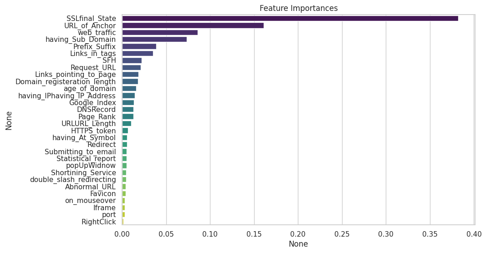
    


```python
# Model Development
# Importing necessary libraries for model development
import pandas as pd
from sklearn.model_selection import train_test_split  # Import train_test_split
from sklearn.preprocessing import StandardScaler
from sklearn.tree import DecisionTreeClassifier
from sklearn.neighbors import KNeighborsClassifier
from xgboost import XGBClassifier
from sklearn.ensemble import RandomForestClassifier
from sklearn import svm
from sklearn.naive_bayes import GaussianNB
from sklearn.linear_model import LogisticRegression
from sklearn.metrics import accuracy_score, precision_score, recall_score, f1_score, roc_auc_score, roc_curve
from imblearn.over_sampling import RandomOverSampler, SMOTE

# Initialize the DataFrame to store results globally
data = pd.DataFrame(columns=['Model', 'Balancer', 'Accuracy', 'AUC', 'F1-Score', 'Precision', 'Recall'])
i = 0

# Ensure 'Result' is the target variable and is correctly formatted as categorical
df['Result'] = df['Result'].astype('category')
df['Result'] = df['Result'].cat.codes

# Separate the features and target variable
X = df.drop(columns=['Result'])  # Features
y = df['Result']  # Target variable

# Split the data
X_train, X_test, y_train, y_test = train_test_split(X, y, test_size=0.3, random_state=42)

# Function to build and evaluate models
def build_model(X_train, X_test, y_train, y_test, balancer, model_name):
    global i
    # Feature scaling for distance-based or gradient descent-based algorithms
    if model_name in ['svm', 'KNN', 'LogisticRegression']:
        print('Applying Feature Scaling...')
        scaler = StandardScaler()
        X_train = scaler.fit_transform(X_train)
        X_test = scaler.transform(X_test)

    # Initialize the model based on the input parameter
    if model_name == 'DecisionTreeClassifier':
        model = DecisionTreeClassifier(random_state=42, splitter='random', max_depth=2, min_samples_leaf=2)
    elif model_name == 'KNN':
        model = KNeighborsClassifier()
    elif model_name == 'XGBClassifier':
        model = XGBClassifier(objective='binary:logistic', eval_metric='auc')
    elif model_name == 'RandomForestClassifier':
        model = RandomForestClassifier(class_weight='balanced', n_estimators=100)
    elif model_name == 'svm':
        model = svm.SVC(kernel='linear', probability=True)
    elif model_name == 'gauss':
        model = GaussianNB()
    elif model_name == 'LogisticRegression':
        model = LogisticRegression()
    else:
        print('No Model Selected')
        return 'No Model Selected'

    # Apply balancing techniques if specified
    if balancer == 1:
        print('Applying Random Over Sampling...')
        ros = RandomOverSampler(random_state=42)
        X_train_balanced, y_train_balanced = ros.fit_resample(X_train, y_train)
    elif balancer == 2:
        print('Applying SMOTE...')
        smote = SMOTE(random_state=42)
        X_train_balanced, y_train_balanced = smote.fit_resample(X_train, y_train)
    else:
        print('No Balancing Applied...')
        X_train_balanced, y_train_balanced = X_train, y_train

    # Train the model
    model.fit(X_train_balanced, y_train_balanced)
    y_pred = model.predict(X_test)
    pred_prob = model.predict_proba(X_test)[:, 1]

    # Calculate metrics
    accuracy = accuracy_score(y_test, y_pred)
    auc = roc_auc_score(y_test, pred_prob)
    f1 = f1_score(y_test, y_pred)
    precision = precision_score(y_test, y_pred)
    recall = recall_score(y_test, y_pred)
    fpr, tpr, thresh = roc_curve(y_test, pred_prob, pos_label=1)

    # Print metrics
    print('Model:', model_name, ' | Balancer:', balancer)
    print('Accuracy:', accuracy)
    print('AUC:', auc)
    print('F1-score:', f1)
    print('Precision:', precision)
    print('Recall:', recall)

    # Store results in the DataFrame
    data.loc[i] = [model_name, balancer, accuracy, auc, f1, precision, recall]
    i += 1

    return fpr, tpr, thresh
```

#### Full Model Evaluation


```python
# Evaluate Decision Tree Classifier
print("Evaluating Decision Tree Classifier...")
DT_fpr, DT_tpr, DT_thresh = build_model(X_train, X_test, y_train, y_test, 0, 'DecisionTreeClassifier')
```

    Evaluating Decision Tree Classifier...
    No Balancing Applied...
    Model: DecisionTreeClassifier  | Balancer: 0
    Accuracy: 0.8896593307205306
    AUC: 0.9123250411864058
    F1-score: 0.9042386185243327
    Precision: 0.8939472322814278
    Recall: 0.9147697194282689
    


```python
DTROS_fpr, DTROS_tpr, DTROS_thresh = build_model(X_train, X_test, y_train, y_test, 1, 'DecisionTreeClassifier')
```

    Applying Random Over Sampling...
    Model: DecisionTreeClassifier  | Balancer: 1
    Accuracy: 0.8896593307205306
    AUC: 0.9123250411864058
    F1-score: 0.9042386185243327
    Precision: 0.8939472322814278
    Recall: 0.9147697194282689
    


```python
DTSMOTE_fpr, DTSMOTE_tpr, DTSMOTE_thresh = build_model(X_train, X_test, y_train, y_test, 2, 'DecisionTreeClassifier')
```

    Applying SMOTE...
    Model: DecisionTreeClassifier  | Balancer: 2
    Accuracy: 0.8896593307205306
    AUC: 0.9123250411864058
    F1-score: 0.9042386185243327
    Precision: 0.8939472322814278
    Recall: 0.9147697194282689
    


```python
# Drop the 'Result' column as it is not useful for model training
X = df.drop(columns=['Result'])  # Features
y = df['Result']  # Target variable

# Convert target variable to categorical if needed
y = y.astype('category').cat.codes

# Split the data
X_train, X_test, y_train, y_test = train_test_split(X, y, test_size=0.3, random_state=42)

# Normalize the features if needed (for specific models)
scaler = StandardScaler()
X_train = scaler.fit_transform(X_train)
X_test = scaler.transform(X_test)
```


```python
import matplotlib.pyplot as plt
import seaborn as sns
from sklearn.metrics import confusion_matrix

def plot_confusion_matrix(y_test, y_pred, model_name, balancer):
    cm = confusion_matrix(y_test, y_pred)
    sns.heatmap(cm, annot=True, fmt='d', cmap='Blues', xticklabels=['Legitimate', 'Phishing'], yticklabels=['Legitimate', 'Phishing'])
    plt.xlabel('Predicted')
    plt.ylabel('Actual')
    plt.title(f'Confusion Matrix: {model_name} | Balancer: {balancer}')
    plt.show()

# Evaluate Decision Tree Classifier
print("Evaluating Decision Tree Classifier...")
DT_fpr, DT_tpr, DT_thresh = build_model(X_train, X_test, y_train, y_test, 0, 'DecisionTreeClassifier')
y_pred_DT = DecisionTreeClassifier(random_state=42, splitter='random', max_depth=2, min_samples_leaf=2).fit(X_train, y_train).predict(X_test)
plot_confusion_matrix(y_test, y_pred_DT, 'DecisionTreeClassifier', 0)

# Random Over Sampling for Decision Tree
ros = RandomOverSampler(random_state=42)
X_train_balanced, y_train_balanced = ros.fit_resample(X_train, y_train)
model_DTROS = DecisionTreeClassifier(random_state=42, splitter='random', max_depth=2, min_samples_leaf=2).fit(X_train_balanced, y_train_balanced)
y_pred_DTROS = model_DTROS.predict(X_test)
plot_confusion_matrix(y_test, y_pred_DTROS, 'DecisionTreeClassifier', 1)

# SMOTE for Decision Tree
smote = SMOTE(random_state=42)
X_train_balanced, y_train_balanced = smote.fit_resample(X_train, y_train)
model_DTSMOTE = DecisionTreeClassifier(random_state=42, splitter='random', max_depth=2, min_samples_leaf=2).fit(X_train_balanced, y_train_balanced)
y_pred_DTSMOTE = model_DTSMOTE.predict(X_test)
plot_confusion_matrix(y_test, y_pred_DTSMOTE, 'DecisionTreeClassifier', 2)
```

    Evaluating Decision Tree Classifier...
    No Balancing Applied...
    Model: DecisionTreeClassifier  | Balancer: 0
    Accuracy: 0.8896593307205306
    AUC: 0.9123250411864058
    F1-score: 0.9042386185243327
    Precision: 0.8939472322814278
    Recall: 0.9147697194282689
    


    

    


    

    


    
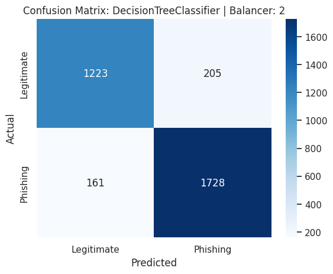
    


```python
# Evaluate KNN Classifier
print("Evaluating KNN Classifier...")
KNN_fpr, KNN_tpr, KNN_thresh = build_model(X_train, X_test, y_train, y_test, 0, 'KNN')
```

    Evaluating KNN Classifier...
    Applying Feature Scaling...
    No Balancing Applied...
    Model: KNN  | Balancer: 0
    Accuracy: 0.9345794392523364
    AUC: 0.9820674166966945
    F1-score: 0.9422718808193669
    Precision: 0.9470588235294117
    Recall: 0.9375330862890419
    


```python
KNNROS_fpr, KNNROS_tpr, KNNROS_thresh = build_model(X_train, X_test, y_train, y_test, 1, 'KNN')
```

    Applying Feature Scaling...
    Applying Random Over Sampling...
    Model: KNN  | Balancer: 1
    Accuracy: 0.9297558034368405
    AUC: 0.9821391499956256
    F1-score: 0.937416062315337
    Precision: 0.9514721919302072
    Recall: 0.9237691900476442
    


```python
KNNSMOTE_fpr, KNNSMOTE_tpr, KNNSMOTE_thresh = build_model(X_train, X_test, y_train, y_test, 2, 'KNN')
```

    Applying Feature Scaling...
    Applying SMOTE...
    Model: KNN  | Balancer: 2
    Accuracy: 0.9303587579137775
    AUC: 0.9819712162260351
    F1-score: 0.937986577181208
    Precision: 0.9515250544662309
    Recall: 0.9248279512969825
    


```python
def plot_confusion_matrix(y_test, y_pred, model_name, balancer, color):
    cm = confusion_matrix(y_test, y_pred)
    sns.heatmap(cm, annot=True, fmt='d', cmap=color, xticklabels=['Legitimate', 'Phishing'], yticklabels=['Legitimate', 'Phishing'])
    plt.xlabel('Predicted')
    plt.ylabel('Actual')
    plt.title(f'Confusion Matrix: {model_name} | Balancer: {balancer}')
    plt.show()

# Evaluate KNN Classifier
print("Evaluating KNN Classifier...")
KNN_fpr, KNN_tpr, KNN_thresh = build_model(X_train, X_test, y_train, y_test, 0, 'KNN')
y_pred_KNN = KNeighborsClassifier().fit(X_train, y_train).predict(X_test)
plot_confusion_matrix(y_test, y_pred_KNN, 'KNN', 0, 'YlGnBu')

# Random Over Sampling for KNN
ros = RandomOverSampler(random_state=42)
X_train_balanced, y_train_balanced = ros.fit_resample(X_train, y_train)
model_KNNROS = KNeighborsClassifier().fit(X_train_balanced, y_train_balanced)
y_pred_KNNROS = model_KNNROS.predict(X_test)
plot_confusion_matrix(y_test, y_pred_KNNROS, 'KNN', 1, 'YlGnBu')

# SMOTE for KNN
smote = SMOTE(random_state=42)
X_train_balanced, y_train_balanced = smote.fit_resample(X_train, y_train)
model_KNNSMOTE = KNeighborsClassifier().fit(X_train_balanced, y_train_balanced)
y_pred_KNNSMOTE = model_KNNSMOTE.predict(X_test)
plot_confusion_matrix(y_test, y_pred_KNNSMOTE, 'KNN', 2, 'YlGnBu')

```

    Evaluating KNN Classifier...
    Applying Feature Scaling...
    No Balancing Applied...
    Model: KNN  | Balancer: 0
    Accuracy: 0.9345794392523364
    AUC: 0.9820674166966945
    F1-score: 0.9422718808193669
    Precision: 0.9470588235294117
    Recall: 0.9375330862890419
    


    
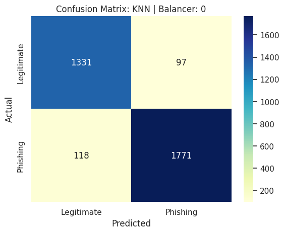
    


    

    


    

    


```python
# Evaluate Logistic Regression
print("Evaluating Logistic Regression...")
LR_fpr, LR_tpr, LR_thresh = build_model(X_train, X_test, y_train, y_test, 0, 'LogisticRegression')
```

    Evaluating Logistic Regression...
    Applying Feature Scaling...
    No Balancing Applied...
    Model: LogisticRegression  | Balancer: 0
    Accuracy: 0.9095568284594513
    AUC: 0.9691318825041927
    F1-score: 0.920886075949367
    Precision: 0.9174986862848135
    Recall: 0.9242985706723134
    


```python
LRROS_fpr, LRROS_tpr, LRROS_thresh = build_model(X_train, X_test, y_train, y_test, 1, 'LogisticRegression')
```

    Applying Feature Scaling...
    Applying Random Over Sampling...
    Model: LogisticRegression  | Balancer: 1
    Accuracy: 0.9080494422671088
    AUC: 0.9691222439213907
    F1-score: 0.918774966711052
    Precision: 0.9244372990353698
    Recall: 0.9131815775542615
    


```python
LRSMOTE_fpr, LRSMOTE_tpr, LRSMOTE_thresh = build_model(X_train, X_test, y_train, y_test, 2, 'LogisticRegression')
```

    Applying Feature Scaling...
    Applying SMOTE...
    Model: LogisticRegression  | Balancer: 2
    Accuracy: 0.9083509195055773
    AUC: 0.9691463403783959
    F1-score: 0.9191489361702128
    Precision: 0.9235702832709781
    Recall: 0.9147697194282689
    


```python
def plot_confusion_matrix(y_test, y_pred, model_name, balancer, color):
    cm = confusion_matrix(y_test, y_pred)
    sns.heatmap(cm, annot=True, fmt='d', cmap=color, xticklabels=['Legitimate', 'Phishing'], yticklabels=['Legitimate', 'Phishing'])
    plt.xlabel('Predicted')
    plt.ylabel('Actual')
    plt.title(f'Confusion Matrix: {model_name} | Balancer: {balancer}')
    plt.show()

# Evaluate Logistic Regression
print("Evaluating Logistic Regression...")
LR_fpr, LR_tpr, LR_thresh = build_model(X_train, X_test, y_train, y_test, 0, 'LogisticRegression')
y_pred_LR = LogisticRegression().fit(X_train, y_train).predict(X_test)
plot_confusion_matrix(y_test, y_pred_LR, 'LogisticRegression', 0, 'coolwarm')

# Random Over Sampling for Logistic Regression
ros = RandomOverSampler(random_state=42)
X_train_balanced, y_train_balanced = ros.fit_resample(X_train, y_train)
model_LRROS = LogisticRegression().fit(X_train_balanced, y_train_balanced)
y_pred_LRROS = model_LRROS.predict(X_test)
plot_confusion_matrix(y_test, y_pred_LRROS, 'LogisticRegression', 1, 'coolwarm')

# SMOTE for Logistic Regression
smote = SMOTE(random_state=42)
X_train_balanced, y_train_balanced = smote.fit_resample(X_train, y_train)
model_LRSMOTE = LogisticRegression().fit(X_train_balanced, y_train_balanced)
y_pred_LRSMOTE = model_LRSMOTE.predict(X_test)
plot_confusion_matrix(y_test, y_pred_LRSMOTE, 'LogisticRegression', 2, 'coolwarm')

```

    Evaluating Logistic Regression...
    Applying Feature Scaling...
    No Balancing Applied...
    Model: LogisticRegression  | Balancer: 0
    Accuracy: 0.9095568284594513
    AUC: 0.9691318825041927
    F1-score: 0.920886075949367
    Precision: 0.9174986862848135
    Recall: 0.9242985706723134
    


    
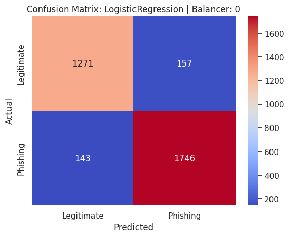
    


    
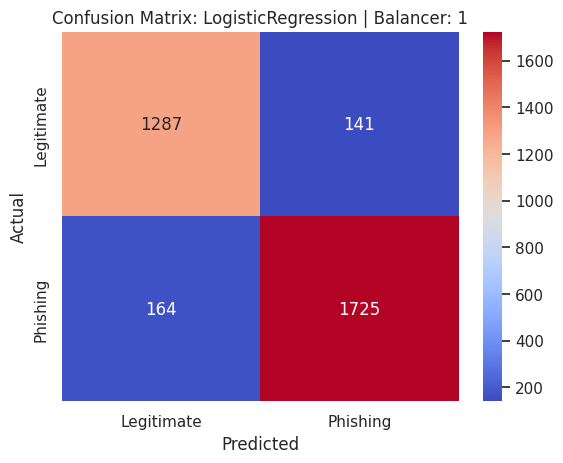
    


    

    


```python
# Evaluate XGB Classifier
print("Evaluating XGB Classifier...")
XGB_fpr, XGB_tpr, XGB_thresh = build_model(X_train, X_test, y_train, y_test, 0, 'XGBClassifier')
```

    Evaluating XGB Classifier...
    No Balancing Applied...
    Model: XGBClassifier  | Balancer: 0
    Accuracy: 0.9683448899608079
    AUC: 0.9957807103783811
    F1-score: 0.9724047306176086
    Precision: 0.965553235908142
    Recall: 0.9793541556379036
    


```python
XGBROS_fpr, XGBROS_tpr, XGBROS_thresh = build_model(X_train, X_test, y_train, y_test, 1, 'XGBClassifier')
```

    Applying Random Over Sampling...
    Model: XGBClassifier  | Balancer: 1
    Accuracy: 0.9704552306300874
    AUC: 0.9958411368782558
    F1-score: 0.9742376445846478
    Precision: 0.9676240208877285
    Recall: 0.9809422975119111
    


```python
XGBSMOTE_fpr, XGBSMOTE_tpr, XGBSMOTE_thresh = build_model(X_train, X_test, y_train, y_test, 2, 'XGBClassifier')
```

    Applying SMOTE...
    Model: XGBClassifier  | Balancer: 2
    Accuracy: 0.9701537533916189
    AUC: 0.9957588382097149
    F1-score: 0.9740498034076016
    Precision: 0.9646936656282451
    Recall: 0.9835892006352568
    


```python
def plot_confusion_matrix(y_test, y_pred, model_name, balancer, color):
    cm = confusion_matrix(y_test, y_pred)
    sns.heatmap(cm, annot=True, fmt='d', cmap=color, xticklabels=['Legitimate', 'Phishing'], yticklabels=['Legitimate', 'Phishing'])
    plt.xlabel('Predicted')
    plt.ylabel('Actual')
    plt.title(f'Confusion Matrix: {model_name} | Balancer: {balancer}')
    plt.show()

# Evaluate XGBoost Classifier
print("Evaluating XGBoost Classifier...")
XGB_fpr, XGB_tpr, XGB_thresh = build_model(X_train, X_test, y_train, y_test, 0, 'XGBClassifier')
y_pred_XGB = XGBClassifier(objective='binary:logistic', eval_metric='auc').fit(X_train, y_train).predict(X_test)
plot_confusion_matrix(y_test, y_pred_XGB, 'XGBClassifier', 0, 'Greens')

# Random Over Sampling for XGBoost
ros = RandomOverSampler(random_state=42)
X_train_balanced, y_train_balanced = ros.fit_resample(X_train, y_train)
model_XGBROS = XGBClassifier(objective='binary:logistic', eval_metric='auc').fit(X_train_balanced, y_train_balanced)
y_pred_XGBROS = model_XGBROS.predict(X_test)
plot_confusion_matrix(y_test, y_pred_XGBROS, 'XGBClassifier', 1, 'Greens')

# SMOTE for XGBoost
smote = SMOTE(random_state=42)
X_train_balanced, y_train_balanced = smote.fit_resample(X_train, y_train)
model_XGBSMOTE = XGBClassifier(objective='binary:logistic', eval_metric='auc').fit(X_train_balanced, y_train_balanced)
y_pred_XGBSMOTE = model_XGBSMOTE.predict(X_test)
plot_confusion_matrix(y_test, y_pred_XGBSMOTE, 'XGBClassifier', 2, 'Greens')

```

    Evaluating XGBoost Classifier...
    No Balancing Applied...
    Model: XGBClassifier  | Balancer: 0
    Accuracy: 0.9683448899608079
    AUC: 0.9957807103783811
    F1-score: 0.9724047306176086
    Precision: 0.965553235908142
    Recall: 0.9793541556379036
    


    

    


    
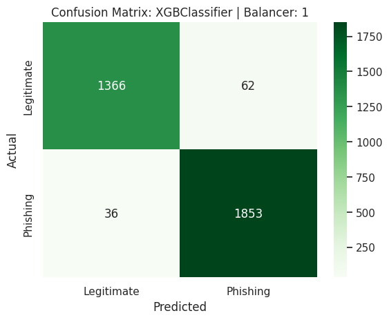
    


    

    


```python
# Evaluate Random Forest Classifier
print("Evaluating Random Forest Classifier...")
RF_fpr, RF_tpr, RF_thresh = build_model(X_train, X_test, y_train, y_test, 0, 'RandomForestClassifier')
```

    Evaluating Random Forest Classifier...
    No Balancing Applied...
    Model: RandomForestClassifier  | Balancer: 0
    Accuracy: 0.9692493216762135
    AUC: 0.9950804302663363
    F1-score: 0.973186119873817
    Precision: 0.9665796344647519
    Recall: 0.9798835362625727
    


```python
RFROS_fpr, RFROS_tpr, RFROS_thresh = build_model(X_train, X_test, y_train, y_test, 1, 'RandomForestClassifier')
```

    Applying Random Over Sampling...
    Model: RandomForestClassifier  | Balancer: 1
    Accuracy: 0.9683448899608079
    AUC: 0.9942296399766894
    F1-score: 0.9723611476704396
    Precision: 0.9670157068062827
    Recall: 0.9777660137638963
    


```python
RFSMOTE_fpr, RFSMOTE_tpr, RFSMOTE_thresh = build_model(X_train, X_test, y_train, y_test, 2, 'RandomForestClassifier')
```

    Applying SMOTE...
    Model: RandomForestClassifier  | Balancer: 2
    Accuracy: 0.9680434127223395
    AUC: 0.9948435435582386
    F1-score: 0.972193074501574
    Precision: 0.9635985439417577
    Recall: 0.9809422975119111
    


```python
def plot_confusion_matrix(y_test, y_pred, model_name, balancer, color):
    cm = confusion_matrix(y_test, y_pred)
    sns.heatmap(cm, annot=True, fmt='d', cmap=color, xticklabels=['Legitimate', 'Phishing'], yticklabels=['Legitimate', 'Phishing'])
    plt.xlabel('Predicted')
    plt.ylabel('Actual')
    plt.title(f'Confusion Matrix: {model_name} | Balancer: {balancer}')
    plt.show()

# Evaluate RandomForest Classifier
print("Evaluating RandomForest Classifier...")
RF_fpr, RF_tpr, RF_thresh = build_model(X_train, X_test, y_train, y_test, 0, 'RandomForestClassifier')
y_pred_RF = RandomForestClassifier(class_weight='balanced', n_estimators=100).fit(X_train, y_train).predict(X_test)
plot_confusion_matrix(y_test, y_pred_RF, 'RandomForestClassifier', 0, 'Oranges')

# Random Over Sampling for RandomForest
ros = RandomOverSampler(random_state=42)
X_train_balanced, y_train_balanced = ros.fit_resample(X_train, y_train)
model_RFROS = RandomForestClassifier(class_weight='balanced', n_estimators=100).fit(X_train_balanced, y_train_balanced)
y_pred_RFROS = model_RFROS.predict(X_test)
plot_confusion_matrix(y_test, y_pred_RFROS, 'RandomForestClassifier', 1, 'Oranges')

# SMOTE for RandomForest
smote = SMOTE(random_state=42)
X_train_balanced, y_train_balanced = smote.fit_resample(X_train, y_train)
model_RFSMOTE = RandomForestClassifier(class_weight='balanced', n_estimators=100).fit(X_train_balanced, y_train_balanced)
y_pred_RFSMOTE = model_RFSMOTE.predict(X_test)
plot_confusion_matrix(y_test, y_pred_RFSMOTE, 'RandomForestClassifier', 2, 'Oranges')

```

    Evaluating RandomForest Classifier...
    No Balancing Applied...
    Model: RandomForestClassifier  | Balancer: 0
    Accuracy: 0.9674404582454025
    AUC: 0.9946997062456534
    F1-score: 0.971608832807571
    Precision: 0.9650130548302872
    Recall: 0.9782953943885654
    


    

    


    
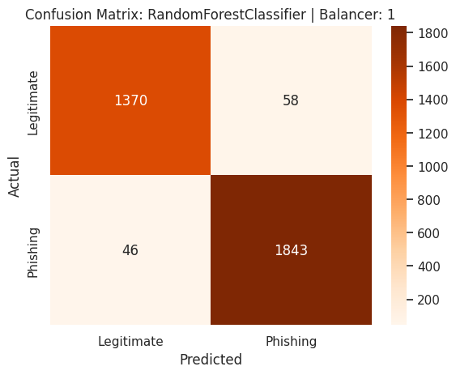
    


    

    


```python
# Evaluate SVM
print("Evaluating SVM Classifier...")
SVMROS_fpr, SVMROS_tpr, SVMROS_thresh = build_model(X_train, X_test, y_train,  y_test, 1, 'svm')
```

    Evaluating SVM Classifier...
    Applying Feature Scaling...
    Applying Random Over Sampling...
    Model: svm  | Balancer: 1
    Accuracy: 0.9110642146517938
    AUC: 0.966847167665372
    F1-score: 0.9221841202848853
    Precision: 0.9190325972660357
    Recall: 0.9253573319216517
    


```python
def plot_confusion_matrix(y_test, y_pred, model_name, balancer, color):
    cm = confusion_matrix(y_test, y_pred)
    sns.heatmap(cm, annot=True, fmt='d', cmap=color, xticklabels=['Legitimate', 'Phishing'], yticklabels=['Legitimate', 'Phishing'])
    plt.xlabel('Predicted')
    plt.ylabel('Actual')
    plt.title(f'Confusion Matrix: {model_name} | Balancer: {balancer}')
    plt.show()

# Evaluate SVM with Random Over Sampling
print("Evaluating SVM Classifier with Random Over Sampling...")
SVMROS_fpr, SVMROS_tpr, SVMROS_thresh = build_model(X_train, X_test, y_train, y_test, 1, 'svm')
y_pred_SVMROS = svm.SVC(kernel='linear', probability=True).fit(X_train, y_train).predict(X_test)
plot_confusion_matrix(y_test, y_pred_SVMROS, 'svm', 1, 'BrBG')
```

    Evaluating SVM Classifier with Random Over Sampling...
    Applying Feature Scaling...
    Applying Random Over Sampling...
    Model: svm  | Balancer: 1
    Accuracy: 0.9110642146517938
    AUC: 0.9668545819598352
    F1-score: 0.9221841202848853
    Precision: 0.9190325972660357
    Recall: 0.9253573319216517
    


    
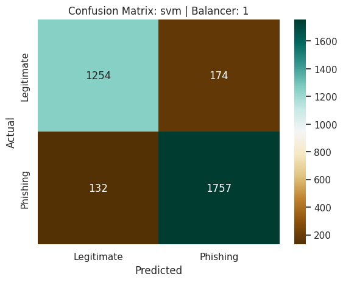
    


```python
# Evaluate Gaussian Naive Bayes
print("Evaluating Gaussian Naive Bayes...")
gauss_fpr, gauss_tpr, gauss_thresh = build_model(X_train, X_test, y_train, y_test, 0, 'gauss')
```

    Evaluating Gaussian Naive Bayes...
    No Balancing Applied...
    Model: gauss  | Balancer: 0
    Accuracy: 0.5646668676514923
    AUC: 0.9665235337120555
    F1-score: 0.3813196229648672
    Precision: 1.0
    Recall: 0.235574377977766
    


```python
def plot_confusion_matrix(y_test, y_pred, model_name, balancer, color):
    cm = confusion_matrix(y_test, y_pred)
    sns.heatmap(cm, annot=True, fmt='d', cmap=color, xticklabels=['Legitimate', 'Phishing'], yticklabels=['Legitimate', 'Phishing'])
    plt.xlabel('Predicted')
    plt.ylabel('Actual')
    plt.title(f'Confusion Matrix: {model_name} | Balancer: {balancer}')
    plt.show()

# Evaluate Gaussian Naive Bayes Classifier
print("Evaluating Gaussian Naive Bayes Classifier...")
gauss_fpr, gauss_tpr, gauss_thresh = build_model(X_train, X_test, y_train, y_test, 0, 'gauss')
y_pred_gauss = GaussianNB().fit(X_train, y_train).predict(X_test)
plot_confusion_matrix(y_test, y_pred_gauss, 'gauss', 0, 'Blues')
```

    Evaluating Gaussian Naive Bayes Classifier...
    No Balancing Applied...
    Model: gauss  | Balancer: 0
    Accuracy: 0.5646668676514923
    AUC: 0.9665235337120555
    F1-score: 0.3813196229648672
    Precision: 1.0
    Recall: 0.235574377977766
    


    
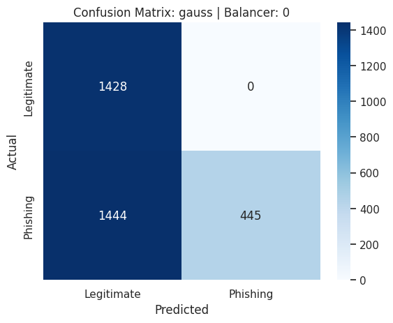
    


```python
# Display the DataFrame with results
print("Model Evaluation Results:")
print(data)
```

    Model Evaluation Results:
                         Model  Balancer  Accuracy       AUC  F1-Score  Precision  \
    0   DecisionTreeClassifier         0  0.889659  0.912325  0.904239   0.893947   
    1   DecisionTreeClassifier         1  0.889659  0.912325  0.904239   0.893947   
    2   DecisionTreeClassifier         2  0.889659  0.912325  0.904239   0.893947   
    3   DecisionTreeClassifier         0  0.889659  0.912325  0.904239   0.893947   
    4                      KNN         0  0.934579  0.982067  0.942272   0.947059   
    5                      KNN         1  0.929756  0.982139  0.937416   0.951472   
    6                      KNN         2  0.930359  0.981971  0.937987   0.951525   
    7                      KNN         0  0.934579  0.982067  0.942272   0.947059   
    8       LogisticRegression         0  0.909557  0.969132  0.920886   0.917499   
    9       LogisticRegression         1  0.908049  0.969122  0.918775   0.924437   
    10      LogisticRegression         2  0.908351  0.969146  0.919149   0.923570   
    11      LogisticRegression         0  0.909557  0.969132  0.920886   0.917499   
    12           XGBClassifier         0  0.968345  0.995781  0.972405   0.965553   
    13           XGBClassifier         1  0.970455  0.995841  0.974238   0.967624   
    14           XGBClassifier         2  0.970154  0.995759  0.974050   0.964694   
    15           XGBClassifier         0  0.968345  0.995781  0.972405   0.965553   
    16  RandomForestClassifier         0  0.969249  0.995080  0.973186   0.966580   
    17  RandomForestClassifier         1  0.968345  0.994230  0.972361   0.967016   
    18  RandomForestClassifier         2  0.968043  0.994844  0.972193   0.963599   
    19  RandomForestClassifier         0  0.967440  0.994700  0.971609   0.965013   
    20                     svm         1  0.911064  0.966847  0.922184   0.919033   
    21                     svm         1  0.911064  0.966855  0.922184   0.919033   
    22                   gauss         0  0.564667  0.966524  0.381320   1.000000   
    23                   gauss         0  0.564667  0.966524  0.381320   1.000000   
    
          Recall  
    0   0.914770  
    1   0.914770  
    2   0.914770  
    3   0.914770  
    4   0.937533  
    5   0.923769  
    6   0.924828  
    7   0.937533  
    8   0.924299  
    9   0.913182  
    10  0.914770  
    11  0.924299  
    12  0.979354  
    13  0.980942  
    14  0.983589  
    15  0.979354  
    16  0.979884  
    17  0.977766  
    18  0.980942  
    19  0.978295  
    20  0.925357  
    21  0.925357  
    22  0.235574  
    23  0.235574  
    


```python
from sklearn.ensemble import RandomForestClassifier, GradientBoostingClassifier
from sklearn.metrics import accuracy_score, precision_score, recall_score, f1_score, roc_auc_score

# Initialize models
rf = RandomForestClassifier(n_estimators=100, random_state=42, class_weight='balanced')
gbm = GradientBoostingClassifier(n_estimators=100, learning_rate=0.1, random_state=42, min_weight_fraction_leaf=0.2, max_depth=3)

# Train models
rf.fit(X_train, y_train)
gbm.fit(X_train, y_train)

# Predict on the testing set
rf_pred = rf.predict(X_test)
gbm_pred = gbm.predict(X_test)

# Combine predictions using voting
ensemble_pred = (rf_pred + gbm_pred) >= 1

# Calculate ensemble model metrics
ensemble_accuracy = accuracy_score(y_test, ensemble_pred)
ensemble_auc = roc_auc_score(y_test, ensemble_pred)
ensemble_f1 = f1_score(y_test, ensemble_pred)
ensemble_precision = precision_score(y_test, ensemble_pred)
ensemble_recall = recall_score(y_test, ensemble_pred)

# Print ensemble model metrics
print("Ensemble Accuracy:", ensemble_accuracy)
print('AUC:', ensemble_auc)
print('F1-score:', ensemble_f1)
print('Precision:', ensemble_precision)
print('Recall:', ensemble_recall)

```

    Ensemble Accuracy: 0.9487488694603557
    AUC: 0.942356084837323
    F1-score: 0.9564549180327869
    Precision: 0.9265508684863524
    Recall: 0.988353626257279
    


```python
from sklearn.datasets import make_classification
from sklearn.model_selection import train_test_split
from sklearn.ensemble import RandomForestClassifier, GradientBoostingClassifier, VotingClassifier
from sklearn.metrics import accuracy_score, precision_score, recall_score, f1_score, roc_auc_score

# Generate a synthetic dataset
X, Y = make_classification(n_samples=1000, n_features=20, n_informative=10, n_classes=2, random_state=42)

# Split the data into training and testing sets
X_train, X_test, y_train, y_test = train_test_split(X, Y, test_size=0.3, random_state=42)

# Create the individual models
rf_model = RandomForestClassifier(n_estimators=100, random_state=42)
gbm_model = GradientBoostingClassifier(n_estimators=100, learning_rate=0.1, random_state=42)

# Create the ensemble model using soft voting
ensemble = VotingClassifier(estimators=[('rf', rf_model), ('gbm', gbm_model)], voting='soft')

# Fit the ensemble model on the training data
ensemble.fit(X_train, y_train)

# Make predictions using the ensemble model
y_pred = ensemble.predict(X_test)

# Calculate the accuracy and other metrics of the ensemble model
accuracy = accuracy_score(y_test, y_pred)
auc = roc_auc_score(y_test, y_pred)
f1 = f1_score(y_test, y_pred)
precision = precision_score(y_test, y_pred)
recall = recall_score(y_test, y_pred)

# Print the accuracy and other metrics of the ensemble model
print('Ensemble Model Performance:')
print('Accuracy:', accuracy)
print('AUC:', auc)
print('F1-score:', f1)
print('Precision:', precision)
print('Recall:', recall)

```

    Ensemble Model Performance:
    Accuracy: 0.9266666666666666
    AUC: 0.9271708683473389
    F1-score: 0.9271523178807947
    Precision: 0.9032258064516129
    Recall: 0.9523809523809523
    


```python
from sklearn.model_selection import KFold, cross_val_score
from sklearn.ensemble import RandomForestClassifier
import numpy as np

# Initialize the random forest classifier
rf_classifier = RandomForestClassifier(n_estimators=100, random_state=42)

# Initialize the K-fold cross-validation object
kfold = KFold(n_splits=5, shuffle=True, random_state=42)

# Evaluate the model using K-fold cross-validation and different scoring metrics
accuracy_scores = cross_val_score(rf_classifier, X, Y, cv=kfold, scoring='accuracy')
auc_scores = cross_val_score(rf_classifier, X, Y, cv=kfold, scoring='roc_auc')
f1_scores = cross_val_score(rf_classifier, X, Y, cv=kfold, scoring='f1')
precision_scores = cross_val_score(rf_classifier, X, Y, cv=kfold, scoring='precision')
recall_scores = cross_val_score(rf_classifier, X, Y, cv=kfold, scoring='recall')

# Print the mean and standard deviation of the scores for each metric
print('Model Evaluation with K-Fold Cross-Validation:')
print(f'Accuracy - Mean: {np.mean(accuracy_scores):.4f}, Std: {np.std(accuracy_scores):.4f}')
print(f'AUC - Mean: {np.mean(auc_scores):.4f}, Std: {np.std(auc_scores):.4f}')
print(f'F1-score - Mean: {np.mean(f1_scores):.4f}, Std: {np.std(f1_scores):.4f}')
print(f'Precision - Mean: {np.mean(precision_scores):.4f}, Std: {np.std(precision_scores):.4f}')
print(f'Recall - Mean: {np.mean(recall_scores):.4f}, Std: {np.std(recall_scores):.4f}')

```

    Model Evaluation with K-Fold Cross-Validation:
    Accuracy - Mean: 0.9320, Std: 0.0144
    AUC - Mean: 0.9810, Std: 0.0048
    F1-score - Mean: 0.9325, Std: 0.0149
    Precision - Mean: 0.9259, Std: 0.0276
    Recall - Mean: 0.9406, Std: 0.0306
    

#### ROC Curve


```python
# Import necessary libraries
import numpy as np
import pandas as pd
from sklearn.datasets import make_classification
from sklearn.model_selection import train_test_split
from sklearn.preprocessing import StandardScaler
from sklearn.tree import DecisionTreeClassifier
from sklearn.neighbors import KNeighborsClassifier
from xgboost import XGBClassifier
from sklearn.ensemble import RandomForestClassifier, GradientBoostingClassifier
from sklearn.svm import SVC  # Import SVC
from sklearn.naive_bayes import GaussianNB
from sklearn.linear_model import LogisticRegression
from sklearn.metrics import roc_curve, auc, accuracy_score, precision_score, recall_score, f1_score
import matplotlib.pyplot as plt

# Generate a synthetic dataset
X, Y = make_classification(n_samples=1000, n_features=20, n_informative=10, n_classes=2, random_state=42)

# Split the data into training and testing sets
X_train, X_test, y_train, y_test = train_test_split(X, Y, test_size=0.3, random_state=42)

# Initialize the models
models = {
    "RandomForest": RandomForestClassifier(n_estimators=100, random_state=42),
    "GradientBoosting": GradientBoostingClassifier(n_estimators=100, learning_rate=0.1, random_state=42),
    "LogisticRegression": LogisticRegression(),
    "DecisionTree": DecisionTreeClassifier(random_state=42),
    "KNeighbors": KNeighborsClassifier(),
    "SVM": SVC(kernel='linear', probability=True),  # SVC imported and used here
    "GaussianNB": GaussianNB()
}

# Fit the models and calculate ROC curves
plt.figure(figsize=(10, 8))

for model_name, model in models.items():
    model.fit(X_train, y_train)
    y_prob = model.predict_proba(X_test)[:, 1]
    fpr, tpr, _ = roc_curve(y_test, y_prob)
    roc_auc = auc(fpr, tpr)
    plt.plot(fpr, tpr, lw=2, label='%s (AUC = %0.2f)' % (model_name, roc_auc))

# Add a diagonal line representing the TPR = FPR (random classifier)
plt.plot([0, 1], [0, 1], color='navy', lw=2, linestyle='--')

plt.xlim([0.0, 1.0])
plt.ylim([0.0, 1.05])
plt.xlabel('False Positive Rate')
plt.ylabel('True Positive Rate')
plt.title('Receiver Operating Characteristic (ROC) Curve')
plt.legend(loc="lower right")
plt.show()

```


    
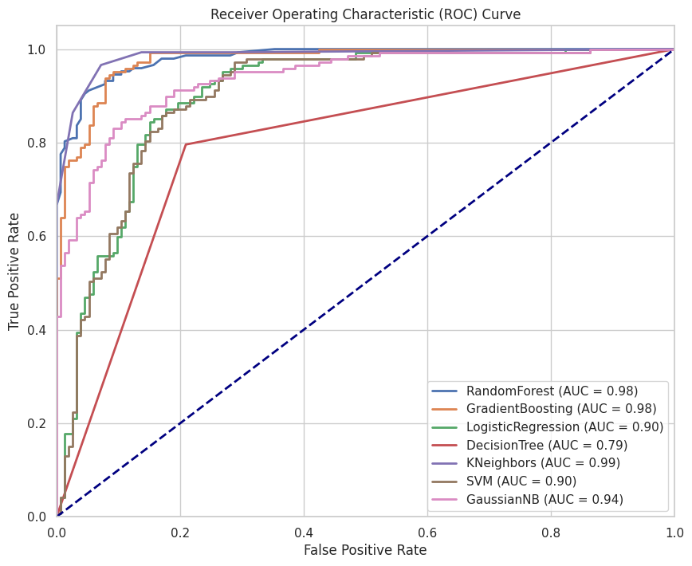
    


### Section 9: Feed-Forward Neural Network


```python
# Import necessary libraries
import numpy as np
import pandas as pd
from keras.models import Sequential
from keras.layers import Dense
from keras.utils import to_categorical
from sklearn.metrics import accuracy_score, precision_score, recall_score, f1_score, roc_auc_score, roc_curve
from sklearn.model_selection import train_test_split
import matplotlib.pyplot as plt
```


```python
df = pd.DataFrame({
    'feature1': np.random.rand(1000),
    'feature2': np.random.rand(1000),
    'Result': np.random.randint(2, size=1000)
})

# Separate the features and target variable
X = df.drop(columns=['Result'])  # Features
y = df['Result']  # Target variable

# Convert target variable to categorical
y = to_categorical(y, num_classes=2)

# Split the data
X_train, X_test, y_train, y_test = train_test_split(X, y, test_size=0.3, random_state=42)
```


```python
# Define and Train the Feed-Forward Neural Network

# Define the model
model_ff = Sequential()
model_ff.add(Dense(64, input_dim=X_train.shape[1], activation='relu'))
model_ff.add(Dense(32, activation='relu'))
model_ff.add(Dense(2, activation='softmax'))  # Assuming binary classification

# Compile the model
model_ff.compile(loss='categorical_crossentropy', optimizer='adam', metrics=['accuracy'])

# Train the model
model_ff.fit(X_train, y_train, epochs=50, batch_size=10, verbose=1)
```

    Epoch 1/50
    70/70 [==============================] - 1s 1ms/step - loss: 0.6950 - accuracy: 0.4929
    Epoch 2/50
    70/70 [==============================] - 0s 1ms/step - loss: 0.6915 - accuracy: 0.5357
    Epoch 3/50
    70/70 [==============================] - 0s 1ms/step - loss: 0.6915 - accuracy: 0.5429
    Epoch 4/50
    70/70 [==============================] - 0s 1ms/step - loss: 0.6917 - accuracy: 0.5457
    Epoch 5/50
    70/70 [==============================] - 0s 1ms/step - loss: 0.6920 - accuracy: 0.5586
    Epoch 6/50
    70/70 [==============================] - 0s 1ms/step - loss: 0.6911 - accuracy: 0.5400
    Epoch 7/50
    70/70 [==============================] - 0s 1ms/step - loss: 0.6905 - accuracy: 0.5557
    Epoch 8/50
    70/70 [==============================] - 0s 1ms/step - loss: 0.6908 - accuracy: 0.5500
    Epoch 9/50
    70/70 [==============================] - 0s 1ms/step - loss: 0.6899 - accuracy: 0.5500
    Epoch 10/50
    70/70 [==============================] - 0s 1ms/step - loss: 0.6905 - accuracy: 0.5471
    Epoch 11/50
    70/70 [==============================] - 0s 1ms/step - loss: 0.6905 - accuracy: 0.5386
    Epoch 12/50
    70/70 [==============================] - 0s 1ms/step - loss: 0.6902 - accuracy: 0.5500
    Epoch 13/50
    70/70 [==============================] - 0s 1ms/step - loss: 0.6897 - accuracy: 0.5300
    Epoch 14/50
    70/70 [==============================] - 0s 1ms/step - loss: 0.6896 - accuracy: 0.5343
    Epoch 15/50
    70/70 [==============================] - 0s 1ms/step - loss: 0.6891 - accuracy: 0.5400
    Epoch 16/50
    70/70 [==============================] - 0s 1ms/step - loss: 0.6893 - accuracy: 0.5414
    Epoch 17/50
    70/70 [==============================] - 0s 1ms/step - loss: 0.6899 - accuracy: 0.5514
    Epoch 18/50
    70/70 [==============================] - 0s 2ms/step - loss: 0.6892 - accuracy: 0.5271
    Epoch 19/50
    70/70 [==============================] - 0s 2ms/step - loss: 0.6899 - accuracy: 0.5429
    Epoch 20/50
    70/70 [==============================] - 0s 1ms/step - loss: 0.6891 - accuracy: 0.5414
    Epoch 21/50
    70/70 [==============================] - 0s 1ms/step - loss: 0.6884 - accuracy: 0.5471
    Epoch 22/50
    70/70 [==============================] - 0s 1ms/step - loss: 0.6888 - accuracy: 0.5486
    Epoch 23/50
    70/70 [==============================] - 0s 1ms/step - loss: 0.6879 - accuracy: 0.5529
    Epoch 24/50
    70/70 [==============================] - 0s 1ms/step - loss: 0.6906 - accuracy: 0.5314
    Epoch 25/50
    70/70 [==============================] - 0s 1ms/step - loss: 0.6891 - accuracy: 0.5314
    Epoch 26/50
    70/70 [==============================] - 0s 1ms/step - loss: 0.6882 - accuracy: 0.5457
    Epoch 27/50
    70/70 [==============================] - 0s 1ms/step - loss: 0.6886 - accuracy: 0.5514
    Epoch 28/50
    70/70 [==============================] - 0s 1ms/step - loss: 0.6884 - accuracy: 0.5457
    Epoch 29/50
    70/70 [==============================] - 0s 1ms/step - loss: 0.6882 - accuracy: 0.5514
    Epoch 30/50
    70/70 [==============================] - 0s 1ms/step - loss: 0.6882 - accuracy: 0.5429
    Epoch 31/50
    70/70 [==============================] - 0s 1ms/step - loss: 0.6872 - accuracy: 0.5457
    Epoch 32/50
    70/70 [==============================] - 0s 1ms/step - loss: 0.6878 - accuracy: 0.5514
    Epoch 33/50
    70/70 [==============================] - 0s 1ms/step - loss: 0.6878 - accuracy: 0.5514
    Epoch 34/50
    70/70 [==============================] - 0s 1ms/step - loss: 0.6882 - accuracy: 0.5400
    Epoch 35/50
    70/70 [==============================] - 0s 1ms/step - loss: 0.6871 - accuracy: 0.5500
    Epoch 36/50
    70/70 [==============================] - 0s 1ms/step - loss: 0.6870 - accuracy: 0.5529
    Epoch 37/50
    70/70 [==============================] - 0s 1ms/step - loss: 0.6875 - accuracy: 0.5471
    Epoch 38/50
    70/70 [==============================] - 0s 2ms/step - loss: 0.6870 - accuracy: 0.5500
    Epoch 39/50
    70/70 [==============================] - 0s 1ms/step - loss: 0.6880 - accuracy: 0.5529
    Epoch 40/50
    70/70 [==============================] - 0s 1ms/step - loss: 0.6864 - accuracy: 0.5600
    Epoch 41/50
    70/70 [==============================] - 0s 1ms/step - loss: 0.6869 - accuracy: 0.5471
    Epoch 42/50
    70/70 [==============================] - 0s 1ms/step - loss: 0.6884 - accuracy: 0.5600
    Epoch 43/50
    70/70 [==============================] - 0s 1ms/step - loss: 0.6867 - accuracy: 0.5529
    Epoch 44/50
    70/70 [==============================] - 0s 1ms/step - loss: 0.6868 - accuracy: 0.5443
    Epoch 45/50
    70/70 [==============================] - 0s 1ms/step - loss: 0.6858 - accuracy: 0.5571
    Epoch 46/50
    70/70 [==============================] - 0s 1ms/step - loss: 0.6866 - accuracy: 0.5543
    Epoch 47/50
    70/70 [==============================] - 0s 1ms/step - loss: 0.6865 - accuracy: 0.5600
    Epoch 48/50
    70/70 [==============================] - 0s 1ms/step - loss: 0.6861 - accuracy: 0.5443
    Epoch 49/50
    70/70 [==============================] - 0s 1ms/step - loss: 0.6854 - accuracy: 0.5500
    Epoch 50/50
    70/70 [==============================] - 0s 1ms/step - loss: 0.6860 - accuracy: 0.5543
    


    <keras.src.callbacks.History at 0x7c56fdc713f0>


```python
# Evalaute the Feed-Forward Neural Network
# Predict probabilities
y_prob_ff = model_ff.predict(X_test)

# Convert probabilities to class labels
y_pred_ff = np.argmax(y_prob_ff, axis=1)
y_true_ff = np.argmax(y_test, axis=1)

# Calculate metrics
accuracy_ff = accuracy_score(y_true_ff, y_pred_ff)
auc_ff = roc_auc_score(y_test, y_prob_ff, multi_class='ovr')
f1_ff = f1_score(y_true_ff, y_pred_ff)
precision_ff = precision_score(y_true_ff, y_pred_ff)
recall_ff = recall_score(y_true_ff, y_pred_ff)

# Print the results
print('Feed-Forward Neural Network Performance:')
print('Accuracy:', accuracy_ff)
print('AUC:', auc_ff)
print('F1-score:', f1_ff)
print('Precision:', precision_ff)
print('Recall:', recall_ff)
```

    10/10 [==============================] - 0s 1ms/step
    Feed-Forward Neural Network Performance:
    Accuracy: 0.4866666666666667
    AUC: 0.4731696428571428
    F1-score: 0.47619047619047616
    Precision: 0.5223880597014925
    Recall: 0.4375
    


```python
# Plot the ROC curve
fpr_ff, tpr_ff, _ = roc_curve(y_true_ff, y_prob_ff[:, 1])
plt.plot(fpr_ff, tpr_ff, color='blue', lw=2, label='Feed-Forward NN (AUC = %0.2f)' % auc_ff)
plt.plot([0, 1], [0, 1], color='navy', lw=2, linestyle='--')
plt.xlim([0.0, 1.0])
plt.ylim([0.0, 1.05])
plt.xlabel('False Positive Rate')
plt.ylabel('True Positive Rate')
plt.title('Receiver Operating Characteristic (ROC) Curve')
plt.legend(loc="lower right")
plt.show()
```


    
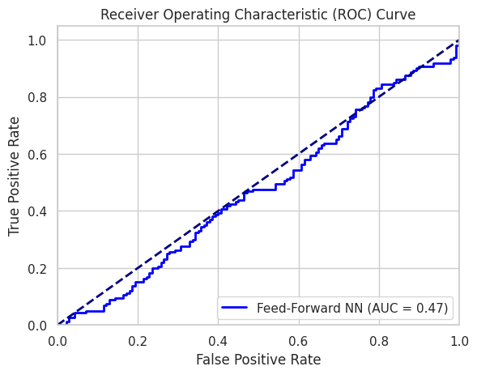
    

